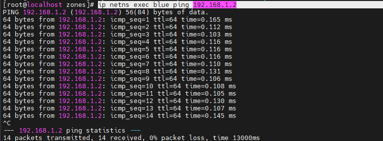
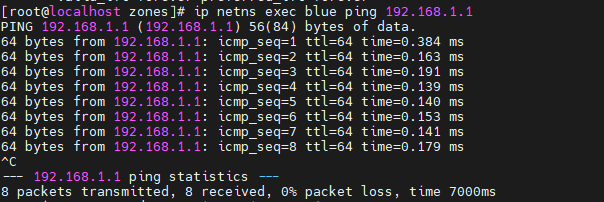
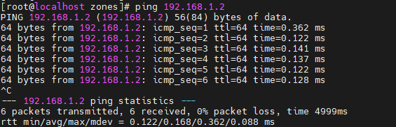
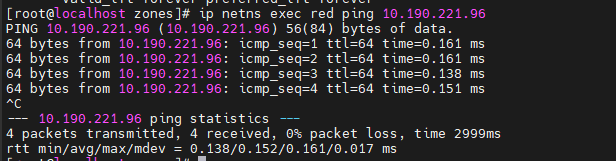

##### 用veth-pair 连接两个namespace ，配置ip地址，测试连通性

```shell
ip netns add red
ip netns add blue
ip link add veth-red type veth peer name veth-blue
ip link set veth-blue netns blue
ip link set veth-red netns red
ip netns exec red ip addr add 192.168.1.2/24 dev veth-red
ip netns exec blue ip addr add 192.168.1.3/24 dev veth-blue
ip netns exec red ip link set veth-red up
ip netns exec blue ip link set veth-blue up
ip netns exec blue ping 192.168.1.2
```

 

##### 创建tap，veth接口，并绑定在bridge中


##### 实现3个namespace中不同网段的通信，用路由实现

```shell
link add vbridge-0 type bridge
ip link set vbridge-0 up
ip addr
ip netns exec red ip link del veth-red
ip netns exec red ip addr
ip netns exec blue ip addr
ip link add veth-red type veth peer name veth-red-br
ip link add veth-blue type veth peer name veth-blue-br
ip link set veth-red-br master vbridge-0
ip link set veth-blue-br master vbridge-0
ip link set veth-red-br up
ip link set veth-blue-br up
ip link
ip link set veth-blue netns blue
ip link set veth-red netns red
ip netns exec red ip link set veth-red up
ip netns exec blue ip link set veth-blue up
ip netns exec red ip addr add 192.168.1.1/24 dev veth-red
ip netns exec blue ip addr add 192.168.1.2/24 dev veth-blue
```

此时 red和blue之间可以平台，，与主机并不互通。。此时vbridge-0不为路由模式，更类似于交换机模式。

 

给vbridge-0 分配一个地址，使其变为路由模式。分配的地址必须属于两个namespace的子网域.此时可以客户端ping通namespace

```shell
ip addr add 192.168.1.3/24 dev vbridge-0
ping 192.168.1.2
```

 

给 namespace的路由表添加一个default路由，default路由的网关设置为vbridge-0路由模式的ip地址，namespace即可ping通主机

```shell
ip netns exec red ip route add default via 192.168.1.3
ip netns exec red ping 10.190.221.96
```

 