###### 创建Bridge网络，实现host内docker之间通信，抓包查看通信过程；

```shell
 docker run -it -d ubuntu
 docker run -it -d ubuntu
 docker ps
```

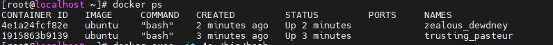 

```shell
docker exec -it 4e /bin/bash
root@4e1a24fcf82e: ifconfig
```

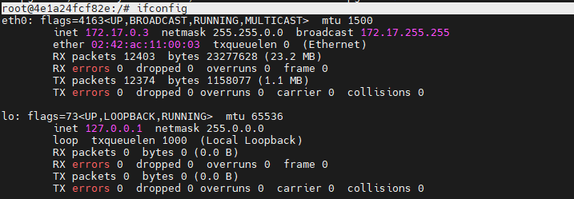 

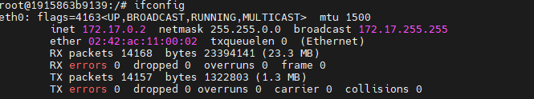 

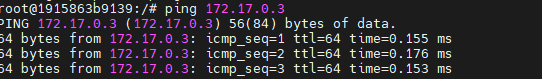 

使用 tcpdump抓取经过 docker0（172.17.0.1）的包

```shell
tcpdump -i docker0 > tcpdump_msg &
jobs
```

进入一个容器ping另一个容器，ping成功了

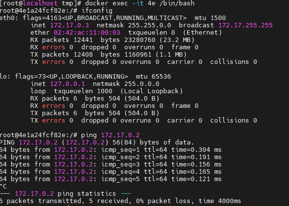 

回到宿主机查看 tcpdump_msg文件 

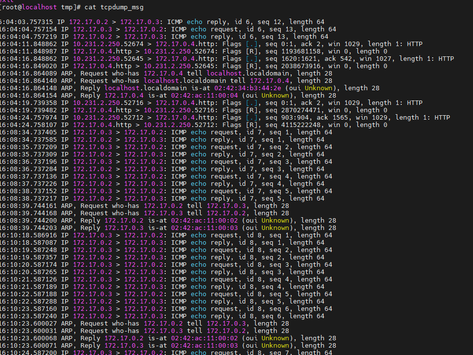 

###### docker内部访问外部网络，抓包查看通信过程；

沿用上面的容器分布，将tcpdump_msg文件清空

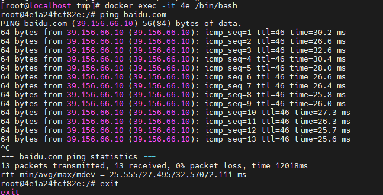 

退出查看tcpdump_msg文件

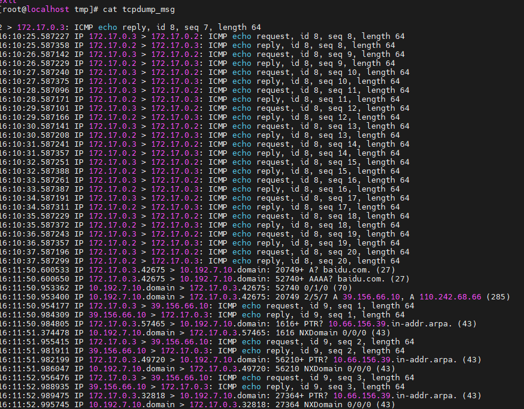 

###### 外部client访问docker中的服务，抓包查看通信过程；

在宿主机中运行一个nginx容器

```shell
docker run -it -d -p 9001:80 nginx
```

外部网络访问宿主机ip:9001,  转发给docker0接口

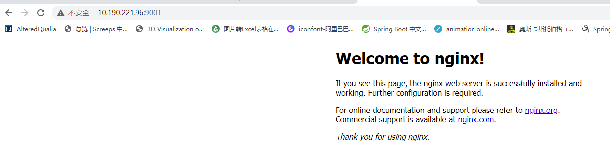

查看tcpdump_msg文件信息

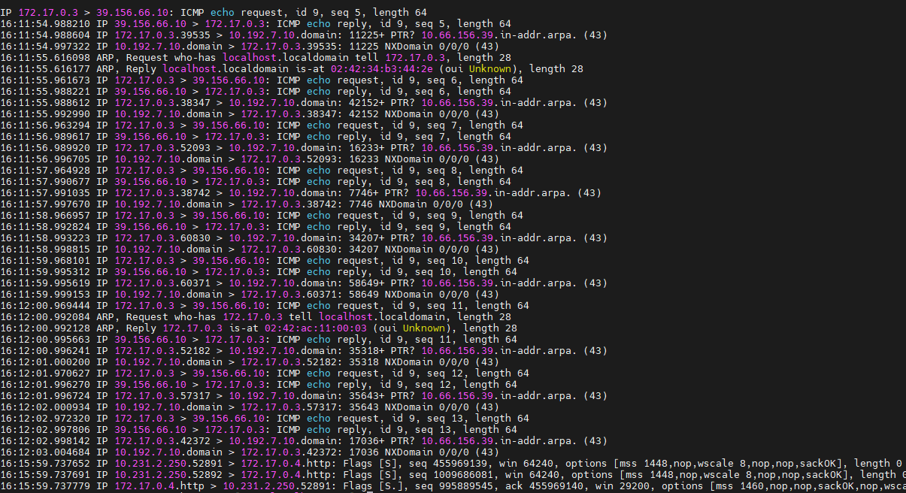 

###### 创建consul数据库容器和overlay网络，实现docker跨host通信。

两个主机分别pull  consul镜像运行容器

```shell
docker pull consul
docker run -d -p 8500:8500 -h consul --name consul consul
```

两个主机设置daemon.json后重启docker服务， docker重启后记得重新运行consul容器。

```json
{
    "cluster-store": "consul://10.190.221.96:8500"
	"cluster-advertise": "10.190.221.96:2375"
}
```

```json
{
    "cluster-store": "consul://10.190.221.96:8500"
    "cluster-advertise": "10.182.51.163:2375"
}
```

检查   10.190.221.96:8500 

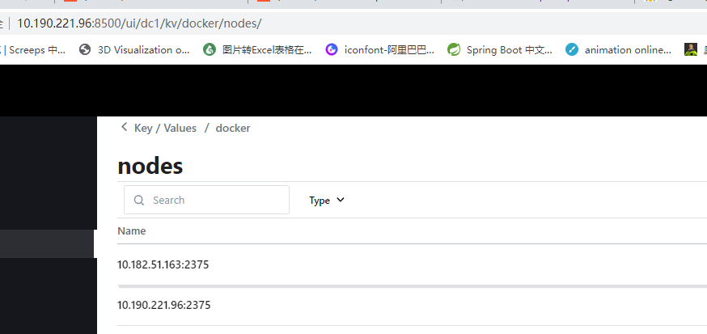 

只需要在一个主机中新建一个 -d overlay的网络 另一个主机中也会有

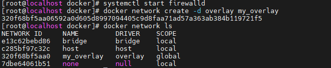 

在两个主机中使用这个网络创建容器， 然后测试网络联通性

```shell
docker run -d -it --net my_overlay ubuntu
```

