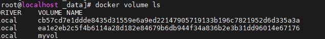
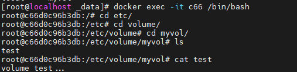
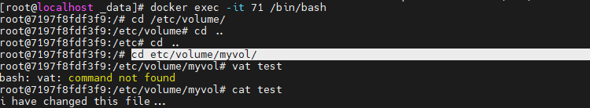

###### 实现多个容器间的数据共享

1. 创建两个容器  挂载使用同一个数据卷

   ```shell
    docker run -it -d -v myvol:/etc/volume/myvol ubuntu
    docker run -it -d -v myvol:/etc/volume/myvol ubuntu
    docker volume ls
   ```

    

2. 在 /var/lib/docker/volume/myvol/_data/ 目录下添加文件

3. 分别进入两个容器查看共享的文件并修改

   进入容器的 /etc/volume/myvol/ 目录查看test文件信息

    

   修改test文件并在第二个容器中查看

   ```shell
   echo "i have changed this file..." > test
   exit
   docker exec -it 71 /bin/bash
   cd etc/volume/myvol/
   cat test
   ```

    