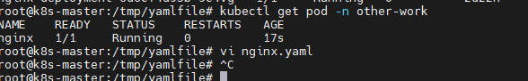

1.编写一个yaml文件

编一个nginx pod的yaml资源清单

```yaml
apiVersion: v1
kind: Pod
metadata:
  name: nginx
  labels:
    app: nginx

spec:
  containers:
  - name: nginx
    image: nginx:latest
    imagePullPolicy: IfNotPresent
    ports:
    - containerPort: 80
```

2.部署一个Pod

在other-work的namespace下部署一个nginxpod

` kubectl apply -n other-work -f nginx.yaml`

 

3.观察Pod中容器的网络和文件共享

一个pod中所有容器共享一个network namespace 共享一个数据卷。且全部使用最初容器pause的网络接口。这也意味着容器之间的端口不能重复。

4.观察Pod的生命周期


5.试验ReadinessProbe和LivenessProbe的效果