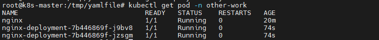
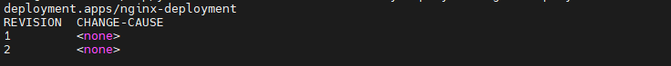
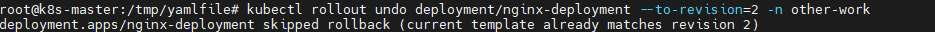
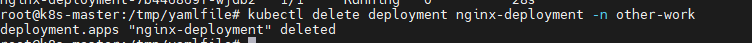

1.使用镜像nginx:1.19.0部署一个2副本的deployment、

使用如下yaml文件配置部署deployment

```yaml
apiVersion: apps/v1
kind: Deployment
metadata:
  name: nginx-deployment
spec:
  selector:
    matchLabels:
      app: nginx
  replicas: 2
  template:
    metadata:
      labels:
         app: nginx
    spec:
      containers:
      - name: nginx
        image: nginx:1.19.0
        ports:
        - containerPort: 80
```

 

2.扩容deployment到5个副本

编辑yaml文件的replicas:5

3.缩容deployment到3个副本

编辑yaml文件中的replicas:3

4.更新deployment的镜像到nginx:1.20.0

编辑yaml文件中image的tag

5.回退deployment到上个版本

 kubectl rollout history deployment nginx-deployment -n other-work     查看历史版本

 

kubectl rollout undo deployment/nginx-deployment --to-revision=2 -n other-work

 

6.删除deployment

 


