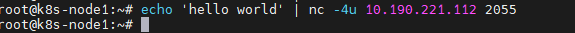
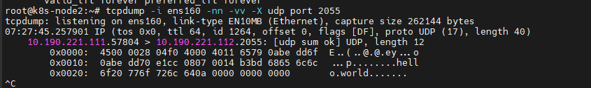
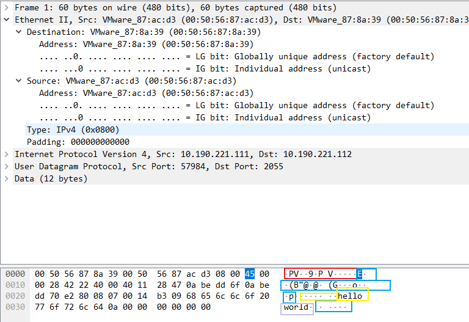
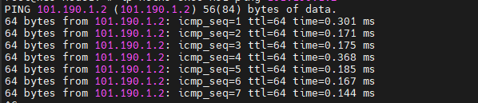
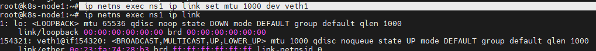
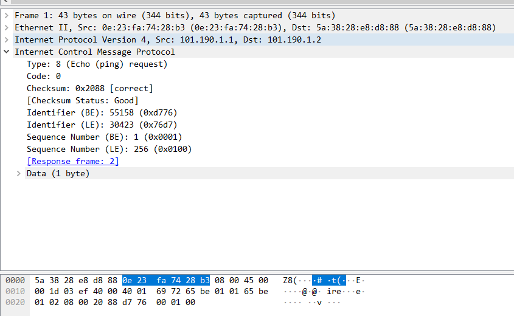
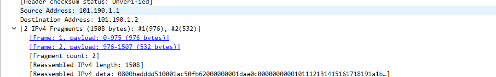

由机器1 `10.190.221.111` 向机器2`10.190.221.112`发送udp数据包

 

机器2接受到包信息

 

使用tcpdump命令将抓到的包保存为.pcap文件。 tcpdump -w udp.pcap -i ens160 port 2055

将该文件放入windows环境下使用wirshark软件打开， 通过点击上方的分区来查看对于的数据内容。

 

在linux环境下创建两个namespace

ip netns add ns1

ip netns add ns2

再创建两对veth

ip link add veth-2.1 type veth peer name veth-2.2

ip link add veth-1.1 type veth peer name veth-1.2

创建一个bridge

ip link add v-bridge type bridge

ip link v-bridge up

将veth与bridge和namespace连接

ip link set  veth-1.2 master v-bridge

ip link set  veth-2.2 master v-bridge

ip link set  veth-2.2 up

ip link set  veth-1.2 up

ip link set veth-1.1 netns ns1

ip link set veth-2.1 netns ns2

 ip netns  exec ns1 ip link set  veth-1.1 up

 ip netns  exec ns2 ip link set  veth-2.1 up

给veth和bridge分配ip地址

ip netns  exec ns1 ip addr add 101.190.1.1/24 dev veth-1.1

ip netns exec ns2 ip addr add 101.190.1.2/24 dev veth-2.1

在ns1中ping ns2的地址

 

设置ns1中veth mtu为1000

 ip netns exec ns1 ip link set mtu 1000 dev veth1

 

在ns2里面运行tcpdump抓包

ip netns exec ns2 tcpdump  -w /ns.pcap

把抓到的包移动到window下使用wireshark根据查看

不修改mtu发送普通的包抓

 

修改ns1 和ns2 的mtu为1000， 然后ns1ping ns2长度为1500的包

 

