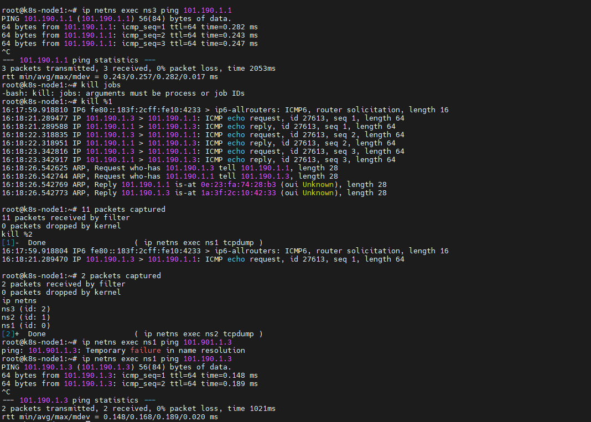
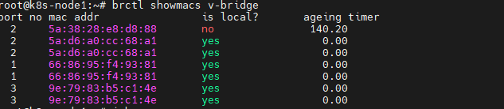
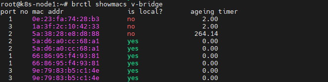

在linux使用namespace创建三个 ns。分别连接到一个虚拟网桥上

ns1 101.190.1.1    ns2  101.190.1.2     ns3  101.190.1.3

使用tcpdump在ns1和ns2上抓包

在ns3对ns1进行ping擦欧总， 一个ping了三个包

 

最终在ns1 的命名空间抓到了10个包.其中4个是ARP包  6个是ping进来的包以及ns1对ping包的返回

在ns2的命名空间之抓到一个包。因为刚开始在v-bridge虚拟交换机中的mac地址表项中  没有ns2中网卡veth1的物理地址， 如下图所示

  

但是进行一次ping操作以后，，交换机中学习到了101.190.1.1和物理地址0e::23::fa......的关系   。mac表项中出现了  veth1的物理地址，，不需要在泛洪发送数据

 

##### 带VLAN的转发

