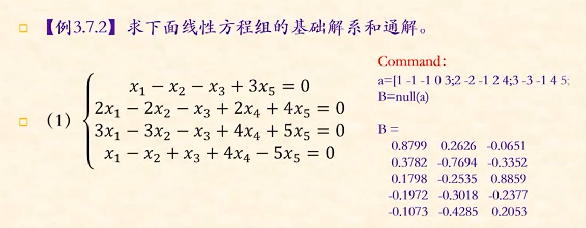

# 矩阵与列阵

### 矩阵的表示

1. 直接输入

   ```
   >>x=[1 2 3;2 3 4;3 4 5]
   ```

2. 向量法，当矩阵内元素较多却有规律时

   ```
   >>x=1:2:10
   //得到矩阵  [1,3,5,7,9]
   ```

   第一个数为起始值，第二个为步长，第三个为终值

3. 函数法

   ```
   >>x=[]          //空矩阵
   >>x=eye(3,4)    //3行4列的单位矩阵
   >>x=ones(5,6)   //5行6列的全一矩阵
   >>x=zeros(3,4)  //全零矩阵
   >>x=rand(3,4)   //元素在0-1之间的均匀分布
   >>x=randn(3,4)  //元素是均值为0方差为1的正态分布
   ```

### 矩阵元素的引用

1. 行列提取

   和python的切片很像，从1开始，前后都包括进去

   ```
   >>x=[1 2 3;2 3 4;3 4 5]
   >>x(9)     //  =5  单个索引值时，按顺序索引
   >>x(1,2:3) //  取第一行的 第二第三个数
   ```

2. 向量标识法

   ```
   >>x=[1 2 3;2 3 4;3 4 5]
   >>vr=[1,3]
   >>vc=[1,2]
   >>y=x(vr,vc)   //y是x的 1，3行 和 1，2列 交叉形成的新矩阵 [1 2;3 4]
   ```

### 矩阵的操作

1. 矩阵合并

   ```
   >>x=[a;b]
   //矩阵的行拓展，此时a，b矩阵的列数相同
   >>x=[a,b]
   //矩阵的列拓展，此时a，b的行数必须相同
   ```

2. 矩阵的转置

   ```mat
   >>x=x'
   ```

3. 矩阵的展开

   ```matlab
   >>x=[1 2;2 3]
   >>x=x(:)      //x按列展开
   ```

4. 矩阵的修改删除

   修改可以利用矩阵的索引赋值索引部分

   删除只需要将某一列行赋值为[],不能删除单个元素

 ### 矩阵的运算  

###### 矩阵的加减

1. 两个同阶矩阵可以加减，结果为对应元素相加减
2. 矩阵加减常量时将常量拓展为同阶矩阵

###### 矩阵的乘法  *

1. 表现为a，b矩阵的线性乘法规则
2. 矩阵乘以常数时，表现为矩阵点乘 常数的拓展

###### 矩阵的点乘  .*

1. 两个同阶矩阵可以点乘，表现两个矩阵的对应元素相乘

2. a*2  表现为点乘效果

   ```
   >>a=[1 2;4 5]
   >>a*2  //等价于  a.*[2 2;2 2]
   ```

###### 矩阵的除法 右除和左除

右除：  a*x=b  此时  x=b\a;

左除：  x*a=b 此时   x=b\a;

###### 矩阵的点除

同点乘

###### 矩阵的乘方和点乘方

a^2 是乘方，表现为a*a

a.^2是点乘方，表现为 a.*a

###### 矩阵的逻辑运算

符号有 ==，<=, >=, ~=(不等于)，&， |， ~

xor(x, y) 表示亦或

any(x)

all(x)

###### 逆矩阵

```
>>b=inv(a)
```

###### 矩阵的行列式与秩

```
>>det(a)  //求a的行列式，a为方阵
>>rank(a) //求矩阵的秩
```

###### 矩阵的特征值和特征向量

```   
>>D=eig(a)  //只求特征值 存放在向量d中
>>[V,D]=eid(a)   //D存放特征值，此时D为对角向量，v存放特征值，每一列为一个特征向量
```

###### 矩阵的变换

```
>>diag(a,k)   //得到a第k个对角元素，k却省时为0
>>fliplr(a)  //左右镜像矩阵a
>>triu(a)    //提取a的上三角矩阵
>>tril(a)    //提取a的下三角矩阵
```

###### 矩阵的分解

1. cholesky分解
2. 三角分解法
3. 正交分解法
4. 奇异值分解法

###### 线性方程组的求解

```
>>输入a
//这里a为系数方程组
>>b=null(a) 
//此时b就是a的基础解系
```

  