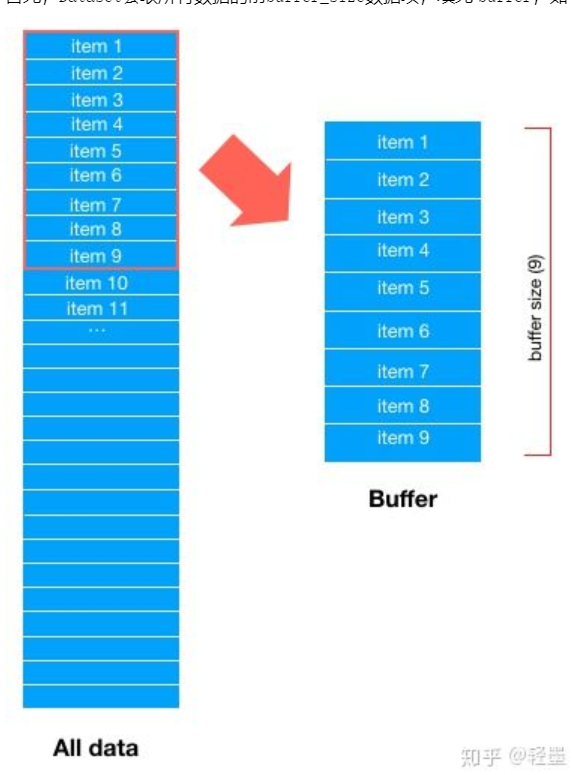
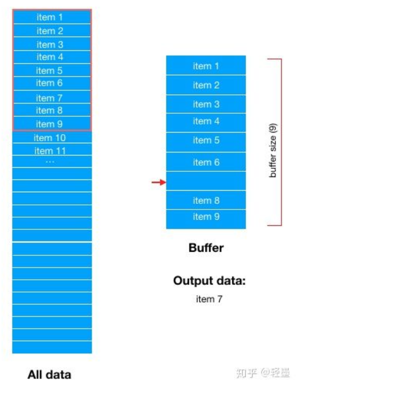

# Tensorflow2.0

## 检查电脑CPU GPU可调用情况

```python
print(tf.test.is_gpu_available())
GPU = tf.config.experimental.list_physical_devices(device_type='GPU')
print(GPU)
CPU = tf.config.experimental.list_physical_devices(device_type='CPU')
print(CPU)

```

```
import tensorflow as tf
```

##### tf.constant(value,dtype,shape)  用来创建张量  dtype用于指定数据类型

##### tf.cast(tensor量，数据类型)   用来修改tensor量的dtype值（只能由高精度向低精度转化）

```
arr = np.array([2, 3])
tf.constant(arr)
print(arr)
>>tf.Tensor([2 3], shape=(2,), dtype=int32)
arr_new = tf.cast(arr, tf.float32)
print(arr_new)
>>tf.Tensor([2. 3.], shape=(2,), dtype=float32)
```

##### tf.convert_to_tensor()也可用于创建张量

##### tf.is_tensor(value) 可以判断一个数据类型是否是一个张量

##### istance（value, tf.Tensor) 也可以用来判断数据类型

### 张量的提取

##### tf.gather(Tensor,indinces=)  indices=是一个索引值，提取Tensor张量中这些索引的值

##### tf.gather_nd(Tensor, indices=) 这个函数可以使提取结果为多维张量

```
arr2 = np.arange(12).reshape(3, 4)
a2 = tf.constant(arr2)
a3 = tf.gather(a2, indices=[0, 1])
print(a3)
>>tf.Tensor(1, shape=(), dtype=int32)
a4 = tf.gather_nd(a2, indices=[[0, 1], [2, 3]])
print(a4)
>>tf.Tensor([ 1 11], shape=(2,), dtype=int32)
```

### 张量的运算（要求两个张量各个元素类型相同）

| tf.add(a, b)      | a,b张量中逐个元素相加                    |
| ----------------- | ---------------------------------------- |
| tf.subtract(a, b) | 相减                                     |
| tf.multiply(a,b)  | 相乘                                     |
| tf.divide(a, b)   | 相除                                     |
| tf.math.mod(a, b) | 对a除b取余（a，b张量数据类型可以不一样） |
| tf.pow(a,b)       | 求a的b次方                               |
| tf.square(x)      | 求x的平方                                |
| tf.sqrt(x)        | x的平方根                                |
| tf.exp(x)         | 求e的x次方                               |
| tf.math.log(x)    | 计算自然对数，底数为e                    |

##### tensorflow中重载了大部分运算方法如加减乘除等，不建议使用。

##### 当张量和np数组一同运算时，若使用的是tf中的方法则np变为张量。当使用了np中的方法则张量变为np数组

## 多维张量的矩阵乘法

/？？？？？？

## tensorflow的自动求导机制

### 可训练变量Variable

tf.Variable(init_value,dtype)可以将张量进一步封装，init_value可以是数组，np类型，tensor类型

对于variable对象手动赋值可以用assign方法

```
x = tf.Variable([3, 4])
x.assign([3, 2])
x.assign_add([1, 1])
print(x)
>>  <tf.Variable 'Variable:0' shape=(2,) dtype=int32, numpy=array([4, 3])>
x.assign_sub([1, 1])
print(x)
>><tf.Variable 'Variable:0' shape=(2,) dtype=int32, numpy=array([3, 2])>
```

### 自动求导——GradientTape

tape.Gradient(persistent=false, watch_accessed_variables=true)

persistent缺省值为false ，此时tawatchpe只能使用一次。为true时可以多次使用但最后要del tape

 watch_accessed_variables 缺省值为true，自动监视所有变量，在某些多元函数中不需要监视所有变量可以定义为false

对于想要定义的变量使用tape.watch(x)

下面是求导实现的基本过程

```
x = tf.Variable(3.)
x2 = tf.Variable(2.)  # 求导值必须定义为浮点型
with tf.GradientTape(persistent=True) as tape:
    y = x*x
    z = pow(x, 3)+x2*x
dy_dx = tape.gradient(y, x)
dz_dx, dz_dx2 = tape.gradient(z, [x, x2])  # 对于多元函数的求导
print(y, dy_dx)
>>  tf.Tensor(9.0, shape=(), dtype=float32) tf.Tensor(6.0, shape=(), dtype=float32)
print(z, dz_dx, dz_dx2)
>> 
tf.Tensor(33.0, shape=(), dtype=float32) tf.Tensor(29.0, shape=(), dtype=float32) tf.Tensor(3.0, shape=(), dtype=float32)
del tape # 当persistent定义为true时要del它
```

##### 实现二次求导

```
x = tf.Variable(3.)
x2 = tf.Variable(2.)
with tf.GradientTape(persistent=True)as tape2:
    with tf.GradientTape(persistent=True) as  tape1:
        f = pow(x, 6)+x*x2
    fir_f = tape1.gradient(f, [x, x2])
sec_f = tape2.gradient(fir_f, [x, x2])
print(fir_f)
print(sec_f)
del tape1
del tape2
```

暂时不会高次方法

## 用于保存训练结果的变量的模块Checkpoint

#### 先看较为简单的保存加载模型方法

##### 只要保存模型的权重

```python
# model是一个训练好的模型
model.save_weights(filedir)
# model2必须是一个与model结构一样的模型但器权重值为空的
model2.load_weights(filedir)
```

##### 同时保存模型的结构和权重

```python
model.save(filedir)
# 在定义model2的时候直接加载model保存下来的结构与权重
mdoel2 = tf.keras.models.load_model(filedir)
model2.evaluate(...)
```

#### 使用checkpoint模块

##### tf.train.Checkpoint()和save()

可以将tensorflow中所有具有 Checkpointable State的随想进行保存，具体包括`tf.Variable` `tf.keras.Layer` `tf.keras.optimizer` `tf.keras.Model`实例都可以被保存。

```python
tf.train.Checkpoint(**kwargs)
# 他的参数是键值对
checkpoint = tf.train.Checkpoint(myAwesomeModel=model)
checkpoint.save("./save/myModel.ckpt")
# 可以在save文件中找到checkpoint 、 model.ckpt-1.index 、 model.ckpt-1.data-00000-of-00001 三个文件。
# save()方法可以多次运行，欸此运行都会生成index和data文件，后缀数字不一样
```

##### restore()方法

可以将save的实例重加载直接使用。

```python
# 新的model必须和被保存的model是同一类型
new_model_to_restore
# myAwesomeModel是之前保存的实例时使用的键值对，不能改变。
checkpoint = tf.train.Checkpoint(myAwesomeModel=new_model_to_restore)
checkpoint.restore("./save/myModel.ckpt-1")
# 可以在后缀后面添加index指定，也可以使用tf.train.latest_checkpoint(save_path) 获取最近的一个
# checkpoint.restore(tf.train.latest_checkpoint("./save"))
```

##### tf.train.CheckpointManager

## 用于数据集处理的模块tf.data.Dataset

##### 创建一个数据集

最简单的方法是使用tf.data.Dataset.from_tensor_slices((x,y))

假设参数x是图片，参数y是对图片的描述。这样一个data和label相对应的数据集就建设成功了。

```python
data_x = tf.constant([[1, 2], [2, 3]])
label_y = tf.constant([0, 1])
dataset = tf.data.Dataset.from_tensor_slices((data_x, label_y))
```

##### 对数据集的预处理  dataset.shuffle()   dataset.batch()    dataset.repeat()

```python
# 打乱数据集顺序，参数数字越大越混乱
dataset = dataset.shuffle(2)

# 将数据集内每两个元素合并成一个batch，最后一个batch可能小于2
dataset = data.batch(2)

# 将数据集重复2两次
dataset = dataset.repaeat(2)
```

###### dataset.shuffle(buffer_size)函数的意义

它会维持一个可以容纳buffer_size个元素的缓冲区。首先取前buffer_size个元素加入到缓冲区中，  再从缓冲区中随机去一个元素作为输出，这样buffer就空了一个出来，再从原数据集中按顺序

再从原数据集中按顺序下一个元素，插入到被输出的元素的位置。


##### 对数据集内元素的访问和使用

两种访问方式

```python
dataset = tf.data.Dataset.from_tensor_slices((A, B))
for a, b in dataset:
    # 对张量a, b, c等进行操作，例如送入模型进行训练
```

```python
dataset = tf.data.Dataset.from_tensor_slices((A, B))
it = iter(dataset)
a_0, b_0= next(it)
a_1, b_1 = next(it)
```

使用时model.fit()可以直接使用dataset作为输入

```python
model.fit(mnist_dataset, epochs=num_epochs)
```

### tf.data.prefetch是预加载的手段可以提高效率


### tf.reduce_XXX()函数

##### tf.reduce_mean(tensor,axis=,keepdims=, name=，keep_dims=)  求张量某一维度的平均值

axis指定维度，如不指定则自动计算所有元素

 keepdims=false时表示结果降维，=True时不降维

name指定操作名称。

```
x = tf.constant(np.array([[1, 3, 2], [1, 2, 3]]))
y1 = tf.reduce_mean(x, axis=0, keepdims=True)
print(y1)
>>tf.Tensor([[1 2 2]], shape=(1, 3), dtype=int32)

y2 = tf.reduce_mean(x, axis=[0, 1], keepdims=True)
print(y2)
>>tf.Tensor([[2]], shape=(1, 1), dtype=int32)
```

##### 类似的函数还有    tf.reduce_sum()求和    tf,reduce_max()求最大值    


 


