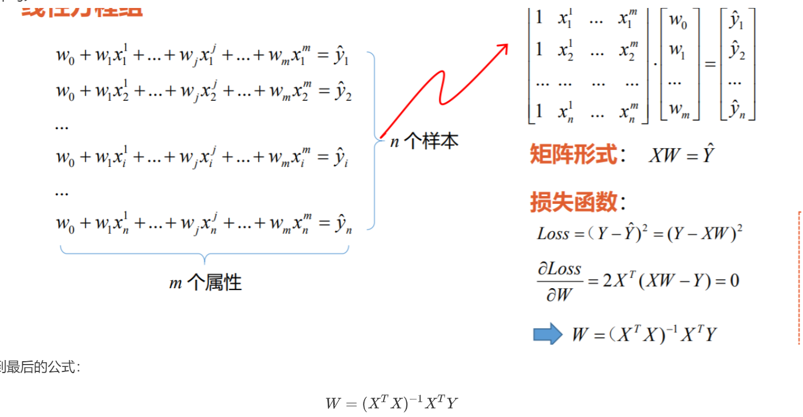
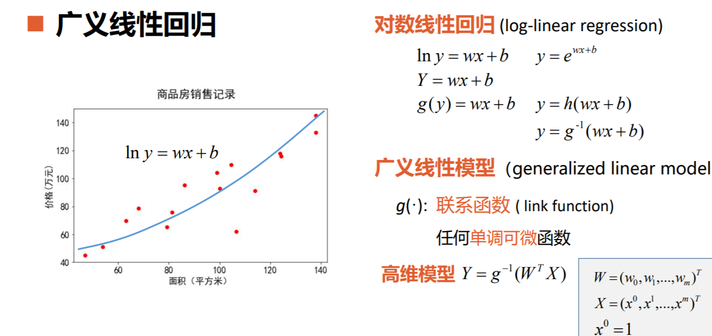

# 线性回归

### 一元线性回归

### 多元线性回归

一元和多元的线性回归都是找到损失函数使其最小化的参数

##### 多元线性回归的原理

有多个因素的公式如下：其中x0=0，w0为常量值
$$
y=w_0x_0+w_1x_0+w_2x_2+....+w_nx_n
$$
损失函数公式为：
$$
LOSS=\sum_1^n(y_i-W^TX_i)
$$
其中W=[w0  w1  w2  w3.........wn],  Xi=[x0  x1  x2,,,,,,,,xn]

以矩阵方式化简该式

得到最后的公式：$W=(X^TX)^{-1}X^TY$ 

## 广义的线性回归

可见对函数进行包装，可以用线性回归解决许多现实中的复杂函数模型

