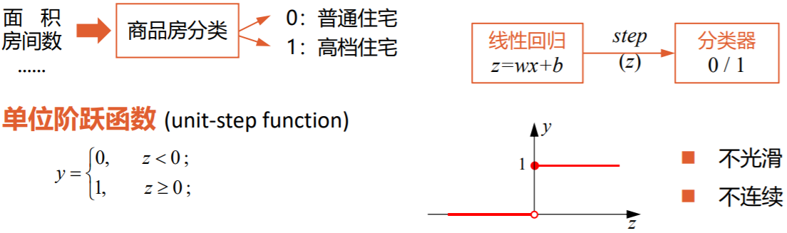
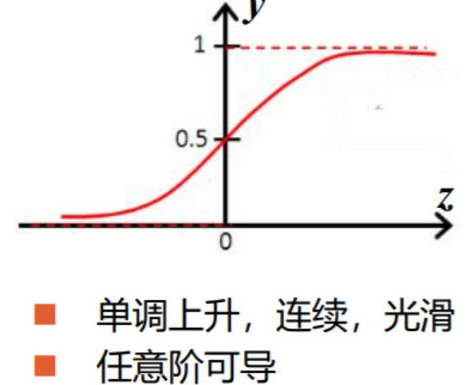
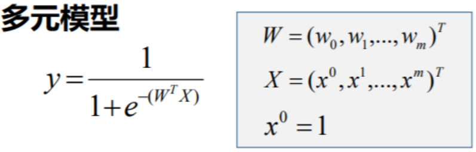

# 逻辑回归/分类问题

鸢尾花数据集  手写数字数据集

为了实现分类问题可以在线性回归的问题上加一个单位阶跃函数，以波士顿房价为例，不求房价而是求房子是高端房间还是低端房间。、

但是由于单位阶跃函数是不光滑不连续的，不满足处处可微。所以要找一个替代函数

### 对数几率函数

对数几率函数就可以代替该单位阶跃函数$y=\frac{1}{1+e^{-z}}  \rightarrow    \ln \frac{1}{1-y}=z$ 

 多元模型图 

由对数几率函数来解决逻辑回归的问题$\sigma(z)=\frac{1}{1+e^{(-wx+b)}}$ 

这时如果损失函数还是选择平方损失函数，会陷入局部极小值之中。需要用交叉熵函数代替

$Loss=-\sum^n_{i=1}[y_i\ln \hat y_i +(1-y_i)/ln(1-\hat y_i)]$       $y_i是标记值，\hat y_i是预测值$ 

### sogmoid函数

sigmoid函数能够将负无穷到正无穷的值变换为  0到1 的值的函数的统称。对数几率函数属于sigmoid函数

sigmoid函数是keras.dense()层中的激活函数，[[tensorflow.keras 的API#Dense 层中的激活函数activation]]

