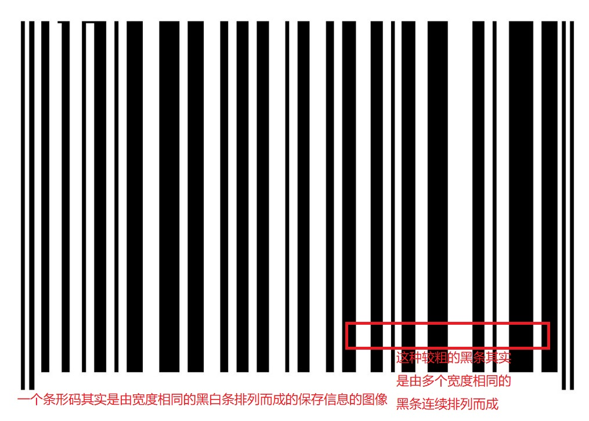
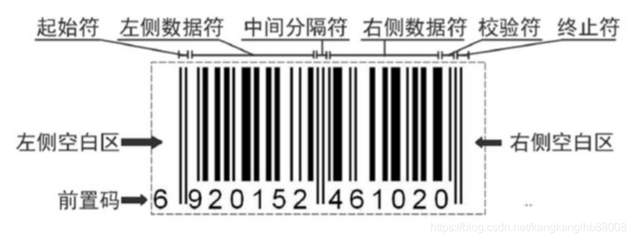
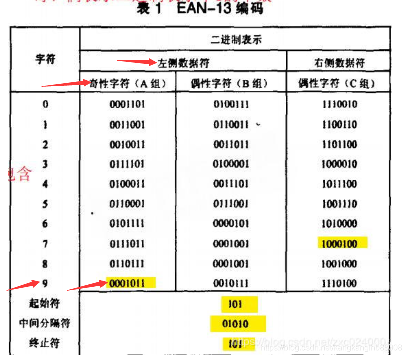
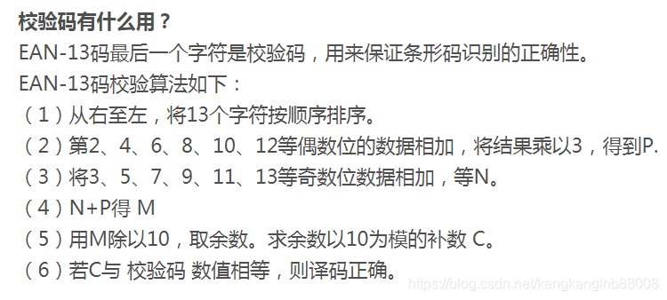
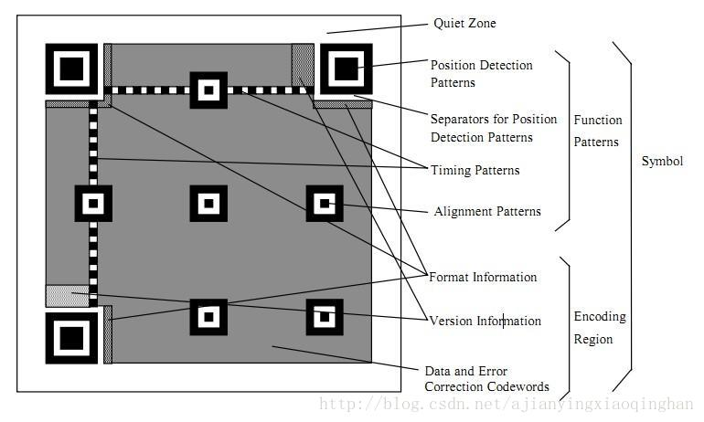
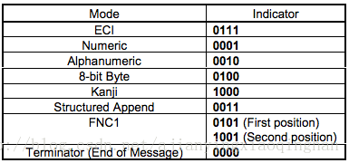
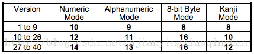
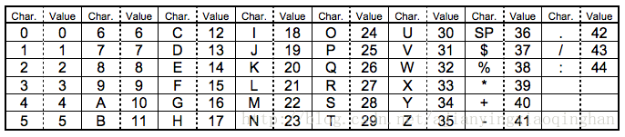

### 一维码 条形码

##### 条形码的诞生

最初的条形码原型诞生在 WestHouse(美国西屋)的实验室，名叫 ohn Kermode 的发明家想实现对邮政单据的自动分拣。方法是在信封上做条码标记，由他发明的扫描器发射光并接受反射光。

##### 成熟的条形码工作模式 以标准版商品条码（EAN－13条码）为例

[中国物品编码中心网站](http://www.ancc.org.cn/Service/queryTools/Internal.aspx) 

条形码通过它特殊的编码方式保存了 13个数字：1-3位代表商品的国家或地区，由国际分配，中国的是（690~699）；4-8位代表生产厂商，由国家分配； 9~12位厂内商品代码，由厂商自定； 13位是校验位，可以通过前面12位计算而校验。因而，在此种商品条形码中是不能看出商品的生产日期的。

 查看左边条形码的分区发现条形码是有方向的，且第一位称为前置码是由第2~7位计算而得。

条形码中黑条表1，白条表示0，来存储一个二进制串。aen-13的编码方式表：

可以看到 1. 左右字符的编码是不一样的；  2. 左侧字符编码是分有奇性和偶性的区别的 。这样区分可以使得即使扫码时条形放置反了，机器也能通过左右字符的编码差异进行区分左右，同时左侧字符的奇偶性区别，可以用来计算前置码，左侧六个字符奇偶排列与前置码的关系 :  O代表奇性 E代表偶性；

最后一位 则是由 前面的12位计算而来的校验位，用来保证机器对条形码识别的准确性。计算规则：

### 二维码

规范化文档ISO/IEC 18004

##### 二维码概念

二维码又称QR Code，QR全称Quick Response，是一个近几年来移动设备上超流行的一种编码方式，它比传统的Bar Code条形码能存更多的信息，也能表示更多的数据类型：比如：字符，数字，日文，中文等等。

RQ code 有多个版本Vesion 最小的称为 Version1是 21\*21的矩阵；最大的Version40 是 177\*177的矩阵，Version没增加一级就加4

的尺寸。

   

##### 二维码区域划分

###### 定位区域

- Position Detection Pattern, 定位图案：用于标记二维码矩形的大小；用三个定位图案即可标识并确定一个二维码矩形的位置和方向了；
- Separators for Position Detection Patterns, 定位图案分割器：用白边框将定位图案与其他区域区分；
- Timing Patterns, 时序图案：用于定位，二维码如果尺寸过大，扫描时容易畸变，时序图案的作用就是防止扫描时畸变的产生；
- Alignment Patterns, 对齐图案：只有在 Version 2 及其以上才会需要；

###### 给功能数据区

- Format Information, 格式信息：存在于所有尺寸中，存放格式化数据；
- Version Information, 版本信息：用于 Version 7 以上，需要预留两块 3×6 的区域存放部分版本信息；

###### 数据内容

- Data Code, 数据码；
- Error Correction Code, 纠错码；

#### 数据编码

##### 二维码支持的编码方式有很多 ，如图

            

###### 数字编码 Numeric Model

对数字进行编码 ，将每三个数字编码成 10位（12位/14位）的二进制数据，最后如果多出1位或2位数据 就编码成4bit或7bit位。不同Version的二维码，二进制位数不一样，参见上表。

举例对 01234567进行Version1 编码： 

012→0000001100, 345→0101011001, 67→1000011;   ==> 三个二进制串连起来就是  0000001100 0101011001 1000011；

加上 数字个数 8的 二进制编码  0000001000 0000001100 0101011001 1000011

加上 数字编码类型的标志 0001得到  0001 0000001000 0000001100 0101011001 1000011

###### 字符编码 Alphanumeric Mode

接收编码的字符包括 0-9，A-Z（无小写），一些符号：

字符编码的过程，就是**将每两个字符分为一组，然后转成上图 2.3 的 45 进制，再转为 11bits 的二进制结果**。对于落单的一个字符，则转为 6bits 的二进制结果。
此外，根据上图 2.2 的设定，对不同 Version 的二维码使用 9/11/13 个二进制表示。

##### 结束符和补齐符

以数字编码Version1  01234567为例，要在一段数据的结尾加上 0000 表示数据结束。如果最后不是8的倍数则再加0补齐

| 编码类型标志 | 数据个数 - 8 | 原数据                        | 结束符     |
| ------------ | ------------ | ----------------------------- | ---------- |
| 0001         | 0000001000   | 0000001100 0101011001 1000011 | 0000 + 000 |

如果最后还没有达到我们最大的 Bits 数限制，则需要在编码最后加上补齐符(Padding Bytes)。补齐符内容是不停重复两个字节：**11101100** 和 **00010001**。因为每一个Version的每一种纠错级别都有最小bits的限制。

##### 纠错码Error Correction Code Level

有了纠错机制，才可以使得有些二维码有了残缺也可以扫码解析出来，才可以使得二维码中心位置可以供某些商家加上对解析不必要的图标。二维码一共有四种纠错级别：

| 纠错水平 | 可被修正容量 |
| -------- | ------------ |
| L        | 7% 码字      |
| M        | 15% 码字     |
| Q        | 25% 码字     |
| H        | 30% 码字     |

具体在那不了解

#### 

#### 二维码的绘制

