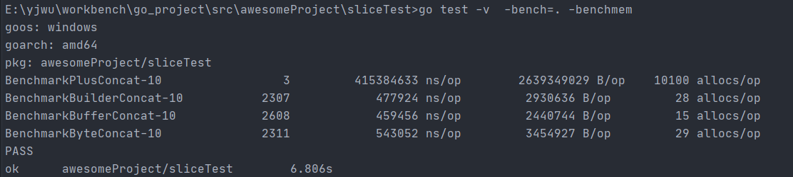
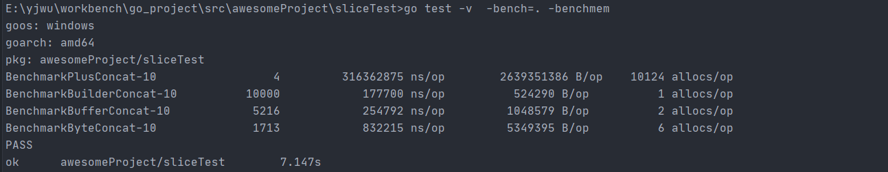

### 字符串拼接的性能问题

使用 `+` 和 `fmt.Sprintf` 的效率是最低的，和其余的方式相比，性能相差约 1000 倍，而且消耗了超过 1000 倍的内存。当然 `fmt.Sprintf` 通常是用来格式化字符串的，一般不会用来拼接字符串。

`strings.Builder`、`bytes.Buffer` 和 `[]byte` 的性能差距不大，而且消耗的内存也十分接近，性能最好且消耗内存最小的是 `preByteConcat`，这种方式预分配了内存，在字符串拼接的过程中，不需要进行字符串的拷贝，也不需要分配新的内存，因此性能最好，且内存消耗最小。

##### 字符串拼接的基本实现

```go
package sliceTest
import (
	"bytes"
	"strings"
)
// 直接 +拼接  或  fmt.sprintf()拼接
func plusConcat(n int, str string) string {
	res := ""
	for i := 0; i < n; i++ {
		res += str
	}
	return res
}
//使用strings.Builder{}对象
//使用builder.Grow() 预分配内存可以进一步提高性能
func builderConcat(n int, str string) string {
	builder := strings.Builder{}
	//builder.Grow(n* len(str))
	for i := 0; i < n; i++ {
		builder.WriteString(str)
	}
	return builder.String()
}
//使用bytes.Buffer{}对象
func bufferConcat(n int, str string) string {
	buf := bytes.Buffer{}
    //buf.Grow(n*len(str))
	for i := 0; i < n; i++ {
		buf.WriteString(str)
	}
	return buf.String()
}
//使用[]byte 拼接
func byteConcat(n int, str string) string {
	b := make([]byte, 0)
    //b := make([]byte, n*len(str))
	for i := 0; i < n; i++ {
		b = append(b, str...)
	}
	return string(b)
}
```

##### benchmark测试情况

```go
package sliceTest
import (
	"testing"
)
var Str_From_Norway = "ncvdscnvwicinvnrujcdijciocjoijWPOMCDIUHCFUEjhuehucvn"
func benchmark(b *testing.B, f func(int, string) string)  {
	for i := 0; i < b.N; i++ {
		f(10000, Str_From_Norway)
	}
}
func BenchmarkPlusConcat(b *testing.B) {
	benchmark(b, plusConcat)
}
func BenchmarkBuilderConcat(b *testing.B) {
	benchmark(b, builderConcat)
}
func BenchmarkBufferConcat(b *testing.B)  {
	benchmark(b, bufferConcat)
}
func BenchmarkByteConcat(b *testing.B) {
	benchmark(b, byteConcat)
}
```

###### 对于没有进行预分配空间的情况



可以看到实际的耗时和程序运行过程中申请内存空间的次数有直接关系。`fmt.Sprint()`和`+` 拼接的性能问题主要是由内存分配方式引起的.

- 字符串string在go中属于不可变的类型，占用的内存大小是固定的。当使用 `+` 拼接2个字符串的时候，就需要开启一段新的空间，新空间的大小是原来两个字符串大小的和。 导致在大量拼接的时候会反复申请内存，内存占用量大且耗时。
- strings.Builder{}  bytes.Buffer{}  []byte 在申请内存时十一倍数去申请的。 比如要拼接一个10byte大小的字符串， 则会申请大小为 16 byte 的内存（恰好大于 10 byte 的 2 的指数），第二次写入 10 byte 时，内存不够，则申请 32 byte 的内存，第三次写入内存足够，则不申请新的，以此类推。在实际过程中，超过一定大小，比如 2048 byte 后，申请策略上会有些许调整。

也因此在对strings.Builder{}  bytes.Buffer{}  []byte 预先分配合适的内存， 减少申请次数可以进一步提高性能                                                                                                                                                                                                                                                                                                                                                                                                                                                                                                 

###### 对strings.Builder{}  bytes.Buffer{}  []byte 预分配空间的情况

 

`strings.Builder`和 `bytes.Buffer` 底层都是 []byte 数组, 并做了一定优化， 相较于直接使用[]byte 都更加高效。 但是使用`strings.Builder` 仍然比`bytes.Buffer`稍快一些， 因为`bytes.Buffer`转化为字符串时重新申请了一块空间，存放生成的字符串变量，而 `strings.Builder` 直接将底层的`[]byte`转换成了字符串类型返回了回来， *可以看到Buffer申请了两次内存*。

### slice的性能问题和常见陷阱

go的切片slice是在建立在数组结构上的抽象数据类型。

##### 数组类型的注意点

C语言中数组是指向第一个元素的指针， 但是Go语言的数组则是属于**值类型**。数组类型定义了长度和元素类型， *这里数组的长度是数组类型的一部分， 两个不同长度的数组是不能互相赋值的， 因为他们属于不同的类型。*

#### 切片slice
[[]]


###### 关于切片删除的安全操作

```go
array := []int{1, 2, 3, 4, 5}
for i := 0; i < len(array); i++ {
    array = append(array[:i], array[i+1:]...)
    i--
}
```

