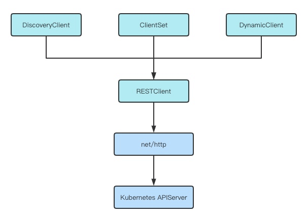

## client-go的四种客户端

Client-Go 共提供了 4 种与 Kubernetes APIServer 交互的客户端。分别是 RESTClient、DiscoveryClient、ClientSet、DynamicClient。

- RESTClient：最基础的客户端，主要是对 HTTP 请求进行了封装，支持 Json 和 Protobuf 格式的数据。
- DiscoveryClient：发现客户端，负责发现 APIServer 支持的资源组、资源版本和资源信息的。
- ClientSet：负责操作 Kubernetes 内置的资源对象，例如：Pod、Service等。
- DynamicClient：动态客户端，可以对任意的 Kubernetes 资源对象进行通用操作，包括 CRD。 *CRD即 custom resource definition， 自定义资源。*



### RESTClient

RESTClient是最基本的客户端 所有其他的客户端都是基于它进行封装。 它提供了RESTAPI 的对应的方法的封装，*（包括 Get() Post() Delete() Put() Patch()）* . 通过这些封装的方法和Kubernetes APISever进行交互。

它可以操作所有的内置对象和CRD对象， **简单的使用示例：**

```go
// 函数GetKubernetesConfig() 用来根据kubeConfig文件生成Config对象。
func GetKubernetesConfig(configPath string) (*rest.Config, error) {
	var kubeconfig *string
	if configPath != "" {
		kubeconfig = &configPath
	} else {
		if home := homedir.HomeDir(); home != "" {
			kubeconfig = flag.String("kubeconfig", filepath.Join(home, ".kube", "config"), "(optional) absolute path to the kubeconfig file")
		} else {
			kubeconfig = flag.String("kubeconfig", "", "absolute path to the kubeconfig file")
		}
	}
	flag.Parse()
	config, err := clientcmd.BuildConfigFromFlags("", *kubeconfig)
	if err != nil {
		return nil, err
	}
	return config, nil
}
```

对由kubeConfig文件生成的Config对象 配置三个额外信息。

```go
func NewRestClient() (*rest.RESTClient, error) {
	config, err := getConfig.GetKubernetesConfig("")
	if err != nil {
		return nil, err
	}
	// 配置 API 路径
	config.APIPath = "api"
	// 配置 资源版本
	config.GroupVersion = &corev1.SchemeGroupVersion
	// 配置 解码器
	config.NegotiatedSerializer = scheme.Codecs
	restClient, err := rest.RESTClientFor(config)
	if err != nil {
		return nil, err
	}
	return restClient, nil
}
```

RESTClient使用示例

```go
func RESTClientUsage() {
	client, err := NewRestClient()
	if err != nil {
		panic(err)
	}
	podList := &corev1.PodList{}
	err = client.Get().
		Namespace("default").
		Resource("pods").
		VersionedParams(&metav1.ListOptions{Limit: 100}, scheme.ParameterCodec).
		Do(context.Background()).
		Into(podList)
	if err != nil {
		panic(err)
	}
	fmt.Printf("have %+v pod in default\n", len(podList.Items))
	fmt.Printf("from k8s get pods: %+v \n", podList.Items)
}
```

#### RESTClient简单分析

RESTClient其实底层是使用了 "net/http" 库， 对


### ClientSet

clientSet是基于RESTClient进行的封装， 同时ClientSet是使用预生成的API对象和APIServer进行交互， 这样可能更有利于二次开发， 但是导致ClientSet只能对k8s内置的资源对象的进行操作。 ClientSet是一组资源对象客户端的集合， 例如负责操作Pods Services等资源的CoreV1Client, 负责Deployment DaemonSets等资源的AppsV1Client等。 

查看 ClientSet实现的结构体， 可以看到 结构体内是各种RESTClient， 当我们使用ClientSet客户端对象时， 实际就是使用该对象内置的各种RESTClient与kubeapiseever进行交互。

```go
type Clientset struct {
	*discovery.DiscoveryClient
	admissionregistrationV1       *admissionregistrationv1.AdmissionregistrationV1Client
	admissionregistrationV1alpha1 *admissionregistrationv1alpha1.AdmissionregistrationV1alpha1Client
	admissionregistrationV1beta1  *admissionregistrationv1beta1.AdmissionregistrationV1beta1Client
	internalV1alpha1              *internalv1alpha1.InternalV1alpha1Client
	appsV1                        *appsv1.AppsV1Client
	appsV1beta1                   *appsv1beta1.AppsV1beta1Client
    ....
    ....
}
```


ClientSet这个名字也表示他是一系列client的集合。

### DiscoveryClient

前面的客户端都是对资源对象进行操作的， 而discoveryClient则是对资源类型进行发现的客户端。 *用于查看当前Kubernetes集群支持哪些资源组， 资源版本， 资源信息。* **使用示例如下：**

创建一个简单的discoveryClient

```go
func NewDiscoveryClient() (*discovery.DiscoveryClient, error) {
	config, err := getConfig.GetKubernetesConfig("")
	if err != nil {
		return nil, err
	}
	discoveryClient, err := discovery.NewDiscoveryClientForConfig(config)
	if err != nil {
		return nil, err
	}
	return discoveryClient, nil
}
```

通过discoveryClient获取kubernetes集群中的资源组和资源信息：

```go
func DiscoveryClientUsage() {
	client, err := NewDiscoveryClient()
	if err != nil {
		panic(err)
	}
	apiGroups, apiResources, err := client.ServerGroupsAndResources()
	if err != nil {
		panic(err)
	}
	for _, group := range apiGroups {
		fmt.Printf("group: %+v \n", group)
	}
	for _, resourceList := range apiResources {
		group, err := schema.ParseGroupVersion(resourceList.GroupVersion)
		if err != nil {
			panic(err)
		}
		fmt.Printf("\ngroup:%+v :", group)

		for _, resource := range resourceList.APIResources {
			fmt.Printf("%+v ", resource)
		}
	}
}
```


### DynamicClient

DynamicClient是一种动态客户端， 通过动态指定资源组， 资源版本， 资源信息等， 来操作任意的kubernetes资源*（不仅仅内置的kubernetes， 还包括CRD）*。使用ClientSet， 程序会和所使用的版本与类型紧密的耦合。 而使用dynamicClient使用的嵌套的map\[string\]intereface{}结构存储kubernetes apisever的返回值， 使用反射机制，在运行的时候与数据进行绑定，这种方式更加灵活，但是无法获取强数据类型的检查和验证。

在dynamicClient中使用了两个比较重要的结构 `Object.runtime`接口和 `Unstructured`结构体.

- Object.runtime: kubernetes中所有的资源对象都实现了这个接口， 其中包含 DeepCopyObject()和 GetObjectKind() 两个方法， 分别用于对象的深拷贝和获取对象的具体资源类型。
- Unstructured结构体： 包含map[string]interface{} 类型字段， 在处理无法预知结果的数据时， 将数据直接传入 interface{}, 等待运行时利用反射机制进行判断。 该结构体提供了大量的根据方法， 用于处理非结构化的数据。

**使用示例：**  构建一个dynamicClient对象

```go
func NewDynamicClient() (*dynamic.DynamicClient, error) {
	config, err := getConfig.GetKubernetesConfig("")
	if err != nil {
		return nil, err
	}
	dynamicClient, err := dynamic.NewForConfig(config)
	if err != nil {
		return nil, err
	}
	return dynamicClient, nil
}
```

使用dynamicClient对象和apisevere交互

```go
func DynamicClientUsage() {
	client, err := NewDynamicClient()
	if err != nil {
		panic(err)
	}
	gvr := schema.GroupVersionResource{
		Group:    "",
		Version:  "v1",
		Resource: "pods",
	}
	list, err := client.Resource(gvr).Namespace("").List(context.Background(), metav1.ListOptions{})
	if err != nil {
		panic(err)
	}
	fmt.Printf("from kubernetes get pods:%+v \n", list.Items)
}
```

