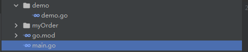
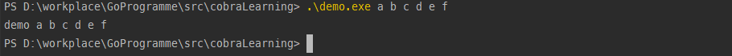
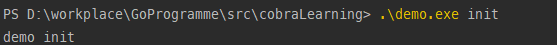

[cobra.dev](https://cobra.dev/)

### cobra

> cobra既是一个用于创建CLI应用程序的库， 也是一个生成应用程序和命令文件的程序。 cobra被使用再很多go语言的项目中， 比如 Kubernetes、Docker、[Istio](https://so.csdn.net/so/search?q=Istio&spm=1001.2101.3001.7020)、ETCD、Hugo、Github CLI等等

###### 安装

```shell
go get -u github.com/spf13/cobra
```

###### cobra项目的一般结构

 

#### cobra项目使用

在demo文件夹新建的demo.go文件，定义间的命令规则

```go
package demo

import (
   "fmt"
   "github.com/spf13/cobra"
   "strings"
)

var rootCMD = &cobra.Command{
   // 命令名 使用示例
   Use:   "demo",
   //介绍
   Short: "this is cobra demo",
   //详细介绍
   Long:  "this is cobra demo, here more msg...",
   //命令运行函数， 
   //cmd *cobra.Command
   //args []string 
   Run: func(cmd *cobra.Command, args []string) {
      fmt.Println("demo " + strings.Join(args, " "))
   },
}

func Execute() {
   err := rootCMD.Execute()
   if err != nil {
      panic(err)
   }
}
```

在main函数中调用该命令的`Execute()`函数

```go
package main

import "cobraLearning/demo"

func main() {
	demo.Execute()
}
```

随后`go build -o demo.exe`打包这部分代码, 执行效果

 

##### 嵌套子命令

cobra推荐的命令格式大致是 `[toolName] [command] [--falgs] [args]`

```go
import (
	"fmt"
	"github.com/spf13/cobra"
	"strings"
)

var rootCmd = &cobra.Command{
	Use:   "demo",
	Short: "this is cobra demo",
	Long:  "this is cobra demo, here more msg...",
	Run: func(cmd *cobra.Command, args []string) {
		fmt.Println("demo " + strings.Join(args, " "))
	},
}
var initCmd = &cobra.Command{
	Use:  "init",
	Long: "this is demo init",
	Run: func(cmd *cobra.Command, args []string) {
		fmt.Println("demo init")
	},
}

func init() {
	rootCmd.AddCommand(initCmd)
}
func Execute() {

	err := rootCmd.Execute()
	if err != nil {
		panic(err)
	}
}
```

该命令使用大致 

 

##### flag参数的使用

Flags提供了修饰符来控制命令的操作， 在cobra中有两种Flag 

- Persistent Falg    全局性的Flag， 可以用于该命令和该命令的所有子命令
- Local Flag             局部Falg， 只能用于该命令。

###### cobra 添加PersistentFlag的方式

```go
var (
	filePath string
	model    string
	count    int32
)
func init() {
	filePath = *rootCmd.PersistentFlags().StringP("filePath", "f", "default_path", "usage")
	rootCmd.PersistentFlags().StringVar(&model, "model", "default_model", "usage")
	rootCmd.PersistentFlags().Int32VarP(&count, "count", "c", 1, "usage")
}
```

