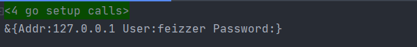

## Golang对象创建传参模式

### builder建造者模式

### option选项模式

option模式出现的原因， golang不允许我们**给函数的入参设置默认值**， 也不允许**使用不同的入参对同名函数重载**。当我们在创建的对象的时候希望选择只初始化对象中几个属性。

##### 实现方式

```go
package main

import "fmt"
//假设我们有一个如下结构体需要创建对象
type Config struct {
	Addr 	 string
	User 	 string
	Password string
}
//定义一个函数类型， 用来修改我们的对象
type Option func(c *Config)

//Option函数实现
func WithUser(user string) Option {
	return func(c *Config) {
		c.User = user
	}
}
func WithAddr(addr string) Option {
	return func(c *Config) {
		c.Addr = addr
	}
}
func WithPassword(password string) Option {
	return func(c *Config) {
		c.Password = password
	}
}

func NewConfig(opts ...Option) *Config {
    //可以设置默认值
	var config = Config{
        User: "xiaojie",
    }
	for _, opt := range opts {
		opt(&config)
	}
	return &config
}
//使用测试
func main() {
	config := NewConfig(
        WithAddr("127.0.0.1"),
		WithUser("feizzer"))
	fmt.Printf("%+v\n", config)
}
```

 

##### 使用总结

**优点：** 允许默认值， 参数顺序任意， 方便拓展

**缺点：** 新增较多函数， 参数不多时不建议使用

