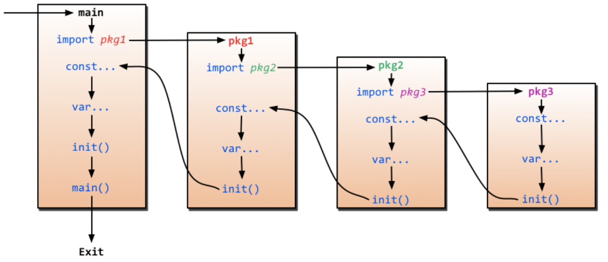
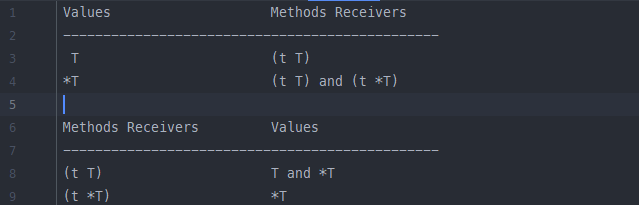
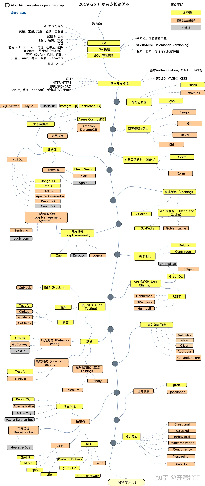

### Go的包导入

[(2条消息) 彻底搞懂golang的GOROOT和GOPATH_知更鸟女孩的博客-CSDN博客_goroot和gopath](https://blog.csdn.net/qq_38151401/article/details/105729884) 

Go语言似乎弱化了项目的概念，强化包的概念。有两个主要的路径GOPATH和GOROOT。

- GOROOT   GOROOT就是go的安装路径，类似于java的JDK

- GOPATH    GOPATH是工作空间路径， 保存go的项目代码和第三方依赖包。  GOPATH目录下有bin， pkg， src。 bin目录存放编译后的二进制文件。

  src目录存放我们的项目代码文件，和默认模式下go get下载的包文件。pkg目录。。。。。

==在go1.11版本以前，使用GOPATH管理的时候：==在import包时， Go会优先在 `%GOROOT%/src`文件中寻找 该目录中保存了Go标准库的代码，然后在`%GOPATH%\src`该目录中存放的是自身代码和依赖的包。[go的package管理](go的package管理.md)

##### 包导入的过程

 

首先从main包开始，如果main包中有import语句，则会导入这些包，如果要导入的这些包又有要导入的包，则继续先导入所依赖的包。重复的包只会导入一次，就像很多包都要导入fmt包一样，但它只会导入一次。

每个被导入的包在导入之后，都会先将包的可导出函数(大写字母开头)、包变量、包常量等声明并初始化完成，然后如果这个包中定义了init()函数，则自动调用init()函数。init()函数调用完成后，才回到导入者所在的包。同理，这个导入者所在包也一样的处理逻辑，声明并初始化包变量、包常量等，再调用init()函数(如果有的话)，依次类推，直到回到main包，main包也将初始化包常量、包变量、函数，然后调用init()函数，调用完init()后，调用main函数，于是开始进入主程序的执行逻辑

### GO MODULES管理
[[Golang的项目管理]]

### Go的基本数据类型

##### Go中的string为什么是基本数据类型

字符串虽然在 Go 语言中是基本类型 string, 但是它实际上是由字符组成的数组，类似于 C 语言中的 char [] ,作为数组会占用一片连续的内存空间。

==语言中的字符串其实只是一个只读的字节数组，不支持直接修改 string 类型变量的内存空==。

```go
func main() {
	str := "hahaha"
	str[0] = 'a'
	fmt.Print(str)
}
```

上面的代码会报错：


**如果我们想修改字符串，我们可以将这段内存拷贝到堆或者栈上，将遍历的类型转换为 []byte 之后就可以进行，修改后通过类型转换就可以变回 string, 对原变量重新赋值即可。**

```go
func main() {
	str := "hahaha"
	byte_str := []byte(str)
	byte_str[0] = 'a'
	str = string(byte_str)
	fmt.Print(str)
}
```

### Go中的复合类型（Aggregate Types）

##### 定长数组

go语言中的定长数组是默认值传递的， 因此它可以直接使用 `==` 符号去判断两个定长数组的值是否一样 *必须要是长度相同的定长数组，否则编译不通过。*

##### slice或切片 （变长数组[]int）

###### 切片底层结构

slice的定义可以在`runtime/slice.go` 中看到 

```go
type slice struct {
   array unsafe.Pointer
   len   int
   cap   int
}
```

包含一个指向数组开头的指针， 两个int值表示长度和容量。

###### 为什么append()  要返回并赋值

显然的我们说切片在传值时是引用传值是因为，slice中包含一个指针指向数组开头，但是另外两个int值代表的信息是值传递。在调用append()函数的过程中，

==长度和容量甚至指针== 都有可能会发生变化， 必须要返回赋值来更新。

###### 切片的扩容策略

```go
a1 := make([]int, 3, 3)
new_a1 := append(a1, 666)
fmt.Printf("pointer= %p, cap= %d\n", &a1, cap(a1))
fmt.Printf("pointer= %p, cap= %d", &new_a1, cap(new_a1))
```

 

当cap<1024时， 扩容时直接 *2，，当cap>=102时，扩容时 *1.25.

###### 切片底层数据共享


##### map类型


#### Golang的接口和类

==首先golang中， 类和接口赋值时是值传递， 似乎只有**切片和map**是引用传递的==

##### golang的类

###### 类方法的奇怪语法糖

golang中的类struct可以通过**值类型接收者 和 引用类型接收者**两个方式定义**类方法**，不同类型之间却是可以调用的

```go
type Person interface {
   Eat()
   Walk()
}
type Man struct {
   staff string
}
func (p *Man) Eat() {
   p.staff = "eat"
   fmt.Println("man eat" + p.staff)
}
func (p Man) Walk() {
   p.staff = "walk"
   fmt.Println("man walk")
}
func TypeTest() {
   man := Man{"man"}
   man.Walk()
   man.Eat()
   (&man).Walk()
   (&man).Eat()
}
```

上面的代码都可以编译通过运行，这是因为编译器会主动的将调用者的类型进行转化。**但是依然会有不同种类型不能调用的情况：**

- **`值类型` 不能被寻址的情况**,如果值类型不能寻址 那么他就不能调用引用接收者的方法。下面这段代码就会编译出错，因为编译器尝试给`createMan()`方法返回的右值调用pointer method方法失败了。然后尝试插入取值符号，但是失败了。及不可以被寻址

  > 左值和右值的定义；

  ```go
  func createMan() Man {
     return Man{"man"}
  }
  func TypeTest() {
     createMan().Eat()
  }
  ```

- **用引用接收实现的接口** 

  但是不同的类型方法实现对应的不同的方法集：

   

  其实就是实现了**值接收者**的类方法 默认也实现了**引用接收者**的类方法*只不过不能调用*。 而实现了**引用接收者**类方法不会去实现**值接收者**的类方法。 所以当使用**引用接收方法**实现了接口。程序认为只有 `&man 指针类型`实现了接口，而`man 值类型`没有实现该接口。

  ```go
  func TypeTest() {
     man := Man{"man"}
      /* var p Person = &man  
         会编译报错 Cannot use 'man' (type Man) as the type Person Type does not implement 'Person' as the 	 	
         'Eat' method has a pointer receive
      */
     var p Person = man
     fmt.Println(p)
  }
  ```

  

####  go的闭包特性

> 所谓闭包，就是一个函数捕获了和它自己同一个作用域的变量或者常量。这就意味这当这个有闭包的函数在任何地方被调用，都能够使用这些变量或常量。只要闭包还在使用他，这些变量依然会存在。 *编程语言中的垃圾回收都是当内存中的一段空间不再被任何变量引用的时候，就可以将这段空间释放。既然这个函数中一直有值指向被捕获的内存空间，那么这个值一直可以被保存并使用。*

```go
func main() {
	f := closure()
	fmt.Println(f()) 	//1
	fmt.Println(f())	//2
	fmt.Println(f())	//3
	fmt.Println(f())	//4
}
func closure() func() int {
   x := 0
   return func() int {
      x++
      return x
   }
}
```

 不正确的偶然间的使用闭包往往会给程序带来难以调式的问题，在平时的编程中需要理解避免误用。




