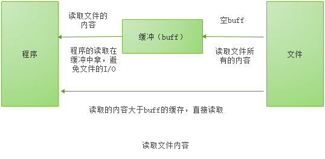

#### bufio

bufio包实现了带有缓冲的IO。简单的说就是`bufio`会把文件内容读取到缓存中（内存），然后再取读取需要的内容的时候，直接在缓存中读取，避免文件的`i/o`操作。同样，通过`bufio`写入内容，也是先写入到缓存中（内存），然后由缓存写入到文件。避免多次小内容的写入操作`I/O`。

**`bufio.Reader.Read(p []bytes)`**读取文件的思路：

1. 当缓存区中有内容时，将缓存区的的内容填入p并情况缓存区。
2. 当缓存区没有内容且len(p)>len(buf), 即要读取的内容比缓存区还要大，直接去读文件即可。
3. 当缓存区没有内容且len(p)<len(buf), 即要读取的内容比缓存区小，则缓存区读取文件的内容充满缓冲区，并将p填满（此时缓存区中有内容剩余）。
4. 以后再次读取缓冲区中内容，将缓冲区的内容全部填入p并清空缓冲区（情况一）。

 

##### 新建一个 bufio.Reader

`bufio.Reader`是封装了`io.Reader`的一个结构体。 bufio中提供了两个函数来获取一个`bufio.Reader`实例。`NewReader()`和`NewReaderSize()`。NewReader()内部就是调用NewReaderSize()。

```go
file, err := os.Open("test.text")
if err != nil {
	fmt.Println(err)
}
reader := bufio.NewReader(file)
```

##### 读取bufio.Reader实例中的内容

- **`func (b *Reader) ReadSlice(delim byte) (line []byte, err error)`** 

  ReadSlice会从输入中读取，直到遇到第一个界定符（delim）返回一个指向缓存中字节的slice，在下次调用读操作时（read），这些字节会无效。

  ReadSlice会把界定符读取进来。如果ReadSlice在读取到界定符之前就遇到了error，他就会返回缓存区中所有的数据和错误本身（经常是io.EOF）。如果在找到界定符之前缓存区已经满了， 会返回bufio.ErrBufferFull错误。如果返回的结果没有以界定符结束，ReadSlice返回的err!=nil 。

- **`func (b *Reader) ReadBytes(delim byte) ([]byte, error)`**

  ReadBytes读取直到第一次遇到delim字节，返回一个包含已读取的数据和delim字节的切片。如果ReadBytes方法在读取到delim之前遇到了错误，它会返回在错误之前读取的数据以及该错误（一般是io.EOF）。当且仅当ReadBytes方法返回的切片不以delim结尾时，会返回一个非nil的错误。

  **ReadBytes()和ReadSlice()**的区别： ReadSlice()返回的 []byte就是指向Reader中的缓冲去buffer， 而不是copy一份。 ReadBytes()返回的[]byte是一份拷贝。一般来说我们会使用 ReadBytes()和ReadString() 而不是ReadSlice()。

- ReadString()
- ReadLine()
- Peek()
- Buffered()
- 