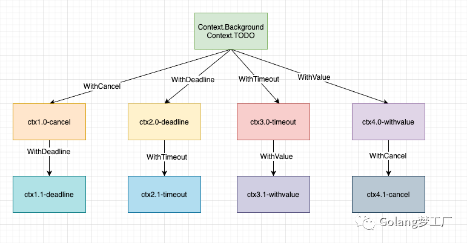

### Context标准包的使用

> Context通常被称为上下文，在go中，理解为goroutine的运行状态、现场，存在上下层goroutine context的传递，上层goroutine会把context传递给下层goroutine。
>
> 每个goroutine在运行前，都要事先知道程序当前的执行状态，通常将这些状态封装在一个 context变量，传递给要执行的goroutine中。
>
> 在网络编程中，当接收到一个网络请求的request，处理request时，可能会在多个goroutine中处理。而这些goroutine可能需要共享Request的一些信息；当request被取消或者超时时，所有从这个request创建的goroutine也要被结束。

##### 创建context

- `context.Backgroud()` 是上下文的默认值，所有其他的上下文都应该从它衍生（Derived）出来。
- `context.TODO()`应该只在不确定应该使用哪种上下文时使用；

实际上这两个方法是完全一样的，他们互为别名。返回的是一个context包内部类型的引用 ==但不是同一个引用==

```go
type emptyCtx int
var (
	background = new(emptyCtx)
	todo       = new(emptyCtx)
)
func Background() Context {
	return background
}
func TODO() Context {
	return todo
}
```

上面的两种方式是创建根`context`，不具备任何功能，具体实践还是要依靠`context`包提供的`With`系列函数来进行派生。 派生的context只要是为了**携带数据信息** 或 **超时控制**

##### context的派生机制



基于一个父`Context`可以随意衍生，其实这就是一个`Context`树，树的每个节点都可以有任意多个子节点，节点层级可以有任意多个，每个子节点都依赖于其父节点，例如上图，我们可以基于`Context.Background`衍生出四个子`context`：`ctx1.0-cancel`、`ctx2.0-deadline`、`ctx3.0-timeout`、`ctx4.0-withvalue`，这四个子`context`还可以作为父`context`继续向下衍生，即使其中`ctx1.0-cancel`                   节点取消了，也不影响其他三个父节点分支。

#### 携带数据信息 

##### context.WithValue()

`func WithValue(parent Context, key, val any) Context {}`

通过这个方法可以创建一个带有key-value键值对信息的是的`ctx`, 经由他生成的子`ctx`也会带有该信息，我们可以使用这个不断穿透下去的信息去打印日志等操作。在使用`WithValue`的时候需要注意的点：

- 不应该使用 `context.WithValue()` 传递关键的参数， 关键参数应该显示的声明出来， 使用隐式的方式传递可能会引发错误。 *context常用来携带 trace_id或 签名 这一类数据*
- 


#### 超时控制

要保证程序的健壮性， 避免服务端因为长时间响应消耗资源，很多web框架或rpc框架都有设置超时控制。

##### context.WithTimeout 和 context.WithDeadline 

这两个方法本质是一样的，因`WithTimeout`内部用的就是`WithDeadline`方法。区别在于`WithTimeout`使用持续时间作为参数，`WithDeadline`方法使用时间对象作为参数。


#### context使用的总结与注意

- context.Background 只应用在最高等级，作为所有派生 context 的根。
- context 取消是建议性的，这些函数可能需要一些时间来清理和退出。
- 不要把`Context`放在结构体中，要以参数的方式传递。
- 以`Context`作为参数的函数方法，应该把`Context`作为第一个参数，放在第一位。
- 给一个函数方法传递Context的时候，不要传递nil，如果不知道传递什么，就使用context.TODO
- Context的Value相关方法应该传递必须的数据，不要什么数据都使用这个传递。context.Value 应该很少使用，它不应该被用来传递可选参数。这使得 API 隐式的并且可以引起错误。取而代之的是，这些值应该作为参数传递。
- Context是线程安全的，可以放心的在多个goroutine中传递。同一个Context可以传给使用其的多个goroutine，且Context可被多个goroutine同时安全访问。
- Context 结构没有取消方法，因为只有派生 context 的函数才应该取消 context。
- **创建衍生节点实际是创建一个个链表节点，其时间复杂度为O(n)，节点多了会掉支效率变低。**
- **`context`可以携带值，但是没有任何限制，类型和大小都没有限制，也就是没有任何约束，这样很容易导致滥用，程序的健壮很难保证；还有一个问题就是通过`context`携带值不如显式传值舒服，可读性变差了。**
- 


#### Context源码大纲

Context接口一共实现了四个方法

```go
type Context interface {
	Deadline() (deadline time.Time, ok bool)
	Done() <-chan struct{}
	Err() error
	Value(key interface{}) interface{}
}
```

- Deadline()
- Done()
- Err()
- Value() 


