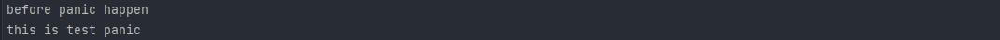

### go的异常处理

go中似乎有两套关于异常处理的模式

#### 使用 panic() defer() recover()  实现异常的抛出与捕获

##### 首先看defer

> defer是Go语言中的延迟执行语句，用来添加函数结束时执行的代码，常用于释放某些已分配的资源、关闭数据库连接、断开socket连接、解锁一个加锁的资源。

###### defer的执行顺序

多个defer语句执行顺序就是入栈出栈的顺序

###### defer语句的执行在return之前吗

return语句在汇编层面的会被重写为 ：

1. 赋值指令   在栈中添加一个返回值 = xxx， 返回值的xxx等于return 后的值
2. 调用defer中的函数
3. RET指令    返回栈中的值

整个return过程，没有defer之前，先在栈中写一个值，这个值会被当作返回值，然后再调用RET指令返回。return xxx语句汇编后是 1.先给返回值赋值，2.再做一个空的return，( 赋值指令 ＋ RET指令)。defer的执行是被插入到return指令之前的，有了defer之后，就变成了(赋值指令 + CALL defer指令 + RET指令)。

==因此需要注意如下的情况==

```go
func Test() (result int) {
	defer func() {
		result += 2
	}()
	return 1
}
>>   3
```

*在defer语句执行之前， 先在栈中存入一个值值为1，（可以预见的 变量result是指向栈中的这个值的），这时defer()执行栈中的值+2， 最后返回栈值为3*

##### panic()和recover()

> 当程序遇到致命错误导致无法继续运行时就会触发panic，例如：数据越界，空指针等。当一个函数在执行过程中出现了异常或遇到panic()，正常语句就会即终止，然后执行 defer 语句，再报告异常信息，最后退出 goroutine。如果在 defer 中使用了 recover()函数,则会捕获错误信息，使该错误信息终止报告。panic会在调用它的函数中向本层和它的所有上层逐级抛出，若一直没有recover将其捕获，程序退出后会产生crash

```go
func Test() {
   defer func() {
      err := recover()
      if err != nil {
         fmt.Println(err)
      }
   }()
   fmt.Println("before panic happen")
   panic("this is test panic")
   fmt.Println("after panic happen")
}
```

 


#### 使用error结构对象处理错误


