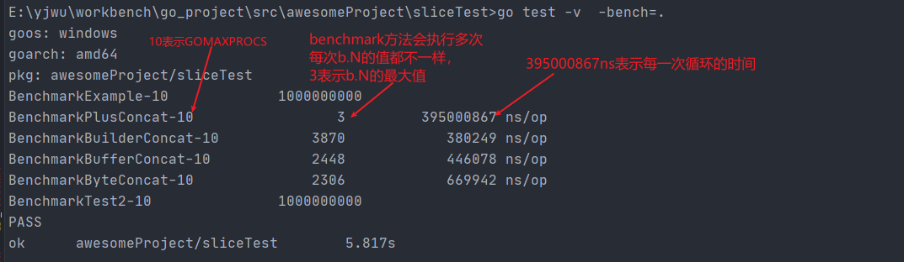
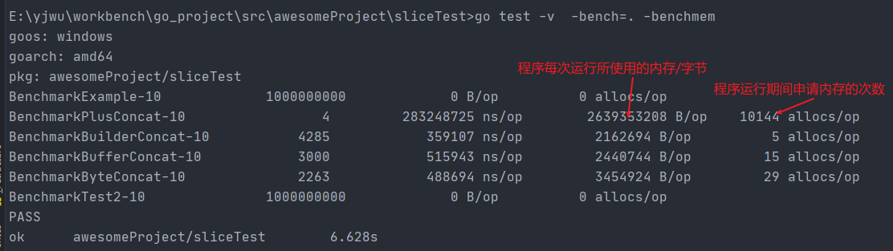

### go_test测试

要进行一个单元测试，首先准备一个go源码的测试文件**该文件必须以 _test.go**结尾，`go test`命令不需要任何的参数，它会自动把你源码包下面所有 test 文件测试完毕。 

go test 命令是一个按照一定的约定和组织的测试代码的驱动程序。 在包目录内。 所有以 **_test.go**结尾的源代码文件都是go test测试的一部分。 不会被go build编译到最终的可执行文件中。 执行go  test命令会遍历 **\*\_test.go** 文件 ，然后生成一个临时的mian包用于调用相应的测试函数。 

在`*_test.go`文件中有三种类型的函数，单元测试函数、基准测试函数和示例函数。

| 类型     | 格式                  | 作用                           |
| -------- | --------------------- | ------------------------------ |
| 测试函数 | 函数名前缀为Test      | 测试程序的一些逻辑行为是否正确 |
| 基准函数 | 函数名前缀为Benchmark | 测试函数的性能                 |
| 示例函数 | 函数名前缀为Example   | 为文档提供示例文档             |

#### 测试函数 TestXXX()

以`Test`为函数名的开头， 用于测试函数的逻辑行为。

- -run \<Reg\>  运行和
- -v    显示测试的详细命令
- -mod    -mod = vendor， 指定使用vendor模式。
- -bench
- -cover  开启测试覆盖率

```go
func Test_Test(t *testing.T) {
   t.Logf("t is logging")
   fmt.Println("hahah")
}
```

在命令行中使用>> go test -run Test_Test -v

注意在使用go test时，如果使用命令行去运行test内容，go使用的是go env中指定的编译方式 **即GOOS的值**。 如果使用Goland去与运行go test，走的是IDE中设置的系统类型。*在setting->go->build Tags & vendoring*中设置。

##### testing.T 参数的使用


#### go test参数解读

**`go test [-c] [-i] [build flags] [packages] [flags for test binary]`** 

- **-c**    	编译go test成为可执行的二进制文件， 但是不运行测试

- **-i**         安装测试包依赖的package， 但是不运行测试。 

- **buill flags**      这是编译运行过程中用到的参数， 通过`go help build`查看介绍。

- **packages**       关于包的管理，可以调用 `go help packages`查看。

- **flags for test binary**  常见的


#### 性能测试函数 BenchmarkXXX()

###### 基准测试基本使用

```go
package sliceTest
import (
	"fmt"
	"testing"
)
func BenchmarkExample(b *testing.B) {
	//do something...
	for i := 0; i < 100; i++ {
		fmt.Println("love")
	}
}
```

随后使用如下命令开启**基准测试**， `go test  -v  -bench=.  [filePath]`

 

##### 参数和falg的使用

-  上述图片中没有添加 *filePath*参数， 程序会找到目录下的所有 xxx_test.go中的 基准测试的函数运行。

- **-bench**  要运行基准测试， -bench是必须的， 用来指定运行哪些基准测试的函数， 接受使用正则表达式过滤。

  -  -bench=.    表示运行所有
  - -bench=Example$  表示运行所有以Example基准测试函数

- **-benchmem**  添加该falg 来打印程序的内存使用情况。 `go test  -v  -bench=. -benchmem` 

   

- **-cpu** 会影响到测试程序中的 `GOMAXPROCS`

- **-benchtime**  用来指定完成基准测试的时间和次数

  - 时间默认为1s。 `go test  -v  -bench=.   -benchtime=10s`指定完成一个基准测试函数的时间为10s
  - 还可以用来指定入参`b testing.B`中的`b.N` 的值 。 `go test  -v  -bench=.   -benchtime=999x` 指定`b.N`为999

- **-count** count方式也是控制执行次数。 不过是指定 BenchmarkXXX函数的执行次数。

##### 并发测试的场景

如果被测试的方法在真实的环境中存在并发调用， 那么在基准测试中也应该使用并行测试来了解其基本性能。

```go
package testTest
import "testing"
func BenchmarkParalle(b *testing.B) {
	b.RunParallel(func(pb *testing.PB) {
		for pb.Next() {
			//do something...
		}
	})
}
```


 
