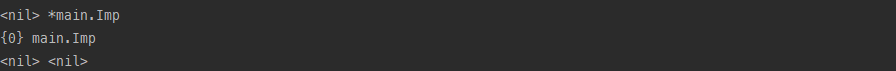
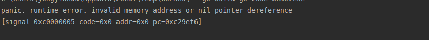
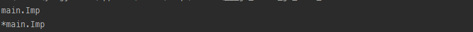
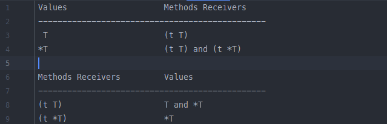

### go接口的概念


### go接口实践

#### 接口类型的非平凡（可能发生的错误）

[[Go基础记录#Go里面类型的理解]]
[Go基础记录](Go基础记录.md)

##### 做\=\=比较的不确定性

接口类型的值也可以通过`==`符号来进行判断，*如果二者都为nil或二者动态类型和动态值完全一致则判断为真*。

但是要注意避免对一些不可进行比较的类型进行`==`判断，这可能导致程序在未知状态崩溃。

go语言中**基本类型和指针**是可比较的  而 **slice， map， 函数**是不可比较的。

##### 不成熟的零值&含有空指针的非空接口

go的给刚设置的变量赋了**零值**， 但不同类型的变量赋予**零值**的情况不同：

- 实现类的值类型； 动态类型即为**这个类**， 动态值为**一个对象**，如果对象中嵌套对象也会嵌套的赋予零值。
- 实现类的引用类型；  动态类型即为**这个类的引用类型**， 动态值为**nil**。
- 接口类型； 动态类型即为**nil**， 动态值为**nil**。

```go
type interface1 interface {
	run() int
}
type Imp struct {
	Value int
}
func (f Imp) run() int {
	return 0
}
func main() {
   var imp1 *Imp
   var imp2 Imp
   var inter1 interface1
   fmt.Println(imp1, reflect.TypeOf(imp1))
   fmt.Println(imp2, reflect.TypeOf(imp2))
   fmt.Println(inter1, reflect.TypeOf(inter1))
}
```

 

###### 含有空指针的非空接口

  *go中对**静态类型为接口的变量** 判断是否为**nil**时，是根据动态类型是否为**nil**来判断的。* 如果动态类型不为nil 但是动态值为nil，这时候如果调用方法程序会发生崩溃。

```go
func test(i1 interface1) {
   fmt.Println(i1 == nil) 	// false
   i1.run()   				//程序发生空指针错误
}
func main() {
   var imp1 *Imp
   fmt.Println(imp1 == nil) //true
   test(imp1)
}
```

 

#### 使用接口声明变量时不需要关注该接口类型的变量是指向**值类型**还是**引用类型**， 赋值后会自然的进行类型的转化。==定义函数参数时也是如此，不同于类== 

```go
type interface1 interface {
	run() int
}
type Imp struct {
}
func (f Imp) run() int {
	return 0
}
func main() {
	var v1 interface1 = Imp{}
	var v2 interface1 = &Imp{}
	fmt.Println(reflect.TypeOf(v1))
	fmt.Println(reflect.TypeOf(v2))
}
```

  

##### 接口类型的变量使用类型断言

 对于类型(static type)是`interface1`的变量，不能直接使用它实现类`Imp`的自身的方法。如果要使用必须要使用类型断言为`Imp`类型。

```go
type interface1 interface {
   run() int
}

type Imp struct {
}
func (f Imp) run() int {
   return 0
}
func (f Imp) selfRun() int {
   return 1
}
func main() {
   var v1 interface1 = Imp{}
   var v2 interface1 = &Imp{}
   fmt.Println(reflect.TypeOf(v1))
   fmt.Println(reflect.TypeOf(v2))
   //v1.selfRun()
   v1.(Imp).selfRun()
}
```

#### 奇怪的语法糖

==首先golang中， 类和接口赋值时是值传递， 似乎只有**切片和map**是引用传递的==

###### 类方法的奇怪语法糖

golang中的类struct可以通过**值类型接收者 和 引用类型接收者**两个方式定义**类方法**，不同类型之间却是可以调用的

```go
type Person interface {
   Eat()
   Walk()
}
type Man struct {
   staff string
}
func (p *Man) Eat() {
   p.staff = "eat"
   fmt.Println("man eat" + p.staff)
}
func (p Man) Walk() {
   p.staff = "walk"
   fmt.Println("man walk")
}
func TypeTest() {
   man := Man{"man"}
   man.Walk()
   man.Eat()
   (&man).Walk()
   (&man).Eat()
}
```

上面的代码都可以编译通过运行，这是因为编译器会主动的将调用者的类型进行转化。**但是依然会有不同种类型不能调用的情况：**

- **`值类型` 不能被寻址的情况**,如果值类型不能寻址 那么他就不能调用引用接收者的方法。下面这段代码就会编译出错，因为编译器尝试给`createMan()`方法返回的右值调用pointer method方法失败了。然后尝试插入取值符号，但是失败了。及不可以被寻址

  > 左值和右值的定义；

  ```go
  func createMan() Man {
     return Man{"man"}
  }
  func TypeTest() {
     createMan().Eat()
  }
  ```

- **用引用接收实现的接口** 

  但是不同的类型方法实现对应的不同的方法集：

   

  其实就是实现了**值接收者**的类方法 默认也实现了**引用接收者**的类方法*只不过不能调用*。 而实现了**引用接收者**类方法不会去实现**值接收者**的类方法。 所以当使用**引用接收方法**实现了接口。程序认为只有 `&man 指针类型`实现了接口，而`man 值类型`没有实现该接口。

  ```go
  func TypeTest() {
     man := Man{"man"}
      /* var p Person = &man  
         会编译报错 Cannot use 'man' (type Man) as the type Person Type does not implement 'Person' as the 	 	
         'Eat' method has a pointer receive
      */
     var p Person = man
     fmt.Println(p)
  }
  ```


#### 类型断言

类型断言是一个在接口值上的操作，结构类似于`x.(T)`。 分为两种情况

**如果T是一个具体的类型**，那么类型断言就会检查x的动态类型是否就是这个具体类型。*必须完全一致，存在继承或被继承关系也不行*。

**如果T是一个接口类型**， 那么类型断言会检查x的动态类型是不是满足了这个接口类型T。

**总结**， 类型断言是一个接口值的表达式，从一个接口类型转变为拥有另一套方法的接口类型(*不可以直接认为是静态类型发生了改变*)，但是保留了接口值中的动态类型和动态值。

一般来说，都是将拥有方法数量少的类型转化为数量多的类型，==但是反过来转化也是可行的。==

```go
type interface1 interface {
   walk() int
}
type interface2 interface {
   interface1
   run() int
}
type Imp struct {}
func (i Imp) walk() int { return 0 }
func (i Imp) run() int { return 1 }
func main() {
   var inter2 interface2 = Imp{}
   inter2.run()
   inter1 := inter2.(interface1)  // 转化为interface1的接口类型
    inter1.run()  //inteface1的接口类型化没有run()方法， 编译不通过
}
```

##### 断言使用方式

- switch语句中直接使用`type`关键字

  ```go
  switch imp2.(type){
  case nil:
     return
  case interface1:
     return
  }
  ```


#### interface在内部的定义实现

接口在golang内部的实现有两种：

- 其中 `runtime.iface` 结构体表示包含方法的接口

  ```go
  type iface struct { // 16 字节
   tab  *itab
   data unsafe.Pointer
  }
  ```

- 其中`runtime.eface`结构体表示不含方法的接口 （空接口）

  ```go
  type eface struct { // 16 字节
   _type *_type
   data  unsafe.Pointer
  }
  ```

  

##### eface类型

eface类型中包含的 `runtime._type`类型， Go 语言类型的运行时表示。下面是运行时包中的结构体，其中包含了很多类型的元信息，例如：类型的大小、哈希、对齐以及种类等。 结构体定义如下：

```go
type _type struct {
	size       uintptr
	ptrdata    uintptr // size of memory prefix holding all pointers
	hash       uint32
	tflag      tflag
	align      uint8
	fieldalign uint8
	kind       uint8
	alg        *typeAlg
	// gcdata stores the GC type data for the garbage collector.
	// If the KindGCProg bit is set in kind, gcdata is a GC program.
	// Otherwise it is a ptrmask bitmap. See mbitmap.go for details.
	gcdata    *byte
	str       nameOff
	ptrToThis typeOff
}
```

- size字段 存储了类型占用的内存空间
- 

##### iface类型

这里我们主要关注 `itab`类型， 每个itab类型都占32字节， 该类型可以看成是 **接口类型和具体类型**的组合， 分别用 `_type`类型和`interfacetype`类型来表示。另外`hash`是对`_type.hash`的拷贝，当我们想将 `interface` 类型转换成具体类型时，可以使用该字段快速判断目标类型和具体类型 `runtime._type`是否一致，`fun`是一个动态大小的数组，它是一个用于动态派发的虚函数表，存储了一组函数指针。虽然该变量被声明成大小固定的数组，但是在使用时会通过原始指针获取其中的数据，所以 `fun` 数组中保存的元素数量是不确定的；

```go
type itab struct { // 32 字节
 inter *interfacetype
 _type *_type
 hash  uint32
 _     [4]byte
 fun   [1]uintptr
}
```

### 关于接口和结构的使用技巧

#### 空接口和空结构体

-  本质上空接口是一个可以指向任意值的指针类型。 所以一个空接口的**实际大小是2个机器字长**，一个是其指向的值的地址， 一个是自身的methods信息

- 空结构体的宽度就是0字节， 占用了0字节的内存空间。

  因此在golang中推荐使用 **`map[string]struct{}`** 类型来代替表示set结构
