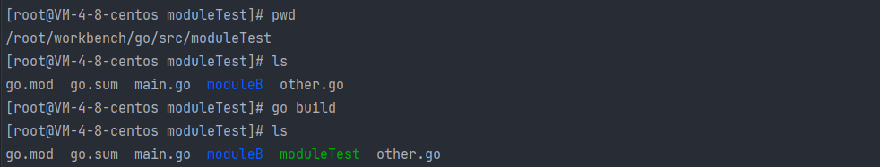

### Go标准命令记录

[go build - GO 命令教程 - UDN开源文档 (yonyoucloud.com)](https://doc.yonyoucloud.com/doc/wiki/project/go-command-tutorial/0.1.html)

一下命令行运行示例和结果基于go1.19.7/linuxamd64

#### 编译运行

- `go build`

  go build用于编译我们指定的go源码或代码包 以及 他们的依赖文件。 可以直接在项目根目录下执行 `go build`, 他会自动找到main模块下main函数入口， 然后自动编译成可执行文件

   

  `go build -o test moduleTest.go` 可以指输出的可执行文件的名称

- `go install`

  命令`go install`用于编译并安装指定的代码包及它们的依赖包。当指定的代码包的依赖包还没有被编译和安装时，该命令会先去处理依赖包。实际上，`go install`命令只比`go build`命令多做了一件事，即：安装编译后的结果文件到指定目录。

  先执行 `go install  -u github.com/kardianos/govendor` 下载 govendor工具包到本地。 再执行`go install   github.com/kardianos/govendor` 将该工具编译安装到 $gopath/bin/ 目录下

  

#### 测试

#### 项目管理