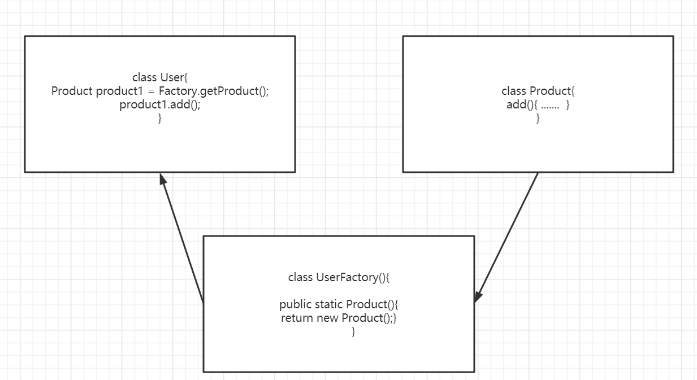
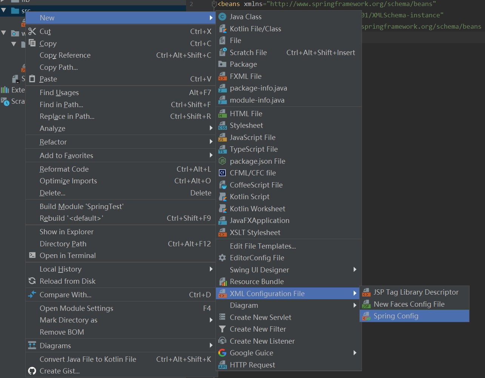
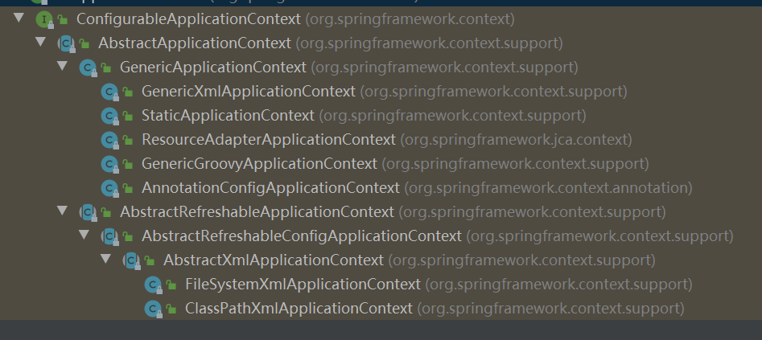
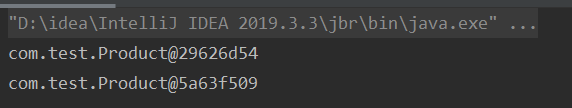
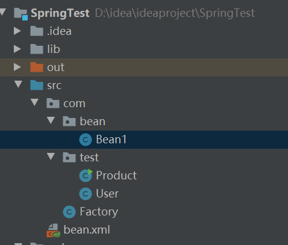

# 	Spring

##### 首先了解IOC的实现原理共有三个知识点 工厂模式，xml解析， 反射

1. 工程模式

   为了降低不同类之间的耦合度，通常在两个类之键添加一个工厂类。让调用其他类的过程在工厂类中完成，这样如果被调用的类在将来有名称路径的改动只要调整工厂类即可。

    

   工厂类的创建

2. 但这样的解耦程度还不够，再引入xml解析和反射的概念

     在idea这个IDE中，我们先在src路径下配置xml配置文件

   接着我们可以在工厂类中获取读取这个配置类

#### IOC的接口的学习

IOC接口的实现基于IOC容器，而IOC容器的底层即为对象工厂的实现。Spring提供了两种IOC容器的实现也是工厂的实现，这也是接下来要学习的两个接口。BeanFactory和ApplicationContext

###### BeanFactory

Beanfactory是我们Spring内部的内置的最基本的IOC容器，一般开发过程中不会使用。加载配置文件的时候不会立刻创建对象，而是在我们使用的时候在创建。

###### ApplicationContext

ApplicationContext是BeanFactory的子接口，提供了跟多更强大的功能，开发过程一般使用这换个。加载配置文件的时候即可创建这些对象。它有两个较为主要的实现类ClassPathXmlApplicationContext 和FileSystemXmlApplicationContext，这两个都可以使用但是稍有区别。

 

```java
//ClassPathXmlApplicationContext()中的路径是相对于src的路径
ApplicationContext context = new ClassPathXmlApplicationContext("bean.xml");
//FileSystemXmlApplicationContext()的路径是本机中的绝对路径。
ApplicationContext context = new FileSystemXmlApplicationContext("D:\\idea\\ideaproject\\SpringTest\\src\\bean.xml");
```

*其实ApplicationContext的效率反而会更高，因为spring的项目往往会部署在服务器上，提前创建好对象会比在服务器上在创建更有利。*

### 基于xml实现对象创建和注入属性

##### 在xml配置文件中对Bean类注入属性值

```java
package com.test;

public class Product {
    private String pName;
    public Product(){}
    public String getpName() {
        return pName;
    }
    public Product(String pName) {
        this.pName = pName;
    }

    public void setpName(String pName) {
        this.pName = pName;
    }
```

1. set方法进行注入

   实际的情况就是调用了Product函数中的setpName()函数来对pName赋值

   ```xml
   <?xml version="1.0" encoding="UTF-8"?>
   <beans xmlns="http://www.springframework.org/schema/beans"
          xmlns:xsi="http://www.w3.org/2001/XMLSchema-instance"
          xsi:schemaLocation="http://www.springframework.org/schema/beans http://www.springframework.org/schema/beans/spring-beans.xsd">
   <bean id="product" class="com.test.Product">
       <property name="pName" value="fakeDick"></property>
   </bean>
   </beans>
   ```

2. 有参构造函数进行注入，则是调用了有参构造函数来赋值，也就是说要是有这个注入方式，该Bean类中必须要有有参构造函数。

   ```xml
   <?xml version="1.0" encoding="UTF-8"?>
   <beans xmlns="http://www.springframework.org/schema/beans"
          xmlns:xsi="http://www.w3.org/2001/XMLSchema-instance"
          xsi:schemaLocation="http://www.springframework.org/schema/beans http://www.springframework.org/schema/beans/spring-beans.xsd">
   <bean id="product" class="com.test.Product">
       <constructor-arg name="pName" value="trueDick"></constructor-arg>
   </bean>
   </beans>
   ```

###### 如何注入空值null或特殊符号之类的

1. 注入null值

   ```xml
   <bean id="product" class="com.test.Product">
       <property name="pName">
           <null></null>
       </property>
   </bean>
   ```

2. 注入特殊符号，可以使用转义符，页可以使用CDATA数据结构格式。

   ```xml
   <bean id="product" class="com.test.Product">
       <property name="pName">
           <value>
               <![CDATA[<<南京>>]]>
           </value>
       </property>
   </bean>
   ```


###### 如果注入的属性是一个类怎么解决

```java
//引用了下面的Product类，如何实现xml注入属性
package com.test;

import org.springframework.context.ApplicationContext;
import org.springframework.context.support.FileSystemXmlApplicationContext;

public class User {
    private String name;
    private Product boughtProduct;

    public void setBoughtProduct(Product boughtProduct) {
        this.boughtProduct = boughtProduct;
    }

    public void setName(String name) {
        this.name = name;
    }


    public static void main(String[] args){
        //ApplicationContext context = new ClassPathXmlApplicationContext("bean.xml");
        ApplicationContext context = new FileSystemXmlApplicationContext("D:\\idea\\ideaproject\\SpringTest\\src\\bean.xml");
        Product product1 = context.getBean("product", Product.class);
        System.out.println(product1.getpName());
    }
}

```

```java
//Product类，被User类引用
package com.test;

public class Product {
    private String pName;
    public Product(){}
    public String getpName() {
        return pName;
    }
    public Product(String pName) {
        this.pName = pName;
    }

    public void setpName(String pName) {
        this.pName = pName;
    }
}
```

1. 内部注入bean

   ```xml
   <?xml version="1.0" encoding="UTF-8"?>
   <beans xmlns="http://www.springframework.org/schema/beans"
          xmlns:xsi="http://www.w3.org/2001/XMLSchema-instance"
          xsi:schemaLocation="http://www.springframework.org/schema/beans http://www.springframework.org/schema/beans/spring-beans.xsd">
       <!--首先新建User对象，在User对象的内部逐步新建Product对象-->
       <bean id="user1" class="com.test.User">
           <property name="name" value="xiaojie"></property>
           <property name="boughtProduct">
               <bean id="product" class="com.test.Product">
                   <property name="pName" value="pen"></property>
               </bean>
           </property>
       </bean>
   </beans>
   <!--这样就将一个Product类作为属性注入User类，Product类的属性pName = "pen"。User类的name="xiaojie"-->
   ```

2. 外部注入bean

   ```xml
   <?xml version="1.0" encoding="UTF-8"?>
   <beans xmlns="http://www.springframework.org/schema/beans"
          xmlns:xsi="http://www.w3.org/2001/XMLSchema-instance"
          xsi:schemaLocation="http://www.springframework.org/schema/beans http://www.springframework.org/schema/beans/spring-beans.xsd">
       <!--分别新建这两个对象，在User对象里引入Product对象-->
       <bean id="user1" class="com.test.User">
           <property name="name" value="xiaojie"></property>
           <!--这里引入了新建的product对象，value赋值，ref代表要引入的新对象的id值-->
           <property name="boughtProduct" ref="productUsedInUser">
           </property>
       </bean>
       <bean id="productUsedInUser" class="com.test.Product">
           <property name="pName" value="pencil"></property>
       </bean>
   </beans>
   ```

3. 还有一种级联赋值，不做过多赘述。

###### xml如何注入集合类型的属性

修改一下User类，在User类中添加各种集合类型。此种方法也可延伸到对象集合，下面没有演示  

```java
package com.test;

import java.util.List;
import java.util.Map;
import java.util.Set;

public class User {
    //数组
    private String[] arrayType;
    //list集合
    private List listType;
    //map类型
    private Map mapType;
    //Set类型
    private Set<String> setType;

    public void setSetType(Set<String> setType) {
        this.setType = setType;
    }

    public void setArrayType(String[] arrayType) {
        this.arrayType = arrayType;
    }

    public void setListType(List listType) {
        this.listType = listType;
    }

    public void setMapType(Map mapType) {
        this.mapType = mapType;
    }

    public static void main(String[] args){

    }
}

```

```xml
<?xml version="1.0" encoding="UTF-8"?>
<beans xmlns="http://www.springframework.org/schema/beans"
       xmlns:xsi="http://www.w3.org/2001/XMLSchema-instance"
       xsi:schemaLocation="http://www.springframework.org/schema/beans http://www.springframework.org/schema/beans/spring-beans.xsd">
    <bean id="user" class="com.test.User">
        <property name="arrayType">
            <!--对于数组的类型可以用<array>标签，在内部添加各个value，下面的集合类型解决方法基本类似，不在赘述-->
            <array>
                <value>a1</value>
                <value>a2</value>
            </array>
        </property>
        <property name="listType">
            <list>
                <value>l1</value>
                <value>l2</value>
            </list>
        </property>
        <property name="mapType">
            <map>
                <entry key="1" value="m1"></entry>
                <entry key="2" value="m2"></entry>
            </map>
        </property>
        <property name="setType">
            <set>
                <value>s1</value>
                <value>s2</value>
            </set>
        </property>
    </bean>
</beans>
```

###### 总结自建bean和工厂bean

 自建bean就是我们自己新建的类并在xml配置文件里配置好的bean类，工厂bean则是用于获取xml配置文件的返回所需要对象的类例如Spring内已经提供的ApplicationContext接口和BeanFactory接口的实现类就是工厂类，工厂类可以自己建，但要实现BeanFactory这个给接口并重写的它的一部分方法。


#### Bean的作用域学习

##### 通过xml配置bean后所产生的bean对象默认都是单实例，但hi是可以通过属性设置

是bean标签中的scope属性，默认值是singleton以为该bean对象是单实例  

值为prototype时是多实例，下面举例。

还有session值和request

```xml
<?xml version="1.0" encoding="UTF-8"?>
<beans xmlns="http://www.springframework.org/schema/beans"
       xmlns:xsi="http://www.w3.org/2001/XMLSchema-instance"
       xsi:schemaLocation="http://www.springframework.org/schema/beans http://www.springframework.org/schema/beans/spring-beans.xsd">
    <bean id="product" class="com.test.Product" scope="prototype">
        <property name="pName" value="pencil"></property>
    </bean>

</beans>
```

```java
    public static void main(String[] args){
        ApplicationContext con = new ClassPathXmlApplicationContext("bean.xml");
        Product product1 = con.getBean("product", Product.class);
        Product product2 = con.getBean("product", Product.class);
        System.out.println(product1);
        System.out.println(product2);
    }
```

 此时打印得到的两个Product对象地址不一样。

##### bean的生命周期的学习

在获取xml配置文件的时候，xml配置的bean对象便开始创建（使用ApplicationContext这个接口的时候）

1. 调用无参构造函数

2. 使用set方法设置属性

   看下面的xml配置文件，使用的注入方法是set因而要先无参构造再用set函数设置属性。而如果使用的是constructor-arg标签即使用有参构造方法注入则第一第二步都在有参构造函数里实现。

3. 执行初始化方法。该方法需要我们自己编写，并在xml配置文件中的bean标签中用init-method属性配置

4. 执行销毁函数。同样自己编写，并用bean标签里的destroy-method属性配置到相应的函数。并且为了让销毁函数执行，必须要手动的调用con.close()。下面代码的最后一行。

   在调用时必须将他强转类型，con的类型是ApplicationContext接口其并没有close()方法，只有它的实现类有。

```java
package com.test;

import org.springframework.context.ApplicationContext;
import org.springframework.context.support.ClassPathXmlApplicationContext;

public class Product {
    private String pName;
    public Product(){
        System.out.println("1.调用无参构造函数");
    }
    public void setpName(String pName) {
        System.out.println("2.set方法使用设置属性");
        this.pName = pName;
    }
    public void initMethod(){
        System.out.println("3.执行初始化方法");
    }
    public void destroyMethod(){
        System.out.println("4.执行销毁方法");
    }
    public static void main(String[] args){
        System.out.println("开始获取bean.xml配置文件");
        ApplicationContext con = new ClassPathXmlApplicationContext("bean.xml");
        System.out.println("开始获取bean对象实例");
        Product product1 = con.getBean("product", Product.class);

        ((ClassPathXmlApplicationContext)con).close();
    }
}

```

```xml
<?xml version="1.0" encoding="UTF-8"?>
<beans xmlns="http://www.springframework.org/schema/beans"
       xmlns:xsi="http://www.w3.org/2001/XMLSchema-instance"
       xsi:schemaLocation="http://www.springframework.org/schema/beans http://www.springframework.org/schema/beans/spring-beans.xsd">
<bean id="product" class="com.test.Product" init-method="initMethod" destroy-method="destroyMethod">
    <property name="pName" value="pencil"></property>
</bean>

</beans>
```

##### xml自动装配了解即可

##### xml读取外部属性文件

### 基于注解实现对象创建与属性注入

##### Spring提供了四个注解给我们用于创建bean对象

1. @Component 普通组件
2. @Service  建议用于service层和业务逻辑层
3. @Controller  建议用于web层
4. @Repository 用于 Dao层

###### 开启组件的扫描

注意要先先引入context命名空间

```xml
<?xml version="1.0" encoding="UTF-8"?>
<beans xmlns="http://www.springframework.org/schema/beans"
       xmlns:xsi="http://www.w3.org/2001/XMLSchema-instance"
       <!--引入context命名空间-->
       xmlns:context="http://www.springframework.org/schema/context"
       xsi:schemaLocation="http://www.springframework.org/schema/beans 		  	 	     	http://www.springframework.org/schema/beans/spring-beans.xsd 
 http://www.springframework.org/schema/context
 http://www.springframework.org/schema/beans/spring-context.xsd">
    <context:component-scan base-package="com.bean"></context:component-scan>
</beans>
```

 项目路径，经过上面xml配置，Spring会在bean文件夹下搜索找到加上了适当注解的类。

```java
//使用注解创建bean对象实例
package com.bean;

import org.springframework.stereotype.Component;

import javax.xml.transform.sax.SAXTransformerFactory;
//这里的value值定义的就是我们在xml配置bean时设置的id值，value可以审略缺省值是 bean
@Component(value = "bean1")
public class Bean1 {
    private String testThing;

    public Bean1() {
    }
    public void setTestThing(String testThing) {
        this.testThing = testThing;
    }
    public String getTestThing() {
        return testThing;
    }
}

```

###### 注解新建bean对象注入属性

1. @Autowired  根据属性类型进行自动装配
2. @Qualifier   根据属性名称进行注入
3. @Resource     可名称可类型
4. @Value   实现注入普通属性

简单测试一下

```java
//使用注解创建bean对象实例
package com.bean;

import org.springframework.beans.factory.annotation.Value;
import org.springframework.stereotype.Component;

import javax.xml.transform.sax.SAXTransformerFactory;

@Component(value = "bean1")
public class Bean1 {
    @Value(value = "testThing")
    private String testThing;

    public Bean1() {
    }
    public void setTestThing(String testThing) {
        this.testThing = testThing;
    }
    public String getTestThing() {
        return testThing;
    }
}
```

```java
package com.test;

import com.bean.Bean1;
import org.springframework.beans.factory.annotation.Autowired;
import org.springframework.context.ApplicationContext;
import org.springframework.context.support.ClassPathXmlApplicationContext;
import org.springframework.stereotype.Component;

@Component(value = "user")
public class User {
    @Autowired
    private Bean1 b1;

    public Bean1 getB1() {
        return b1;
    }

    public static void main(String[] args) {
        ApplicationContext con = new ClassPathXmlApplicationContext("bean.xml");
        User user = con.getBean("user", User.class);
        System.out.println(user.getB1().getTestThing());
    }
}

```

```xml
<?xml version="1.0" encoding="UTF-8"?>
<beans xmlns="http://www.springframework.org/schema/beans"
       xmlns:xsi="http://www.w3.org/2001/XMLSchema-instance"
       xmlns:context="http://www.springframework.org/schema/context"
       xsi:schemaLocation="http://www.springframework.org/schema/beans http://www.springframework.org/schema/beans/spring-beans.xsd
                            http://www.springframework.org/schema/context http://www.springframework.org/schema/context/spring-context.xsd"
>
    <context:component-scan base-package="com.bean com.test"></context:component-scan>
</beans>
```

最终可以打印出在Bean1类中用 @Value注解注入的普通属性值

@Qualifier注解要和@Autowired配合使用，倘如两个类都是某一接口的实现类这两个类都被注册为组件，而要注入的属性又是该接口类型，这时必须用@Qualified注解指定其中一个。

#### 完全注解开发

其实最后一步在xml里配置组件扫描的范围的工作也可以从xml配置中抽离出来，通过再编写一个配置类来实现。

```java
package com.config;

import org.springframework.context.annotation.ComponentScan;
import org.springframework.context.annotation.Configuration;
//@Configuration注解声明这是一个配置类
//@ComponentScan注解声明指定组件扫描的路径
@Configuration
@ComponentScan(basePackages = {"com.bean"})
public class SpringConfig {
   
}
```

```java
package com.test;

import com.bean.Bean1;
import org.springframework.context.ApplicationContext;
import org.springframework.context.annotation.AnnotationConfigApplicationContext;
import org.springframework.context.annotation.Configuration;

public class User {
    public static void main(String[] args) {
        //对于要使用完全注解开发，其获取配置文件的方式页发生一点变化
        ApplicationContext con = new AnnotationConfigApplicationContext(Configuration.class);
    }
}

```

*这种形式的开发方法再Springboot中更为常见*

###### 使用@Bean注解更加灵活的创建组件对象

我们之前的组件类，这时我们已经去掉了他的@Component注解

```java
package com.bean;

import org.springframework.stereotype.Component;
public class Imp {
    private String name;

    public Imp() {
    }

    public Imp(String name) {
        this.name = name;
    }
}
```

我们的配置类  @Bean可以放在方法之前，方法返回一个组件对象，这样就像像容器中注册一个新的组件的对象

```java
import com.bean.Imp;
import org.springframework.context.annotation.Bean;
import org.springframework.context.annotation.ComponentScan;
import org.springframework.context.annotation.Configuration;
import org.springframework.stereotype.Component;

import java.security.PublicKey;

//注意这里的(proxyBeanMethods)默认值是true以为单组件模式，此时多次调用下面的getBeanImp1()方法获得的组件对象是同一个，设置
//为false时时多组件模式。
@Configuration(proxyBeanMethods = false)
@ComponentScan(basePackages = {"com.bean"})
public class SpringConfig {
    //我们在容器中加入了一个名为这个方法名的组件对象
    @Bean
    public Imp getBeanImp1(){
        return new Imp("shit");
    }
    //可以通过value来指定注册的租价对象的值
    @Bean(value = "newname")
    public Imp getBeanImp2(){
        return new Imp("ass");
    }
}
```


### Spring的AOP

###### AOP操作中的术语

1. 连接点，一个类中可以被增强的方法
2. 切入点， 实际真正增强的方法，例如下面这个例子中我只增强了add方法
3. 通知（增强），实际被增强的逻辑部分，通知可以分类
   1. 前置通知  2. 后置通知  3. 环绕通知   4. 异常通知   5. 最终通知
4. 切面，   把通知应用到切入点的过程

#### AOP动态代理的底层原理

##### 在有接口的情况下如何在不修改原实现类的基础上新增功能呢

使用 java.lang.reflect.Proxy这个类，借此调用newProxtInstance方法以返回我们要加强的接口，

###### newProxyInstance方法详解

newProxyInstance(ClassLoader loader,Class[] interfaces, InvocationHandler h)

1. 第一个参数类加载器

2. 第二个是我们要增强的方法所在的接口，支持多个

3. 第三个参数 实现一个接口Invocationhandler,在这个接口中编写真正的要增加的业务代码

   ```java
   package com.bean;
   
   public interface Interface {
       public int add(int a,int b);
   
       public int mul(int a,int b);
   }
   ```

   ```java
   package com.bean;
   
   public class Imp implements Interface {
       @Override
       public int add(int a,int b) {
           System.out.println("add执行了");
           return a+b;
       }
   
       @Override
       public int mul(int a,int b) {
           System.out.println("mul执行了");
           return a-b;
       }
   }
   ```

   下面是增强代码的编写方法，注意看代码内的注释

   ```java
   package com.bean;
   
   import com.alibaba.druid.support.json.JSONUtils;
   
   import java.lang.reflect.InvocationHandler;
   import java.lang.reflect.Method;
   import java.lang.reflect.Proxy;
   
   public class Enhance {
       public static void main(String[] args) {
           Class[] interfaces = {Interface.class};
   //为了实现InvocationHandler接口可以直接像下面一样新建一个接口的匿名实现类。也可以重新建一个实现类。
   //        Proxy.newProxyInstance(Enhance.class.getClassLoader(), interfaces, new InvocationHandler() {
   //            @Override
   //            public Object invoke(Object o, Method method, Object[] objects) throws Throwable {
   //                return null;
   //            }
   //        });
           //获取一个被增强类的实例，作为参数传递给Imp2的有参构造函数。
           Imp imp = new Imp();
           Interface inter = (Interface) Proxy.newProxyInstance(Enhance.class.getClassLoader(), interfaces, new Imp2(imp));
           System.out.println(inter.add(1,2));
       }
   }
   //新建一个类以实现InvocationHandler接口，在这个类里面要有我们被增强类的实例
   class Imp2 implements InvocationHandler{
       //利用有参构造函数将被增强类的实例传递进来
       Object obj;
       public Imp2(Object obj) {
           this.obj = obj;
       }
       //必须要重写的一个函数 invoke()
       @Override
       //method参数是我们调用的原实现类中的哪个方法可以用method.getName()获得方法名，  objects是调用方法时的参数集
       public Object invoke(Object o, Method method, Object[] objects) throws Throwable {
           System.out.println("原方法之前执行，获取到方法名称："+method.getName());
           Object res = method.invoke(obj, objects);
           System.out.println("原方法时候执行");
           return res;
       }
   }
   ```

#### AOP的实际操作

Spring一般借助Aspectj实现AOP操作， 放在Springboot中仔细了解

#### 

### Spring整合数据库

#### JDBCtemplate