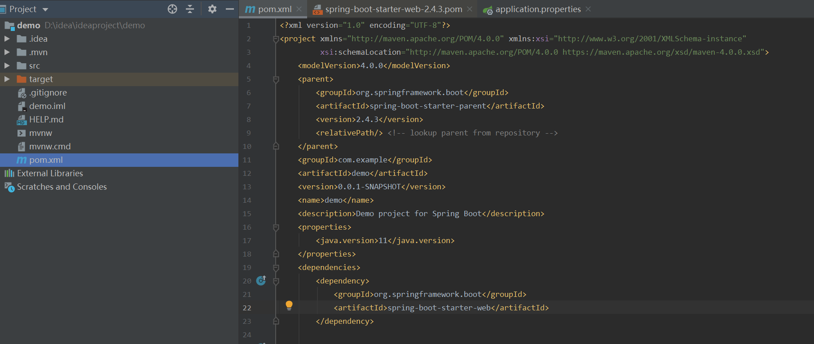
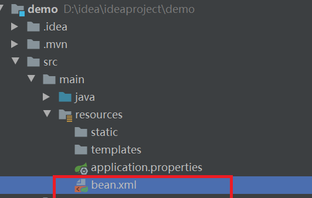
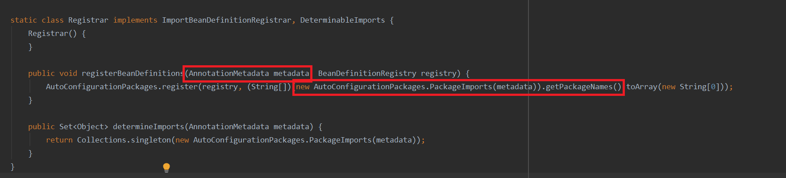
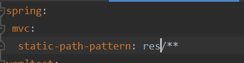
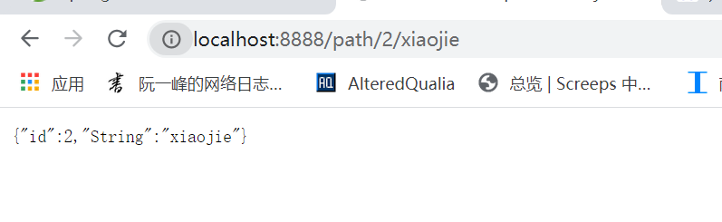
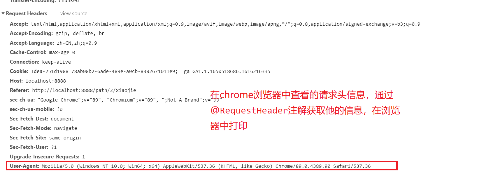
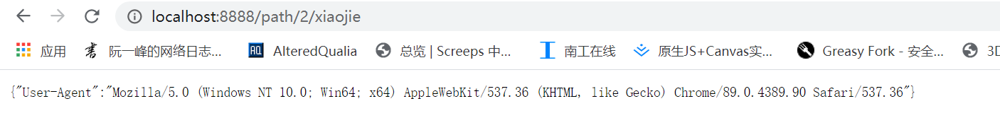

# SpringBoot

## 实际编程需要解决的问题
[[使用token存储信息]]
[[SpringBoot过滤器Fliter和拦截器Intercepter]]
[[Springboot中使用Mybatis]] ==> [[SpringBoot中使用pagehelper实现Mybatis分页管理]]
[[Springboot中使用jpa]]
[[thymeleaf]]
[[SpringBoot过滤器Fliter和拦截器Intercepter]] ==> [[SpringBoot整合Shiro框架]]
[[SpringBoot整合Swagger]]
[[SpringBoot整合Kapatcha包实现验证码检测]]
[[SpringBoot中使用Edit.md实现markdown网页编辑]]
[[SpringBoot处理图片]]
[[网络中的Request,Response,Session,Cookie等等]]
[[SpringBoot 日志框架]]
#### SpringBoot启动与Spring区别

SpringBoot有一个主程序类，通过注解@SpringBootApplication来指定，并用SpringApplication.run(DemoApplication.class, args)语句来运行。这个语句是有返回值的返回一个容器。返回类型ConfigurableApplicationContext其实是ApplicationContext的继承类
[[Spring#ApplicationContext]]


```java
package com.example.demo;

import org.springframework.boot.autoconfigure.SpringBootApplication;


@SpringBootApplication
public class DemoApplication {
    public static void main(String[] args) {
        ConfigurableApplicationContext run = SpringApplication.run(DemoApplication.class, args);
    }
}
```

#### 依赖管理

在SpringBoot的工程中极少需要到导包的操作，我们只需要在pom.xml引入相应的依赖管理即可

 

我们可以看到，当前的pom.xml文件的depencies标签下引入了，名为spring-boot-starter-web的开发场景，当我们引入这样一个starter其内部用到的包就会自动的导入   [官方的starter](https://docs.spring.io/spring-boot/docs/current/reference/html/using-spring-boot.html#using-boot-starter) 

```xml
<dependencies>
    <dependency>
        <groupId>org.springframework.boot</groupId>
        <artifactId>spring-boot-starter-web</artifactId>
    </dependency>

    <dependency>
        <groupId>org.springframework.boot</groupId>
        <artifactId>spring-boot-starter-test</artifactId>
        <scope>test</scope>
    </dependency>
</dependencies>
```

#### 自动配置

1. 自动配置了tomcat
2. 自动配置好SpringMVC

#### SpringBoot在容器中注册组件
之前在Spring中有过了解[[Spring#使用 Bean注解更加灵活的创建组件对象]]

##### @Configuration 和  @Bean

为了给容器里面添加组件，需要用到这两个组件。

```java
package com.example.demo.config;
//User是一个实例类，不做展示
import com.example.demo.bean.User;
import org.springframework.context.annotation.Bean;
import org.springframework.context.annotation.Configuration;

@Configuration //告诉springboot这是一个配置类  ==  配置文件
public class MyConfig {
    @Bean   //给容器中添加组件，这时组件名即为方法名
    // @Bean("User02")  也可以在这里指定组件名。
    public User User01() {
        return new User("Tom");
    }
}
```

##### 关于@Configuration中的Full模式和Lite模式

在@Configuration中有一个属性 ，proxyBeanMethods默认值是true，此时为Full模式。也就是说该配置类会被代理（CGLIB），在同一个配置文件中调用其它被@Bean注解标注的方法获取对象时会直接从IOC容器之中获取。简而言之，就是保持组件单实例。多次调用方法得到的组件实例是同一个。

如果，设为false为Lite模式 。则多次调用组件方法获得的组件的实例就不是同一个。

```java
package com.example.demo;

import com.example.demo.bean.User;
import com.example.demo.config.MyConfig;
import org.springframework.boot.SpringApplication;
import org.springframework.boot.autoconfigure.SpringBootApplication;
import org.springframework.context.ConfigurableApplicationContext;

@SpringBootApplication(proxyBeanMethods = true)
public class DemoApplication {
    public static void main(String[] args) {
        System.out.println("hello");
        ConfigurableApplicationContext run = SpringApplication.run(DemoApplication.class, args);
        //这个方法意为者，带有@Configuration注解的配置类，本身也是容器内的一个组件。
        MyConfig bean = run.getBean(MyConfig.class);
        User usr1 = bean.User01();
        User usr2 = bean.User01();
        System.out.println((usr1 == usr2));
    }
}
```

##### 其他添加组件的注解方法

1. @Import

   ```java
   @Import(类名.class)
   //可以直接注册一个组件进入容器，组件名为该类的全类名。
   ```

2. @Conditional

   要使用@Conditional注解，需要实现Condition接口，这个实现类作为@Conditional的判定条件。注意是org.springframework.context.annotation.Condition这个包。必须要重写matches()这个方法。

   ```java
   package com.example.demo.condition;
   
   import org.springframework.context.annotation.Condition;
   import org.springframework.context.annotation.ConditionContext;
   import org.springframework.core.type.AnnotatedTypeMetadata;
   
   public class MyConditional implements Condition {
       @Override
       public boolean matches(ConditionContext context, AnnotatedTypeMetadata metadata) {
           return false;
       }
   }	
   ```

   ```java
   @Conditional(MyConditional.class)
   @Import(Tool.class)
   //这样是否导入就要看MyConditional类内match()方法的具体返回
   ```

3. ImportResource("") 用于引入其他配置文件中注册的组件

   ```xml
   <?xml version="1.0" encoding="UTF-8"?>
   <beans xmlns="http://www.springframework.org/schema/beans"
          xmlns:xsi="http://www.w3.org/2001/XMLSchema-instance"
          xsi:schemaLocation="http://www.springframework.org/schema/beans http://www.springframework.org/schema/beans/spring-beans.xsd">
       <bean id="userInXML" class="com.example.demo.bean.User">
           <property name="name" value="xiaojieInXML"></property>
       </bean>
   </beans>	
   ```

   ```java
   package com.example.demo.config;
   
   import com.example.demo.bean.Tool;
   import com.example.demo.bean.User;
   import com.example.demo.condition.MyConditional;
   import org.springframework.context.annotation.*;
   
   @Configuration(proxyBeanMethods = true)
   @ImportResource("classpath:bean.xml")
   public class MyConfig {
       @Bean //
       public User User01() {
           return new User("Tom");
       }
   }
   ```

    注意SpringBoot中的classpath在main下的resources文件夹下

##### properties配置绑定
[[yaml标记语言]]建议使用yaml代替properties，properties的生效优先级高于yaml

@ConfigurationProperties 有两种使用方法

1. @Component+@ConfigurationProperties

   ```properties
   tool.type = pen
   ```

   ```java
   package com.example.demo.bean;
   
   import org.springframework.boot.context.properties.ConfigurationProperties;
   import org.springframework.stereotype.Component;
   //先将Tool类是为组件
   @Component
   //这样就可以为它设置properties配置文件内的前缀，自动设置值
   @ConfigurationProperties(prefix = "tool")
   public class Tool {
       private String type;
   
       public String getType() {
           return type;
       }
   
       public void setType(String type) {
           this.type = type;
       }
   
       public Tool() {
       }
   
       public Tool(String type) {
           this.type = type;
       }
   }
   ```

   ```java
   Tool tool1 = run.getBean(Tool.class);
   System.out.println(tool1.getType());
   //可以得到的值为pen		
   ```

2. @ConfigurationProperties+@EableConfigurationProperties 效果一样不做赘述

#### Controller系列注解的使用

##### @Controller用于与@RequestMapping合用实现页面的跳转

##### @ControllerAdvide   @Controller的加强注解

###### 1. 可以实现一个全局的异常处理

与@ExceptionHandler注解一起使用， 他会拦截所有的Exception.class类型的异常进行处理并返回结果。

```java
package com.xiaojie.xiaojieblog.handler;

import org.springframework.web.bind.annotation.ControllerAdvice;
import org.springframework.web.bind.annotation.ExceptionHandler;
import org.springframework.web.servlet.ModelAndView;
import javax.servlet.http.HttpServletRequest;

@ControllerAdvice
public class MyExceptionHandler {
    @ExceptionHandler(Exception.class)
    public ModelAndView exceptionhandler(HttpServletRequest request, Exception e) {
        ModelAndView mv = new ModelAndView();
        mv.addObject("URL",request.getRequestURI());
        mv.addObject("Exception",e);
        mv.addObject("class:", e.getClass());
        //setViewName可以指定返回后跳转的页面
        mv.setViewName("error");
        return mv;
    }
}
```

###### 2. 全局数据的绑定

###### 3. 全局数据的预处理

#### @SpringBootApplication注解了解

SpringBootApplication是一个合成注解，其效果与下面三个注解放在一起一样

- ##### @SpringBootConfiguration

  实际就是一个@Configuration， 就是一个核心配置类

- ##### @ComponentScan

  是一个包扫描注解

- ##### @EnableAutoConfiguration

  该注解实际又是@AutoConfigurationPackage和@Import({AutoConfigurationImportSelector.class})的合成注解

  - @AutoConfigurationPackage我们称之为自动配置包

    它实际又是使用@Import()注解导入了一个Registrar.class

    注意是这个包*import org.springframework.boot.autoconfigure.AutoConfigurationPackages.Registrar;*

    我们再观察Registrar这个类做了什么

     

    AnnotationMetadata metadata这个参数是获得该注解被添加的类的位置，即我们的主程序类

    new AutoConfigurationPackages.PackageImports(metadata))在获得我们主程序类的包名。

    最后将主程序类所在的包内的所有组件导入。实现批量注册组件的作用

  - @Import({AutoConfigurationImportSelector.class})

    又导入了一个AutoConfigurationImportSelector类的组件


### SpringBoot Web开发场景

##### SpringBoot已经帮我们帮我们把SpringMVC配置好了

#### 简单的分析一下功能

##### 静态资源的访问

将一些静态的资源放在类路径*（类路径就是resources文件夹）*  下的 `/static` (or `/public` or `/resources` or `/META-INF/resources`) 文件加下可以直接在项目路径出直接访问到。

可以在配置文件中通过spring.mvc.static-path-pattern=来修改

 默认值是/**  改成res/** 后要访问这些目录下的镜头资源要在项目路径后加上res/

##### 欢迎页index.html


#### 请求处理

##### 常用参数注解的使用

1. ###### @PathVariable("")可以动态替换路径上的值

   这是一个controller，@PathVariable("")可以获取到路径中的值。当@PathVariable不参数是，可用一个Map<String, String>类型接收所有的路径中的值

   ```java
   package com.example.demo.controller;
   import org.springframework.web.bind.annotation.PathVariable;
   import org.springframework.web.bind.annotation.RequestMapping;
   import org.springframework.web.bind.annotation.RestController;
   
   import java.util.HashMap;
   import java.util.Map;
   
   @RestController
   public class DemoController {
       @RequestMapping("/path/{id}/{name}")
       public Map<String, Object> PathVariableTest(@PathVariable("id") Integer id,
                                                   @PathVariable("name") String name,
                                                   @PathVariable Map<String, String> pv){
           Map<String ,Object> map = new HashMap<>();
           map.put("id", id);
           map.put("name", name);
           return map;
   
       }
   }
   ```

   

2. ###### @RequestHeadder("")可以获取请求头的字段内容

   同样的它也可以不加参数，而将请求头中的所有字段信息放入一个Map<String, String>类型的变量中。
   [[网络连接#以get请求为例]]

   

   ```java
   package com.example.demo.controller;
   import org.springframework.web.bind.annotation.PathVariable;
   import org.springframework.web.bind.annotation.RequestHeader;
   import org.springframework.web.bind.annotation.RequestMapping;
   import org.springframework.web.bind.annotation.RestController;
   
   import java.util.HashMap;
   import java.util.Map;
   
   @RestController
   public class DemoController {
       @RequestMapping("/path/{id}/{name}")
       public Map<String, Object> PathVariableTest(@RequestHeader("User-Agent") String userAgent){
           Map<String ,Object> map = new HashMap<>();
           map.put("User-Agent", userAgent);
           return map;
       }
   }
   ```

    

   3. ###### @RequestParam("")是获取请求参数的注解，

### SpringBoot数据库开发场景

使用JDBC进行数据库连接

##### 引入依赖

```xml
<dependency>
    <groupId>org.springframework.boot</groupId>
    <artifactId>spring-boot-starter-jdbc</artifactId>
</dependency>
<dependency>
    <groupId>mysql</groupId>
    <artifactId>mysql-connector-java</artifactId>
</dependency>
```

此时idea会自动配置的数据库连接池是Hakari

#### 使用JdbcTemplate进行数据库操作

##### 在yaml配置文件中配置数据连接的需要的信息

```yaml
spring:
 datasource:
  url: jdbc:mysql://localhost:3306/stu
  username: root  
  password: 1234
```

##### 在需要的地方引入JdbcTemplate组件，并使用

```java
package com.example.demo.bean;

import org.springframework.beans.factory.annotation.Autowired;
import org.springframework.jdbc.core.JdbcTemplate;
import org.springframework.stereotype.Component;

@Component
public class YamlTest {
    //JdbcTemplate其实就是一个组件，使用@Autowired会自动通过类型配置该组件，并使用我们配置文件的信息初始化。
    @Autowired
    private JdbcTemplate jdbc;
    public void add(){
        int update = jdbc.update("insert into stu values (4,'xiaojie', 'male', 1, 99)");
        System.out.println(update);
    }
}
```

##### JdbcTemplate内一些函数的使用方法

内部的自动封装和批量操作尚未学习

###### update(sql, arrays)

该方法可以实现包括insert delete和update的sql语句

```java
//arrays数组用于给出sql语句中？位置的值
String sql = "insert into stu values (?,?, ?, ?, ?)";
Object[] arrays = {5, "xiaojie2","male", 2,99};
int update = jdbc.update(sql,arrays);
```

###### queryForXXX()方法

1. queryForObect(sql,  class类型)

   ```java
   String sql = " select count(*) from stu";
   int num = jdbc.queryForObject(sql,Integer.class);
   ```

2. queryForList(sql)应该最多使用，凡是查询的结果是多个多维的都可以用

   ```java
   String sql = " select * from stu";
   List name = jdbc.queryForList(sql);
   ```

##### 如何整合druid数据源

###### 引入依赖

```xml
<dependency>
    <groupId>com.alibaba</groupId>
    <artifactId>druid</artifactId>
    <version>1.1.17</version>
</dependency>
```

###### 在自己的配置类中将Druid数据源作为组件注册进容器

由于SpringBoot底层只有在没有其他数据源注册的时候才会将Hakari数据源引入，内部的数据原就变成Druid了

```java
package com.example.demo.config;

import com.alibaba.druid.pool.DruidDataSource;
import org.springframework.boot.context.properties.ConfigurationProperties;
import org.springframework.context.annotation.Bean;
import org.springframework.context.annotation.Configuration;
import javax.sql.DataSource;
@Configuration
public class MyDataSourceConfig {
    //@ConfigurationProperties注解必须写在@Bean注解的前面。
    @ConfigurationProperties(prefix = "spring.datasource")
    @Bean
    public DataSource getDataSource(){
        return new DruidDataSource();
    }
}
```

##### 也可以引入官方的starer。


### SpringBoot中使用AOP切面编程

##### 首先引入开发场景

```xml
<dependency>
	<groupId>org.springframework.boot</groupId>
	<artifactId>spring-boot-starter-aop</artifactId>
</dependency>
```

##### 切面代码测试

用@Aspect和@Component两个注解声明该类时用于切片编程的。

@PointCut注解时植入Advice的出发条件，且它标记的方法必须是public和void类型的。该方法内部不用编写实际逻辑代码，因为不会被执行。其内部的参数用于指定切片方法植入的范围。有多种匹配包的方法

1. within  指定某些类型的全部方法执行，也可用来指定一个包。

   ```
   @Pointcut("within(com.imooc..*)")
   ```

2. @execution 用于指定某一个方法。。。用的最多

   execution(modifiers-pattern? ret-type-pattern declaring-type-pattern? name-pattern(param-pattern) throws-pattern?)

   modifiers-pattern是函数的访问类型如public，，可以省略

   ret-type-pattern  是函数的返回类型

   declaring-type-pattern?  函数所在的包的范围  ，，，可以省

   name-pattern(param-pattern)函数名字和函数的参数  用name-pattern(..)指代参数任意。

   throws-pattern?  函数抛出异常的的类型 可以省略

@Before:前置通知,在目标代码执行之前执行
@AfterReturning:后置通知,可以获取到方法的返回值,但是修改不了返回值,方法抛异常后不会执行这个方法.
@Around:环绕通知,可以阻止目标方法执行.同时有Around和Before的时候优先执行Around,然后再执行Before.同时有Around和                  AftrReturning的时候先执行AfterReturning再执行Around.Around.要注意Around可以拿到方法的返回值,并且可以修改返回值
@AfterThrowing:目标代码抛出异常后会执行。
@After:最终final通知,不管被切入方法是否抛异常,这个通知都会执行.和Around一起用的时候After优先级高
@DeclareParents:引介通知

```java
package com.xiaojie.xiaojieblog.aspect.aspectLog;

import org.aspectj.lang.annotation.After;
import org.aspectj.lang.annotation.Aspect;
import org.aspectj.lang.annotation.Before;
import org.aspectj.lang.annotation.Pointcut;
import org.springframework.context.annotation.EnableAspectJAutoProxy;
import org.springframework.stereotype.Component;

@Aspect
@Component
public class LogHandler {
    @Pointcut("execution(* com.xiaojie.xiaojieblog.controller.*.*(..))")
    public void Log(){
        System.out.println("-----Log-------");
    }
//    @Before("execution(* com.xiaojie.xiaojieblog.controller.*.*(..))")
//    public void beforeLog(){
//        System.out.println("--------beforeLog2-------");
//    }  这样写也行
    @Before("Log()")
    public void beforeLog(){
        System.out.println("--------beforeLog-------");
    }
    @After("Log()")
    public void afterLog(){
        System.out.println("----------afterLog---------");
    }
}

```


