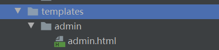

## thymeleaf模板引擎

### 实际使用中遇到的问题

- #### thymeleaf页面引入静态资源（如css，js，图片等）的问题

  在一个页面中引入资源时 他的地址不应该是存放这个页面文件的地址，而是在项目中 请求得到这个资源的请求路径，举例：

   倘若有如上这个资源的存放路径。

  templates文件下的模板文件可以直接被访问得到，`admin.html`文件则是在 admin文件夹下。但是该页面想引入静态资源所使用的路径与他在admin文件夹下并无关系。影响他==实际所在地址==的是 在浏览器中能够访问得到这个页面的 ==请求地址==。 

  譬如，这个就是访问得到他的请求路径，那么想要引入static文件夹下的img/test.jpg时，就需要用 `` 表示回退一个路径去访问静态资源。这时静态资源的请求路径就是 `localhost:8080/img/test.jpg` .

- #### 在模板引擎中 各种请求路径和最好的格式  @{/requestURL} 

  前面最好加上 / ，在运行过中 如果不加斜杠，可能会出现thymeleaf请求多加路径 的意外情况。

[官方文档](https://www.thymeleaf.org/doc/tutorials/3.0/usingthymeleaf.html#what-is-thymeleaf) 

##### 使用thymeleaf的第一步，引入命名空间

```xml
<html xmlns:th="http://www.thymeleaf.org">	
```

### 基础语法

#### 标准表达式方言

1. `${...}` : 变量表达式。
2. `*{...}` : 选择表达式。
3. `#{...}` : 消息 (i18n) 表达式。
4. `@{...}` : 链接 (URL) 表达式。
5. `~{...}` : 片段表达式。

##### `${...}` : 变量表达式

可以获取controller中用model返回的属性

```java
@RequestMapping("/th")
public String th(Model model){
    String user = "xiaojie";
	User user = new User("age"，18);
	model.addAttribute("user",user);
	return "/course/th";
}	
```

```html
<p th:text="${user.name}"></p>
<p th:text="${user.age}"></p>
```

结果：  xiaojie  18

##### `*{...}` : 选择表达式。

起到精简表达式的效果

```html
<div th:object="${user}" >
	<p th:text="*{name}"></p>
	<p th:text="*{age}"></p>
</div>
```

结果：  xiaojie  18

##### `@{...}` : 链接 (URL) 表达式。

一般和 th:href、th:src进行结合使用，用于显示Web 应用中的URL链接。通过@{...}表达式Thymeleaf 可以帮助我们拼接上web应用访问的全路径，同时我们可以通过（）进行参数的拼接

```html
<a th:href="@{/name(age=${user.age})}" >查看</a>
<!--效果：  /name?age=18-->
```

```html
<a th:href="@{/name/{age}(age=${user.age})}" >查看</a>
<!--效果：  /name/18 -->
```

以/开始的路径是属于上下文相关的。如果将一个名称为`myapp.war`的文件部署到一个Tomcat服务器中，那么应用程序一般是通过URL:`http://localhost:8080/myapp`来访问，`myapp`就是上下文名称。那么刚刚的路径就是`http://localhost:8080/myapp/name？age=18` 。

##### `~{...}` : 片段表达式。

片段表达式是一种简单的方法用来表示标记的片段并将其移动到模板中。 由于这些表达式，片段可以被复制，传递给其他模板的参数等等。

1. 使用 `th:fragment=""`定义片段代码

   ```html
   <div id="footer" th:fragment="footerFragment">2017 fanlychie</div>
   ```

2. 最常见的是使用`th:insert`或`th:replace`来插入片段:

   insert是将片段代码插入进当前的标签内，replace则是直接用片段代码取代当前的标签。

   ```html
   <div th:insert="~{commons/base :: footerFragment}"></div>
   <!-- ~{}是可选的, 可与去掉 -->。
   ```

##### 字符串操作

1. ```html
   <!-- 不管是字面值还是表达式的结果，我们都可以使用+符号将它们连接起来：-->
   <!-- Welcome to BeiJing! -->
   <p th:text="'Welcome to ' + ${location} + '!'"></p>
   ```

2. ```html
   <!-- 符号||可以用来将字面值和表达式包裹起来，这样就能方便的替换变量的值，而不需要使用+连接符：-->
   <!-- Welcome to BeiJing! -->
   <p th:text="|Welcome to ${location}!|"></p>
   ```

##### bool运算

```html
<p th:text="${user.online and user.vip}"></p>
<p th:text="${user.online or user.vip}"></p>
<p th:text="${!user.online}"></p>
<p th:text="${not user.online}"></p>
```

##### 条件运算

###### 三元运算

```html
<div th:text=" false ? 'truething' : 'falsething'"> </div>
```

##### th:text和  th:attr

###### th:text和  th:utext 取代标签中的值

```html
<p th:text="${message}"></p>
<!-- utext会自动转义html 标签 -->
<p th:utext="${message}"></p>
```

###### th:attr 可以用来设置html标签的属性值

```html
<a th:attr="href=@{https://www.google.com.hk}">谷歌一下你就知道</a>
<!-- 可以化简-->
<a th:href="@{https://www.google.com.hk}">谷歌一下你就知道</a>
```

###### h:attrappend & th:attrprepend

`th:attrappend`和`th:attrprepend`可以将表达式的结果分别追加到指定的属性值之后和之前。

```html
<!-- <button class="btn enable">购买</button> -->
<button class="btn" th:attrappend="class=${outOfStock} ? ' enable' : ' disable'">购买</button>
<!-- <button class="enable btn">购买</button> -->
<button class="btn" th:attrprepend="class=${outOfStock} ? 'enable ' : 'disable '">购买</button>
```

#### 遍历和条件判断

##### 遍历（迭代）的语法`th:each="自定义的元素变量名称 : ${集合变量名称}"`：

```html
<div>
    <spn>你所在城市：</spn>
    <select name="mycity">
        <option th:each="city : ${cities}" th:text="${city.name}"></option>
    </select>
</div>
```

属性`th:each`提供了一个用于跟踪迭代的状态变量，它包含以下几个属性：

|  属性   |  类型   |               描述               |
| :-----: | :-----: | :------------------------------: |
|  index  |   int   |    当前迭代的索引，从 0 开始     |
|  count  |   int   |    当前迭代的计数，从 1 开始     |
|  size   |   int   |        集合中元素的总个数        |
| current |   int   |          当前的元素对象          |
|  even   | boolean |     当前迭代的计数是否是偶数     |
|   odd   | boolean |     当前迭代的计数是否是奇数     |
|  first  | boolean |  当前元素是否是集合的第一个元素  |
|  last   | boolean | 当前元素是否是集合的最后一个元素 |

###### 状态变量的使用语法：`th:each="自定义的元素变量名称, 自定义的状态变量名称 : ${集合变量名称}"`：

```html
<div>
    <spn>所在城市：</spn>
    <select name="mycity">
        <option th:each="city, status : ${cities}" th:text="${city.name}" th:item-index="${status.count}">			</option>
    </select>
</div>
```

##### 条件判断

###### th:if   当表达式的评估结果为真时则显示内容，否则不显示：

###### t:unless 与if相反

###### th:switch 多路选择语句，它需要搭配`th:case`来使用：

```html
<div th:switch="${user.role}">
    <p th:case="admin">管理员</p>
    <p th:case="user">普通用户</p>
</div>
```


#### 内联表达式

###### [[...]]  相当于 th:text

```html
<p>The message is : [[${htmlContent}]]</p>
```

###### [(...)]  相当于 th:utext

##### th:inline

我们已经了解到，使用`[[]]`和`[()]`语法可以直接在 HTML 文本中使用标准表达式，如果想要使用更多高级的功能，需要使用`th:inline`属性来激活，它的取值如下：

|     值     |                       描述                       |
| :--------: | :----------------------------------------------: |
|    none    | 禁止内联表达式，可以原样输出 [[]] 和 [()] 字符串 |
|    text    |      文本内联，可以使用 th:each 等高级语法       |
|    css     |     样式内联，如：`<style th:inline="css">`      |
| javascript |  脚本内联，如：`<style th:inline="javascript">`  |

###### none

```html
<!-- [[1, 2], [3, 4]] -->
<p th:inline="none">[[1, 2], [3, 4]]</p>
```

###### text

```html
<!-- 北京 上海 广州 深圳 -->
<p th:inline="text">
    [# th:each="city : ${cities}"]
        [(${city.name})]
    [/]
</p>
```

###### css

```html
<style th:inline="css">
    body {
        background-color:[[${bgColor}]];
    }
</style>
```

###### javascript

```html
<script th:inline="javascript">
    var user = [[${user}]];
    alert("用户名：" + user.name);
</script>
```

#### 内置对象和工具类

#### 2.1.6 内置对象

|                             对象                             |                             描述                             |
| :----------------------------------------------------------: | :----------------------------------------------------------: |
| [#ctx](https://github.com/thymeleaf/thymeleaf/blob/thymeleaf-3.0.5.RELEASE/src/main/java/org/thymeleaf/context/IContext.java) |                          上下文对象                          |
| [#vars](https://github.com/thymeleaf/thymeleaf/blob/thymeleaf-3.0.5.RELEASE/src/main/java/org/thymeleaf/context/IContext.java) |                   同 #ctx，表示上下文变量                    |
|                           #locale                            | 上下文本地化（特定的地理区域）变量，可参考 java.util.Locale  |
|                           #request                           | HttpServletRequest 对象，可参考 javax.servlet.http.HttpServletRequest |
|                          #response                           | HttpServletResponse 对象，可参考 javax.servlet.http.HttpServletResponse |
|                           #session                           |   HttpSession 对象，可参考 javax.servlet.http.HttpSession    |
|                       #servletContext                        |   ServletContext 对象，可参考 javax.servlet.ServletContext   |

`#ctx`示例：

```html
<!-- zh_CN -->
<p th:text="${#ctx.getLocale()}"></p>
<!-- Welcome to BeiJing! -->
<p th:text="${#ctx.getVariable('message')}"></p>
<!-- true -->
<p th:text="${#ctx.containsVariable('message')}"></p>
```

`#vars`示例：

```html
<!-- zh_CN -->
<p th:text="${#vars.getLocale()}"></p>
<!-- Welcome to BeiJing! -->
<p th:text="${#vars.getVariable('message')}"></p>
<!-- true -->
<p th:text="${#vars.containsVariable('message')}"></p>
```

`#locale`示例：

```html
<!-- zh_CN -->
<p th:text="${#locale}"></p>
<!-- CN -->
<p th:text="${#locale.country}"></p>
<!-- 中国 -->
<p th:text="${#locale.displayCountry}"></p>
<!-- zh -->
<p th:text="${#locale.language}"></p>
<!-- 中文 -->
<p th:text="${#locale.displayLanguage}"></p>
<!-- 中文 (中国) -->
<p th:text="${#locale.displayName}"></p>
```

`#request`示例：

```html
<!-- HTTP/1.1 -->
<p th:text="${#request.protocol}"></p>
<!-- http -->
<p th:text="${#request.scheme}"></p>
<!-- localhost -->
<p th:text="${#request.serverName}"></p>
<!-- 8080 -->
<p th:text="${#request.serverPort}"></p>
<!-- GET -->
<p th:text="${#request.method}"></p>
<!-- /standard-expression-syntax/variables -->
<p th:text="${#request.requestURI}"></p>
<!-- http://localhost:8080/standard-expression-syntax/variables -->
<p th:text="${#request.requestURL}"></p>
<!-- /standard-expression-syntax/variables -->
<p th:text="${#request.servletPath}"></p>
<!-- java.util.Collections$3@203646fe -->
<p th:text="${#request.parameterNames}"></p>
<!-- {q=[Ljava.lang.String;@3308c69f} -->
<p th:text="${#request.parameterMap}"></p>
<!-- q=expression -->
<p th:text="${#request.queryString}"></p>
```

注意，请求地址的 URL 参数直接通过`#request.x`是取不出来的，需要使用`param.x`语法来取出。如，URL：`/standard-expression-syntax/variables?q=expression`，取出 q 参数的正确姿势：

```
<p th:text="${param.q}"></p>
```

`#response`示例：

```html
<!-- 200 -->
<p th:text="${#response.status}"></p>
<!-- 8192 -->
<p th:text="${#response.bufferSize}"></p>
<!-- UTF-8 -->
<p th:text="${#response.characterEncoding}"></p>
<!-- text/html;charset=UTF-8 -->
<p th:text="${#response.contentType}"></p>
```

`#session`示例：

```html
<!-- 2BCB2A0EACFF2D9D249D9799431B5127 -->
<p th:text="${#session.id}"></p>
<!-- 1499786693244 -->
<p th:text="${#session.lastAccessedTime}"></p>html
<!-- fanlychie -->
<p th:text="${#session.getAttribute('user').name}"></p>
```

注意，放到会话里面的对象直接通过`#session.x`是取不出来的，需要使用`session.x`语法来取出。如，取出会话里面的 user 对象的正确姿势：

```html
<p th:text="${session.user.name}"></p>
```

#### 2.1.7 工具类

|                             对象                             |             描述              |
| :----------------------------------------------------------: | :---------------------------: |
| [#messages](https://github.com/thymeleaf/thymeleaf/blob/thymeleaf-3.0.5.RELEASE/src/main/java/org/thymeleaf/expression/Messages.java) | 消息工具类，与 ＃{…} 作用相同 |
| [#uris](https://github.com/thymeleaf/thymeleaf/blob/thymeleaf-3.0.5.RELEASE/src/main/java/org/thymeleaf/expression/Uris.java) |       地址相关的工具类        |
| [#conversions](https://github.com/thymeleaf/thymeleaf/blob/thymeleaf-3.0.5.RELEASE/src/main/java/org/thymeleaf/expression/Conversions.java) |        对象转换工具类         |
| [#dates](https://github.com/thymeleaf/thymeleaf/blob/thymeleaf-3.0.5.RELEASE/src/main/java/org/thymeleaf/expression/Dates.java) |        日期时间工具类         |
| [#calendars](https://github.com/thymeleaf/thymeleaf/blob/thymeleaf-3.0.5.RELEASE/src/main/java/org/thymeleaf/expression/Calendars.java) |          日历工具类           |
| [#numbers](https://github.com/thymeleaf/thymeleaf/blob/thymeleaf-3.0.5.RELEASE/src/main/java/org/thymeleaf/expression/Numbers.java) |          数字工具类           |
| [#strings](https://github.com/thymeleaf/thymeleaf/blob/thymeleaf-3.0.5.RELEASE/src/main/java/org/thymeleaf/expression/Strings.java) |         字符串工具类          |
| [#objects](https://github.com/thymeleaf/thymeleaf/blob/thymeleaf-3.0.5.RELEASE/src/main/java/org/thymeleaf/expression/Objects.java) |          对象工具类           |
| [#bools](https://github.com/thymeleaf/thymeleaf/blob/thymeleaf-3.0.5.RELEASE/src/main/java/org/thymeleaf/expression/Bools.java) |          布尔工具类           |
| [#arrays](https://github.com/thymeleaf/thymeleaf/blob/thymeleaf-3.0.5.RELEASE/src/main/java/org/thymeleaf/expression/Arrays.java) |          数组工具类           |
| [#lists](https://github.com/thymeleaf/thymeleaf/blob/thymeleaf-3.0.5.RELEASE/src/main/java/org/thymeleaf/expression/Lists.java) |          List 工具类          |
| [#sets](https://github.com/thymeleaf/thymeleaf/blob/thymeleaf-3.0.5.RELEASE/src/main/java/org/thymeleaf/expression/Sets.java) |          Set 工具类           |
| [#maps](https://github.com/thymeleaf/thymeleaf/blob/thymeleaf-3.0.5.RELEASE/src/main/java/org/thymeleaf/expression/Maps.java) |          Map 工具类           |

```html
<!-- false -->
<p th:text="${#strings.isEmpty(message)}"></p>
<!-- 2017-07-12 00:37:25 -->
<p th:text="${#dates.format(now, 'yyyy-MM-dd HH:mm:ss')}"></p>
```