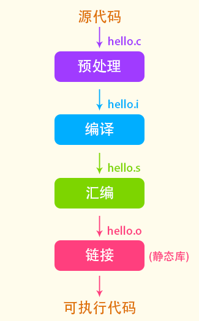
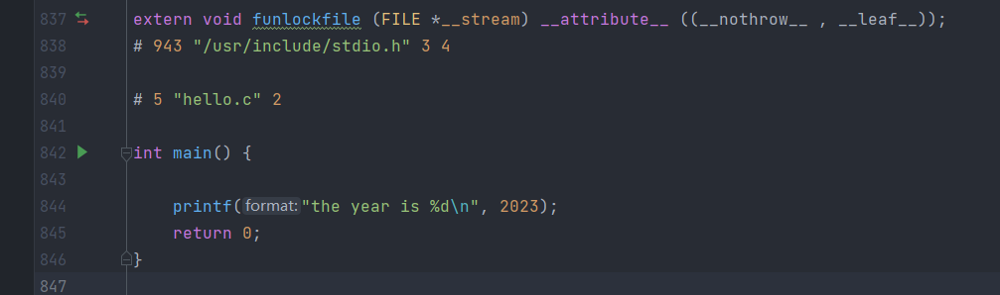
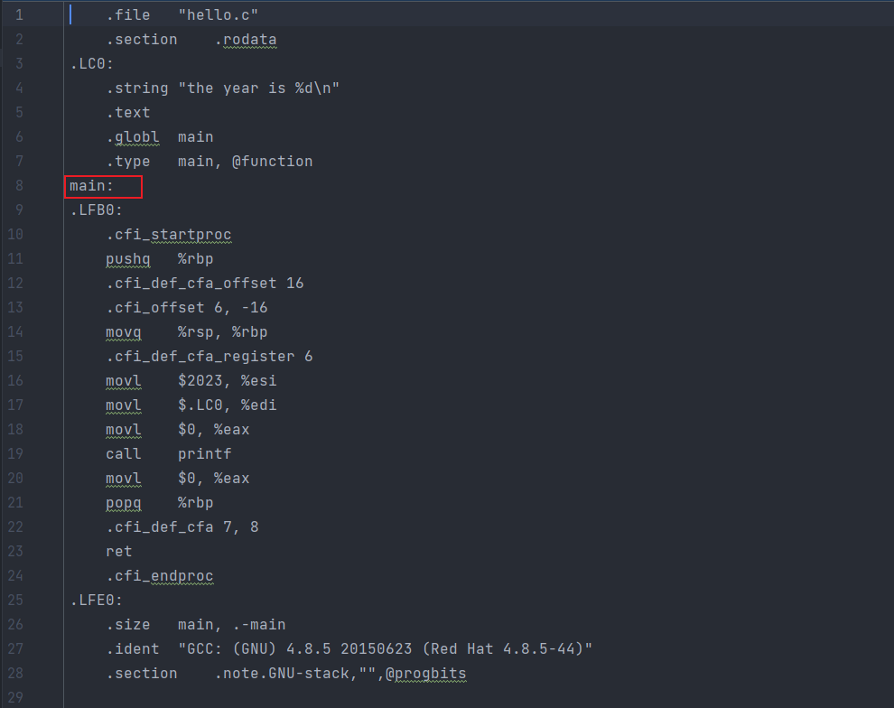
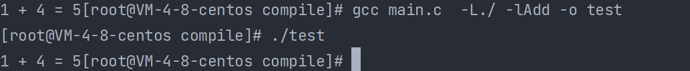
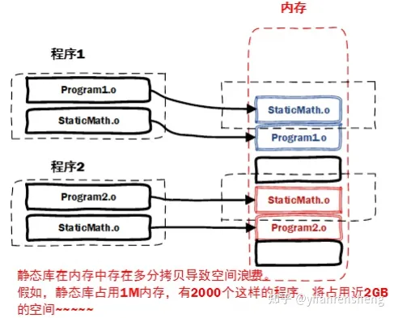

## C语言编译链接

编译器处理c项目， 主要包含如下的内容：

1. 预处理阶段。 预处理由预处理器(Preprocess)负责执行，这个过程并不对源代码进行解析。 而是处理一些头文件， 宏定义等。主要包括：
   1. 替换三字符组合为 双字符组合
   2. 行处理， 将源码中的转移字符转化为一般的字符
   3. 处理代码中的注释， 空白等。
   4. 处理源码中的预处理和宏拓展。
2. 编译(compile)  编译是使用编译器处理， 主要是将预处理好的代码编译成汇编代码， 这个过程很复杂， 设计到语法词法分析等。
3. 汇编(assembly) 汇编过程就是使用汇编器将汇编代码翻译成机器代码。 但是此时的机器还不能执行。 因为在预编译阶段只是将头文件包含进来， 但是并没有引用对应的实现代码
4. 链接(link)  链接阶段由链接器执行， 上面提到， 预编译中有些头文件的实现没有包含近来， 那么在这一步就需要将需要的文件包含进来。 这一步又分为静态库和动态库。

#### 编译动作演示

 

##### 预处理

```c
// hello.c
#include "stdio.h"
#define YEAR 2023
int main() {
    //hello world
    printf("the year is %d\n", YEAR);
    return 0;
}
```

执行 `gcc -E hello.c -o hello.i`  预处理文件的后缀并不一定要求是 *.i 。 查看hello.i文件

 

删除了源代码中的注释信息， 将头文件 "stdio.h"的内容引入进来， 处理替换一些宏定义的内容


##### 编译

使用 `gcc –S hello.i –o hello.s` 将刚刚预处理得到的文件编译为汇编文件。 查看汇编文件：

 


*在当前版本的gcc将 预处理和编译两个步骤合并为一个， 使用一个叫做cc1的程序来完成*


##### 汇编

执行命令 `gcc -c hello.s -o hello.o`, 将汇编文件汇编为机器码文件， 该文件就不去查看了。

*实际上gcc这个命令只是一些后台程序的包装， 汇编的后台程序就是 `as`*


#### 链接link

链接属实是一个让人费解的过程， *首先链接的后台程序是 ld。* 下面是静态链接产生一个正常运行hello world的程序所需步骤：

```shell

```


### 中间·目标文件和可执行文件结构


## Linux下使用gcc编译

### 制作和使用静态库

##### 制作静态库

 linux下的静态库一般以`.a` 结尾， 如下位测试代码

```c
/*util.h*/
int add(int a, int b)

/*util.c*/
int add(int a, int b) {
    return a+b;
}
```

1. `gcc util.c -c`   得到二进制 `util.o`	 文件
2. `ar -crv libAdd.a util.o`   得到静态库文件 `libAdd.a`


##### 使用静态库

静态库的使用首先要将对应库的头文件包含到我们的代码中， 还有就是在编译目标代码时要链接上该静态库*具体说应该是在将二进制文件链接为可执行文件的阶段*。

```c
/*main.c*/
#include "util.h"
#include "stdio.h"
int main() {
    printf("1 + 4 = %d", add(1, 4));
    return 0;
}
```

链接的方式也是有多种：

1. 直接在源文件上带上静态库文件 `gcc  main.c libAdd.a -o main` 得到main 可执行文件

   

2. 使用 参数指定链接目录和文件 `gcc -L./ -lAdd -o test main.c` 得到可执行文件 test

   


### 静态库的优缺点

**优点：**

- 函数库最终被打包到应用程序中，实现是函数本地化，寻址方便、速度快。（库函数调用效率==自定义函数使用效率）
- 程序在运行时与函数库再无瓜葛，移植方便。

**缺点：**

- 消耗系统资源较大, 每个进程使用静态库都要复制一份, 无端浪费内存。
- 静态库会给程序的更新、部署和发布带来麻烦。如果静态库libxxx.a更新了，所有使用它的应用程序都需要重新编译、发布给用户（对于玩家来说，可能是一个很小的改动，却导致整个程序重新下载）。

 


### 制作和使用动态库

##### 制作

共享库在程序编译时并不会被连接到目标代码中, 而是在程序运行是才被载入。 不同的应用程序如果调用相同的库, 那么在内存里只需要有一份该共享库的拷贝, 规避了空间浪费问题.动态库在程序运行时才被载入, 也解决了静态库对程序的更新、部署和发布会带来麻烦。用户只需要更新动态库即可, 增量更新.

按照习惯， 动态库一般以 `.so`结尾， 以制作静态库代码为例

1. `gcc util.c -fpic -c`   命令生成二进制文件util.o   参数：-fpic创建与地址无关的编译程序(pic, position independent code), 目的就是为了能够在多个应用程序间共享.  
2. `gcc -shared  util.o  -o libAdd2.so` 使用gcc将.o文件编译成库文件
3. 或者使用 `gcc -shared -fpic util.c -o libAdd2.so` 直接一步到位 


##### 使用

1. 链接的命令和链接静态库时一样 `gcc main.c -o main -L./ -lAdd2`

2. 但是在执行时需要链接到刚刚指定的动态库

   

3. 如何让系统找到我们制作的动态库

   1. 拷贝自己制作的共享库到/lib或者/usr/lib
   2. 临时设置LD_LIBRARY_PATH: export LD_LIBRARY_PATH=$LD_LIBRARY_PATH:库路径 说明：这种方法只能当前窗口有效。
   3. 永久设置, 把export LD_LIBRARY_PATH=$LD_LIBRARY_PATH:库路径, 设置到∼/.bashrc文件中, 然后在执行 `. ~/.bashrc` 或 `source ~/.bashrc`
   4. 永久设置， export LD_LIBRARY_PATH=$LD_LIBRARY_PATH:库路径，设置到/etc/profile文件中
   5. 将其添加到 /etc/ld.so.cache文件中。 编辑/etc/ld.so.conf文件, 加入库文件所在目录的路径。 运行sudo ldconfig -v, 该命令会重建/etc/ld.so.cache文件

   1. 
