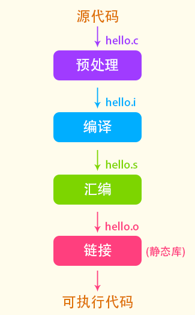
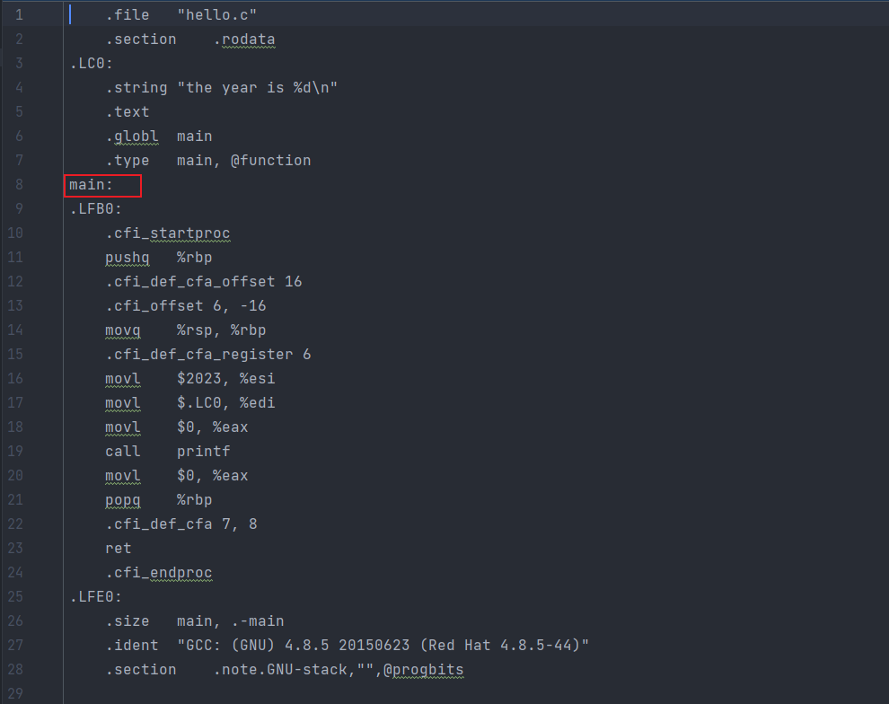
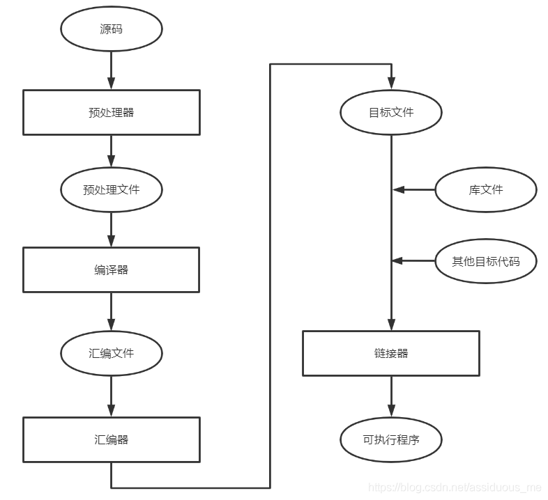

## C语言编译链接

编译器处理c项目， 主要包含如下的内容：

1. 预处理阶段。 预处理由预处理器(Preprocess)负责执行，这个过程并不对源代码进行解析。 而是处理一些头文件， 宏定义等。主要包括：
   1. 替换三字符组合为 双字符组合
   2. 行处理， 将源码中的转移字符转化为一般的字符
   3. 处理代码中的注释， 空白等。
   4. 处理源码中的预处理和宏拓展。
2. 编译(compile)  编译是使用编译器处理， 主要是将预处理好的代码编译成汇编代码， 这个过程很复杂， 设计到语法词法分析等。
3. 汇编(assembly) 汇编过程就是使用汇编器将汇编代码翻译成机器代码。 但是此时的机器还不能执行。 因为在预编译阶段只是将头文件包含进来， 但是并没有引用对应的实现代码
4. 链接(link)  链接阶段由链接器执行， 上面提到， 预编译中有些头文件的实现没有包含近来， 那么在这一步就需要将需要的文件包含进来。 这一步又分为静态库和动态库。

#### 编译动作演示

 

##### 预处理

```c
// hello.c
#include "stdio.h"
#define YEAR 2023
int main() {
    //hello world
    printf("the year is %d\n", YEAR);
    return 0;
}
```

执行 `gcc -E hello.c -o hello.i`  预处理文件的后缀并不一定要求是 *.i 。 查看hello.i文件

 

删除了源代码中的注释信息， 将头文件 "stdio.h"的内容引入进来， 处理替换一些宏定义的内容


##### 编译

使用 `gcc –S hello.i –o hello.s` 将刚刚预处理得到的文件编译为汇编文件。 查看汇编文件：

 


##### 汇编

执行命令 `gcc -c hello.s -o hello.o`, 将汇编文件汇编为机器码文件， 该文件就不去查看了。


#### 链接link演示

  

