 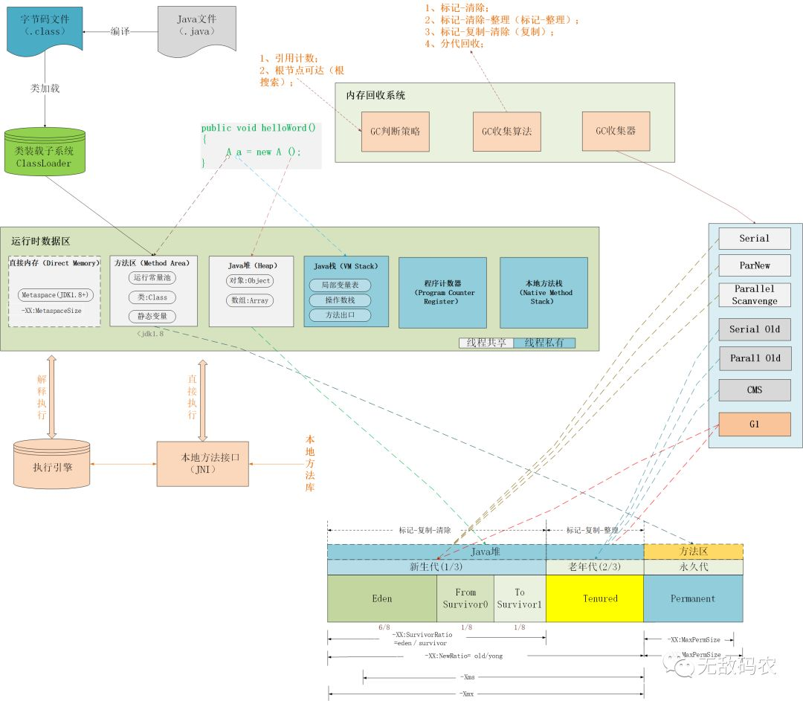 


[java虚拟机规范](https://docs.oracle.com/javase/specs/jvms/se8/html/)  

###### JVM工作内存图（简图）

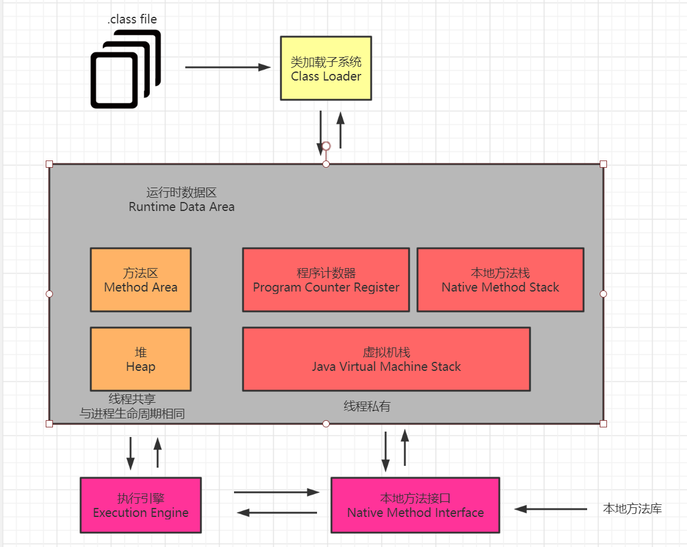  

### 类加载子系统


#### 加载一个 .class文件的过程

##### 1. 加载 Loading

1. 如果是在本地硬盘的java文件，则通过类的全限定名得到二进制字节流 .class文件
2. 将这个字节流所代表的信息转化为 运行时数据区的方法区内的数据结构。
3. 同时在内存中生成一个代表这个类的 java.lang.Class对象，作为方法区这个类的访问入口 *JVM规范中并没有规定Class实例放在那里，但是在hotspot虚拟机中，Class对象放在java堆中。*  

图示：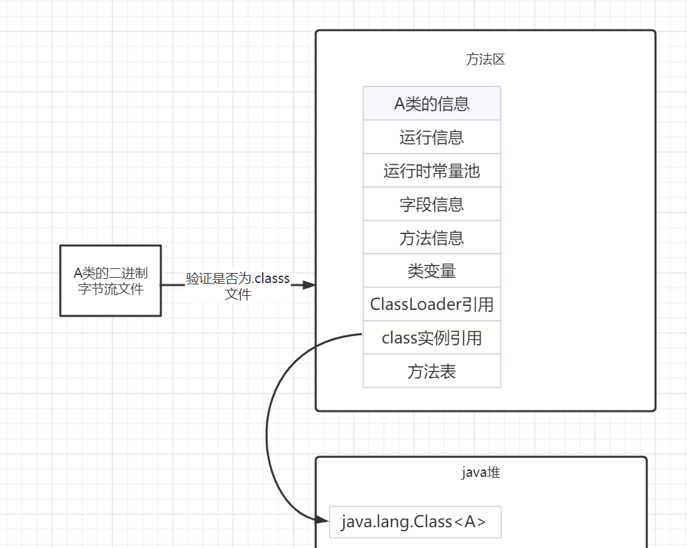  

###### 加载 .class文件的途径

- 从本地系统直接获取
- 通过网络获取，经典场景：Web应用
- 从zip压缩包和 jar，war包中获取
- 运行时计算生成，动态代理场景[[Spring#AOP动态代理的底层原理]]
- 从其他文件生成，例如jsp
- 从专有数据库中提取
- 从加密文件中获取，为了防止class文件被反编译的保护措施

##### 2. 连接 Linking

1. ###### 验证 Verify

   目的在于确保  .class 文件中的信息符合当前虚拟机的要求，保证被加载类的准确性。主要包括有文件格式验证，元数据验证 ，字节码验证， 符号引用验证。

2. ###### 准备 Prepare

   为类变量分配内存空间，并设置该类变量的默认初始值即零值。注意不包括final修饰的static变量，这种变量相当于常量，在编译的时候就会显示的初始化。但不会为实例变量分配初始化，类变量会分配在方法区中而实例变量和对象一样分配进java堆中。

   *类变量是加了static修饰的变量，实例变量是不加static修饰的变量。* 

3. ###### 解析Resolve

   将常量池内的符号引用转化为 直接引用。 解析动作主要针对类或接口、字段、类方法、接口方法、方法类型等。对应常量池中的CONSTANT_Class_info/CONSTANT_Fieldref_info、CONSTANT_Methodref_info等。

   并且实质上的解析动作往往在完成 初始化之后。

##### 3. 初始化 Initialzation

初始化阶段就是执行类构造器方法\<clinit\>方法的过程 *clinit()即“class or interface initialization method”，，， 并不是类的构造方法* 。如果一个类有父类会保证子类的clinit方法执行前，父类的clinit方法先执行。且虚拟机会保证在多线程的环境下，clinit方法是同步加锁的。 

这个方法也不需要我们自己定义，javac编译器会自己生成。它具体完成对 类变量和静态代码块的初始化工作。

可以在 idea中使用 jclasslib插件查看一个类的  .class字节码解析。 如果一个类没有类变量那么它的字节码就没有 clinit方法。

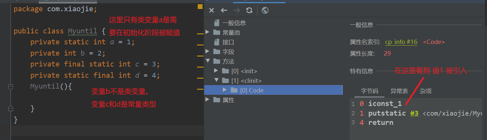  

在使用静态代码块时：

```java
package com.xiaojie;
public class Myuntil {
    private static int a = 1;
    static {
        //在静态代码块中可以提前使用类变量，是因为在连接的准备阶段，已经将所有类变量初始化为零值。
        b = 3;
        //但是还不可以直接使用
        //System.out.println(b); 错误的
    }
    public static int b = 2;
    Myuntil(){
    }
}
```

#### 何时会加载一个类

当遇到类的主动使用时，主动使用有如下的情况

- 遇到new、getstatic、putstatic或者invokestatic字节码指令的时候，如果类还没有初始化。对应场景为：
  - new一个对象；
  - 读取或者设置一个类的静态字段；
  - 调用类的静态方法的时候；
- 使用`java.lang.reflect`包的方法对类进行反射的时候，如果类还没有初始化；
- 初始化类的时候，如果父类还没有初始化，则触发父类初始化；
- 虚拟机器启动时，main方法所在的类会首先进行初始化；
- JDK1.7中使用动态语言支持的时候，如果一个java.lang.invoke.MethodHandler实例最后解析为：REF_getStatic，REF_putStatic，REF_invokeStatic方法句柄的时候，并且句柄所对应的类没有进行过初始化。

类的被动使用与主动使用的区别是，类不会被初始化，既不会执行 \<clinit\>方法了


#### 类加载器和双亲委派机制

在JVM规范中 规定了加载器分为引导类加载器（Bootstrap ClassLoader ）和自定义类加载器（User-Defined ClassLoader）。

其中 Bootstrap ClassLoader是由 c++语言编写的。

##### 在JDK8 中的类加载器

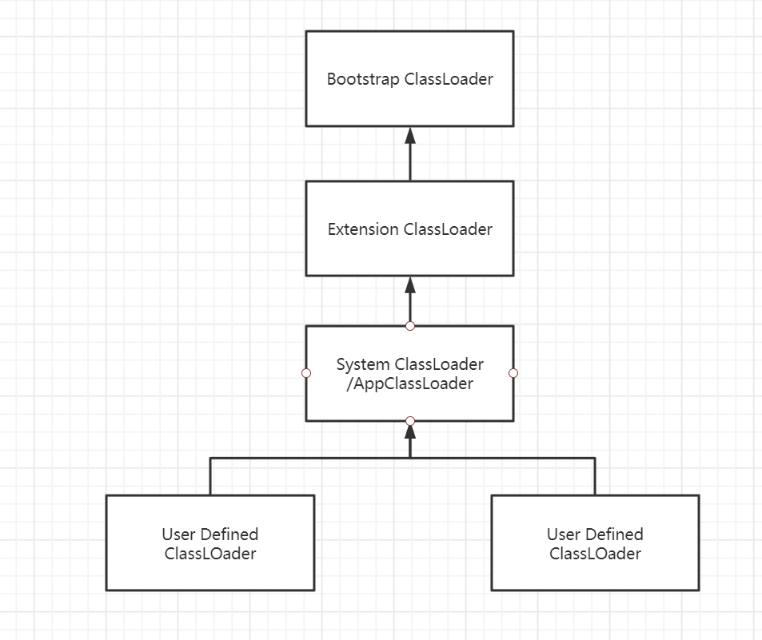 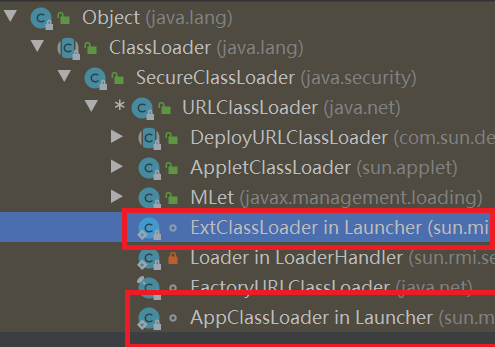 类加载器类型，注意他们是包含关系。而不是父子继承关系。 

1. 启动类加载器，负责加载%JAVA_HOME%\bin目录下的所有jar包，或者是-Xbootclasspath参数指定的路径；

2. 扩展类加载器：负责加载%JAVA_HOME%\bin\ext目录下的所有jar包，或者是java.ext.dirs参数指定的路径；

3. 应用程序类加载器：负责加载用户类路径上所指定的类库，如果应用程序中没有自定义加载器，那么次加载器就为默认加载器。

尽管在JVM规范中将除Bootstrap ClassLoader外的类加载器统称为 自定义类加载器。但是对于开发人员来说，自定义加载器往往代表那些自己实现的加载器。

##### 双亲委派机制   

当一个类加载器收到加载类的请求时并不会立即加载，而是把请求委托给父加载器。父加载器也会进行同样的操作，只有当父类加载器无法进行加载时，他才会自己加载这个类。

###### 为什么使用双亲委派机制

避免重复加载 + 避免核心类篡改
采用双亲委派模式的是好处是Java类随着它的类加载器一起具备了一种带有优先级的层次关系，通过这种层级关可以避免类的重复加载，当父亲已经加载了该类时，就没有必要子ClassLoader再加载一次。其次是考虑到安全因素，java核心api中定义类型不会被随意替换，假设通过网络传递一个名为java.lang.Integer的类，通过双亲委托模式传递到启动类加载器，而启动类加载器在核心Java
API发现这个名字的类，发现该类已被加载，并不会重新加载网络传递的过来的java.lang.Integer，而直接返回已加载过的Integer.class，这样便可以防止核心API库被随意篡改。

### 运行时数据区学习

 运行时数据区其实就是内存空间管理。java虚拟机在执行java程序的过程中会把它所管理的内存划分为若干的不同的数据区域。这些区域各有用途和各自的创建和销毁的时间。下面介绍一下jvm在运行时的数据区域。

###### 首先看一下在JDK8 hotspot虚拟机中运行时数据区的详细图示： *在开头处有一张工具JVM规范绘制的简图* 

  

###### 程序计数器

国内有时候称它 pc寄存器，其实是对物理寄存器的抽象模拟，他并不是一个真正意义上的寄存器。pc寄存器只占用很小的一块内存，用于指向下一条指令的地址，有执行引擎来读取运行指令。

- pc寄存器是线程私有的，生命周期与线程的周期是一致的。因为如果是线程共享的话，不同线程切换后，pc寄存器指向的指令段就失效了。
- 如果当前执行的是 native方法，那么pc寄存器的值就是 `undefined`
- 由于它所占的内存极小，所以他是唯一一个没有OutOfMemoryError情况的区域

#### 虚拟机栈 JVM stacks

 

JVM stacks是运行时的单位保证了程序的运行，栈内的基本单位时栈帧，一个栈帧对应一个java方法。

1. 一个活动的线程中，只会有一个活动的栈帧（即栈顶帧）。
2. 不同线程的JVM stacks中的栈帧不能互相引用。
3. 一个方法调用另一个方法，对应到栈帧的情况，前一个方法对应的栈帧本来时当前帧，由于前一个方法调用新方法，栈中压入一个心栈帧，新栈帧变新的当前活动帧，等到新方法运行结束，新栈帧出栈。

##### JVM stacks的OOM问题

堆栈来说不存在GC问题，因为JVM stacks中只有入栈和出栈两种操作。但是会有OOM的异常问题。[[JVM#JVM中的异常处理#JVM stacks的OOM（OutOfMemory）和StackOverflow 两种异常]]

##### 栈帧的结构

###### 局部变量表 Local Variable

其被定义为一个数字数组，主要用于储存 方法参数 和 定义在方法体中的局部(Local)变量，包括的数据类型有 1. 基本数据类型(8种)  2. 对象的引用  3. return Addres 。

###### 操作数栈 Operand Stack /表达式栈

- 主要用于保存计算过程的中间结果，即为计算过程中变量的临时存储空间。
- 当一个方法刚开始执行的时候，这个栈帧的操作数栈式空的。
- 每一个操作数栈有一个明确的栈深度，这个栈深度在编译期间就已经确定了，保存在方法的code属性中（确定于本方法中最多会有几个同时运算的操作数）。
- 栈中的元素可以是java的任意数据类型，32bit的占一个深度单位，64bit占两个深度。
- 在hotspot虚拟机中有一个 栈顶缓存机制(Top-of-Stack- Cashing),将栈顶元素全部缓存在 物理cpu中，提升执行引擎的效率。

```java
package com.xiaojie;
public class Gomain {
    public static void main(String[] args) {
        System.out.println(test());
    }
    static int test(){
        int a = 1+3;    //-1~5  1+3操作 编译阶段就已经实现。
        int b = a+9;
        int c = 100;    //-128~127
        int d = 1000;   //-32768~32767
        int e = 33000;  //-2147483648~2147483647
        return a;
    }
}
```

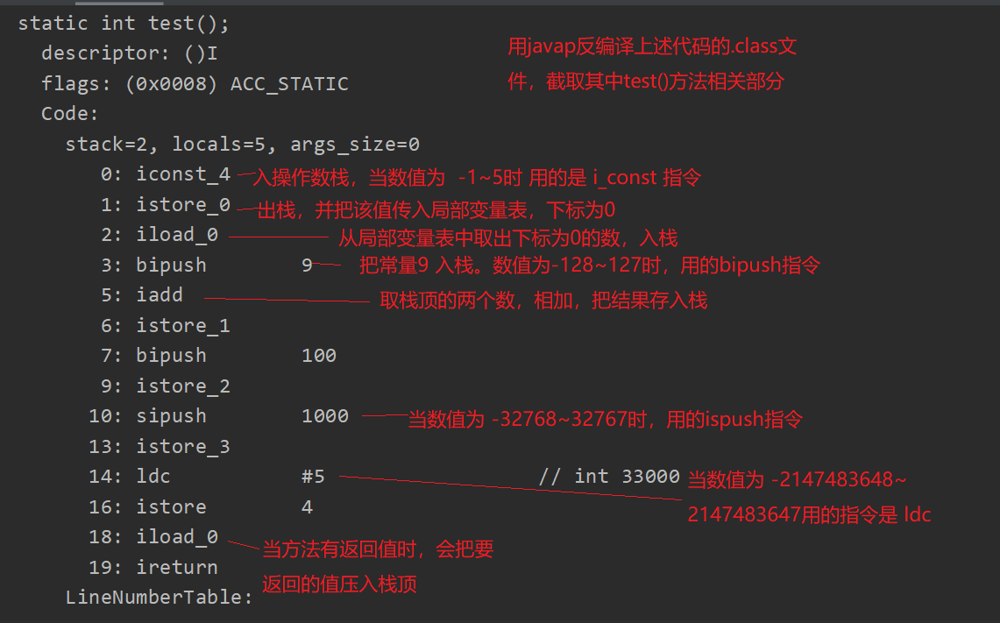 

###### 动态链接 Dynamic Linking 

每一个栈帧包含一个指向 运行时常量池中 该帧所属方法的 引用。 运行起来后，常量池会被放到方法区。目的是为了将符号引用转化为直接引用。

​             **java中方法调用的细分**

- 静态链接 ，当一个字节码文件被装载进JVM时，如果被调用的方法在编译期间可知，且运行期间保持不变。这时将符号引用转化为直接引用的过程称为 静态链接。

- 动态链接， 反之 编译期间无法确定的方法引用，这时需要使用动态链接。

   

###### 方法返回地址 Return Address

- 用于 存放调用该方法的pc寄存器的值。方法正常退出时，调用者的pc寄存器值作为返回地址，即调用该方法的指令的下一条指令地址。
- 而对于异常退出的方法，不会给他的上层调用者产生任何返回值

###### 一些附加的信息

#### 本地方法栈

###### 本地方法接口

在学习本地方法栈之前我们先了解一下什么是本地方法接口。简单来说 一个native方法就是一个 java调用的非java代码的接口，常用的语言有c++/c 。

JVM栈管理java方法的运行，本地方法栈自然就是管理本地方法的调用，也是线程私有的。

#### 堆 Heap

-  一个JVM实例只有一个 堆heap， 是java内存管理的核心，正常来说应该是JVM最大一块内存区域。分为新生代（伊甸区 ，s0 ，s1），老年代。
- 堆heap在 JVM实例创建的时候就已经确定了，后期不可以的动态的拓展，他是JVM中GC的最主要区域，同时也会出现OOM异常。[[JVM#JVM中的异常处理#堆heap中的 OutOfMemoryError异常]]

-  所有的线程共享堆，但是这里还可以划分出线程私有的缓冲区 （Thread Local Allocation Buffer，TLAB）
-  在 虚拟机规范里 规定了堆可以处于物理上不连续内存空间中，但在逻辑上必须是连续的。
- 在 虚拟机规范中 规定所有的对象实例都应该存放在 堆中，但是主流的虚拟机主要是hotspot却有例外。

###### 配置Heap堆内存中，各个结构的占比参数

- `-XX:NewRatio=2` ,用于设置新生代与老年代的占比。默认值是2，代表新生代占1，老年代占2，即 新生代占整个堆的 1/3 。
- `-Xmn:` 可以单独设置 新生代的大小，且优先级比`-XX:NewRatio=2`高，但一般不用。
- `-XX:Survivor=8`，用于设置新生代中 Eden区和 S0/S1区的占比。默认值是8，即S0/S1占 整个新生代的1/9 。
- `UseAdaptiveSizePolicy` 该参数的是由似乎有错误。。。。。。。


###### 对象分配内存的过程

1. new的对象先存放在 Eden区。
2. 当 Eden区的内存被占满时，程序又需要new新的对象时，堆 Eden区进行垃圾回收（Minor GC/Young GC）。将Eden区中不再被应用的对象销毁，仍然被引用的对象加载进 S0区。新产生的对象就可以放入空的Eden区。
3. 如果再次触发 Eden区的 YGC/Minor GC，最初放入Eden区中对象的S0区就是 from区，而空的S1区就是对应的to区。Eden区需要被保留的对象进入to区，from区中仍被引用的对象进入to区，from区变空下次GC变为to区。
4. 进入幸存者区的对象会有一个 周期属性，默认周期到15后会进入 养老区。可以通过`-XX:MaxTenuringThreshold=<N>` 进行设置。

######  对象分配内存的流程图

 


## JVM中的异常处理

##### JVM stacks的OOM（OutOfMemory）和StackOverflow 两种异常，，，，OOM其实是error

###### StackOverflow

采用固定的JVM stacks容量时 会出现的异常。当线程请求的栈容量超出了 JVMstacks允许的最大值。

可以通过 `-Xss` 参数来设置栈容量大小。默认的单位时 byte ， 加上K是 kb单位，加上 m是 mb单位。

```java
//这段代码 使main()函数反复递归调用自己并计数，借此测试 -Xss参数设置栈容量的大小
package com.xiaojie;
public class Gomain2 {
    static int  cnt=0;
    public static void main(String[] args) {
        System.out.println(cnt++);
        main(args);
    }
}
```

在idea中 可以在 有上角的 Edit Configuration中的 VM option选项设置

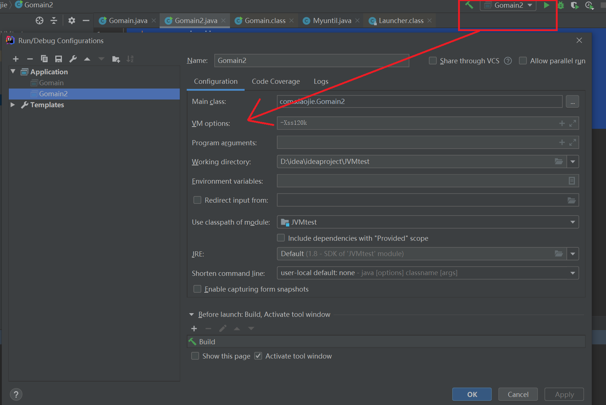 

设置为 -Xss120k后 递归调用了 970次，随后抛出了 StackOverflowError异常。                              

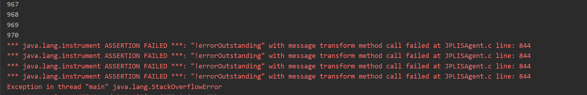 

###### OOM

当JVM stacks的容量允许的动态的拓展，申请拓展时无法获得内存的情况。 或者线程创建时，无法创建对于的stack出现。

*在hotspot中不允许栈容量支持扩展，因此在hotspot中只有在创建线程无法获得足够内存才会出现该异常*  。

##### 堆heap中的 OutOfMemoryError错误

java堆的大小在启动JVM实例的时候 已经确定了，可以通过 `-Xms` 	`-Xmx` 选项来设置。

- `-Xms`  表示堆区的初始内存大小，等价于 `-XX：InitialHeapSize`  默认为物理电脑最大内存大小/64  。
- ` -Xmx`  表示堆区的最大内存， 等价于  `-XX:MaxHeapSize`  默认为物理电脑最大内存/4 。

一旦堆区的内存大小超过了，`-Xmx` 所设置的值，就会出现OOM异常。

```java
package com.xiaojie;
public class Gomain2 {
    public static void main(String[] args) {
        //获取虚拟机堆内存总量
        long initalMemory = Runtime.getRuntime().totalMemory();
        //获虚拟机试图使用的最大空间
        long maxMemory = Runtime.getRuntime().maxMemory();
        System.out.println("-Xms:" + initalMemory/1024/1024 + "mb");
        System.out.println("-Xmx:" + maxMemory/1024/1024 + "mb");
    }
}
```

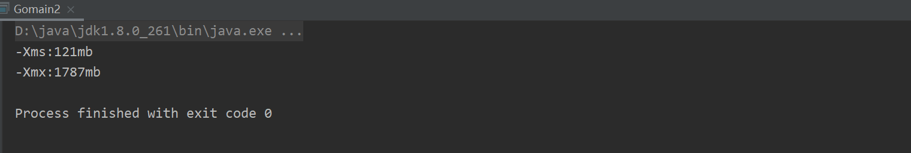  

使用`jps` 指令查看当前hotspot虚拟机的进程，使用`jstat -gc 进程号 `指令查看某一进程的堆空间GC情况

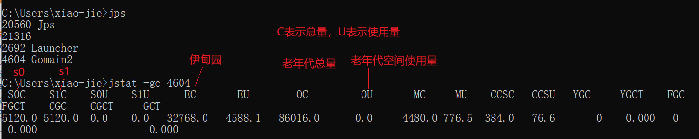 

发现 (S0C+EC+OC)/1024/1024 = 121MB    这是我们设置的 -Xms值。但是 堆的组成是由 新生代（伊甸园，S0,S1）h和老年代组成，

为什么没有把 S1的空间加进去。这是因为 S0和S1只会有一个能用于存放对象，另一个用于GC时。

也可以在 Edit Configuration中添加选项 `-XX:+PrintGCDetails` 查看相似的数据。

 

 
