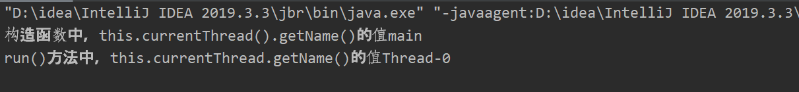

​    

# java多线程

##### 线程类的编写

###### 继承自基类Thread，需要重写run方法

```java
package com.xiaojie;

public class Thread1 extends Thread{
	@Override
	public void run() {
		System.out.println("ThreadName:"+this.getName());
		return;
	}
}
```

###### 实现Runable接口，实际Thread也是Runable的实现类

实现Runable接口这时我们还没有开始实现它的各种方法所有无法使用。

```java
package com.xiaojie;

public class Thread1 implements Runnable{

    public void run() {
        System.out.println("暂时不能使用Thread类中的方法");
        return;
    }
}
```

新建一个自己的实现类的对象，把他作为Thread的参数创建一个Thread类对象，可以使用该类对象了。优点是可以实现多继承。

```java
package com.xiaojie;

public class Gomain {
    public static void main(String[] args) {
        Thread1 th1 = new Thread1();
        th1.run();
        Thread thread = new Thread(th1);
        thread.start();
    }
}
```

*注意点  :   想要使得进程创建运行，应当调用start()方法，而不是run()方法。调用run方法只是将run内的代码执行而已。*

### 线程类Thread中的各种方法

##### currentThread()方法

currentThread()返回的是当前代码段调用的线程的引用。

```java
package com.xiaojie;

public class Thread1 extends Thread{
    public Thread1(){
        super();
        System.out.println("构造函数中，this.currentThread().getName()的值"+ this.currentThread().getName());
    }
    @Override
    public void run() {
        System.out.println("run()方法中，this.currentThread.getName()的值"+ this.currentThread().getName());
        return;
    }
}
```

```java
package com.xiaojie;

public class Gomain {
    public static void main(String[] args) {
        Thread1 thread = new Thread1();
        thread.start();
    }
}
```

 

构造函数是在 main函数中调用的。main函数其实也是一个线程，它的Name的默认值就是 "main"。其实者并不奇怪因为线程"Thread-0"的产生，是在 start()语句执行后，构造函数执行时只有主函数所在的线程可以承载。

而 thread.start()方法执行会自动创建线程，并执行run内的代码，所以它的currentThread()指向新建的线程。

###### currentThread()方法与直接在类定义中使用this.的区别

*在很多情况下，this指针不能使用。可以用Thread关键字代替* 

currentThread()返回的是当前代码段调用的线程的引用。this则一直是指向当前的对象。

在实现Runable接口达到多继承效果的方法创建新的线程类的情况下会有所不同

```java
package com.xiaojie;

public class Thread1  extends Thread implements Runnable{
    @Override
    public void run() {
        System.out.println("在main函数中把这个类的对象作为new Thread()的参数，创建Thread实例");
        System.out.println("run()方法中，this.currentThread.getName()的值" + this.currentThread().getName());
        System.out.println("run()方法中，this.getName()的值" + this.getName());
        return;
    }
}
```

```java
package com.xiaojie;

public class Gomain {
    public static void main(String[] args) {
        Thread1 thread1 = new Thread1();
        thread1.setName("thread-1");
        Thread thread2 = new Thread(thread1);
        thread2.setName("thread-2");
        thread2.start();
    }
}
```


this.getName()的值是 Thread1的线程名。而this.currentThread.getName()是Thread2，因为这里我们是 `thread2.start();`。由thread2创建的线程运行了 Thread1里的run函数。所以currentThread()指向的调用它的线程的引用自然就是thread2这个对象。

##### isAlive()用于判断当前的线程类对象是否存活

##### getStackTrace()  用于获取一个存活状态的线程的堆栈跟踪元素的数组。

其实就是获取该线程调用的方法的记录。第一个元素表示栈顶是最近调用的一个方法。如果该线程已经停止或者尚未激活，则返回长度为0的数组。

```java
package com.xiaojie;

public class Recur {
    public void a(){
        b();
    }
    public void b(){
        c();
    }
    public void c(){
        System.out.println("c-method");
        StackTraceElement[] stackTrace = Thread.currentThread().getStackTrace();
        for (int i=0; i< stackTrace.length; i++) {
            StackTraceElement ele = stackTrace[i];
            System.out.println(ele.getClass()+ "    "+ ele.getMethodName()  +"   " +ele.getLineNumber());
        }
    }
}
```

```java
package com.xiaojie;

public class Gomain {
    public static void main(String[] args) throws InterruptedException {
        Recur re = new Recur();
        re.a();
    }
}
```

 

##### getId()可以获得线程的唯一id

#### 停止线程

##### interrupted()和isInterrupted() 用于获取该线程是否被打上了中断

- this.interrupted()  用于测试当前运行this.interrupted()的线程是否中断

  ```java
  package com.xiaojie;
  
  public class Gomain {
      public static void main(String[] args) throws InterruptedException {
          Thread1 thread1 = new Thread1();
          thread1.interrupt();
          System.out.println(thread1.interrupted());
      }
  }
  ```

  这里的结果是 `false` ，因为`thread1.interrupted()`测试的是运行该语句的线程的中断情况，所以是main函数对应的线程。

  并且`interrupted()` 由清除中断的效果，就是原本中断情况为 `true`时，执行一次`interrupted()` 后，他的值变为`false`。

- isInterrupted() 则是直接作用于调用它的对象，且不会清除状态标志。

  ```java
  package com.xiaojie;
  
  public class Thread1  extends Thread implements Runnable{
      @Override
      public void run() {
          System.out.println("run");
          return;
      }
  }
  ```

  ```java
  package com.xiaojie;
  
  public class Gomain {
      public static void main(String[] args) throws InterruptedException {
          Thread1 thread1 = new Thread1();
          thread1.start();
          thread1.interrupt();
          System.out.println(thread1.isInterrupted());
      }
  }
  ```

   

  注意这里的输出，我们看到尽管先输出了`true`，以为着打上中断状态在打印 "run"之前，但是打印语句依然执行了。说明打上中断并不会立即停止线程。这也是我们称interrupt()只是打上中断状态的一个方法的原因。


##### 回到停止线程的问题

###### 利用中断异常停止

```java
package com.xiaojie;

public class Thread1  extends Thread implements Runnable{
    @Override
    public void run() {
        super.run();
        try{
            for (int i=0; i<1000; i++){
                if (this.isInterrupted()){
                    System.out.println("Interrupted happened");
                    throw new InterruptedException();
                }
                System.out.println(i);
            }
        }catch (InterruptedException e){
            System.out.println(e);
        }

    }
}
```

```java
package com.xiaojie;

public class Gomain {
    public static void main(String[] args) throws InterruptedException {
        Thread1 thread1 = new Thread1();
        thread1.start();
        Thread.sleep(10);
        thread1.interrupt();
        System.out.println(thread1.isInterrupted());
    }
}
```

 

我们看到`i++`到370的时候，主函数中的interrupt()执行，线程对象抛出异常提早结束线程。此时线程的isInterrupted()是 `true`。

###### 简单粗暴 return，同样推荐

###### 不推荐使用stop() 方法，， 会有未预料的情况。


### 多线程环境下 对对象的并发访问可能会有的问题

###### 脏数据的问题

脏数据包括赋值的情况和取值的情况，下面以赋值的情况举例。

```java
package com.xiaojie;

public class Recur {
    String name;
    String password;
    public void test(String newname, String newpass) throws InterruptedException {
        name = newname;
        if (name.equals("a")) {
            Thread.sleep(2000);
        }
        password = newpass;
        System.out.println(name+ "   "+password);
    }
}
```

```java
package com.xiaojie;

public class Thread1  extends Thread implements Runnable{
    Recur recur;
    String name;
    Thread1(Recur re,String name){
        super();
        this.recur = re;
        this.name = name;
    }
    @Override
    public void run() {
        super.run();
        try {
            this.recur.test(name,"pp");
        } catch (InterruptedException e) {
            e.printStackTrace();
        }
    }
}
```

```java
package com.xiaojie;

public class Gomain {
    public static void main(String[] args) throws InterruptedException {
        Recur recur = new Recur();
        Thread1 thread1 = new Thread1(recur,"a");
        Thread1 thread2 = new Thread1(recur, "b");
        thread1.start();
        thread2.start();
    }
}
```

 

发现没有 name=a的情况，因为在多线程情况单实例的值被多次修改，主要是多个线程可以同时访问test(方法，法导致数据发生错误。

###### 解决方法

在这个对单例进行修改值的方法进行synchronized进行方法同步，意味者同一时间只有一个线程可以调用方法。

```java
package com.xiaojie;

public class Recur {
    String name;
    String password;
    synchronized public void test(String newname, String newpass) throws InterruptedException {
        name = newname;
        if (name.equals("a")) {
            Thread.sleep(2000);
        }
        password = newpass;
        System.out.println(name+ "   "+password);
    }
}
```

 

注意这两个Thread线程中的recur是同一个对象，所以才会有同步的效果。不同的对象由不同的锁。

###### synchronized同步在字节码指令中的原理

###### 锁重入的特性

synchronized ，当一个线程得到一个对象的锁时，再次请求是可以得到该对象的所的，这也意味着在一个synchronized 方法快内部时，调用一个synchronized 方法快是永远可以得到的。并且锁重入还支持父子类之间的继承。

```java
package com.xiaojie;

public class Recur {
    synchronized public void fun1(){
        System.out.println("fun1");
        fun2();
    }
    synchronized public void fun2(){
        System.out.println("fun2");
    }
}
```

```java
package com.xiaojie;

public class Thread1  extends Thread implements Runnable{
    RecurSon recurSon;
    Thread1(RecurSon recurSon){
        this.recurSon = recurSon;
    }
    @Override
    public void run() {
        super.run();
        recurSon.fun3();
    }
}
```

```java
package com.xiaojie;

public class Gomain {

    public static void main(String[] args) throws InterruptedException {
        RecurSon recurSon = new RecurSon();
        Thread1 thread1 = new Thread1(recurSon);
        thread1.start();
    }
}
```

 

###### 当一个线程发生异常时，持有的锁会自动释放

###### 当重写一个synchronized 方法如果不加 synchronized ，则自动变为非同步方法

##### synchronized 同步语句块

在许多情况下，一个方法中并不所有语句都要求同步的，可以使用同步语句块进一步划分。

###### synchronized(this)这时的代码块锁定的也是当前对象

这种情况下，同步代码块和同步的函数是要求一起同步。在Recur类中的fun1是放在代码块中的，fun2是放在同步函数中，都是锁定在当前对象，所以其中一个方法被一个线程A被访问时，另一个线程也不能被除A的任意线程访问。

```java
package com.xiaojie;

public class Recur {
     public void fun1() throws InterruptedException {
         synchronized (this){
             System.out.println("fun1 start");
             Thread.sleep(1000);
             System.out.println("fun1 end");
         }
    }
    synchronized public void fun2(){
        System.out.println("fun2 start");
        System.out.println("fun2 end");
    }
}
```

```java
package com.xiaojie;

public class Thread1  extends Thread implements Runnable{
    Recur re;
    Thread1(Recur re){
        this.re = re;
    }
    @Override
    public void run() {
        try {
            re.fun1();
        } catch (InterruptedException e) {
            e.printStackTrace();
        }
    }
}
```

```java
package com.xiaojie;

public class Thread2  extends Thread implements Runnable{
    Recur re;
    Thread2(Recur re){
        this.re = re;
    }
    @Override
    public void run() {
        re.fun2();
    }
}
```

```java
package com.xiaojie;

public class Gomain {

    public static void main(String[] args) throws InterruptedException {
        Recur re = new Recur();
        Thread1 th1 = new Thread1(re);
        Thread2 th2 = new Thread2(re);
        th1.start();
        th2.start();
    }
}
```

 

###### synchronized(Object)  除this， 可以将任意对象作为锁

只有当这其中的object类对象是同一个时，这两个锁才是同一个锁。而不同的锁就意味着异步执行。

修改刚刚的Recur类

```java
package com.xiaojie;

import java.lang.reflect.Array;
import java.util.ArrayList;
import java.util.List;

public class Recur {
    List list = new ArrayList();
    public void fun1() throws InterruptedException {
        synchronized (list){
            System.out.println("fun1 start");
            Thread.sleep(1000);
            System.out.println("fun1 end");
        }
    }
    synchronized public void fun2(){
        System.out.println("fun2 start");
        System.out.println("fun2 end");
    }
}
```

 

可以看到的`fun1`和`fun2`已经时异步运行的了 。

###### 使用 synchronized(Object)时，通常不使用String类型

由于[[JVM]]的String常量池功能，会使得两个一样值的没有显示new()  String类视为同一个对象。

```java
package com.xiaojie;

import java.lang.reflect.Array;
import java.util.ArrayList;
import java.util.List;

public class Recur {
    List list = new ArrayList();
    public void fun1(String str) throws InterruptedException {
        synchronized (str){
            System.out.println("fun1 start");
            Thread.sleep(1000);
            System.out.println("fun1 end");
        }
    }
    public void fun2(String str){
        synchronized (str){
            System.out.println("fun2 start");
            System.out.println("fun2 end");
        }
    }
}
```

两个Thread类：

 

```java
package com.xiaojie;

public class Gomain {

    public static void main(String[] args) throws InterruptedException {
        Recur re = new Recur();
        Thread1 th1 = new Thread1(re);
        Thread2 th2 = new Thread2(re);
        th1.start();
        th2.start();
    }
}
```

 

当传入两个一样 `"aa"`  ,就会被视为同一个String类对象，导致这两个方法变为同步方法。要解决这个问题可以显示的new String()。

`String string = new String("aa");`。

##### 静态同步方法 static synchronized

##### 多线程的死锁


#### volatile关键字

- volatile可以实现线程之间的可见性
- 原子性，针对32未系统中的long和double实现原子性
- 禁止代码重排

##### 原子性的测试

###### 32位的jdk中，long和double不具有原子性


###### volatile int i++ 并不是原子性的

```java
package com.xiaojie;

public class IntTest {
    volatile private int count = 0;
    public void go(){
        for (int i=0;i<100;i++){
            count++;
            System.out.println(count);
        }
    }
}
```

```java
package com.xiaojie;

public class Thread1  extends Thread implements Runnable{
    IntTest intTest;
    Thread1(IntTest intTest){
        this.intTest = intTest;
    }
    @Override
    public void run() {
        intTest.go();
    }
}
```

```java
package com.xiaojie;

public class Gomain {

    public static void main(String[] args) throws InterruptedException {
        IntTest intTest = new IntTest();
        Thread1[] threads = new Thread1[100];
        for (int i =0; i<100; i++){
            threads[i] = new Thread1(intTest);
        }
        for (int i=0; i<100; i++) {
//            Thread.sleep(0, 1);
            threads[i].start();
        }

    }
}
```


在多次运行后会出现最终值不等于1000的情况。这足以证明在巨大的线程访问中，volatile int i++ 并不是原子性的。要解决这种意外的出现依然是将 `count++`的代码段视为同步运行,想使用volatile关键字无法取代。

### 线程之间的通信

#### wait/notify机制

wait()是object类的方法，作用是使得当前执行wait()方法的线程等待，并立即释放锁，直到接到通知（notified）或被中断。在调用wait()时线程必须获得该对象的对象级别的锁，即只能在同步块中调用wait()方法。如果调用时没有获得锁，会抛出`IllegalMonitorStateException`异常

```java
package com.xiaojie;

public class Gomain {

    public static void main(String[] args) throws InterruptedException {
        String newString = new String();
        newString.wait();
    }
}
```


notify()方法也是Object类的方法，也需要在同步代码块中使用。未获得锁使用也会报IllegalMonitorStateException异常。该方法用于通知可能等的线程，并释放锁*并不是立即释放，而是在当前同步块代码执行完毕后释放*。有多个等待线程，和一个notify方法时，会按照执行wait()方法的顺序将锁释放给第一个等待的线程，其他的线程继续等待。

###### 完整的使用wait/notify机制

```java
package com.xiaojie;

public class Thread2  extends Thread implements Runnable{
    String lock;
    Thread2(String lock){
        this.lock = lock;
    }
    @Override
    public void run() {
        try{
            synchronized (lock){
                System.out.println("thread2--before wait");
                lock.wait();
                System.out.println("thread2-----after wait");
            }
        } catch (InterruptedException e) {
            e.printStackTrace();
        }
    }
}
```

```java
package com.xiaojie;

public class Thread1  extends Thread implements Runnable{
    String lock;
    Thread1(String lock){
        this.lock = lock;
    }
    @Override
    public void run() {
        try {
            synchronized (lock){
                System.out.println("thread1---before notify");
                lock.notify();
                this.sleep(1000);
                System.out.println("thread1---after notify");
            }
        } catch (Exception e) {
            e.printStackTrace();
        }
        try {
            this.sleep(1000);
        } catch (InterruptedException e) {
            e.printStackTrace();
        }
        System.out.println("thread----outof synchronized");
    }
}
```

```java
package com.xiaojie;

public class Gomain {

    public static void main(String[] args) throws InterruptedException {
        String lock = new String();
        Thread2 th2 = new Thread2(lock);
        Thread1 th1 = new Thread1(lock);
        th2.start();
        th1.start();
    }
}
```


th2线程开始运行，并进入状态释放了锁，th1线程得以运行同步块中的代码，可以看到th1线程notify后并没有立即释放锁，而是在自己运行哇同步代码后释放锁，th2继续运行同步代码块中的内容。

###### notifyAll()方法：通知所有的线程

notify()方法会按照执行wait()的倒序依次释放所有正在等待该锁的线程。

###### wait(long)

带参数的wait()函数，作用是等待一定时间，在该时间段内可以由其他线程唤醒。超过时间则自行争取获得锁，获得锁后运行同步代码块

##### wait和sleep的区别

- wait()方法时Object基类中的，sleep方法时Thread类中的方法
- wait()方法调用后立即释放持有的锁，sleep并不会释放锁。但都会释放占用的cpu资源

##### 线程状态变换

在JDK1.8的源码中线程有 6中状态。

1. New当线程被创建出来还没有被调用start()时候的状态。   
2. RUNABLE，当线程被调用了start()，且处于等待操作系统分配资源（如CPU）、等待IO连接、正在运行状态，即表示Running状态和Ready状态。 注：不一定被调用了start()立刻会改变状态，还有一些准备工作，这个时候的状态是不确定的。
3. BLOCKED，等待监视锁，这个时候线程被操作系统挂起。当进入synchronized块/方法或者在调用wait()被唤醒/超时之后重新进入synchronized块/方法，锁被其它线程占有，这个时候被操作系统挂起，状态为阻塞状态。
4. WAITING无条件等待，当线程调用wait()/join()/LockSupport.park()不加超时时间的方法之后所处的状态，如果没有被唤醒或等待的线程没有结束，那么将一直等待，当前状态的线程不会被分配CPU资源和持有锁。
5. TIMED_WAITING,有条件的等待，当线程调用sleep(睡眠时间)/wait(等待时间)/join(等待时间)/ LockSupport.parkNanos(等待时间)/LockSupport.parkUntil(等待时间)方法之后所处的状态，在指定的时间没有被唤醒或者等待线程没有结束，会被系统自动唤醒，正常退出.
6.  TERMINATED, 执行完`run()`方法

 

##### 通过管道实现线程之间的通信数据传输


##### join方法

join方法可以用于，父线程创建子线程，子线程运行时间远大于父线程，希望父线线程在子线程运行结束后再继续运行下面的代码。

join方法的作用是使子线程正常执行，而父线程无限期的阻塞，直到子线程运行完毕。有类似与同步的效果。在join方法的内部使用了wait方法进行等待，这也意味着join方法有释放锁的特点。

```java
package com.xiaojie;

public class Thread1  extends Thread implements Runnable{
    @Override
    public void run() {
        try {
            System.out.println("-----thread1 start-----");
            this.sleep(1000);
            System.out.println("-----thread1结束-----");
        } catch (InterruptedException e) {
            e.printStackTrace();
        }
    }
}
```

```java
package com.xiaojie;

public class Gomain {

    public static void main(String[] args) throws InterruptedException {
        Thread1 th1 = new Thread1();
        th1.start();
        th1.join();
        System.out.println("-------main end------");
    }
}
```

 

###### join(long)方法

带参数的join()函数，在给定的时间里会等待子线程运行完毕。超出时间，则尝试争取锁，获得锁后继续运行。


#### ThreadLocal类的使用

ThreadLocal类给每个线程提供了独立存储变量的能力，注意ThreadLocal类并不储存数据，他只是桥梁。 

###### 使用

```java
package com.xiaojie;

public class Gomain {
    public static void main(String[] args) throws InterruptedException {
        ThreadLocal threadLocal = new ThreadLocal();
        //新建一个ThreadLoacl对象，如果没有使用set设置过值，get返回的值使null
        if (threadLocal.get() == null) {
            threadLocal.set("aaa");
        }
        System.out.println(threadLocal.get());
    }
}
```

##### 简略分析原理

###### 进入ThreadLocal类查看set()方法

```java
public void set(T value) {
    //首先获取运行的线程，在本例中是main函数所在的线程
    Thread t = Thread.currentThread();
    //通过getMap()方法获取一个在Thread类中的定义的公有变量，类型是ThreadLocal.ThreadLocalMap。因为在Thread中该变量的默认值null。我们的数据就存储在这里。
    ThreadLocal.ThreadLocalMap map = this.getMap(t);
    if (map != null) {
        map.set(this, value);
    } else {
        //第一次取得该对象会调用createMap方法创建一个新的ThreadLocal.ThreadLocalMap。因为在Thread中该变量的默认值null
        this.createMap(t, value);
    }
}
```

###### createMap方法

将this对象也就是自己 作为firstkey，传入ThreadLocalMap方法

```java
void createMap(Thread t, T firstValue) {
    t.threadLocals = new ThreadLocal.ThreadLocalMap(this, firstValue);
}
```

###### ThreadLocalMap方法源码

```java
ThreadLocalMap(ThreadLocal<?> firstKey, Object firstValue) {
    this.table = new ThreadLocal.ThreadLocalMap.Entry[16];
    int i = firstKey.threadLocalHashCode & 15;
    this.table[i] = new ThreadLocal.ThreadLocalMap.Entry(firstKey, firstValue);
    this.size = 1;
    this.setThreshold(16);
}
```

###### 最后查看get()方法的源码

```java
public T get() {
    Thread t = Thread.currentThread();
    ThreadLocal.ThreadLocalMap map = this.getMap(t);
    if (map != null) {
        ThreadLocal.ThreadLocalMap.Entry e = map.getEntry(this);
        if (e != null) {
            T result = e.value;
            return result;
        }
    }
}
```

###### 结构图 

#### InheritableThreadLocal类的使用

ThreadLocal类可以实现线程独立的保存自己的数据，这也使得父子线程之间不能继承数据。InheritableThreadLocal类就是为了解决这个问题。

```java
package com.xiaojie;

public class Thread1  extends Thread implements Runnable{
    InheritableThreadLocal inheritableThreadLocal;
    ThreadLocal threadLocal;
    Thread1(InheritableThreadLocal inheritableThreadLocal, ThreadLocal threadLocal){
        this.inheritableThreadLocal = inheritableThreadLocal;
        this.threadLocal = threadLocal;
    }
    @Override
    public void run() {
        System.out.println("threadLocal:" + threadLocal.get());
        System.out.println("inheritableThreadLocal:"+ inheritableThreadLocal.get());
    }
}
```

```java
package com.xiaojie;

public class Gomain {

    public static void main(String[] args) throws InterruptedException {
        ThreadLocal threadLocal = new ThreadLocal();
        InheritableThreadLocal inheritableThreadLocal  = new InheritableThreadLocal();
        threadLocal.set("threadLocal:该值由main线程赋予");
        if (inheritableThreadLocal.get() == null){
            inheritableThreadLocal.set("该值由main线程赋予");
        }
        Thread1 thread1 = new Thread1(inheritableThreadLocal, threadLocal);
        thread1.start();
    }
}
```

 

由此也可以确定，父子线程并不共享由ThreadLocal实现保存在各自线程中的值。

##### 简单的分析一下原理

###### InheritableThreadLocal类是ThreadLocal的子类，并重写了三个方法

###### 重写getMap方法

获取的是Thread类中的另一个Map

```java
ThreadLocalMap getMap(Thread t) {
    return t.inheritableThreadLocals;
}
```

这里显示的是Thread类中定义的这两个变量。

###### 重写createMap方法

```java
void createMap(Thread t, T firstValue) {
    t.inheritableThreadLocals = new ThreadLocalMap(this, firstValue);
}
```

###### Thread类中一个初始化方法

截取了相关部分的代码

最后一个传入的inheritThreadLocals参数，用于表明是否要继承父线程的inheritableThreadLocals。

如果`inheritThreadLocals==true`，父线程的`inheritThreadLocals!=null`就位this.inheritThreadLocals新建对象，并继承父类的值

```java
private Thread(ThreadGroup g, Runnable target, String name, long stackSize, AccessControlContext acc, boolean inheritThreadLocals) {
	if (inheritThreadLocals && parent.inheritableThreadLocals != null) {
	this.inheritableThreadLocals = ThreadLocal.createInheritedMap(parent.inheritableThreadLocals);
}
```

*注意子线程获取父线程的`inheritThreadLocals`值后，两个线程的inheritThreadLocals值不再动态更新，即改变一个线程的值另一个并不会随之改变，，除非两个inheritThreadLocals保存的是同一个对象的引用*。

###### InheritThreadLocals类中的第三个重写方法 childValue()

```java
//源码
protected T childValue(T parentValue) {  return parentValue; }
```

可以通过修改return的值，对从父线程继承过来的值进行一些加工，并且只在继承时生效。即只生效一次。不做测试。                                                                                                                          	

### Lock接口/ReentrantLock类的使用

原本我们使用synchronized关键字实现线程之间的同步，在JDK.5后新加入了一个 `ReentrantLock` 类用于实现更加强大的功能。

###### 使用lock()/unlock()方法包裹同步代码块

```java
package com.xiaojie;

import java.util.concurrent.locks.Lock;

public class Thread1  extends Thread implements Runnable{
    Lock lock;
    Thread1(Lock lock){
        this.lock = lock;
    }

    @Override
    public void run() {
        lock.lock();
        System.out.println("线程开始");
        System.out.println("sleep 2s");
        try {
            this.sleep(2000);
        } catch (InterruptedException e) {
            e.printStackTrace();
        }
        System.out.println("线程结束");
        lock.unlock();
    }
}
```

```java
package com.xiaojie;

import java.util.concurrent.locks.Lock;
import java.util.concurrent.locks.ReentrantLock;

public class Gomain {

    public static void main(String[] args) throws InterruptedException {
        Lock lock = new ReentrantLock();
        Thread1 threada = new Thread1(lock);
        Thread1 threadb = new Thread1(lock);
        threada.start();
        threadb.start();
    }
}
```

 

###### 使用Condition类的await()和signal()方法实现 wait()/notify()机制

```java
package com.xiaojie;

import java.util.concurrent.locks.Condition;
import java.util.concurrent.locks.Lock;

public class Thread1  extends Thread implements Runnable{
    private Lock lock;
    private Condition condition;
    Thread1(Lock lock,Condition condition){
        this.lock = lock;
        this.condition = condition;
    }
    @Override
    public void run() {
        try {
            lock.lock();
            System.out.println("线程"+this.getName()+"  开始");
            System.out.println("使用condition放弃锁");
            condition.await();
            System.out.println("线程"+this.getName()+"  结束");
            lock.unlock();
        } catch (InterruptedException e) {
            e.printStackTrace();
        }
    }
    public void mySignal(){
        lock.lock();
        condition.signal();
        lock.unlock();
    }
}
```

```java
package com.xiaojie;

import java.util.concurrent.locks.Condition;
import java.util.concurrent.locks.Lock;
import java.util.concurrent.locks.ReentrantLock;

public class Gomain {

    public static void main(String[] args) throws InterruptedException {
        Lock lock = new ReentrantLock();

        Condition conditiona = lock.newCondition();
        Condition conditionb = lock.newCondition();
        Thread1 threada = new Thread1(lock, conditiona);threada.setName("A");
        Thread1 threadb = new Thread1(lock, conditionb);threadb.setName("B");
        threada.start();
        threadb.start();
        Thread1.sleep(1000);
        threadb.mySignal();
        threada.mySignal();
    }
}
```

 

Condition类的await()方法相当于wait()方法，signal()方法相当与 notify()方法，只不过要注意在同步代码块中使用。另外由于await()和signal()方法都是在Condition类上，*Condition类对象由一个Lock对象创建*，这也意味着一个Lock对象可以生成多个Condition对象。对于争抢同一个的锁的线程可以通过`Condition`更加细分的实现锁的传递。

#### 公平锁与非公平锁

若使用synchronized关键字实现的锁，都是非公平锁。可以通过`new ReentrantLock(True)`的时候传入一个True值表明，这个所是一个公平锁。

公平锁指的是，采用先到先得的策略，每次线程获取锁之前都会检查队列里面有没有正在等待的锁，若有则加入到队列中绝不插队。

非公平锁，线程争取锁时，先尝试获取锁，若未能成功则加入到队列中。

*这里要注意，这里的获取锁 并不包括 使用wait()/await()方法主动放弃锁等待通知的情况 ， 因为等待通知重新获取锁的线程是必然会按照wait()方法执行的顺序来的，与公平锁无关。*

#### Lock接口的一些强大之处


### Timer定时器

定时器Timer作用时用于设置定时任务。

##### TimerTask用于封装任务


#### 单例模式与多线程注意

单例模式，在spring的许多组件注入时都是单例模式。有两种加载模式

- ##### 立即加载/饥汉模式

  ```java
  package com.xiaojie;
  
  public class Test {
      //立即加载，即在使用类时就已经将该单例创建好。
      private static Test test = new Test();
      Test(){ }
      public static Test MyTest(){
          return test;
      }
  }
  ```

- ##### 延迟加载/懒汉模式

  ```java
  package com.xiaojie;
  
  public class Test {
      private static Test test;
      Test(){ }
      public static Test MyTest(){
          //延迟加载，在调用获取实例方法的时候才创建实例。
          if(test == null){
              test = new Test(); 
          }
          return test;
      }
  }
  ```

  在这种代码结构下，多线程的场景常常会有多个线程一起进入`if(test == null)` 的代码段内，导致取出了多例。

  ###### 解决该问题使用同步代码块就可解决。但是更近一步的时使用DCL（双检查锁）机制。

  在我的单例对象声明式加上volatile关键字，保证不被代码重排并使变量在多个线程之间达到可见性。

  最重要的是在同步代码块内在单独做一次`if`判断 `test`单例对象是否为`null`

  ```java
  package com.xiaojie;
  
  public class Test {
      volatile private static Test test;
      Test(){ }
      public static Test MyTest(){
          //延迟加载，在调用获取实例方法的时候才创建实例。
          if(test == null){
              synchronized (Test.class) {
                  test = new Test();
              }
          }
          return test;
      }
  }
  ```

#### 其他实现单例模式的方法
[[没写完啊啊啊]]

##### 静态内置类


##### 序列化与反序列化


##### 使用static关键字


##### 使用枚举数据类型


