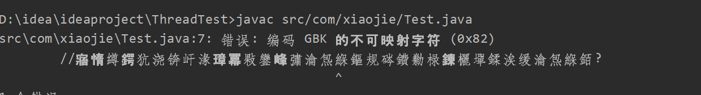

# java源码的运行原理

 

 

##### 1. java源程序经过编译后后得到 字节码.class文件

字节码文件与平台无关，由此实现了java语言著名的 ‘一次编写，处处运行’ 的特点。

我们可以使用JDK内自带的  javac.exe根据手动编译java源代码。

```java
package com.xiaojie;

public class Test {
    volatile private static Test test;
    Test(){ }
    public static Test MyTest(){
        //延迟加载，在调用获取实例方法的时候才创建实例。
        if(test == null){
            synchronized (Test.class) {
                test = new Test();
            }
        }
        return test;
    }
}
```

使用时注意带上 -encoding UTF-8 参数，否则会出现错误。出现这个错误的原因是由于 javac.exe这个命令，会自动优先获取操作系统的

`file.encoding` 参数，而国内的电脑一般的值都是 GBK，按照GBK编码转化为unicode编码。如果这个时候你的源程序的编码不是GBK编码就会出现这个错误。正确的命令：

```
> javac -encoding UTF-8 src/com/xiaojie/Test.java
```

 

###### class文件是什么

Java字节码类文件（.class）是Java编译器编译Java源文件（.java）产生的“目标文件”。它是一种8位字节的二进制流文件， 各个数据项按顺序紧密的从前向后排列， 相邻的项之间没有间隙， 这样可以使得class文件非常紧凑， 体积轻巧， 可以被JVM快速的加载至内存， 并且占据较少的内存空间（方便于网络的传输）。数据之间没有空隙，这也就意味着文件中的信息有固定的位置固定的长度。

###### class文件中的各项数据

1. magic
   在class文件开头的四个字节， 存放着class文件的魔数， 这个魔数是class文件的标志，他是一个固定的值： 0XCAFEBABE 。 也就是说他是判断一个文件是不是class格式的文件的标准， 如果开头四个字节不是0XCAFEBABE， 那么就说明它不是class文件， 不能被JVM识别
2. 

###### 可以用javap.exe工具对 .class文件进行反编译

```cmd
javap [-option] file
```

```
//option的选项
-help 帮助
-l 输出行和变量的表
-public 只输出public方法和域
-protected 只输出public和protected类和成员
-package 只输出包，public和protected类和成员，这是默认的
-p -private 输出所有类和成员
-s 输出内部类型签名
-c 输出分解后的代码，例如，类中每一个方法内，包含java字节码的指令，
-verbose 输出栈大小，方法参数的个数
-constants 输出静态final常量
```

##### 2. 通过JVM的解释器将字节码文件生成可执行文件运行

对JVM的详细学习记录[[JVM]]