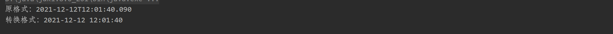

## java知识补足


### java的泛型

泛型自jdk5出现，是java中非常重要特性，java中许多重要的类都有泛型的使用（List接口，Map接口....）。泛型的出现主要是为了解决使用 java多态传递对象，会使对象的类型丢失，常常会出现`java.lang.ClassCastException`异常的情况。

###### 什么是泛型

**泛型，即“参数化类型”。一提到参数，最熟悉的就是定义方法时有形参，然后调用此方法时传递实参。那么参数化类型怎么理解呢？顾名思义，就是将类型由原来的具体的类型参数化，类似于方法中的变量参数，此时类型也定义成参数形式（可以称之为类型形参），然后在使用/调用时传入具体的类型（类型实参）。**

##### 泛型的使用

具体使用时可以分为泛型类，泛型接口和泛型方法。

```java
package com.xiaojie.genericstest;

public class GenericsObject<T> {
    private T t;
    //泛型方法的定义
    public <S, M> S generics(S s, M m){
        return s;
    }
}
```

###### 静态方法不能泛型


#### 类型擦除（erasure)

[jdk5开发者对于jdk使用泛型擦除的解释](http://gafter.blogspot.com/2004/09/puzzling-through-erasure-answer.html) 

java的泛型与c++的模板(泛型)在语法上十分相似，这是由于java的泛型就是从c++中得到的灵感，但是在实现上且有区别。java的泛型也常常称为伪泛型。

##### java如何实现泛型

java在编译阶段期间，会将使用泛型过程中传入的**参数类型**全部消除。

```java
public class GenericsMain {
    public static void main(String[] args) {
        GenericsObject<String> genericsObject1 = new GenericsObject<>();
        GenericsObject<Integer> genericsObject2 = new GenericsObject<>();
        System.out.println(genericsObject1.equals(genericsObject2)); // 结果是true
    }
}
```

编译后，`GenericsObject` 类只会生成一个 .class文件。这也意味着`GenericsObject<String>` 和`GenericsObject<Integer>`这两者在进入运行时间后他们的**类实例**是同一个。

通过查看`GenericsObject` 类生成的字节码文件中关于`generics`方法的部分：


 在字节码文件中 应该待定的参数类型会被转化成 Object基类，在运行时再进行强转。java中重要的泛型可以看成是一种语法糖。

###### 但在编译期间会尽可能的保证语法的正确性

 

像这样错误使用泛型类型的代码不管是在IDE中还是强行进行编译都会报错。

###### 在运行阶段实现往 List\<integer\>中加入 String类型

[麻了，好多问题不会解决](https://www.cnblogs.com/wuqinglong/p/9456193.html) 

在编译时尝试这样的操作，java会拒绝编译。但是在运行时可以通过反射做到。但是会有和多问题出现，这里不应该使用。

```java
public class GenericsMain {
    public static void main(String[] args) throws NoSuchMethodException, InvocationTargetException, IllegalAccessException {
        List<Integer> integerList = new ArrayList<>();
        integerList.add(1);
        integerList.getClass().getMethod("add", Object.class).invoke(integerList, "asd");
        for (int i = 0; i < integerList.size(); i++) {
            System.out.println(integerList.get(i));
            //System.out.println(integerList.get(i).getClass());会报错的问题；
           
        }
    }
}
```

 

##### c++如何实现泛型

#### 在泛型类的静态方法问题

##### 泛型类中的静态方法不能使用 泛型类声明的泛型类型

由于静态方法需要在类加载完成后就能使用，而这个泛型类型则要在对象实例初始化时才传入，导致错误。

```java
public class GenericsObject<T> {
    private T t;
    static public <S, M> S generics(S s, M m){
        return s;
    }
    //这个方法会编译不通过
    static public void test(T s) {
        return;
    }
}
```

##### 注意泛型类中 静态的泛型方法使用方法自己的泛型类型没有问题

因为这样的方法使用的泛型类型在使用时传入即可（没有对象实例初始化也能在调用方法时传入）

```java
public class GenericsObject<T> {
    private T t;
    
    //该方法不会报错。
    static public <S, M> S generics(S s, M m){
        return s;
    }
    static{
        System.out.println("hahahhahaha");
    }
}
```

#### 泛型的通配符  ？

List\<Object\> 和List\<String\>不具有父子类的关系，所有`List<Object> list = new ArrayList<String>()` 这样的语句是不会通过编的，而且List\<Object\>也不能作为多态的引用类型来指向List\<String\>了。通配符可以提供这样一个引用：

```java
public class GenericsMain {
    public static void main(String[] args) throws NoSuchMethodException, InvocationTargetException, IllegalAccessException {
        List<String> list = new ArrayList<>();
        List<?> ptrList = null;
        ptrList = list;
        list.add("str1");
        for (Object ob: ptrList
             ) {
            System.out.println(ob);
        }
     }
}
```

List<?>通配符不应该被始化，它只需要当作是一个引用，指向任意的List<...>对象即可，常用在函数的形参声明上。或者List\<?\>不应该被初始化，因为java不允许这个引用写数据，只能读数据。

##### 带有限制的通配符

`List<? extends Person>`声明的引用只能指向`Person`类的子类（包括Person类），`List<? super Person>`声明的引用只能指向`Person`类的父类（包括Person）。

```java
public class GenericsMain {
    public static void main(String[] args) throws NoSuchMethodException, InvocationTargetException, IllegalAccessException {
        List<String> stringList = new ArrayList<>();
        List<Integer> integerList = new ArrayList<>();
        List<? super String> listptr = null;
        listptr = stringList;
        //编译不通过，ide报错。
        listptr = integerList;
     }
}
```

### java反射

反射就是把Java类中的各个成分映射成一个个的Java对象。即在运行状态中，对于任意一个类，都能够知道这个类的所以属性和方法；对于任意一个对象，都能调用它的任意一个方法和属性。这种动态获取信息及动态调用对象方法的功能叫Java的反射机制。由此，可以实现在运行可以对类和对象进行更灵活的操作，生成动态代理等等。

##### java借助哪些类 实现了反射

- `Class`  *注意区别于 class关键字* ，用于将一个java类表示成一个实例对象。
- `Method`, 将类中的方法表示为一个实例对象
- `Contructor` 将类的构造函数表示为一个实例对象
- `Field` 将类中的属性表示为实例对象

#### 基本使用

##### 得到Class 类的实例对象方法

```java
public class TestMain {
    public static void main(String[] args) throws ClassNotFoundException {
        TestObject testObject = new TestObject();
        //三种方法获取的java类的对象实例是一样的。
        Class classType1 = testObject.getClass();
        Class classType2 = Class.forName("com.xiaojie.reflectiiontest.TestObject");
        Class classType3 = TestObject.class;
        System.out.println(classType1 == classType2);
        System.out.println(classType1 == classType3);
    }
```

```java
package com.xiaojie.reflectiiontest;
public class TestObject {
    public String str1;
    private String str2;
    public TestObject(){
    }
    public String getStr1() { return str1; }
    public String getStr2() { return str2; }
}
```

- getName()：获得类的完整名字。

##### 通过Class类型实例对象获取类的构造函数

- getConstructors()：获得类的public类型的构造方法。不会去找父类的构造函数，与getMethod()方法区别。
- getConstructor(Class[] parameterTypes)：获得类的特定构造方法，parameterTypes 参数指定构造方法的参数类型。

```java
package com.xiaojie.reflectiiontest;
public class TestObject {
    public String str1;
    private String str2;
    public TestObject(){
    }
    public String getStr1() { return str1; }
    public String getStr2() {
        return str2;
    }
}
```

```java
package com.xiaojie.reflectiiontest;

public class TestSonObject extends TestObject {
    public TestSonObject(){
    }
    private void privateFunc(){ System.out.println("privateFunc"); }
    public void pubFunc(){ System.out.println("pubFunc"); }
}
```

```java
public class TestMain {
    public static void main(String[] args) {
        TestSonObject testObject = new TestSonObject();
        Class classType1 = testObject.getClass();
        Constructor[] constructors = classType1.getConstructors();
        System.out.println(constructors.length);
    }
}
```

- newInstance() 调用构造函数返回一个新构造的对象。

##### 通过Class类型的实例对象获取类的方法

-  getMethods()：获得该类和其父类的public类型的方法。*Object类有9个方法*
- getDeclaredMethods()：获得该类声明的所有方法（包括private类型）。
- getMethod(String name, Class[] parameterTypes)：获得类的特定方法，name参数指定方法的名字，parameterTypes 参数指定方法的参数类型。
- getDeclaredMethod(String name, Class[] parameterTypes)

```java
public class TestMain {
    public static void main(String[] args) {
        TestSonObject testSonObject = new TestSonObject();
        Class classType1 = testSonObject.getClass();
        Method[] methods = classType1.getMethods()；
        System.out.println(methods.length);
        //>> 12; TestSonObject本类 1个public方法 + TestObject父类2个public方法 + Object基类9个public方法
        Method[] methods1 = classType1.getDeclaredMethods();
        System.out.println(methods1.length);
        //>> 2包括自己的一个private方法
    }
}
```


- invoke(Object obj, Object... args) Method对象调用这个方法可以运行这个给Method对象代表的方法

  ```java
  public class TestMain {
      public static void main(String[] args) throws
              IllegalAccessException, InstantiationException, NoSuchMethodException, InvocationTargetException {
          TestSonObject testSonObject = new TestSonObject();
          Class classType1 = testSonObject.getClass();
          Object instance = classType1.newInstance();
          Method method = classType1.getMethod("pubFunc",null);
          method.invoke(instance);
      }
  }
  ```

##### 通过class类型的实例对象获取类的属性

- getFields()：获得该类和父类的public类型的属性。
- getDeclaredFields()：获得类的所有属性。包括private 声明
- getFields(String name)：指定属性的名称
- getDeclaredFields(String name)：

### java的代理

#### 静态代理

静态代理的代理类是有自己手工实现的， 要代理的目标类时固定的。实现案例：

```java
public interface Hello {
    void sayHello();
}
```

被代理的目标类：

```java
public class HelloImp implements Hello {

    @Override
    public void sayHello() {
        System.out.println("imp say hello");
    }
}
```

代理类也要实现 目标类实现的接口：

```java
public class HelloProxyStatic implements Hello{
    private Hello helloImp1 = new HelloImp();
    @Override
    public void sayHello() {
        System.out.println("before... ");
        helloImp1.sayHello();
        System.out.println("after... ");
    }
}
```

最后调用代理类， 实现增强或控制目标类方法的目的

```java
public class Gomain {
    public static void main(String[] args) {
        Hello helloProxy = new HelloProxyStatic();
        helloProxy.sayHello();
    }
}
```

#### 动态代理

静态代理非常简单直观 但是缺点也很明显，不够灵活。jdk动态代理依靠jdk反射机制来创建==代理类的对象==，并动态的指定要代理的==目标对象==。使用到了java反射包 `java.lang.reflect` 中的`InvocationHandler`, `Method` 和`Proxy`三个类。

##### InvocationHandler接口

**必须要实现这个接口， 然后在实现类里的invoke()方法中实现目标类方法的调用与增强**

```java
//InvocationHandler接口中的invoke()方法
public Object invoke(Object proxy, Method method, Object[] args) throws Throwable;
```

该接口内部就一个方法`invoke` *注意与反射机制中method.invoke()方法区分*。有三个参数：

- Object proxy  ; 由jdk创建的代理类对象
- Method method;  目标类中的要执行的方法
- Object[] args;    要执行的方法的参数

##### Method类

通过method.invoke()方法来实现

##### Proxy类 是核心类 用于创建代理对象

```java
public static Object newProxyInstance(ClassLoader loader,
						Class<?>[] interfaces,
                        InvocationHandler h)  throws IllegalArgumentException
```

使用静态方法 `Proxy.newProxyInstance()` 来实现代理对象的创建。三个参数：

- ClassLoader loader；  通过目标类对象来获取的类加载器
- Class<?>[] interfaces;    目标类实现的接口
- InvocationHandler h；  传入创建的InvocationHandler实现类对象。

#### ==**实现步骤**==

1. 创建接口 定义目标要实现的方法  *延用上面的Hello接口*
2. 创建目标类完成接口                      *延用上面的HelloImp类*
3. 创建InvocationHandler接口的实现类，在invoke()方法中完成 ==代理类对目标类方法的调用==与==增强功能==
4. 使用 Proxy静态方法 `Proxy.newProxyInstance()` 创建代理对象，并将类型转化为目标类实现的接口类型。

```java
public class HelloProxyHandler implements InvocationHandler {
    private Object subject;
    HelloProxyHandler(Object hello) {
        this.subject = hello;
    }

    @Override
    public Object invoke(Object proxy, Method method, Object[] args) throws Throwable {
        System.out.println("before....");
        method.invoke(this.subject, args);
        System.out.println("after....");
        return null;
    }
}
```

```java
public class Gomain {
    public static void main(String[] args) {
        Hello helloImp = new HelloImp();
        InvocationHandler handler = new HelloProxyHandler(helloImp);
        Hello hello = (Hello)Proxy.newProxyInstance(helloImp.getClass().getClassLoader(),
                helloImp.getClass().getInterfaces(), handler);
        //hello传递给 InvocationHandler方法中的proxy，sayHello方法传递给method 参数传递给args
        hello.sayHello();
    }
}
```

==其实最后理解的关键就在于 newProxyInstance()创建并返回的代理类对象 是如何在调用sayHello()方法时 调用到InvocationHandler实现类中的invoke()方法的，并将参数信息都传递到==

#### CGlib代理

### 被重写的equals()方法

`equals()` 方法是在 object基类中定义的，其源码非常简单：实际就是把两个对象做 `==` ，比较两个对象的地址是否一样，或者说是否是两个一样的对象。

```java
//JDK8 Object类 定义的equals()方法
public boolean equals(Object obj) {
    return (this == obj);
}
```

#### 需要注意的是许多的java类都重写了 equals()方法，以发挥他真正的作用

##### String 类重写 equals()方法

最常用到的就是 String的equals()方法。由JDK8的源码可以看到，先查看 `anobject`类型，比较长度，最后只要 String类里的`value` 纸一样就可以返回 `true`了。

```java
//JDK8 String类重写的equals()方法
public boolean equals(Object anObject) {
    if (this == anObject) {
        return true;
    }
    if (anObject instanceof String) {
        String anotherString = (String)anObject;
        int n = value.length;
        if (n == anotherString.value.length) {
            char v1[] = value;
            char v2[] = anotherString.value;
            int i = 0;
            while (n-- != 0) {
                if (v1[i] != v2[i])
                    return false;
                i++;
            }
            return true;
        }
    }
    return false;
}
```

### java 中的hashCode()与 equals()方法

hashCode()方法是在Object基类中就定义的 native本地方法，这里有一大段关于这个方法的注释。，注释说明了如下几点：

1. ##### 在同一个JVM进程内，同一个对象多次调用 `hashCode()`方法得到的值是一样的

   在JVM GC操作时，原来的hashcode值被存储在了某个地方，以备再用。对此以Hotspot为例，最直接的实现方式就是在对象的header区域中划分出来一部分（32位机器上是占用25位，64位机器上占用31）用来存储hashcode值。但这种方式会添加额外信息到对象中，而在大多数情况下hashCode方法并不会被调用，这就造成空间浪费。

   那么JVM是如何进行优化的呢？当hashCode方法未被调用时，object header中用来存储hashcode的位置为0，只有当hashCode方法（本质上是System#identityHashCode）首次被调用时，才会计算对应的hashcode值，并存储到object header中。当再次被调用时，则直接获取计算好hashcode即可。

   上述实现方式就保证了即使GC发生，对象地址发生了变化，也不影响hashcode的值。比如在GC发生前调用了hashCode方法，hashcode值已经被存储，即使地址变了也没关系；在GC发生后调用hashCode方法更是如此。

2. ##### 如果两个对象能使用 `equals()`方法返回 `true` ,那么这两个对象的`hashCode()`返回值最好一样。

   [[java高级#java的集合框架 Java Collection Framework#HashMap类]]

   

   因为`hashCode()`和`equals()`函数的返回结果与许多集合类的存取数据的效率或结果有关，两者最好能一起重写。

3. ##### `hashCode()`的生成一般情况下确与对象的内存地址有关，但也有其他因素。

```java
/**
 * Returns a hash code value for the object. This method is
 * supported for the benefit of hash tables such as those provided by
 * {@link java.util.HashMap}.
 * <p>
 * The general contract of {@code hashCode} is:
 * <ul>
 * <li>Whenever it is invoked on the same object more than once during
 *     an execution of a Java application, the {@code hashCode} method
 *     must consistently return the same integer, provided no information
 *     used in {@code equals} comparisons on the object is modified.
 *     This integer need not remain consistent from one execution of an
 *     application to another execution of the same application.
 * <li>If two objects are equal according to the {@code equals(Object)}
 *     method, then calling the {@code hashCode} method on each of
 *     the two objects must produce the same integer result.
 * <li>It is <em>not</em> required that if two objects are unequal
 *     according to the {@link java.lang.Object#equals(java.lang.Object)}
 *     method, then calling the {@code hashCode} method on each of the
 *     two objects must produce distinct integer results.  However, the
 *     programmer should be aware that producing distinct integer results
 *     for unequal objects may improve the performance of hash tables.
 * </ul>
 * <p>
 * @return  a hash code value for this object.
 * @see     java.lang.Object#equals(java.lang.Object)
 * @see     java.lang.System#identityHashCode
 */
public native int hashCode();
```

### java的集合框架 Java Collection Framework

 

其中最重要的其实就是4个接口：Collection ，List ，Set ，和Map ， 其中List和Set是继承自Collection，而Map则自成一脉。这些接口都在`java.util.*`路径下的，都属于java的基础类库**rt.jar**。  

需要区分的是 `java.util.Collectins` 这是个**工具类**, 不属于 Collection集合框架，它包含有一些专门操作集合的静态方法。

##### Collection接口的遍历方法

由于 `Collection`接口时继承自一个 `Iterable`接口，所以所有 `Collection`派生的类型 都有一个 `iterator()` 方法可以迭代遍历。 

```java
// iterator方式
Collection collection = new HashSet();
//...add elements to the Collection 
Iterator iterator = collection.iterator();
while(iterator.hasNext()){
    Object object = iterator.next();
    //do something to object;    
}
// for-loop方式
Collection collection = new HashSet();
//... add elements to the collection
for(Object object : collection) {
  //do something to object;
}
```

#### List接口学习

List是有序的Collection，使用此接口能够精确的控制每个元素插入的位置。用户能够使用索引（元素在List中的位置，类似于数组下标）来访问List中的元素，这类似于Java的数组，当然也和数组一样允许存在同样的元素。`List`接口除了 `iterator()`方法外，还有一个`ListIterator()`迭代器类，这里不在详述。

##### ArrayList类

**ArrayList**实现了可变大小的数组（动态数组），它允许所有元素，包括null，存放是，且对象可以重复。其内部方法：`size`，`isEmpty`，`get`，`set` 方法 ，添加n个元素需要O(n)的时间。

##### LinkedList类

LinkedList实现了List接口，允许null元素，它以链表的形式存放对象，这样就克服了ArrayList的插入、删除的不便，但查询效率不如ArrayList高。此外LinkedList提供额外的addFirst(), addLast(), getFirst(), getLast(), removeFirst() 和 removeLast()等方法在 LinkedList的首部或尾部。这些操作使LinkedList可被用作堆栈（stack），队列（queue）或双向队列（deque）。

注意：*ArrayList和 LinkedList 都是非线性安全的 ，但是也可以在创建的时候创建一个同步的List `List list = Collections.synchronizedList(new LinkedList(...))`* .

##### Vector

`Vector`与`ArrayList` 非常类似，但他是线程安全的。具体暂不了解

##### Stack 类

`Stack` 继承于`Vector`类 ，实现了一个先进后出的栈结构。

#### Set接口

`Set` 接口不允许有重复元素，不按顺序存放数据，元素在 Set中的位置由元素的hashCode()的值决定

##### HashSet类

`HashSet` 类采用哈希算法来存取 查找元素，具有很好的性能。由于采用这种算法，所以应该覆盖Object类中的equals()方法和hashCode()方法，否则可能会使`HashSet`无法正常工作。 HashSet的实现其实非常简单，它只是封装了一个HashMap对象来存储所有的集合元素。所有放入HashSet中的集合元素实际上由HashMap的key来保存，而HashMap的value则存储了一个PRESENT，它是一个静态的Object对象。
HashSet的绝大部分方法都是通过调用HashMap的方法来实现的，因此HashSet和HashMap两个集合在实现本质上是相同的。

注意：由于HashSet的add()方法添加集合元素实际上转变为调用HashMap的put()方法来添加key-value对，当新放入HashMap的Entry中key与集合中原有Entry的key相同（hashCode()返回值相等，通过equals比较也返回true）时，新添加的Entry的value将覆盖原来Entry的value，但key不会有任何改变。因此，如果向HashSet中添加一个已经存在的元素，新添加的集合元素（底层由HashMap的key保存）不会覆盖已有的集合元素。

#### Map接口

请注意，Map没有继承Collection接口，Map提供key到value的映射。一个Map中不能包含相同的key，每个key只能映射一个 value。Map接口提供3种集合的视图，Map的内容可以被当作一组key集合，一组value集合，或者一组key-value映射。

##### HashMap类

`HashMap` 类采用键值对的方式来进行存取数据，如下所示：通过 `put(key,value)`方法来存入数据。且`HashMap`允许存入的 key value的值为 `null` .

```java
HashMap<String , Double> map = new HashMap<String , Double>();   
map.put("语文" , 80.0);   
map.put("数学" , 89.0);   
map.put("英语" , 78.2);   
```

该类正是使用大名鼎鼎的 哈希算法来决定元素存储位置的，*HashSet也是使用的这种算法。* `HashMap`内部存储的结构其实就是数组，便于进行查找。

###### put 方法

在`HashMap`类中，由key的`hashCode()`值来决定键值对的存放位置，与value的值是无关的。下面了解 `HashMap` 存值的过程：[[哈希算法记录#java代码中的哈希#HashMap 类如何用哈希存取数据]]


###### 方法

#####  HashTable类

`HashTable`和`HashMap`两个类比较相似。但是有如下的几点区别：

- `HashTable`是线程安全的，因此它的性能要比 `HashMap` 差一点。
- `HashTable` 的key和value都不允许是 `null`
- 对 hash值的处理不一样，`HashTable` 直接将 key的hashCode()的值拿来用。`HashMap` 会将key的HashCode()的值用hash()函数再处理一遍。
- 初始容量和每次扩容的大小不一样。`HashTable`初始大小为 11，扩容后是 2n+1 。`HashMap`初始大小是 16，每次扩容就是 2n。
- 可以调用的方法有区别。


### Java的序列化与反序列化

java.io.ObjectOutputStream对象输出流 ，java.io.ObjectInputStream对象输入流。

- 只有实现了 Serializable或Externalizable接口的类的对象才能被序列化，否则抛出异常。 如果一个对象内引用了其他对象，那么这个被引用的对象类要实现 Serializable或Externalizable接口
- 序列话的内容时属于这个对象独有的属性，不包括方法，静态属性等。
- 使用`transient`可以使的一些属性不被序列化
- 

### java I/O流
[[java高级#ImageIO类 javax imageio ImageIO]]
流就是内存与存储设备之间传输数据的通道。下面是java io流的简单分类图。io流的包是 `java.io.*`  在JDK的 rt.jar报下。


#### File类

java 对流的操作也是对文件的操作，先从 `java.io.File` 这个类开始。这个类提供许多对于文件的操作，几个重要的方法包括：1.按路径新建文件；2. 获得文件名； 3.获得文件的父路径；

```java
public class IO_FileTest {
    //新建File类的时候把文件名连带路径传入
    File f = new File("C:\\Users\\xiao-jie\\Desktop\\filetest.txt");
    public void fileTest(){
        try{
            f.mkdir();
            //如果路径合法且文件不存在，会创建该文件
            f.createNewFile();
            //在win下，会返回文件所在磁盘的大小，单位是bytes
            System.out.println(f.getTotalSpace()/1024/1024/1024);
            //得到父目录的路径。返回类型是String
            System.out.println(f.getParent());
        }catch (IOException e){
            e.printStackTrace();
        }
    }
}
```

#### 字节流 InputStream和OutputStream抽象类

在`InputStream`和`OutputStream`中的一些方法 :

- read()  ,显然这是在 InputStream中的方法。不传入参数时只读取一个字节并以int类型返回； 传入 `byte[]`类型的参数，读取参数数组长度的字节数，返回实际读取的字节数返回类型为int;  传入三个参数 `byte[]  off  len` 表示将读入的len个字节存入 byte[] 从 off开始的 len个 元素中。
- write() ,   是OutputStream中的方法，参数使用与 read()类似
- available()   ，是InpuStream中的方法 表名还有多少字节可以读取
- markSupported() , 是InputStream类中的方法，返回 Boolen类型 表名是否可以使用 mark() 和reset()方法，在InputStream中直接返回false，如果他的子类不重写，那就是不可用。
- mark()  ,  是InputStream类中的方法，设置输入流指针的当前位置
- skip(Long n),    输入流中的方法，让输入流中的指针调过 n个字节
- reset() ,    输入流中的方法，重置输入流中指针的位置，即回到开头。
- flush(),   输出流的方法，  在OutputStream这个类里面没有任何操作。只有两个自带缓冲区的类有具体实现意义。

##### 对文件的处理 FileInputStream/FileOutputStream

这两个类分别继承了 InputStream和OutputStream类，然而他们的许多方法（如 read() write()  available() )都是单独实现的，没有沿用他们父类的方法）。

###### 一般的将文件数据读入java变量的代码展示

```java
public class FileInputStreamTest {
    File f = new File("C:\\Users\\xiao-jie\\Desktop\\test.txt");
    public void fileInputStreamTest(){
        //f.length返回的类型是Long，强转成int
        byte[] filecontent = new byte[(int) f.length()];
        try{
            //新建 FileInputStream以 File类的对象为参数; 可能会抛出FileNotFoundException
            InputStream inputStream = new FileInputStream(f);
            //读取 文件内容进入 byte[]类型
            inputStream.read(filecontent);
            //关闭 输入流
            inputStream.close();
        }catch(FileNotFoundException e){
            e.printStackTrace();
        } catch (IOException e) {
            e.printStackTrace();
        }
        String[] strs = new String(filecontent).split("\n|\t| ");
        for (String st: strs
             ) {
            System.out.println("==>"+st);
        }
    }
}
```

如果出现，无法确定文件大小的情况，可以采用循环读取的方法。

```java
byte[] temp = new byte[1024];
byte[] total = new byte[100000];
try{
    InputStream inputStream = new FileInputStream(f);
    int templen;
    int totallen = 0;
    do{
        templen = inputStream.read(temp);
        System.arraycopy(temp, 0, total, totallen, templen);
        totallen = totallen + templen;
        System.out.println( totallen);
    }while (templen == 1024);
}catch(FileNotFoundException e){
    e.printStackTrace();
} catch (IOException e) {
    e.printStackTrace();
}finally {
    System.out.println(new String(total));
}
```

######  FileOutputStream类的使用基本一致，是使用byte[]数组来将字节存入指定的文件。

###### 读取并复制一张本地照片

```java
public class FileInputStreamTest {
    File f = new File("C:\\Users\\xiao-jie\\Desktop\\test.gif");
    File newf = new File("C:\\Users\\xiao-jie\\Desktop\\test2.gif");
    public void fileInputStreamTest() {
        byte[] imgbyte = new byte[(int) f.length()];
        try{
            InputStream fileInputStream = new FileInputStream(f);
            OutputStream fileOutputStream = new FileOutputStream(newf);
            fileInputStream.read(imgbyte);
            fileOutputStream.write(imgbyte);
        }catch (IOException e){
            e.printStackTrace();
        }
    }
}
```

##### ObjectInputStream和ObjectOutputStream 用来序列化和反序列化
[[java高级#Java的序列化与反序列化]]

对象的序列化就是把对象转化为字节序列可以保存在硬盘上，而反序列化就是把字节序列转化为对象。这样可以实现两个JVM进程之间的通信了，也可以实现对象的持久化。

```java
public class ObjectOutputStreamTest {
    File f = new File("C:\\Users\\xiao-jie\\Desktop\\test.txt");
    public void objectOutputStreamTest(){
        try {
            InputStream in = new FileInputStream(f);
            OutputStream out = new FileOutputStream(f);
            //创建一个ObjectOutputStream对象需要传入一个 OutputStream参数
            ObjectOutputStream objectOutputStream = new ObjectOutputStream(out);
            //被序列化的对象必须是实现了 Serializablez这个接口。
            ObjectImpSerializable objectImpSerializable0 =
                    new ObjectImpSerializable("pri", "pub");
            objectOutputStream.writeObject(objectImpSerializable0);
            objectOutputStream.close();
            ObjectInputStream objectInputStream = new ObjectInputStream(in);
            Object objectImpSerializable = objectInputStream.readObject();
            //最后显然这两个对象的 hashCode()的值是不一样的
            System.out.println(objectImpSerializable0.hashCode());
            System.out.println(objectImpSerializable.hashCode());
        }catch (IOException | ClassNotFoundException e) {
            e.printStackTrace();
        }
    }
}
//测试类
public class ObjectImpSerializable implements Serializable {
    private String privateStr;
    public String publicStr;
}
```

##### DataInputStream和DataOutputStream  与上面的对象序列化类似，但它只针对基本类型或String类型

```java
public class DataStreamTest {
    String msg = "给岁月以文明，而不是给文明以岁月。";
    byte[] bytes = new byte[100];
    ByteArrayOutputStream out = new ByteArrayOutputStream();
    ByteArrayInputStream in = new ByteArrayInputStream(bytes);
    public void dataStreamTest(){
        DataInputStream dataIn = new DataInputStream(in);
        DataOutputStream dataOut = new DataOutputStream(out);
        String str1 = "dataTest1";
        String str2 = "dataTest2";
        try {
            dataOut.writeUTF(str1);
            dataOut.writeUTF(str2);
            System.out.println(out.toString());
        } catch (IOException e) {
            e.printStackTrace();
        }
    }
}
```

##### ByteArrayInputStream和ByteArrayOutputStream 用一个字节数组作为io流操作的目的地

简单来说，FileInputStream类是针对文件进行输入输出流操作，但并不是所有的IO操作都针对文件进行。java.io.ByteArrayInputStream、java.io.ByteArrayOutputStream就是将内存中的一个字节数组作为 io流操作的目的地。

```java
public class ByteArrayStreamTest {
    //以这个 byte[]数组作为 输入流的来源，输出流的目的；
    String msg = "无知不是生存的障碍，傲慢才是。";
    byte[] bytes = msg.getBytes();
    //参数处理一个byte[],还可以指定 offset和 length，只读取  offset到 offset+length位置的字节。
    ByteArrayInputStream byteArrayInputStream = new ByteArrayInputStream(bytes);
    //创建一个ByteArrayOutputStream 传入大小参数，默认是32kb
    ByteArrayOutputStream byteArrayOutputStream = new ByteArrayOutputStream(20);
    public void byteArrayStreamTest(){
        System.out.println(byteArrayInputStream.available());
        byte[] readin = new byte[100];
        try{
            byteArrayInputStream.read(readin);
            System.out.println(new String(readin));
            //write 方法将byte[]数组写入这个输出流缓冲区，
            byteArrayOutputStream.write(readin);
            //writeto()方法将输出流内的内容写出到out
            //byteArrayOutputStream.writeTo(OutputStream);
            //ByteArrayOutputStream输出流 toString()被重写为，返回流内数据。
            System.out.println(byteArrayOutputStream.toString());
        } catch (IOException e) {
            e.printStackTrace();
        }
    }
}
```

ByteArrayInputStream支持使用mark()和reset()方法；

```java
//JDK8   ByteArrayInputStream类源码。其中pos就是输入流中指针位置;
//mark()方法，将mark标记设置为pos位置，mark的初始值是 offset或0 ;在这个类的mark方法中参数无意义
public void mark(int readAheadLimit) {
    mark = pos;
}
//reset() 方法是将 pos设置为mark的值。
public synchronized void reset() {
        pos = mark;
    }
```

##### BufferInputStream和BufferOutputStream 内置了一个缓冲字节数组

使用缓冲区可以防止每次读取或写入数据时 直接使用io操作，而是使用缓冲区，当缓冲区满了以后或执行 `flush()`/`close()`方法后再一次性执行io操作写入内存，提高效率。主要与`FileInputStream`类比较。

查看这两个类的源码可以发现他们都有一个内置的字节数组作为缓冲区，再调用构造函数时可以传入一个size来指定它的大小，默认是8192 \= 8kb；利用缓冲区提升io效率的关键在于，从内存获取数据比 从硬盘上调用IO获取要快的多，而FileStream又是阻塞的，比如操作的文件很大，且需要对文件内容进行一些耗时操作时，使用 `BufferInputStream`一次性读入大量数据进入内存，程序直接从内存取数据进行耗时处理。且容易发现，BufferStream类内置的缓冲区大小尽可能的大于 外置保存数据字节数组的大小。

```java
public class BufferStreamTest {
    File f = new File("C:\\Users\\xiao-jie\\Desktop\\test.gif");
    File newf = new File("C:\\Users\\xiao-jie\\Desktop\\test2.gif");
    int buffer_size = 1024;
    byte[] buffers = new byte[buffer_size];
    int copysize;
    public void bufferSteamTest(){
        try{
            InputStream in = new FileInputStream(f);
            OutputStream out = new FileOutputStream(newf);
            //构造函数可以指定类内置的缓冲区大小
            BufferedInputStream bufferin = new BufferedInputStream(in,1024*1024);
            BufferedOutputStream bufferout = new BufferedOutputStream(out,1024*1024);
            while ((copysize = bufferin.read(buffers)) > 0){
                bufferout.write(buffers,0,copysize);
            }
            bufferin.close();
            bufferout.close();
        } catch (FileNotFoundException e) {
            e.printStackTrace();
        } catch (IOException e) {
            e.printStackTrace();
        }
    }
}
```

######  关于BufferOutputStream中的flush()方法

再 BufferOutputStream类中，当缓冲区满了会自动执行IO，当调用flush时也会将未满的缓冲区写出。另外，close()函数内也调用了一次`flushBuffer()`函数。

```java
//JDK8 BufferOutputStream 关于flush方法的源码
public synchronized void flush() throws IOException {
    flushBuffer();
    out.flush();
}
private void flushBuffer() throws IOException {
    if (count > 0) {
        out.write(buf, 0, count);
        count = 0;
    }
}
```

##### PipedOutputStream和PipedInputStream 管道输入输出流 用于线程之间的通信。

##### PrintStream类 关于 `System.out.println()`语句的实现

#### 字符流 Reader和Writer 抽象类


### java中的引用


### java类型

###### 对于封箱特性的数组类型之间转换

jdk5开始有封箱特性，*注意int[]数组 和 Integer[]数组 类型不能直接互相转换*，可以用如下的代码实现转换。

```java
Integer[] nums = {1,2,3,5,3};
int[] ints = Arrays.stream(nums).mapToInt(Integer::intValue).toArray();
Integer[] integers = Arrays.stream(ints).boxed().toArray((Integer[]::new));
```

###### 数组变list，list变数组

注意这里的aslist()发返回的实现类型是ArrayList

```java
Integer[] nums = {1,2,3,4,5};
List<Integer> list = Arrays.asList(nums);
System.out.println(list.getClass());
```

```java
List<Integer> integerList = new ArrayList();
integerList.add(1);
Integer[] integers = new Integer[integerList.size()];
integerList.toArray(integers);
```


### java中的正则表达式

java中处理正则表达式是通过`java.util.regex.*` (主要是Pattern和matcher类).

#### Pattern类

Pattern类用于创建一个正则表达式,也可以说创建一个匹配模式,它的构造方法是私有的,不可以直接创建,但可以通过`Pattern.complie(String regex)`简单工厂方法创建一个正则表达式, Java代码示例: 

```java
Pattern pattern =Pattern.compile("^(?=.*?[A-Z])(?=.*?[a-z])(?=.*?[0-9])(?=.*?[#?!@$%^&*\\-]).{8,}$");
System.out.println(pattern.pattern());
//^(?=.*?[A-Z])(?=.*?[a-z])(?=.*?[0-9])(?=.*?[#?!@$%^&*\\-]).{8,}$
```

###### pattern.pattern()方法

pattern() 返回正则表达式的字符串形式,其实就是返回Pattern.complile(String regex)的regex参数

###### pattern.slipt(String str)

用于分割传入的得到字符串str,分割规则就是pattern的正则表达式,java代码.

```java
Pattern pattern =Pattern.compile("\\d+");
String[] res = pattern.split("feizzer2heihei22");
for(int i=0; i<res.length;i++) {
    System.out.println(res[i]);
}
//feizzer
//heihei
```

###### pattern.matcher(CharSequence str)

matcher()方法传入一个字符串.返回一个Matcher类的对象,可以查看传入的字符串是否匹配该正则表达式. *CharSequence 是一个接口String类是他的实现类之一*.

```java
Pattern pattern =Pattern.compile("\\d+");
String str = "1111";
Matcher m = pattern.matcher(str);
System.out.println(m.matches());
```

###### Pattern.matches(String regex, String str)

Pattern类的一个静态方法,传入一个正则表达式字符串,一个带校验的字符串,直接返回Boolean对象. 其实在静态方法内部还是创建了一个Pattern对象.算是一种编写代码简化的解决方法.

```java
//该方法的源码
public static boolean matches(String regex, CharSequence input) {
    Pattern p = Pattern.compile(regex);
    Matcher m = p.matcher(input);
    return m.matches();
}
```

#### Matcher类

###### mattern.matches()

要求被校验整条字符串通过正则表达式的校验,返回true 否则返回false.

###### mattern.lookingAt()

lookingAt()对前面的字符串进行匹配,只有匹配到的字符串在最前面才返回true 

###### mattern.find()

find()对字符串进行匹配,匹配到的字符串可以在任何位置. 

##### Mathcer.start()/ Matcher.end()/ Matcher.group()

当使用matches(),lookingAt(),find()执行匹配操作后,就可以利用以上三个方法得到更详细的信息. 
start()返回匹配到的子字符串在字符串中的索引位置. 
end()返回匹配到的子字符串的最后一个字符在字符串中的索引位置. 
group()返回匹配到的子字符串 


### Java中的日期处理   ==以jdk8更新的为主==

##### JDK8以前

对于日期时间的操作常用的类 `java.utils.Date` ,日期的加减时间计算时常用 `java.Utils.Calendar`.   日期转化时常用`java.text.DataFormat/SimpleDateFormat` 

**缺点：** 这些有关的时间日期操作对象，都是可变的、线程不安全的，代码繁琐，性能低。

#### JDK8推荐的日期处理方式  `java.time.*`中提供的类

##### LocalDate LocalTime LocalDateTime三个类

- LocalDate 只表示日期(年月日),不表示时间(时分秒) 不包含时区信息
- LocalTime  只表示时间,不表示日期  不包含时区信息
- LocalDateTime  表示日期和时间  不包含时区信息

###### 创建日期的方法

```java
//获取当前时区的额当前时间
LocalDateTime dateTimeNow = LocalDateTime.now();
LocalDate dateNow = LocalDate.now();
LocalTime timeNow = LocalTime.now();
System.out.println(dateTimeNow + "  " + dateNow + "  " + timeNow);
//指定日期或时间
LocalDateTime dateTimeSpec = LocalDateTime.of(2021, 1, 1, 12, 0, 1);
LocalDate dateSpec = LocalDate.of(2021, 1,1);
LocalTime timeSpec = LocalTime.of(12, 0, 1);
System.out.println(dateTimeSpec+"  "+dateSpec+"  "+timeSpec);
```


###### ==注意JDK8中对时区的管理==

尽管刚刚说到 LocalTime LocalDate LocalDateTime三个类是没有时区信息的,只保存所谓的时间信息.但是在now()方法自动生成当前时间的时候,会默认获取当前系统的时区来设置时间.

 *可以传入一个ZoneId信息来设置时区, LocalTime time = LocalTime.now(ZoneId.of("Asia/Shanghai"))* 

可以在`java.time.ZoneId`类的源码注释中查看更多地区时区相关的设置

```java
* <ul>
* <li>EST - -05:00</li>
* <li>HST - -10:00</li>
* <li>MST - -07:00</li>
* <li>ACT - Australia/Darwin</li>
* <li>AET - Australia/Sydney</li>
* <li>AGT - America/Argentina/Buenos_Aires</li>
* <li>ART - Africa/Cairo</li>
* <li>AST - America/Anchorage</li>
* <li>BET - America/Sao_Paulo</li>
* <li>BST - Asia/Dhaka</li>
* <li>CAT - Africa/Harare</li>
* <li>CNT - America/St_Johns</li>
* <li>CST - America/Chicago</li>
* <li>CTT - Asia/Shanghai</li>
* <li>EAT - Africa/Addis_Ababa</li>
* <li>ECT - Europe/Paris</li>
* <li>IET - America/Indiana/Indianapolis</li>
* <li>IST - Asia/Kolkata</li>
* <li>JST - Asia/Tokyo</li>
* <li>MIT - Pacific/Apia</li>
* <li>NET - Asia/Yerevan</li>
* <li>NST - Pacific/Auckland</li>
* <li>PLT - Asia/Karachi</li>
* <li>PNT - America/Phoenix</li>
* <li>PRT - America/Puerto_Rico</li>
* <li>PST - America/Los_Angeles</li>
* <li>SST - Pacific/Guadalcanal</li>
* <li>VST - Asia/Ho_Chi_Minh</li>
* </ul>
```


###### 日期的加减操作 以LocalDateTime为例

JDK8给新的日期类提供了丰富的API去操作加减运算:

 

这里传入的参数都是Long类型,还可以传入负数实现减日期的操作

```java
LocalDateTime dateTime = LocalDateTime.now();
System.out.println(dateTime.plusDays(-1L));
```

`dateTime.plusDays(1, ChronoUnit.MONTHS) `这个方法有两个参数,一个相加的数量,一个数相加的单位

###### 获取日期中的年月日时分秒 还有星期

 

大部分方法返回的都是数值基本类型 ,除开 `getDayOfWeek()`和`getMonth()` 方法,他们因为是星期和月份又更多的延伸含义,所以是Enum枚举类型,直接打印得到的是类似SATURDAY这样的描述,也可以调用getValue()得到相应的数值类型.

```java
LocalDateTime dateTime = LocalDateTime.now();
System.out.println("今天是" + dateTime);

int dayOfYear = dateTime.getDayOfYear();
System.out.println("今天是今年的第[" + dayOfYear + "]天");

DayOfWeek dayOfWeek = dateTime.getDayOfWeek();
System.out.println("今天是" + dayOfWeek + "，也是一周中的第" + dayOfWeek.getValue() + "天");
```


##### 其他的日期操作

###### 计算两个日期之间相隔多久 `java.time.Period` `java.time.Duration`

```java
//Period
LocalDate date1 = LocalDate.of(2020, 11, 30);
LocalDate date2 = LocalDate.of(2021, 12, 30);
Period period = Period.between(date1, date2);
System.out.println("date2与date1相差" + period.getYears() + "年, "
                        + period.getMonths() + "个月，" + period.getDays() + "天，");
//Duration  
LocalDateTime localDateTime1 = LocalDateTime.of(2021, 12,1,0,1,10);
LocalDateTime localDateTime2 = LocalDateTime.of(2021, 12, 2, 23,59,10);
Duration duration = Duration.between(localDateTime1, localDateTime2);
System.out.println("time2与time1相差" + duration.toDays() + "天， " + duration.toHours() + "小时，"
        + duration.toMinutes() + "分钟，" + duration.getSeconds() + "秒");
```


- Period对象的`getDays()`方法只会计算月份中 日子号数的差，并不会叠加。`getMonths()`同理。 且Period.between()只接受LocalDate类型的参数。

- 调用Duration对象的方法获取相差时间时，是会叠加的。并且它的between()方法传入的参数为`Temporal`,根据多态性质可以传入跟多样的对象类型（包括`LocalDate` `LocalTime` `LocalDateTime`） 

###### 改变日期格式 `java.time.format.DateTimeFormatter`

```java
DateTimeFormatter dateTimeFormatter1 = DateTimeFormatter.ofPattern("yyyy-MM-dd HH:mm:ss");
LocalDateTime localDateTime = LocalDateTime.now();
String time_to_str1 = dateTimeFormatter1.format(localDateTime);
System.out.println("原格式："+ localDateTime+ "   \n转换格式：" +time_to_str1);
```



也可以用`DateTimeFormatter`类将符合的字符串转换成时间对象。

```java
LocalDateTime str_to_time = LocalDateTime.parse("2021-12-12 12:44:16" ,dateTimeFormatter1);
System.out.println("字符串转时间对象"+str_to_time);
```

##### java中的统一时间戳 

###### `java.time.Instant`
[[UTC时间和GMT时间]]

java的时间戳基于UTC（世界协调时间，是格林威治的当地时间，或者说格林威治是零时区）。

```java
LocalDateTime localDateTime = LocalDateTime.now();
System.out.println("北京时间" + localDateTime.now());
System.out.println("格林威治时间： "+localDateTime.toInstant(ZoneOffset.ofHours(8)));
System.out.println("格林威治时间： "+Instant.now());
```


可以直接通过`Instant.now()`方法获得当前的时间戳(格林威治当地时间).也可以用`LocalDatetime`对象调用`toInstant()`方法来获取，前面说过 `LocalDateTime`是不包括时区信息的，所以在转换时要带上时区偏移量作为参数，`ZoneOffset.ofHours(8)`就表明这个是东八区的时间。

##### 字符串如何转化为LocalDateTime

###### 使用 `DateTimeFormatter` 类配置字符串格式

```java
String time = "2021-03-20 20:12:13";
DateTimeFormatter dateTimeFormatter = DateTimeFormatter.ofPattern("yyyy-MM-dd HH:mm:ss");
LocalDateTime parse = LocalDateTime.parse(time, dateTimeFormatter);
System.out.println(parse);
```

###### 也可以用于将 LocalDateTime 转化为适合的String

```java
String formatter_time = dateTimeFormatter.format(parse);
```

##### LocalDateTime对象如何得到时间戳

```java
//从LocalDateTime对象获取 Instant对象
Instant instant = LocalDateTime.now().toInstant(ZoneOffset.ofHours(8));
//Instant对象.toEpochMilli() 获取 Long类型的时间戳  指的是UTC时间经历的毫秒数
// 也可以 getEpochSecond() 获取秒数
long epochMilli = instant.toEpochMilli();
Timestamp timestamp = new Timestamp(epochMilli);
System.out.println(timestamp);
```

### java中的接口和抽象类

接口和抽象类都不可以被实例化， 都处于类结构的顶层，用于给其他类继承或实现。他们内部的抽象方法都是被 **abstract** 修饰的。被 **abstract**修饰的方法不能被 **static**和 **synchronized**修饰， 且必然是**public**或**protected**的。*由于抽象方法需要在子类中被实现，自然不能用static。* 

#### 抽象类 abstract

- 不能被实例化 可以被继承
- 抽象类中可以有已经被实现的正常的方法
- 抽象类中被abstract修饰的抽象方法 必须被 **protected**或 **public** 修饰。*因为抽象类必须要被子类继承，抽象方法也要由子类实现， 抽象方法必须要被子类访问到*
- 子类继承一个抽象类，必须实现抽象类中所有的抽象方法，否则子类也要声明为abstract
- 抽象类中可以有属性 方法 和 构造方法。构造方法不能用于实例化，可以被子类调用。

#### 接口 Interface

- 不能实例化， 可以被实现
- 接口内部可以有属性和方法
  - 属性必然被 **public static final**修饰，定时必须赋值， 不可修改。
  - 抽象方法必然被 **abstract public** 修饰
- JDK8中允许用 **static**修饰一个方法并将它实现， 称为 **静态接口方法**， 只能由接口调用。它可以用来实现一些简单的工具类。
- JDK8中允许用 **default**修饰一个方法并将它实现，称为默认方法。必然的这个方法也必须被 **public**修饰。子类可以调用它，可以选择不重写它。 *但是由于一个类可以实现多个接口， 如果实现的两个接口中含有同名的两个默认函数，那么这个实现类必须重写该方法。*
  - 为什么JDK8要在接口中引入这样一个可实现的方法体：设想这样一个接口 List， 他在老版本中已经有了一系列的方法体，并且在编码过程中经常会以它为基础编写很多实现类。但是在新版本中，开发者认为需要添加一个新的（抽象）方法sort() 在List接口中，这时候老版本的项目想要切换到新版本。 项目中实现了该接口的实现类没有实现sort()这个方法， 必然会报错。违背向后兼容的要求。


### java的注解 Annotation

注解是jdk5.0引入的技术。	注解本身不是程序，但是可以对程序做出解释，被其他程序读取。它可以实现：

- 编写文档 通过注解后的信息生成java自动文档。
- 代码分析  通过代码中的注解对代码进行分析， 使用反射实现。
- 编译检查  通过代码中标识的注解 让编译器实现基本的编译检查。

##### JDK中的预设的几个注解

- @Override ：检测被注解标注的方法是否继承自父类
- @Deprecated： 表示被标注的方法不再推荐使用，*依然可以使用*。
- SuppressWarning(value="all")  表示压制警告，  不显示warning

#### 自定义自己的注解

###### 格式  首先添加  元注解  然后定义自己的注解

```java
@元注解
public @interface 注解名{}
```

##### 注解接口的定义

###### 注解的本质

注解其实就是一个接口，并继承了 `java.lang.Annotation`接口。

```java
public interface 注解名 extends java.lang.Annotation{}
```

###### 这个注解接口中可以定义抽象成员方法 *这些抽象方法也可以称为注解的属性*

但是成员方法的返回类型只接受 `基本数据类型` `String` `枚举` `注解` `Class` `以上类型的数组` ，定义了成员方法(属性)在使用注解时就必须要赋值，也可以为属性定义一个默认的值。

```java
public @interface MyAnnotation {
    int value() default 7;
}
```

##### 元注解

是用于描述注解的注解。

- @Target()  表示注解可以作用的范围， 接收一个枚举类型 `java.lang.annotation.ElementType`,几个比较常见的值 。
  - TYPE   可以作用在类 接口 注解接口 枚举类上
  - FIELD   成员变量上
  - METHOD   方法上
- @Retention  表示注解可以保留到什么时候，接收一个枚举 `java.lang.annotation.RetentionPolicy`
  - SOURCE  注解只保留到源文件（.java文件） 
  - CLASS      注解只保留到 编译后的.class文件
  - RUNTIME  JVM加载字节码文件后依然存在， 一般情况下我们自定义注解都是这个值。

##### 演示

