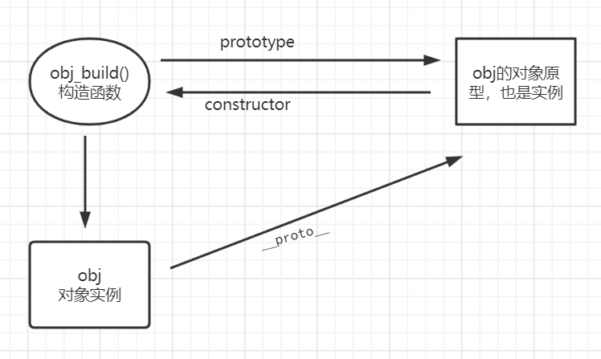

## 补充

#### lambda

基本形式

```js
(参数1,参数2,......,参数n) =>{ 具体函数逻辑 }
```

它表示的是

```js
function(参数1,参数2, .....) {
	具体函数逻辑；
}
```

当参数只有一个，具体函数居于只有一条就可以更省一步

```js
let a => console.log(a);
```

### 类型转换


### 作用域和闭包

javascript的作用域不做多余介绍，需要注意的是在定义一个变量的时候，如果审略let和var该变量自动升级为全局变量。

##### 闭包

```js
let outter = function () {
    var index=1;
}
```

这时我们在函数外部无法获得函数内部，index的值，只有在outter内部再定义一个函数

```js
let outter = function () {
    var index=1;
	let inner = function(){
        return index;
    }
    return innerlet outter = function () {
    var index=1;
    let inner = function () {
        return index;
    }
    return inner;
}

let result = outter();
console.log(result());
>>1
```

这样即可获得outter函数内部的idnex的值。注意这个程序中，outter函数中的index值并没有在调用完outter函数后被回收，这是因为这时，outter的子函数inner被赋给了result这个全局变量，因此inner一直在内存中，所以outter也一直保存在内存中。

注意点：1. 由于闭包会使得函数中的变量都被保存在内存中，内存消耗很大，所以不能滥用闭包，否则会造成网页的性能问题，在IE中可能导致内存泄露。解决方法是，在退出函数之前，将不使用的局部变量全部删除。

2. 闭包会在父函数外部，改变父函数内部变量的值。所以，如果你把父函数当作对象（object）使用，把闭包当作它的公用方（Public Method），把内部变量当作它的私有属性（private value），这时一定要小心，不要随便改变父函数内部变量的值。

### 深浅拷贝

js的变量存储的方式会有不同，使得数据的复制也有差异

1. #### 简单数据

   存放在栈区，栈区的数据必去是相同大小的。栈区的数据复制，就是数据值的传递，没有深浅拷贝之分

2. #### 复杂数据（引用数据）

   引用数据的大小不定，所以只能存放在堆区，但是他们的地址写在栈区以供我们访问
   
   ##### 浅拷贝
   
   ```js
   let origin_array = [1,2,3];
   let clone_array = origin_array;
   console.log(clone_array);
   >>[1,2,3]
   origin_array[0]=100;
   console.log(clone_array);
   >>[100,2,3]
   ```
   
   clone_array也只是复制了放在栈区的地址，地址内的值一旦变化它也会变化
   
   ##### 深拷贝
   
   1. ###### JSON.stringify/parse方法
   
      但只能用于数组或者没有方法的对象上
   
      ```js
      let origin_array = [1,2,3];
      let clone_array = JSON.parse(JSON.stringify(origin_array));
      origin_array[0]=100;
      console.log(origin_array);
      >>[100,2,3]
      console.log(clone_array);
      >>[1,2,3]
      console.log(clone_array === origin_array);
      >>false
      ```
   
   2. ###### 递归的方法
   
      ```js
      function deepClone(source) {
          const targetObj = source.constructor === Array ? [] : {}; // 判断复制的目标是数组还是对象
          for (let keys in source) { // 遍历目标
              if (source.hasOwnProperty(keys)) {
                  if (source[keys] && typeof source[keys] === 'object') { // 如果值是对象，就递归一下
                      targetObj[keys] = source[keys].constructor === Array ? [] : {};
                      targetObj[keys] = deepClone(source[keys]);
                  } else { // 如果不是，就直接赋值
                      targetObj[keys] = source[keys];
                  }
              }
          }
          return targetObj;
      }
      ```

##### instanceof

用于检测一个实例是否是构造函数的子类

```js
//父类
console.log("p");
function human(name){
    this.name = name || 'xiaojie';
    this.eat = function(){
        console.log(this.name+" is eating");
    }
}
//子类1
function female(name) {
    human.call(this);
    this.name = name;
}
let man2 = new female('xiaoming');
//子类2
function female(name) {
    human.call(this);
    this.name = name || 'xiaosao';
}
female.prototype = new human();
let female1 = new female('xiaolv');

console.log(man2 instanceof human);
>>false
console.log(female1 instanceof human);
>>true
```

man2是由构造继承实现的继承，是子类的实例不是父类的实例，所以human的prototype不在man2的原型链上

female1是由组合继承实现的，既是子类的实例又是父类的的实例。

### 实现继承的方法

```js
//父类
console.log("p");
function human(name){
    this.name = name || 'xiaojie';
    this.eat = function(){
        console.log(name+"is eating");
    }
}
//定义一个父类实例human1
let human1 = new human();
```

1. ##### 原型链继承的方法

   让子类的构造方法的原型 = 父类的一个实例

   ```js
   //子类1
   function man(name){
       this.cum = function() {
           console.log(this.name+" is cum");
       };
   }
   man.prototype = human1;
   let man1 = new man();
   man1.cum();
   ```

   优点：1. 是纯粹的继承关系，父类新增的方法子类也能访问。2. 

   缺点：1. 创建子类时无法向父类的构造函数传参。2. 只能继承自一个父类。

2. ##### 构造继承

   使用父类的构造函数来增强子类实例，等于是复制父类的实例属性给子类（没用到原型）

   ```js
   //子类2
   function female(name) {
       human.call(this);
   }
   let woman2 = new female('xiaoming');
   console.log(woman2.name);
   console.log(woman2.__proto__);
   woman2.eat();
   ```

   优点：1. 可以继承自多个父类。2.每一个子类实例并不会共享父类实例的属性

   缺点：1. 子类实例并不是父类实例 ，man2的\_\_proto\_\_不是human的实例
   
3. ##### 实例继承

   为父类实例添加新的属性或方法，作为实例返回。

   ```js
   function woman(name){
       let h = new human('xiaohong');
       h.name = name||'xiaoli';
       return h;
   }
   let woman1 = woman('xiaomei');
   console.log(woman1.__proto__);
   ```

   优点：可以new构造也可返回构造

   缺点：实例是父类的实例，不是子类的实例。不可多继承

4. ##### 拷贝继承

   不推荐

5. ##### 组合继承

   组合原型链继承和构造继承的，是最推荐的继承

   ```js
   function female(name) {
       human.call(this);
       this.name = name || 'xiaosao';
   }
   female.prototype = new human();
   
   let female1 = new female('xiaolv');
   console.log(female1.__proto__);
   >>指向human的实例
   female1.eat();
   >>xiaolv is eating
   ```

   优点：既是父类的实例又是子类的实例。不存在属性共享问题。3.函数可复用

6. ##### 寄生组合继承

   较为复杂。

### 原型与原型链

每个javascript对象（除null）在创建时都会，关联另一个对象从中继承属性，这个就是原型

##### prototype

每个函数都有prototype指向调用该函数的对象的原型对象

##### \_\_proto\_\_  

每个对象实例都有\_proto_ 指向该对象类型的原型对象

```js
function build_obj(a) {
    this.a=10;
}
let obj = new build_obj('age');
console.log(obj.__proto__ == build_obj.prototype);
>>true
```

由这个例子可知，函数的prototype和对象实例的_\_proto\_\_都指向原型

##### constructor

每个原型都会有一个constructor，指向该原型关联对象的构造函数

    

```js
function build_obj(a) {
    this.a=10;
}
let obj = new build_obj('age');
console.log(obj.__proto__.constructor);//这里打印函数对象
console.log(obj.__proto__.constructor == obj.constructor)
>>true
```

obj的constructor为什么会等于 obj原型的constructor属性。因为，最开始只有 `Func.prototype.constructor`是可以访问得到的, 没有`obj.__proto__.constructor` 这个属性，因此它应该没有constructor属性，但依据原型链，他会找到它原型的属性继承。

##### 原型链 

我们说原型是对象创建的时候关联的另一个对象，那么原型也是一个对象，既然是对象那么原型也应该关联一个对象是原型的原型

那么原型对象创建的时候也会关联一个对象。原型链一层一层往上，最后会找到一个对象的 \_\_proto\_\_ == null结束。因此constructor属性是不可靠的，不建议使用。

##### js中没有传统意义上的类（比如java或c++的类），这也是原型链在js中重要的原因
理解java中类的概念[[JVM#加载一个 class文件的过程]]
而在js中 ，并没有这种类的概念，甚至es6以前没有 `class` 这个关键字[[javascript更多#ES6记录#class关键字]]。js一切皆对象，我们可以认为js中新建一个对象，是从一个现有的对象派生而来。
##### 关于原型链在js编程中的体现
由于js没有类的概念，因而一个对象中的属性方法全部在对象中实现，这样如果一批类似的对象实现一个通用的方法该怎么处理。通过给构造对象函数设置添加原型上的属性，可以实现给所有由这个构造函数创建的对象一个共享的方法或者属性
```js
function buildObject(name){

 this.name = name

}

obj.prototype.getName = function(){

 console.log(this.name)

}

let obj1 = new buildObject("FEIZZER")

obj1.getName()
```


## ES6记录

[es6小文档](https://es6.ruanyifeng.com/#docs/intro) 

#### let和const

let才是我们所熟悉的合理的变量定义的方式，var定义的变量会自动升级为全局变量，`var i;`这就意味着全局只有一个i变量。会遇到一些特殊的问题。

```js
let a = [];
for(var i=0;i<10;i++) {
    a[i] = function(){
        console.log(i);
    }
}
a[6]();
>>10
```

a[]的所有的方法log的都是10，因为i是全局变量所有的`console.log(i)`指向同一个i，且最终i的值为10；且var定义的变量有变量提升的现象，这并不合理。

const也与其他语言里的const类似，必须在定义时初始化，且不可以改变值，同样有作用域的限制。
#### class关键字
es6新增的class一直为人们诟病，主要的原因在于class的出现并没有让js变得更加强大，他只是对原有的原型链继承模式的一种封装简化。但并不是毫无意义，可以不用，但不能看不懂。因为有了class以后，js的许多代码确实更贴合主流语言了。
##### js中class关键字的语法
```js
class Person{
 	constructor(name, gender){
 	this.name = name
 	this.gender = gender
 }
 say(){
 	console.log(this.name + '说要毁灭地球')
 }
}
let person = new Person('FEIZZER', 'male')
person.say()
```
constructor是一个构造函数方法，创建对象时自动调用它，且他是默认存在的。
##### class本质上就是一个函数
```js
console.log(typeof Person)
>> function
```
完全可以把它理解为另一种语法的构造函数。
### ES6里的块级作用域

ES6定义的块级作用域必须有大括号才会生效。

##### 块级作用域和函数定义

应当尽量避免在作用域内定义函数，ES5 规定，函数只能在顶层作用域和函数作用域之中声明，不能在块级作用域声明。但是，浏览器没有遵守这个规定，为了兼容以前的旧代码，还是支持在块级作用域之中声明函数，因此上面两种情况实际都能运行，不会报错。

但是注意，ES6 规定，块级作用域之中，函数声明语句的行为类似于`let`，在块级作用域之外不可引用。如果使用了`use strict`则函数只能定义顶层作用域。

### promise对象

```js
//console.dir可以打印一个对象所有属性方法
console.dir(Promise);
```

可以看到的Promise是一个构造函数，可以用它来产生一个Promise对象

```js
 let p = new Promise(function(reslove, reject) {
     console.log('runasync');
     reslove('data1');
 });
```

这时我们只是新建一个Promise对象，但‘runasync' 已经被输出。因此Promise经常被封装在一个函数中，需要时调用函数。

```js
function runAsync(){
    var p = new Promise(function(resolve, reject){
        //做一些异步操作
        setTimeout(function(){
            console.log('执行完成');
            reslove('随便什么数据');
        }, 2000);
    });
    return p;            
}
runAsync().then(function(data) {
    console.log(data);
})
//这里的data就是上面resolve内的值
```

Promise()构造函数的参数是一个函数，函数内有两个参数resolve和reject， 分别表示接状态和拒绝状态。由此可知，Promise的精髓是“状态”，用维护状态、传递状态的方式来使得回调函数能够及时调用，它比传递callback函数要简单、灵活的多。下面是一个多次回调的例子。

```js
function runasync(data){
    let p = new Promise(function(reslove, reject) {
        reslove(data);
    })
    return p;
}
runasync(1).then(function(data) {
    console.log(data);
    return runasync(data+1);
}).then(function(data) {
    console.log(data);
    return runasync(data+1);
}).then(function(data) {
    console.log(data);
})

>>1
  2
  3
```

输出结果是1，2，3 。首先runasync(1)，返回一个promise对象，并reslove一个data=1的值交给后面的then处理。then()里面的回调函数接收到data=1,打印并返回一个函数runasync(2)。继续进行下面的then函数。

##### reslove和reject

刚刚我看到reslove的值会被，then函数里的回调函数获取，现在具体了解reslove和reject。

其实reslove和reject就是promise()创建结果的两种状态。

```js
function getNumber(){
    var p = new Promise(function(resolve, reject){
        //做一些异步操作
        setTimeout(function(){
            var num = Math.ceil(Math.random()*10); //生成1-10的随机数
            if(num<=5){
                resolve(num);
            }
            else{
                reject('数字太大了');
            }
        }, 2000);
    });
    return p;            
}
getNumber()
.then(
    function(data){
        console.log('resolved');
        console.log(data);
    }, 
    function(reason, data){
        console.log('rejected');
        console.log(reason);
    }
);
```

上述代码回得到两种结果， 如果随机数小于5那么打印  “reslove和数字”  ，如果打印5 ，那么  “打印rejected 数字太大了”。


##### then和catch

then刚刚看到可以接收promise状态 返回得值。then有两个函数参数，第一个函数的参数接收reslove返回的值， 第二个可审略接收reject返回的值。catch则和then第二个参数很像。

```js
getNumber()
.then(
    function(data){
        console.log('resolved');
        console.log(data);
    }
)
.catch(function(reason) {
    console.log('rejected');
    console.log(reason);
})
```

这样写与上面的代码效果一样。但还有一个捕获异常的作用。

如果then中出现错误，没有catch的写法，后面的内容不会在运行。但写了catch会把then中的错误报给reason借由catch打印并继续执行。

##### all的用法

##### race的用法

### js里的await和asyns


### js的时间处理Date

在javascript的环境中，使用Date创建一个时间对象，默认的都是获取当前系统的时区设置，将时区信息保存在这个新建的Date对象中用以区分不同时。

##### 在node环境下使用Date

- 直接new Date()得到的对象，表示信息是当前的时间戳以及系统的时区信息。==直接打印得到的是UTC时间，即格林威治的当地时间==
- 也可以 日期时间 字符串为参数 新建对象。这样新建的Date对象保存的信息是当前系统的时区，以及格林威治当地时间等于参数时 代表的时间戳。这表示如果你的所在地并不是零时区，==那么当你向表示一个固定的时间时，需要做时区转化。== 

```js
let now = new Date()
console.log(now)
//>>2021-12-30T12:10:45.934Z 得到时间是当前之间戳下格林威治的当地时间

//
let date = new Date('2021-12-30:20:00:00:000Z')
console.log(date)
//2021-12-30:20:00:00:000Z 
```

##### 在浏览器中显示时间

在浏览器的js环境中新建`Date` 对象与node环境下基本一致，但是显示在浏览器上有区别，不管是在网页中还是在控制台中直接打印Date对象，浏览器都会根据时间戳信息和时区信息做格式转化。chrome大概是下面的格式，不同的浏览器有区别

​                Wed Dec 01 2021 07:23:23 GMT+0800 (中国标准时间)


