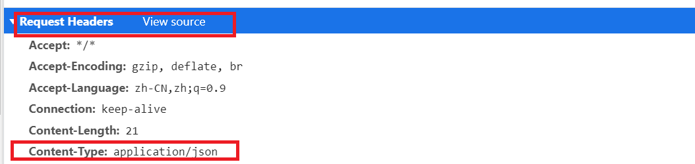

#  Jquery学习笔记

javascript相关知识[[javascript的DOM操作]]	
重点学习 JQuery对Ajax的操作 [[#Jquery学习笔记#JQuery Ajax]]

#### jquery的基本语法

##### jquery的选择器语法  *$(selector).action()* 

- $("#test").hide()，隐藏 id="test" 的元素。
- $("p").hide()，隐藏所有 \<p\> 元素。
- $(".test").hide()，隐藏所有 class="test" 的元素
- $(this).hide(), 可以写入变量或this，隐藏js变量指向的标签。

- $("[href]") 选取所有带有 href 属性的元素。
- $("[href='#']") 选取所有带有 href 值等于 "#" 的元素。
- $("[href!='#']") 选取所有带有 href 值不等于 "#" 的元素。
- $("[href\$='.jpg']") 选取所有 href 值以 ".jpg" 结尾的元素

##### 文档就绪函数

```javascript
$(document).ready(function(){
	//jQuery functions go here----确保js代码在doc渲染完成之后加载
});
```

##### jquery常用事件即绑定形式

| Event 函数                      | 绑定函数至                                     |
| :------------------------------ | :--------------------------------------------- |
| $(document).ready(function)     | 将函数绑定到文档的就绪事件（当文档完成加载时） |
| $(selector).click(function)     | 触发或将函数绑定到被选元素的点击事件           |
| $(selector).dblclick(function)  | 触发或将函数绑定到被选元素的双击事件           |
| $(selector).focus(function)     | 触发或将函数绑定到被选元素的获得焦点事件       |
| $(selector).mouseover(function) | 触发或将函数绑定到被选元素的鼠标悬停事件       |

#### jquery函数效果记录

###### 显示/隐藏 hide()/show()  *$(selector).hide(speed,callback)*

speed是动画时间，callback是动画之完成后要执行的函数。

```js
//可以让 第一个div标签在三秒后小时，在花上一秒重现
let thing = document.getElementsByTagName("div")[0];
function ac(){
	$(thing).show(1000);
}
$(document).ready(function(){
    $(thing).click(function(){
        $(thing).hide(3000,ac);
    });
});
```

###### $(selector).toggle(speed,callback)方法可以切换 隐藏显示。


###### 淡入/淡出 fadeIn/fadeOut/fadeToggle   *$(selector).fadeIn(speed,callback)*

fadeIn淡出不可见元素， fadeOut淡出可见元素，fadeToggle淡出淡入之家切换。

###### 将标签淡化到指定透明度  $(selector).fadeTo(speed,opacity,callback) 

opacity指定透明度，在0~1之间


###### jquery的动画  *$(selector).animate({params},speed,callback)* 

{params} 形成动画的css参数，可以是高度宽度，透明度等几乎所有的css属性，*注意必须使用Camel标记法书写属性名* 。

```js
// 每次点击 thing指向的标签元素后，该标签元素宽度加150px，高度来回隐藏显示
$(document).ready(function(){
      $(thing).click(function(){
          $(thing).animate({
            height:'toggle',
              //在现有width上加150px
            width:'+=150px', 
          })
      });
    });
```

######  stop()函数  $(selector).stop(stopAll,goToEnd)

stopAll参数，默认为`false` 若一个元素上有多个动画队列,则`stop()`只对当前动画效果有有效 。若为`false `则对队列中所有都有效。

goToEnd参数，默认是`false` ，立即停止动画，保留当前样式。若未`true` 则立即完成动画。

*stop()函数对所有的 jquery效果函数都有效* 

### jquery 的html操作

##### 获取属性的操作

- .text() 获取文本元素的内容。
- .html() 也是获取文本元素内容，不会解析里面的 html标签。
-  .val()  获取input里面输入的值。
-  .attr("href") 获取属性值。
- .css("background-color")  获取css属性值

##### jquery的设置属性操作

- text() ， html(),  val(),  在其中添加参数就变成了设置函数。

- text() ， html(),  val(), 还可以以函数为参数。

  ```js
  $("#btn1").click(function(){
      //函数有两个默认参数，i表示当前元素在元素列表中的下标，origtext表示老文本，新文本以return方法返回。
    $("#test1").text(function(i,origText){
      return "Old text: " + origText + " New text: Hello world!
      (index: " + i + ")";
    });
  });
  ```

- 设置属性  *$("#w3s").attr("href","http://www.baidu.com")* 

- 设置css属性值 *$("#w3s").css("background-color","red")*  

##### jquery删除节点操作

- .remove() 删除该节点
- .empty() 清空该节点中的子节点。

##### jquery() 对class属性的操作，常用于元素动画的变化

- .addClass() 添加一个或多个类名
- removeClass() 删除一个或多个类名
- .toggleClass()  在删除和添加类名之间替换

## JQuery Ajax

AJAX = 异步 JavaScript 和 XML（Asynchronous JavaScript and XML）。简短地说，在不重载整个网页的情况下，AJAX 通过后台加载数据，并在网页上进行显示。

通过 jQuery AJAX 方法，您能够使用 HTTP Get 和 HTTP Post 从远程服务器上请求文本、HTML、XML 或 JSON - 同时您能够把这些外部数据直接载入网页的被选元素中。

##### 加载方法  *$(selector).load(URL,data,callback)* 

是最简单的请求数据方法，可以请求html文档的内容，使用很少。

#### \$.get()和\$.post()方法 

##### $.get(URL,callback);


##### $.post(url,data,success(data, textStatus, jqXHR),dataType)

| 参数                               | 描述                                                         |
| ---------------------------------- | ------------------------------------------------------------ |
| *dataType*                         | 可选。规定预期的服务器响应的数据类型。默认执行智能判断（xml、json、script 或 html）。 |
| *url*                              | 必需。规定把请求发送到哪个 URL。                             |
| *data*                             | 可选。映射或字符串值。规定连同请求发送到服务器的数据。       |
| *success(data, textStatus, jqXHR)* | 可选。请求成功时执行的回调函数。                             |

但是jquery对于整个函数的封装并不优秀灵活建议使用 `$.ajax({});`

```js
$.ajax({
  //请求类型
  type: 'POST',
  //请求路径
  url: url,
  //数据，在传送js对象时注意要把js对象用JSON.Stringify()序列化
  data: data,
  //回调函数，还有error等回调函数
  success: function,
  // contentType较为重要，不能不写，在下面详细讨论一下。
  contentType:
  //数据类型，属于入参告诉服务器我需要什么类型的数据
  dataType: dataType
});
```


该参数告诉服务器，前端传递给他的数据是什么类型的，可以通过浏览器在  Request Header  里来查看该属性。

 

###### POST提交数据时，常见的contentType类型
[[前后端传送数据时的几种Content-type]]
- application/x-www-form-urlencoded 这是最常见POST提交数据类型，是提交表单数据时的类型，也是默认的（如果不设置表单的 enctype属性的话）。
- application/json   传递序列化后的js对象数据
- multipart/form-data，在表单中设置了`enctype="multipart/form-data"` 属性值会出现这样的情况，
- text/xml使用的会跟少，以后在做了解。

###### dataType是用于告诉服务器，前端需要什么样的数据。

```js
$.ajax({
    url:"test",
    data:JSON.stringify({"content":str}),
    contentType:"application/json",
    dataType:"json",
    type:"post",
    success :function (data,textStatus) {
        console.log(typeof da)
    },
    error: function (XMLHttpRequest, textStatus, errorThrown) {
        console.log("aaa"+XMLHttpRequest+textStatus)
    },
})
```

```java
@ResponseBody
@PostMapping(value = "/test")
public Map test(@RequestBody Map<String,Object> params){
    return params;
}
```

当 dataType="json"时，data的类型就是 js对象object。当dataType="text" data类型就是 String

###### success 参数接收一个带有两个参数的函数

data是服务端返回的数据，textStatus是处理状态一般为"success"

```js
success :function (data,textStatus) {
    console.log(data+textStatus)
}
```

###### error请求失败时调用的回调函数

