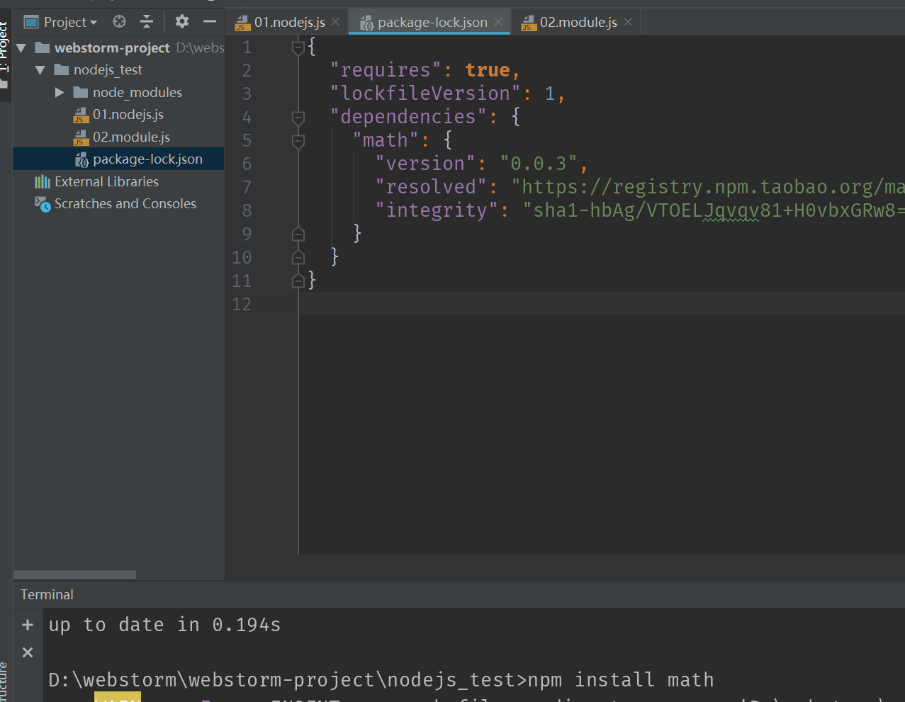
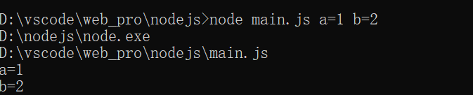
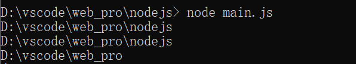
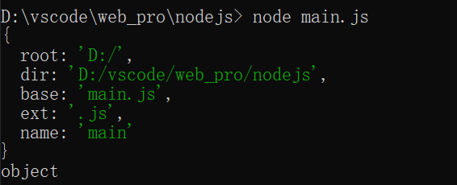

# 	nodejs

[文档](http://nodejs.cn/api/) 

###  模块的引用和循环引用

##### 引用规则

模块被加载时会运行一次，之后会存入缓存，当再次调用模块的参数或方法时不会再加载，而是直接在缓存中获取

##### 循环应用

写三个js文件来理解一下

```js
//main.js
const A = require('./modA');
const B = require('./modB');
```

```js
//modA.js
module.exports.A_num = 'A';

const modB = require('./modB');

console.log("modA console B_num"+modB.B_num);

module.exports.A_num = 'AA';
```

```js
//modB.js
module.exports.B_num = 'B';

const modA = require('./modA');
console.log("modB console A_num"+modA.A_num);

module.exports.B_num = 'BB';
```

调试main.js 后输出

modB:A

modA:BB

main首先加载modA模块，modA模块运行到一半时加载modB模块。

而modB模块中也有加载modA模块的语句，这时modA模块不会重新加载，而是直接读取modA已加载的缓存。

因此，modB模块中中取到的A_num='A'; 而后modB模块加载完成，modA模块继续加载，并输出，加载完成后的B_num='BB';

### nodejs的模块思想

nodejs的一个特点是模块化，我们自己写的js每一个js视为一个模块。模块化是为了做到低耦合高复用。模块中的代码实际上是被封装在一个函数中的。

```js
function(exports, require, module, _filename, _dirname){
    
}
```

- exports:该对象用来将模块内部的变量暴露到外部去
- require:函数，用来引入外部的模块
- module:module就是这个模块本身，且exports是module的属性，可以这样使用 *module.exports = 变量* 
- _filename: 当前模块的完整路径
- _dirname: 当前模块所在文件夹的路径

一个commonjs引用的例子

```js
//02.module.js
let a = 1;
let a_exports = 2;
module.exports.a_plus = a_exports;
```

```js
//01.nodejs.js
let module_test = require('./02.module.js');
console.log(module_test.a);
console.log(module_test.a_plus);
```

##### exports和module.exports的区别

module.exports才是真正的接口，exports只不过是它的一个辅助工具。　最终返回给调用的是module.exports而不是exports。
所有的exports收集到的属性和方法，都赋值给了Module.exports。当然，这有个前提，就是module.exports本身不具备任何属性和方法。 **如果，module.exports已经具备一些属性和方法，那么exports收集来的信息将被忽略** con

#### 包package的思想

将一个js，包括一些辅助型文件打包在一个文件中，就形成了一个包。可以将上传自己的包，也可以下载使用别人的包。

###### 包结构

1.  package.json  描述性文件（必须）。  2. bin 可执行的二进制文件。 3. lib  js代码存放处。  4. doc  文档  5. test 测试单元

##### npm  node package manage

npm是用来管理包的工具。借助npm，nodejs与各种第三方模块形成了跟好的生态系统。

###### 使用npm

- npm search 包名 ： 搜索这个包
- npm install 报名 ： 安装这包
- npm version  ： 查看所有模块的版本
- npm -v ： 查看nodejs的版本
- npm install ： 下载当前项目依赖的包
- npm install 包名 g ：全局安装一个包

###### 在项目中使用npm

以webstorm为例:

 

在项目的终端中输入 npm命令。如在项目目录下输入 *npm install math* 会自己在项目目录下新建一个node_modules文件夹，下载的包模块会放在里面，并且该项目的package.json的depenencies字段里会自动添加该依赖。

###### 引入包模块时的搜索流程

在我们引入一个包模块时，会先在项目目录下的node_modules文件夹里寻找相应的包，如果找不到会在父级目录里找node_modules文件夹，依次往上直到项目所在磁盘的位置，最终报错。

### nodejs的Global

表示位全局变量，理解为js里的window对象。可以把一些希望全局访问的对象，属性，方法挂入global

```js
global.global_num = 1;
```

暴露一和全局变量 global_num.

他还包括一些内置的一些常用的属性与方法：

- commonJS
- Buffer
-  process
- timer
- console

#### process

###### argv, argv0, execArgv, execPath, env,cwd()

```js
const {argv, argv0, execArgv, execPath} = process;
for(let item=0; item<argv.length;item++) {
    console.log(argv[item]);
}
```

1. 首先argv是一个数组，它返回我们在使用脚本调试该文件时添加的一些参数

    

   我们一共加了两个参数，argv内有四个值。因为第一第二个是固定的值。第一个是我nodejs的安装路径，第二个是调试文件路径。

2. argv0是argv的第一个值

3. execArgv  调用node时加入的一些特殊参数( *写在文件名前面的*) 不会被argv记录，而是记录在execArgv里。

4. execPath 表示node的路径


#### Buffer变量

###### Buffer.alloc(len, )和Buffer.allocUnsafe(len)

alloc()第一个参数表示新建Buffer的字节长度，第二个参数表示用什么填充，默认值是0。

allocUnsafe() 只有一个参数即字节长度。

###### Buffer.from(数组或string，)

把数组或string转换为Buffer， 第二参数可以指定编码方式。默认为utf-8

###### Buffer.byteLength(B)

返回B的字节长度

###### Buffer.concat(A,B,C....)

把多个Buffer参数拼接

###### Buffer.isBuffer(B)

判断B是否为Buffer类型

###### 一些实例方法

- buf.length 返回字节长度
- buf.toString('utf-8', start, end)  把二进制转换为string
- buf1.equals(buf2)   判断buf1和buf2的内容是否相同
- buf.indexOf(str)  返回索引，类似于数组
- buf.fill(s, start, end)  把buf中start到end-1填充为s。

### node内置模块

#### fs，二进制文件的处理

```js
const fs = require('fs');
const result = fs.readFile('nodejs/main.js', function(err, data){
    if(err) {
        console.log(err);
    }
    else{ 
        console.log(data);
        console.log(data.toString());
        return data;
    }
});
//在回调函数中处理返回得数据
//readFile是一个异步处理的操作，result不会得到任何返回值。
console.log(result);
//data时缓冲区的二进制数据
>>
<Buffer 63 6f 6e 73 74 20 66 73 20 3d 20 72 65 71 75 69 72 65 28 27 66 73 27 29 3b 0d 0a 63 6f 6e 73 74 20 72 65 73 75 6c 74 20 3d 20 66 73 2e 72 65 61 64 46 ... 219 more bytes>
//toString()后得到文件的本身内容
>>
const fs = require('fs');
const result = fs.readFile('main.js', function(err, data){
    if(err) {
        console.log(err);
    }
    else{
        console.log(data);
        console.log(data.toString());
        return data;
    }
});
console.log(result);

D:\vscode\web_pro\nodejs>
```

#### path模块

###### normalize（）

处理路径中一些不合理的地方

###### basename dirname extname

- basename 文件名
- dirname 文件路径
- extname 文件拓展名

Path.dirname(路径)和__dirname和process.cwd()

```js
const Path = require('path');
console.log(__dirname);
console.log(process.cwd());
console.log(Path.dirname(__dirname));
```

使用脚本调试的结果，__dirname打印的是main.js的路径，process.cwd()是脚本调试的路径， 而Path.dirname( dirname)打印的是项目路径。

 

###### parse()和format()

- parse()把一个路径解析分解，返回一个对象类型

  ```js
  const Path = require('path');
  const dir_name = 'D:/vscode/web_pro/nodejs/main.js'
  const ne = Path.parse(dir_name)
  console.log(ne);
  console.log(typeof ne);
  ```

    

- format()则可以把那个对象类型，重新生成为路径。注意到上图的对象中共有五个属性，其中dir会覆盖root，base会覆盖ext和name。

#### event模块

nodejs的事件触发器应该以异步为主。所有能触发事件的对象都是 `EventEmitter` 类的实例。 这些对象有一个 `eventEmitter.on()` 函数，用于将一个或多个函数绑定到命名事件上。 事件的命名通常是驼峰式的字符串，但也可以使用任何有效的 JavaScript 属性键。当 `EventEmitter` 对象触发一个事件时，所有绑定在该事件上的函数都会被==同步==地调用。 ==被调用的监听器返回的任何值都将会被忽略并丢弃==。 

```js
const EventEmitter = require('events');
//构造一个EventEmitter的拓展类
class MyEmitter extends EventEmitter {}
const myEmitter = new MyEmitter();

//给myEmitter绑定函数
myEmitter.on('event', function(a, b) {
  console.log(a, b, this, this === myEmitter);
});
myEmitter.emit('event', 'a', 'b');
>>
  //   a b MyEmitter {
  //     domain: null,
  //     _events: { event: [Function] },
  //     _eventsCount: 1,
  //     _maxListeners: undefined } true
```

##### EventEmitter的 error事件

EventEmitter类定义考虑一个特殊的事件 error，它包含了发生错误的信息，当该事件被触发时nodejs会认为发生异常并退出程序打印错误信息，我们一般要为会触发 error 事件的对象设置监听器，避免遇到错误后整个程序崩溃

##### EventEmitter类方法统计

###### addListener(event,callback)

为事件添加一个监听器到监听器数组的底部，因为绑定在一个事件上的函数都是同步执行的 ，是有顺序的。

###### on()  同上

###### once(event, callback)

###### removeListener(event, callback名称)

注意这里不能使用匿名函数的形式了，必须是使用函数名称。

###### removeAllListeners([event])

移除事件下的所有监听器

###### listener(event)

返回指定事件的监听器数组

###### setMaxListener(n)

默认情况下， EventEmitters 如果你添加的监听器超过 10 个就会输出警告信息。 setMaxListeners 函数用于改变监听器的默认限制的数量。

###### emit(event,[argv0], [argv1],...)

触发事件并传入参数，如果该事件没有注册过监听器（监听器数组长度为0）返回 `false` 否则返回`true`.

#### http模块


