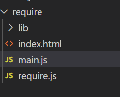

## require.js库

当js文件变多时，网站加载js的时候就会停止渲染，意味着网站会失去响应，js越多，失去响应的时间越久。

js文件多时，文件间的依赖关系很复杂，严格保证加载顺序。

因而，require.js就是为了：

1. 实现js文件的异步加载，避免网站失去响应
2. 管理模块之间的依赖性，便于维护编写


### 使用require.js库

去[官网](https://requirejs.org/docs/errors.html#scripterror) 把require.js下载并放入需要的项目

在html中引入  *鼓励把它放在html最后,* 

```html
<script data-main="./main.js" src="./require.js"></script>
```

data-main属性是指定网站加载的主模块,所以main.js会第一个被加载.main.js可以审略为main

#### 模块的加载

要求满足AMD规范.

假设我们有三个js模块  *jquery, underscore, backbone* ,主模块main依赖他们.

那么就需要使用require.config()方法里的paths属性来设置他们的路径.require.config()应该写在main.js的开头

我的文件路径 

```js
require.config({
//baseURL可以改变基目录
　　　　paths: {

　　　　　　"jquery": "lib/jquery",
　　　　　　"underscore": "lib/underscore",
　　　　　　"backbone": "lib/backbone"

　　　　}

　　});
```

注意文件路径最后不要加js     如果某个模块在另一台主机上，也可以直接指定它的网址.

###### main.js里代码的写法

```js
require(['jquery', 'underscore', 'backbone'], function (jquery,underscore, backbone){

　　　　// some code here

　　});
```

#### 被依赖模块  要求符合AMD规范

require.js加载的模块，采用AMD规范。也就是说，模块必须按照AMD的规定来写。

具体来说，就是模块必须采用特定的define()函数来定义。如果一个模块不依赖其他模块，那么可以直接定义在define()函数之中。

假定现在有一个math.js文件，它定义了一个math模块。那么，math.js就要这样写：

```js
　　// math.js
　　define(function (){
　　　　var add = function (x,y){
　　　　　　return x+y;
　　　　};
　　　　return {
　　　　　　add: add
　　　　};
　　});
```

加载方法如下：

```js
　// main.js
　　require(['math'], function (math){
　　　　alert(math.add(1,1));
　　});
```

如果这个模块还依赖其他模块，那么define()函数的第一个参数，必须是一个数组，指明该模块的依赖性。

```js
　　define(['myLib'], function(myLib){
　　　　function foo(){
　　　　　　myLib.doSomething();
　　　　}
　　　　return {
　　　　　　foo : foo
　　　　};
　　});
```

当require()函数加载上面这个模块的时候，就会先加载myLib.js文件。

#### 被依赖包不符合AMD规范时

AMD-Asynchronous Module Definition  异步模块定义

