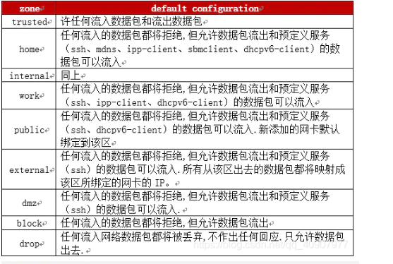

### firewalld配置防火墙

##### firewall的区域zone

zone是firewall预设的积几类保护集规则， 一个有九类。其配置文件都存储在`/usr/lib/firewalld/zones/`下.

|   zone   |                    default configuration                     |
| :------: | :----------------------------------------------------------: |
| trusted  |                  允许所有流入或流出的数据包                  |
|   home   | 允许任何数据包流出 和 部分预定义的服务（ssh mdns ipp-client sbmclient dhcp6-client）数据包流入 |
| internal |                                                              |
|   work   |                                                              |
|  public  |                                                              |
| external |                                                              |
|   dmz    | 阻断数据包流入，只允许预定义的服务(ssh)的数据流入。且允许数据包流入 |
|  block   |      任何流入的数据包阻断，会做响应。但是允许数据包流出      |
|   drop   | 任何流入的网络数据包都将被丢弃， 且不做回应， 提高效率。但是允许数据包流出 |

 