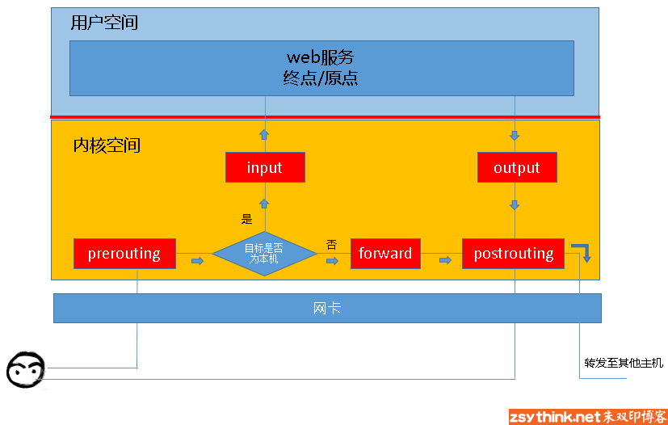

```shell
# 配置 ant转发案例
iptables -t nat -I POSTROUTING -d 111.111.111.111 -j SNAT --to 10.182.169.1
```


##### 防火墙简单分类

从物理层面，防火墙可以简单分为硬件防火墙和软件防火墙，硬件防火墙从硬件级别实现功能，性能高但成本也高。iptables属于软件防火墙，性能低但成本低。iptables同样属于免费开源软件


### iptables

**iptables**其实不是真正的防火墙，我们可以把它理解成一个客户端代理，用户通过iptables这个代理，将用户的安全设定执行到对应的”安全框架”中，这个”安全框架”才是真正的防火墙，这个框架的名字叫**netfilter**

netfilter才是防火墙真正的安全框架（framework），netfilter位于内核空间。iptables其实是一个命令行工具，位于用户空间，我们用这个工具操作真正的框架。

###### 理解不了这句话

==所以说，虽然我们使用service iptables start启动iptables”服务”，但是其实准确的来说，iptables并没有一个守护进程，所以并不能算是真正意义上的服务，而应该算是内核提供的功能。==

##### iptables防火墙功能的实现

当外部机器需要访问本机时，会发送报文到本机网卡。（下面以tcp服务为例）然后客户端的报文信息会根据套接字信息找到对应端口， 进入本机web服务。当本机需要响应外部机器时，以web服务为起点，经本机网卡发送返回信息给外部机器。。在这个过程中，防火墙要起到作用就必须要在web服务和网卡之间（内核空间）设置关卡所有进出的报文都要通过这些关卡，经过检查后，符合放行条件的才能放行，符合阻拦条件的则需要被阻止，**这里的关卡可以称为==链==**

 

#### 学会使用iptables配置网络防火墙

##### 了解四表五链的概念

前面已经说过 iptables在内核空间中数据流向的五个地方设置了五个关卡，称为五链：

- prerouting 对数据包作路由选择前应用此链中的规则（所有的数据包包括转发的数据包都先由这个链处理）
- input  进来的数据包应用此规则链中的策略
- forward  转发数据包时应用此规则链路中的策略
- 外出的数据包应用此规则链中的策略
- 对数据包作路由选择后应用此链中的规则（所有的数据包出来的时候都由这个链处理）

链是一系列规则在数据流向不同位置的集合，，那么表就是不同功能的规则的集合。 ==在实际的使用过程中， 往往都是通过表来操作规则的==：

- filter表

  主要用于对数据包进行过滤，根据具体的规则决定是否放行该数据包（如DROP、ACCEPT、REJECT、LOG）。

- nat表

  主要用于修改数据包的IP地址、端口号等信息（网络地址转换，如SNAT、DNAT、MASQUERADE、REDIRECT）。属于一个流的包(因为包
  的大小限制导致数据可能会被分成多个数据包)只会经过这个表一次。如果第一个包被允许做NAT或Masqueraded，那么余下的包都会自动地被做相同的操作，也就是说，余下的包不会再通过这个表。

- mangle

  主要用于修改数据包的TOS（Type Of Service，服务类型）、TTL（Time To Live，生存周期）指以及为数据包设置Mark标记，以实现Qos(Quality Of Service，服务质量)调整以及策略路由等应用。使用并不广泛

- raw

  主要用于决定数据包是否被状态跟踪机制处理。在匹配数据包时，raw表的规则要优先于其他表。。 暂不了解

==表规则优先级：  Raw>>>>mangle>>>>nat>>>>filter==

###### 具体每个链对应哪些表如下图

 

##### 命令的使用

​    **iptables -t table -COMMAND chain S_CRITIRIA -j ACTION**

###### -t table

指定需要维护的防火墙规则表 filter、nat、mangle或raw。在不使用 -t 时则默认使用 filter 表。

###### -COMMAND

定义对规则的管理动作

- -A	添加防火墙规则， 添加到最后（最后生效）
- -D	删除防火墙规则
- -I	插入防火墙规则， 添加到最前面
- -F	清空防火墙规则
- -L	列出添加防火墙规则
- -R	替换防火墙规则
- -Z	清空防火墙数据表统计信息
- -P	设置链默认规则

###### chain  定义生效在哪一条链上

###### S_CRITIRIA  一系列的参数匹配管理

- [!]-p	匹配协议，! 表示取反
- [!]-s	匹配源地址
- [!]-d	匹配目标地址
- [!]-i	匹配入站网卡接口
- [!]-o	匹配出站网卡接口
- [!]--sport	匹配源端口
- [!]--dport	匹配目标端口
- [!]--src-range	匹配源地址范围
- [!]--dst-range	匹配目标地址范围
- [!]--limit	四配数据表速率
- [!]--mac-source	匹配源MAC地址
- [!]--sports	匹配源端口
- [!]--dports	匹配目标端口
- [!]--stste	匹配状态（INVALID、ESTABLISHED、NEW、RELATED)

###### -j ACTION   定义对此请求的动作

- ACCEPT	允许数据包通过
- DROP	丢弃数据包
- REJECT	拒绝数据包通过
- LOG	将数据包信息记录 syslog 曰志
- DNAT	目标地址转换
- SNAT	源地址转换
- MASQUERADE	地址欺骗
- REDIRECT	重定向

##### 关于iptables配置文件  `/etc/sysconfig/iptables`

在开机时服务自启的时候使用的默认配置，语法大致如下：

```shell
# Generated by iptables-save v1.4.21 on Tue Jul 26 06:49:29 2022
*filter
:INPUT ACCEPT [0:0]
:FORWARD ACCEPT [0:0]
:OUTPUT ACCEPT [113:9336]
-A INPUT -m state --state RELATED,ESTABLISHED -j ACCEPT
-A INPUT -p icmp -j ACCEPT
-A INPUT -i lo -j ACCEPT
-A INPUT -p tcp -m state --state NEW -m tcp --dport 22 -j ACCEPT
-A INPUT -p tcp -m state --state NEW -m tcp --dport 3306 -j ACCEPT
-A INPUT -j REJECT --reject-with icmp-host-prohibited
-A FORWARD -j REJECT --reject-with icmp-host-prohibited
COMMIT

*nat
-A POSTROUTING -d 123.123.123.1 -j SNAT --to 10.182.120.1
COMMIT
# xCompleted on Tue Jul 26 06:49:29 2022
```


