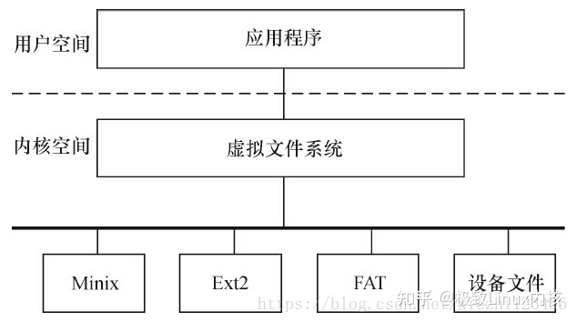

# linux

https://blog.csdn.net/m0_74282605/article/details/127819861?ops_request_misc=%257B%2522request%255Fid%2522%253A%2522167998390316800192260198%2522%252C%2522scm%2522%253A%252220140713.130102334.pc%255Fall.%2522%257D&request_id=167998390316800192260198&biz_id=0&utm_medium=distribute.pc_search_result.none-task-blog-2~all~first_rank_ecpm_v1~pc_rank_34-1-127819861-null-null.142^v76^pc_new_rank,201^v4^add_ask,239^v2^insert_chatgpt&utm_term=%E4%BB%A3%E7%A0%81%E5%A4%A7%E4%BD%AC%E7%9A%84%E3%80%90Linux%E5%86%85%E6%A0%B8%E5%BC%80%E5%8F%91%E7%AC%94%E8%AE%B0%E3%80%91%E5%88%86%E4%BA%AB&spm=1018.2226.3001.4187

### linux内核组成

linux内核主要由五个子系统组成 **进程调度** **内存管理** **虚拟文件系统**  **网络接口** **进程间通信**

##### 进程调度

进程调度控制系统中的多个进程对CPU的访问，使得多个进程能在CPU中“微观串行，宏观并行”地执行。进程调度处于系统的中心位置，内核中其他的子系统都依赖它，因为每个子系统都需要挂起或恢复进程。
[[lan/linux/linux进程概念与操作]]

##### 内存管理

内存管理的主要作用是控制多个进程安全地共享主内存区域。当CPU提供内存管理单元（MMU）时，Linux内存管理对于每个进程完成从虚拟内存到物理内存的转换。Linux 2.6引入了对无MMU CPU的支持。

##### 虚拟文件系统

linux虚拟文件系统隐藏了硬件的各种细节， 为所有的设备提供了统一的接口。 而且它独立于各个具体的文件系统， 是对各个文件系统的抽象， 为上层应用提供了统一的`vfs_read()` ` vfs_write()`接口， 并调用具体底层文件系统或者设备驱动中实现的file_operations结构体的成员函数。

 

##### 网络接口

网络接口提供了对各种网络标准的存取 和 对各种网络硬件的支持。

##### 进程间通信

进程间通信支持进程之间的通信，Linux支持进程间的多种通信机制，包含信号量、共享内存、消息队列、管道、UNIX域套接字等，这些机制可协助多个进程、多资源的互斥访问、进程间的同步和消息传递。在实际的Linux应用中，人们更多地趋向于使用UNIX域套接字，而不是System V IPC中的消息队列等机制。Android内核则新增了Binder进程间通信方式。

