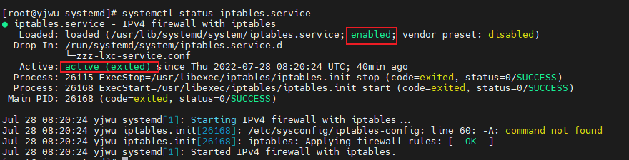

### 服务（service) 的管理方式Systemd

##### 在早期linux服务的管理方式相对简单 init。

当时的管理方式为SysV的init脚本程序处理方式， 所有的服务启动脚本通通放置于/etc/init.d/ 底下，基本上都是使用bash shell script 所写成的脚本程式，需要启动、关闭、重新启动、观察状态时， 可以	使用`/etc/init.d/daemon start|stop|restart|status`命令。自从centos7.X开始，管理方式变为Systemd。

 

###### daemons（守护进程）的概念

 系统为了成功实现一个服务，必须要运行的一些程序。为了实现这个服务，所需要的进程就称为这个服务的守护进程daemon。

#### systemd管理方式

基本上， systemd将过去称为daemon的执行脚本统称为服务单位(unit), 而每种服务单位依据功能来区分时，就分类为不同的类型  (type)。  基本的类型有包括系统服务、数据监听与交换的插槽档服务  (socket)、储存系统状态的快照类型、提供不同类似执行等级分类的操作环境  (target)  等等。相关的配置文件都会被放在如下几个文件中：

- /usr/lib/systemd/system/： 每个服务最主要的启动脚本设定，有点类似以前的  /etc/init.d  底下的文件
- /run/systemd/system/：系统执行过程中所产生的服务脚本，这些脚本的优先序要比  /usr/lib/systemd/system/  高！
- /etc/systemd/system/：管理员依据主机系统的需求所建立的执行脚本，其实这个目录有点像以前 /etc/rc.d/rc5.d/Sxx  之类的功能！执行优先序又比  /run/systemd/system/  高!

到底系统开机会不会执行某些服务其实是看  /etc/systemd/system/  底下的设定，所以该目录底下就是一大堆连结档。而实际执行的  systemd  启动脚本配置文件，  其实都是放置在 /usr/lib/systemd/system/  底下的。

##### systemd下服务的分类

- .service   ； 一般类的服务，一般是系统服务，包括服务器本身需要的本地或网络服务，这也是我们最常见的服务
- .socket    ； 内部程序数据交换的插槽服务 (socket unit)：主要是 IPC (Inter-process communication) 的传输讯息插槽文件 (socket file) 功能。
- .target     ;    其实是一群服务(unit)的集合
- .mount/.automount
- .path
- .timer

#### 通过systemctl管理服务

systemctl start/stop/restart  iptables.service       启动/停止/重启   iptables服务

systemctl  status  xxx      查看某一个服务的状态

 

###### 其中  enabled表示允许服务开机自启

- enabled；   这个服务开机会自启
- static；        这个服务开机可能被其他enabled的服务唤醒（相依属性的服务）
- disabled；  这个服务不能自启；
- mask;           这个  daemon  无论如何都无法被启动！因为已经被强制注销  (非删除)。可透过  systemctl unmask  方式改回原本状态 

###### active(exited) 表示服务正常执行，已经退出

- active(running) 有一只或多只程序正在运行中
- active(exited)     仅执行一次就正常结束的服务，目前并没有任何程序在系统中执行
- active(waiting)   正在执行中， 不过需要等待其他进程才能继续运行
- inactive(dead)   服务已经停止了。

###### systemctl/systemctl list-units  

显示所有正在运行的服务， 加上 --all可以显示所有包括未运行的服务  ，--type=service可以选择服务的类型

###### systemctl list-unit-files

显示所有安装的服务 **依据/usr/lib/systemd/system/ 内的启动文件，列出启动文件列表** 

