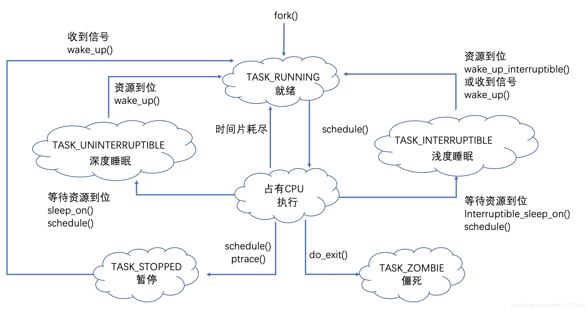
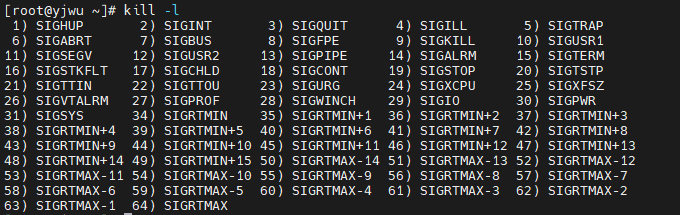
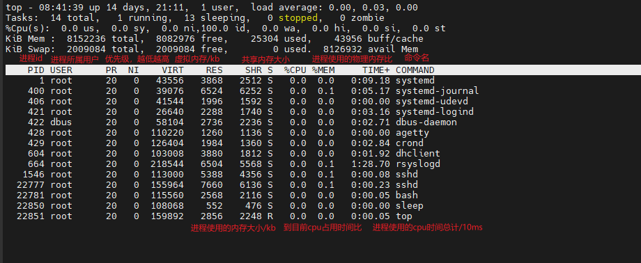

### linux上对进程的管理

进程是正在运行的程序的实例。

#### 进程的生命周期

##### 进程的产生

我们可以在shell中执行一条程序，产生一个进程。当然shell本身也是一个进程，所有最初运行的进程都是在开机时由一个pid为1的进程（init/systemd）fork() 产生的。

 

- 就绪态TASK_RUNNING 和执行态 ； 一个进程被fork()出来 就进入就绪态，此时获得cpu资源即进入执行态。如果时间片用完或cpu资源被占用则变为就绪态。

- 睡眠态TASK_INTERRUPTIBLE & TASK_UNINTERRUPTIBLE；  当一个执行态进程所需进程无法获得时进入睡眠态*如一个网络程序等待远程发包的情况*，获得资源后重新进入就绪态等待cpu资源。

- 暂停TASK_STOPPED;  进程暂停执行接受某种处理。如正在接受调试的进程处于这种状态，Linux 使用 TASK_STOPPED 宏表示此状态。

   

- 僵死 TASK_ZOMBIE；进程执行完毕，资源已经被释放，只保留了进程描述结构，父进程wait4()还未收到它信号的时候。

#### linux对进程的操作

##### kill 尝试杀死进程

kill  [-选项]  [进程号]

###### kill -l  查看所有信号

 

默认情况下 会使用信号15)SIGTERM  。其中信号2)SIGINT 和在shell使用ctrl^c是一样的。==只有信号9)SIGKILL是强制进程退出结束，其他信号均有可能会被进程忽略。==   1)HUP;终端短线  3)QUIT; 同ctrl^\   18)CONT  进程继续信号与STOP相反;    19)STOP  进程暂停同ctrl^z

##### ps  查看当前进程运行情况

ps  -[f e]   查看服务器的进程信息。 ps只是将当前进程信息打印下来，是静态的查看。

参数f   显示所有字段

参数e  显示所有的进程

##### top  动态监控进程与服务资源情况

其中VIRT表示虚拟内存，RES表示常驻内存， SHR表示共享内存。

M  快捷键将进程按占用内存比例从高到底排序

P   快捷键将进程按 CPU占用比例从高到底排序

1   快捷键显示跟多CPU信息

 

