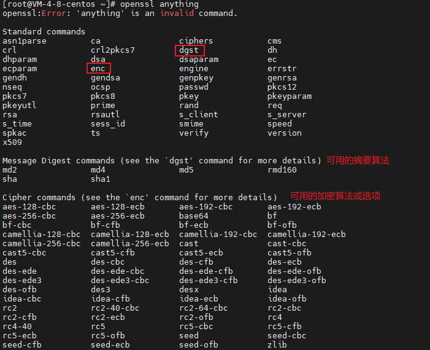
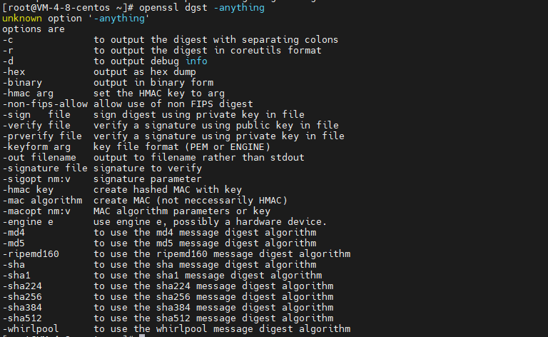

### openssl软件记录

[OpenSSL 中文手册 | OpenSSL 中文网](https://www.openssl.net.cn/)

##### ssl协议

SSL是Secure Sockets Layer（安全套接层协议）的缩写。SSL能使用户/服务器应用之间的通信不被攻击者窃听，并且始终对服务器进行认证，还可选择对用户进行认证。**SSL协议要求建立在可靠的传输层协议(TCP)之上**。SSL协议的优势在于它是与应用层协议独立无关的，高层的应用层协议(例如：HTTP，FTP，TELNET等)能透明地建立于SSL协议之上。**SSL协议在应用层协议通信之前就已经完成加密算法、通信密钥的协商及服务器认证工作**。在此之后应用层协议所传送的数据都会被加密，从而保证通信的私密性。

##### openssl开源软件

在计算机网络上，OpenSSL是一个开放源代码的软件库包，应用程序可以使用这个包来进行安全通信，避免窃听，同时确认另一端连接者的身份。这个包广泛被应用在互联网的网页服务器上。

openssl使用c语言作为开发语言。 整个openssl软件主要包括三个部分的实现： 应用程序， SSL协议库， 密码算法库（对称加密， 非对称加密）

openssl一个实现了四种非对称加密的算法，**DH算法**用于密钥交换， **RSA算法**用于密钥交换或数字签名， **DSA算法**一般只用于数字签名。

openssl实现了五种信息摘要的算法

#### openssl命令行使用

- `openssl *` openssl + 任意字符 会打印可用的标准命令

    

- `openssl command [option]`  openssl enc + 任意错误选项 显示该标准命令可用的选项

   

##### 常用命令

- `openssl genrsa -out test.key 2048`  生成长度为2048的rsa密钥
- `openssl rsa -in test.key -text`         打印密钥文件信息
- 
