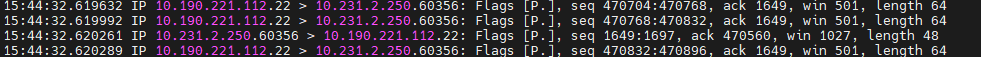

### tcpdump抓包工具

###### 常见的选项设置

`tcpdump  -i  ens160`  住监听ens160接口上的数据包

`tcpdump src host 192.168.10.100` 只监听来自主机 192.168.10.100 发来的包。

 **tcpdump  OPTION PROTO  DIR  TYPE**

 

​	  

1. option 可选参数：将在后边一一解释。
2. proto 类过滤器：根据协议进行过滤，可识别的关键词有： tcp, udp, icmp, ip, ip6, arp, rarp,ether,wlan, fddi, tr, decnet
3. type 类过滤器：可识别的关键词有：host, net, port, portrange，这些词后边需要再接参数。
4. direction 类过滤器：根据数据流向进行过滤，可识别的关键字有：src, dst，同时你可以使用逻辑运算符进行组合，比如 src or dst

###### linux抓包打印值

下面是几个抓到的TCP包的打印截图

 

- 最前面是 时分秒毫秒，这个时间会受到系统时区设置的影响
- 第二列IP表示网络协议
- 对于tcp协议的网络包，会有Flags标识符
  - `[S]` : SYN（开始连接）
  - `[P]` : PSH（推送数据）
  - `[F]` : FIN （结束连接）
  - `[R]` : RST（重置连接）
  - `[.]` : 没有 Flag （意思是除上面四种类型外的其他情况，有可能是 ACK 也有可能是 URG）

#### [TYPE] 基于IP地址和端口进行过滤

` tcpdump host 192.168.10.100` 指定只抓取 192.168.10.100 ip的包

`tcpdump net 192.168.10.0/24`  基于网段进行过滤

`tcpdump port 80 or 8088`  基于端口

`tcpdump portrange 8000-8080` 基于端口范围

#### [DIR] 基于数据包流向过滤

`tcpdump -i eth2 src 192.168.10.100`   

`tcpdump dst portrange 8000-8080` 

#### [PROTO] 基于网络协议进行过滤

protocol 可选值：tcp，icmp，ip, ip6, arp, rarp, atalk, aarp, decnet, sca, lat, mopdl, moprc, iso, stp, ipx, or netbeui

#### [OPTION] 可选参数解析

