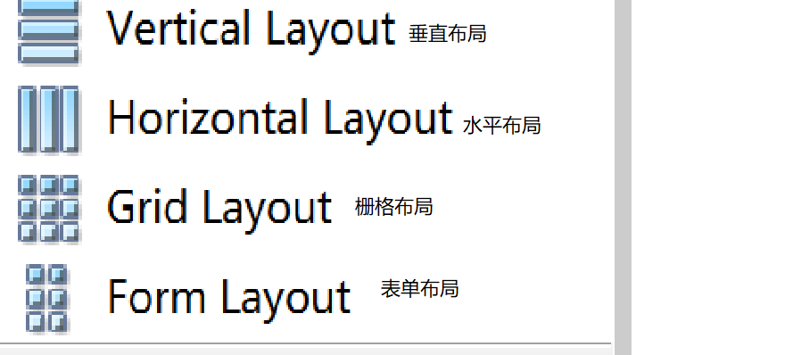
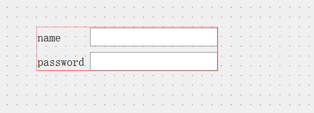
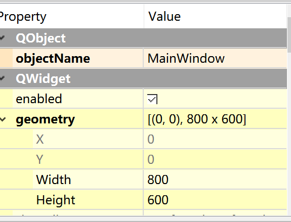
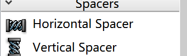
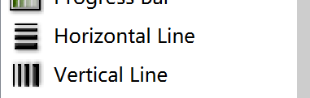
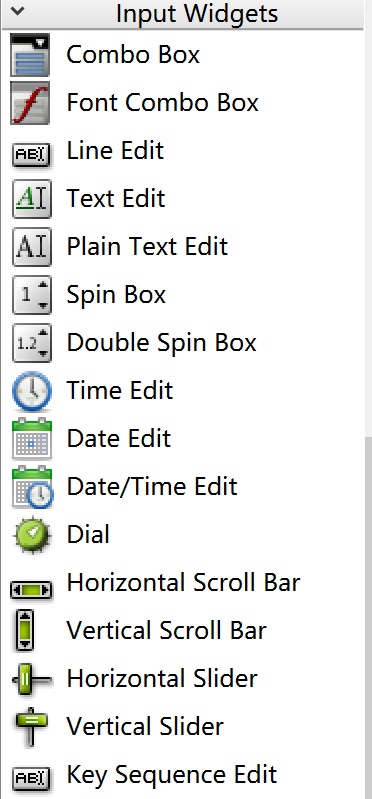
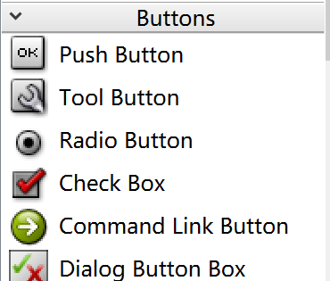
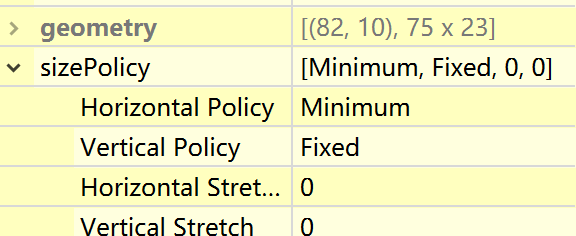

# pyqt

## 如何使用

1. 首先借助qt designer形成界面，产生xxx.ui文件

2. 利用External tool里的pyuic将 .ui文件转化为 .py文件

   ```python
   from PyQt5 import QtCore, QtGui, QtWidgets
   from PyQt5.QtWidgets import QToolTip
   from PyQt5.QtGui import *
   
   class Ui_MainWindow(object):
       def setupUi(self, MainWindow):
       MainWindow.setToolTip('fuck')  # 设置窗口提示
       MainWindow.setWindowIcon(QIcon('./imag/leidian.png'))  # 设置窗口图标
       # 其他的属性设置
           .......
       def retranslateUi(self, MainWindow):
           _translate = QtCore.QCoreApplication.translate
           MainWindow.setWindowTitle('尝试')
           # 一般在这里修改窗口的标题其他不用考虑
           .........
   ```

3. 新建一个py文件用于产生刚刚的界面

   对于界面里控件的作用在这里实现

   ```python
   import sys
   from PyQt5.QtWidgets import QApplication, QMainWindow, QToolTip
   from test import Ui_MainWindow
   from PyQt5.QtGui import QIcon
   
   
   if __name__ == '__main__':
       app = QApplication(sys.argv)
       MainWindow = QMainWindow()
       ui = Ui_MainWindow()
       ui.setupUi(MainWindow)
       MainWindow.show()
       sys.exit(app.exec_())
   ```

   

## 使用qt designer 形成界面

### 各项组件

#### 布局

  表单布局一般是分成两列

一列是标签 另一列用于收集用户信息。

  

##### 绝对布局

 

在属性查看器里可以查看x，y属性，是距离左上角的距离

在容器内的组件是距离容器左上角的距离。

#### 分割线与间隙

##### 间隙

 

###### 分割线

在 display widgets里

 


#### 输入框

 

##### QLineEdit

###### 产生

一般自动生成了

```
self.lineEdit = QtWidgets.QLineEdit(self.widget)
```

###### 设置类型

```
self.lineEdit.setEchoMode(QLineEdit.Password)
```

参数种类

1. QLineEdit.Normal 缺省情况正常显示
2. QLineEdit.Password 显示圆点，密码保护
3. QLineEdit.PasswordEchoOnEdit  密码类型一段时间后变为圆点
4. QLineEdit.NoEcho 不显示

###### 使用掩码限制输入值

```
self.lineEdit.setInputMask(">AAA-AAA-999-999")
```

```
A    ASCII字母字符是必须输入的(A-Z、a-z)
a    ASCII字母字符是允许输入的,但不是必需的(A-Z、a-z)
N    ASCII字母字符是必须输入的(A-Z、a-z、0-9)
n    ASII字母字符是允许输入的,但不是必需的(A-Z、a-z、0-9)
X    任何字符都是必须输入的
x    任何字符都是允许输入的,但不是必需的
9    ASCII数字字符是必须输入的(0-9)
0    ASCII数字字符是允许输入的,但不是必需的(0-9)
D    ASCII数字字符是必须输入的(1-9)
d    ASCII数字字符是允许输入的,但不是必需的(1-9)
#    ASCI数字字符或加减符号是允许输入的,但不是必需的
H    十六进制格式字符是必须输入的(A-F、a-f、0-9)
h    十六进制格式字符是允许输入的,但不是必需的(A-F、a-f、0-9)
B    二进制格式字符是必须输入的(0,1)
b    二进制格式字符是允许输入的,但不是必需的(0,1)
>    所有的字母字符都大写
<    所有的字母字符都小写
!    关闭大小写转换
\    使用"\"转义上面列出的字符
```

###### 使用校验器限制输入

1. 整数校验器

   ```
   intvalidator = QIntValidator(self)
   intvalidator.setRange(1,100)
   ```

2. 浮点数

   QDoubleValidator(self)

3. 字符和数字

   ```python
   reg = QRegExp('[a-zA-Z]+$')
   # 这里面天正则表达式
   validator = QRegValidator(self)
   validator.setRange(reg)
   ```

###### 预设值

```
self.lineEdit.setPlaceholderText('预先要写的内容')
```

##### QTextEdit

###### 设置textEdit的内容

1. ```
    self.textEdit.setPlainText('Hello World')
   ```

2. ```
   self.textEdit.setHtml('<font color="blue" size="5"> Hello World</font>')
   ```

###### 获取textEdit的内容

1. ```
   self.textEdit.toPlainText()
   ```

2. ```
   self.textEdit.toHtml()
   ```


##### QComboBox下拉框

###### 当下拉框选择内容变化时

```
self.comboBox.currentIndexChanged.connect(self.index_changed)
```

###### 读取当前选择的内容

```
self.comboBox.currentText()
```

###### 读取第index个item

```
self.comboBox.itemText(index)
```

##### Slider 滑块

###### 两种滑块

 

###### 设置最大值最小值

```
self.horizontalSlider.setMaximum(199)
self.horizontalSlider.setMinimum(2)
```

###### 设置指向

```
 self.horizontalSlider.setTickPosition(QSlider.TicksBelow)
 self.verticalSlider.setTickPosition(QSlider.TicksLeft)
```

###### 取值变化时

```
self.horizontalSlider.valueChanged.connect(self.change_value)
```

###### 读取当前值

```
self.horizontalSlider.value()
```

#### 按钮

 

##### PushButton

###### 设置按钮图标

```
self.pushButton.setIcon(QIcon(QPixmap('./imag/leidian.png')))
```

###### 获取按钮上的text

```
self.pushButton.text()
```

###### 按钮绑定事件

```
self.pushButton_2.clicked.connect(self.clickTextButton)
```

##### Radio Button

##### Check Box


### 属性编辑器

###### 期望尺寸 sizeHnit  和最小期望尺寸 sizeMinHint

控件创建时期望的大小

对大多数控件，sizeHint是只读的

可以用self.pushBottun.sizeHint().width()获取

###### sizepolicy

 

常用fixed和expanding

fixed是是控件大小固定

expanding会使控件大小随着布局容器而改变 ，设置stretch来控制比例

### 核心 信号与槽

信号：由对象或控件的发出的信号

槽：拦截和响应发出的信号，槽本质上是一个的函数和方法


