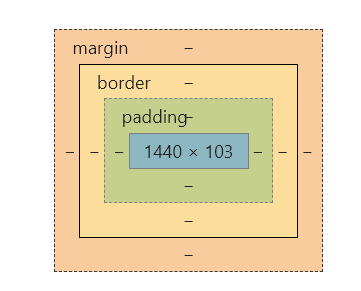
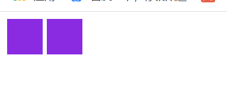
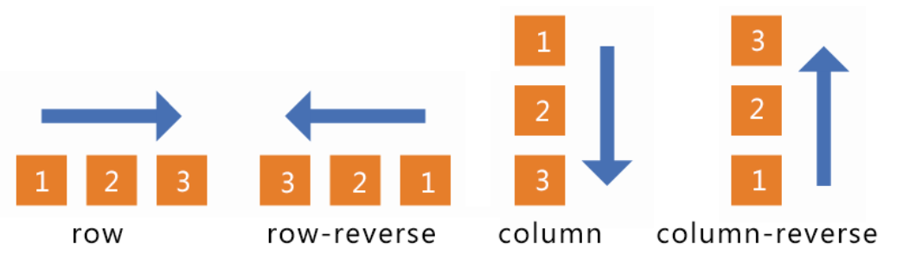
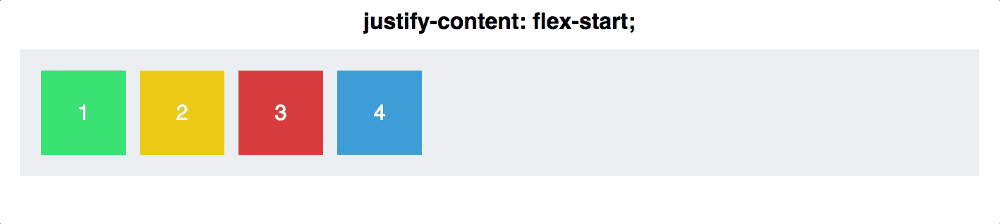
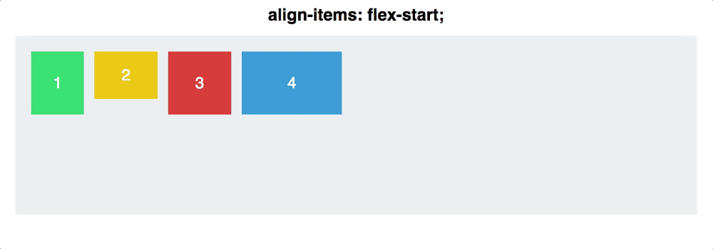
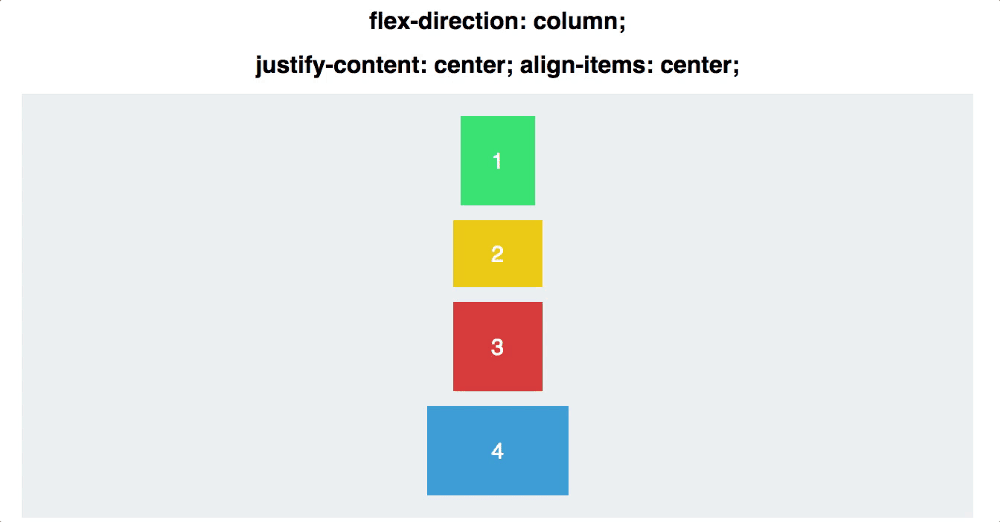

[[好看的颜色]]
#  css语法

[文档链接](https://www.w3school.com.cn/css/css_syntax_descendant_selector.asp)


###### 选择器 

通过选择器，选定页面中的指定元素

###### 声明块

给选定元素制定样式。

```css
p{color: tomato;font-family: "sans serif";}
//font-famliy是字体
```

### 基本用法

##### css文件引入

###### 外部样式表

```html
<link rel="stylesheet" type="text/css" href="mystyle.css" />
```

###### 内部样式表

```html
<head>
<style type="text/css">
  hr {color: sienna;}
  p {margin-left: 20px;}
  body {background-image: url("images/back40.gif");}
</style>
</head>
```

###### 内联样式

不记录

#### 选择器

###### 派生选择器

```css
li strong {
    font-style: italic;
    font-weight: normal;
  }
```

```html
<ol>
<li><strong>aaaa</strong></li>
<li>bbbb</li>
</ol>
```

只有<li><strong></strong></li>内的内容会受到影响

###### id选择器

```css
#red {color:red;}
//#+id值
```

```html
<p id="red">这个段落是红色。</p>
```

只对有该id的标签有效果

###### 类选择器

```css
.center {text-align: center}
//. + 类名
```

###### 层次选择器

1. 后代选择器。2. 子选择器。3. 通用兄弟选择器。4. 相邻兄弟选择器。

##### 

### 页面布局属性

#### float属性

#### position属性

position有5个值，static(默认值)， relative, absolute, fixed， sticky。可以使用left，right， top，bottom来设置其值。

- ##### position:static

  默认值。没有定位，元素出现在正常的流中（忽略 top, bottom, left, right 或者 z-index 声明）。

- ##### position:fixed

  元素的位置相对于浏览器窗口是固定位置。即使窗口是滚动的它也不会移动。Fixed定位使元素的位置与文档流无关，因此不占据空间。Fixed定位的元素和其他元素重叠。

- ##### position:relative

  生成相对定位的元素，相对于其正常位置进行定位。可以用left，right, bottom, top来设置其位置。而且原有位置的空间依然会被占用。可以与其他元素重叠。
  
- ##### position:absolute

  绝对定位的元素的位置相对于最近的已定位父元素，如果元素没有已定位的父元素，那么它的位置相对于html标签。absolute 定位使元素的位置与文档流无关，因此不占据空间。absolute 定位的元素可以其他元素重叠。

- ##### position:sticky

  粘性定位，介于relative和fixed之间的定位。

#### 各类声明

###### 背景

```css
P
{
background-color: gray; //背景颜色
padding: 20px;          //背景往外延展一些距离
background-imag:url:();       //设置图像为背景
background-repeat: repeat-y; //往y轴方向叠加
background-position:center;  //背景位置设置，也可以设置两个px值
background-attachment:fixed  //滑动滚轮时背景不动
}
```

1. background-repeat属性：配合background-img属性使用，默认值是repeat，在xy轴上平铺图片。还有repeat-x和repeat-y值，分别是只在x轴方向和y轴方向平铺。no-repeat是不平铺该图像。

2. background属性：多个属性的合集。  他的参数由 颜色 图片url  图片位置  平铺方式组成

   ```css
   background: red url("img/cimei.jpg") 20px 20px no-repeat;
   ```

   

###### 文本

```css
P{
text-indent:5em;   //设置缩进值 ,可以使用百分值，缩进值为父元素的宽度的百分值
text-align:center; //设置文本对齐方式
word-spacing: 30px;//设置字间距，单词间
letter-spacing: 20px；//字母间
font-famliy:          //字体
font-style:normal;    //字体风格，normal时正常，italic斜体
font-weight:normal;   //字粗，bold加粗，还可以用100~900 400=normal  700=bold
font-size:16px;       //默认大小时16xp，
font:blod 20px/50px Arial; //第一个参数是粗细，第二个是字体大小，第三是行高，第四是字体
line-height:50px;      //行高，将行高设置成和父级元素一样高，可以使文本垂直居中
text-shadow: black 10px 10px 2px;  //参数分别是 阴影颜色 水平偏移，垂直偏移， 阴影半径
}
```


###### 列表

```css
ul {
list-style-type : square;   //列表标志类型设置
list-style-imag:url();      //设置为图像
}
```

### 盒子模型

margin外边距。border边框。 padding内边距。

   

```css
border: 2px solid black; //用于边框的设置，参数分别是 粗细 样式 颜色
border-right-color: red;//可以对边框的上下左右边进行各自不同的设计
margin: 0;              //外边距设置为0
margin-right: 10px;     //外边距也可以上下左右分别设置
padding: 0;				//内边距设置为0
border-radius: 10px;    //设置一个盒子四个角的弧度
```

1. border属性： 是粗细属性，边框样式属性，颜色属性的合集。

2. margin属性： 可以接受多个值。当只有一个值时，该值设定上下左右的margin。有两个值时分别表示上下和左右的margin值。有四个值分别表示上下左右。设置margin:0 auto;可以使它水平居中。[[css#display flex新布局]]

   注意：margin: auto;只能实现左右自适应。要实现上下左右的自适应，可以使用新的flex弹性盒子布局

3. border-radius属性： border-radius:10px; 表示四个角变为，半径为10px圆形的圆弧。他也可以接受多个参数，有一个参数时，代表四个角。有两个参数化时，第一个代表左上和右下，第二个代表右上和左下。有四个参数时，从左上开始，顺时针。

### 文件流 display方式 float 

**标准文档流：**简称标准流，指的是在不使用其他的与排列和定位相关的css规则时，各种元素的排列规则。同时html里区分行元素和块元素。

##### 块元素的特点：

- 表现为块的的特性，独占一行，同级块元素会自上而下的排列 .display=block;
- 可以设置他们的高度宽度 各个方向的margin和padding。当width缺省时，默认为父级元素的width
- 可以容纳其他的块级元素和行级元素

##### 行元素的特点：

- 不会独占一行，只会占有它自身的高度和宽度。display = inline;
- 不可以设置他的宽高，高由内容的字体决定，宽由内容长度决定
- 不可以包含块级元素

##### display 有六值

- none 可以使元素不可见

- inline 行元素的默认值

- block 块元素的默认值

- inline-block 兼有行元素和块元素的优点，可以放在同一行中，也可以设计他的高宽。

  ```html
  <style>
  div{
         display: inline-block;
         width: 40px;
         height: 40px;
         background-color: blueviolet;
  }
  </style>
  <body>
      <div></div>
      <div></div>
  </body>
  ```

  效果： 可以看到两个元素间有空隙，这不是盒子的内外边距，而是空文本元素的原因，可以将父元素的字体大小设置为0，解决。

- inherit ：继承父级元素的display属性。

- flex：新值[[css#display flex新布局]]

##### float属性

float被设计是用来实现图片被文字环绕的效果，不建议用来做布局。记录一些float的属性：

- 包裹性，一个浮动元素如果有子元素，却为设置该浮动元素的宽度，该浮动元素的宽度应为子元素的宽度。
- 跳出文档流，浮动元素不在文档流。如果一个父元素的所有子元素浮动，那么该父元素高宽就会变为0。这时与父元素同级的元素会跑到该父元素的子元素下面，造成页面塌陷。给父元素设置overflow:hidden可以解决。


### 动画animate

css3中出现了动画的效果，可以代替一部分的js代码。

#### @keyframes部分 *定义关键帧* 

```css
 @keyframes change-color{
            from{
                background-color: blue;
            }
            50%{
                background-color: burlywood;
            }
            to{
                background-color: brown;
            }
        }
```

from代表0% 及动画开始的时候。to表示100%动画结束的时候。

#### 动画的属性设置：

- ##### animation-name:

  绑定动画名字，必填。

- ##### animation-duration:

  动画时长，必填。因为默认值是0.

- ##### animation-timing-function:

  动画运动速度怎么样变化。有多个值：

  1. linear:匀速
  2. ease(默认)：先慢后快，再由快变慢。
  3. ease-in:  慢到快
  4. ease-out:快到慢
  5. *cubic-bezier(n,n,n,n)*    自己设置速率变化。

- ##### animation-delay:

  动画在执行前有多久的延迟。默认值是0.

- ##### animation-iteration-count:

  播放次数，值是int类型或infinite，默认为1 。 

- ##### animation-direction:

  是否反向播放动画，有多个值：

  1. normal：正向播放。
  2. reverse:繁项播放
  3. alternate：奇数次正向播放，偶数次方向播放
  4. alternate-reverse : 

- ##### animation-fill-mode:

  动画完成后停留在那个地方，

  1. none 停留在最后一帧
  2. forwards  停留在第一帧
  3. backwards：如果设置了animation-delay，在开始到delay这段时间，画面停在第一帧。如果没有设置delay，画面是元素设置的初始值。

- ##### animation-play-state   

  动画是否正在运行 有paused和running。

最后的animation是所有属性的简写，顺序就如上所述，且第一个第二属性不可省。

### css伪元素学习

### Filter学习


### display:flex新布局

flexible灵活的，以为弹性布局。它之所以被称为 Flexbox ，是因为它能够扩展和收缩 flex 容器内的元素，以最大限度地填充可用空间。与以前布局方式（如 table 布局和浮动元素内嵌块元素）相比，Flexbox 是一个更强大的方式。采用 Flex 布局的元素，称为 Flex 容器（flex container），简称"容器"。它的所有子元素自动成为容器成员，称为 Flex 项目（flex item）。

#### 属于flex布局容器的特殊的属性

1. ##### flex-direction:定义flex容器内的主轴的方向，有多个值：

   - row（默认值）：主轴为水平方向，起点在左端。
   - row-reverse：主轴为水平方向，起点在右端。
   - column：主轴为垂直方向，起点在上沿。
   - column-reverse：主轴为垂直方向，起点在下沿。

    

2. ##### flex-wrap：设置容器内部元素一行满了以后是否换行。

   - nowrap（默认）：不换行。超出后会压缩内部元素的width
   - wrap：换行，往下。
   - wrap-reverse：换行，往上。

3. ##### justify-content:设置水平方向上的元素如何派普

   - flex-start（默认值）：左对齐
   - flex-end：右对齐
   - center： 居中
   - space-between：两端对齐，项目之间的间隔都相等。
   - space-around：每个项目两侧的间隔相等。所以，项目之间的间隔比项目与边框的间隔大一倍。

     

4. ##### align-items:

   - flex-start：交叉轴的起点对齐。
   - flex-end：交叉轴的终点对齐。
   - center：交叉轴的中点对齐。
   - baseline: 项目的第一行文字的基线对齐。
   - stretch（默认值）：如果项目未设置高度或设为auto，将占满整个容器的高度。

     

5. ##### align-content:定义了多根轴线的对齐方式，如果项目只有一根轴线，那么该属性将不起作用

   - flex-start：与交叉轴的起点对齐。
   - flex-end：与交叉轴的终点对齐。
   - center：与交叉轴的中点对齐。
   - space-between：与交叉轴两端对齐，轴线之间的间隔平均分布。
   - space-around：每根轴线两侧的间隔都相等。所以，轴线之间的间隔比轴线与边框的间隔大一倍。
   - stretch（默认值）：轴线占满整个交叉轴。

结合使用align-items和justify-content可以有多种布局： 

#### 属于flex容器内元素的特殊属性：

1. ##### order:项目的排列顺序，越大越往后，默认值为0。

2. ##### flex-grow：项目的放大比列，当父元素水平方向存在空余空间，所有的子元素按比例放大。默认值为0，即有空余也不放大。

3. ##### flex-shrink: 项目的比例缩小，默认值是1 .

4. ##### flex-basis:设置该元素的初始大小。

5. ##### flex：是flex-grow flex-shrink flex-basis 的缩写。

6. ##### justify-self属性align-self属性允许单个项目有与其他项目不一样的对齐方式，可覆盖align-items属性。默认值为auto，表示继承父元素的align-items属性，如果没有父元素，则等同于stretch。

   
