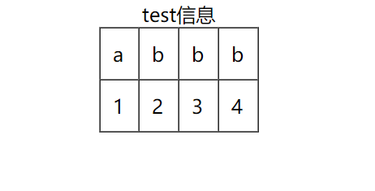

# html5语法小记

[文档链接](https://www.w3school.com.cn/tags/index.asp)

### 基本框架

!加Tab键

```
<!DOCTYPE html>  
<!--注释-->
<html lang="zh">
<!--lang是html标签内的语言属性，"zh"是中文，"en"是英文-->
<head>
    <meta charset="UTF-8">
    <meta name="viewport" content="width=device-width, initial-scale=1.0">
    <title>Document</title>
</head>
<body>
    <p>这是一个段落</p>
</body>
</html>
```

### 特殊字符
[[转义字符#html里的特殊字符]]

### 基本标签

###### 布局标签

div和span时没有语义的，主要用于布局。div是块级元素，span是行元素

###### 标题标签

```
<h1> </h1>
h1~h6
```

###### 段落

```
<p> </P>
```

###### 加重斜体标签

```html
<em> </em> <i></i>斜体
<strong> </strong><b></b>加粗
<s></s><del></del>叫删除线
<u></u> <ins></ins>加下划线
```

###### 列表

```
    <ul>
        <li>fuck</li>
        <li>bitch</li>
        <li>shit</li>
    </ul>  
    无序列表
    <ol>
        <li>fuck</li>
        <li>bitch</li>
        <li>shit</li>
    </ol>
    有序列表
    <dl>
        <dt>fuck</dt>
        <dd>fuck is fuck</dd>
        <dt>shit</dt>
        <dd>shit is shit</dd>
        <dt>bitch</dt>
        <dd>bitch is bitch</dd>
    </dl>
    定义列表
```

###### 超链接

```
<a href="http://www.baidu.com">超链接</a>  
//跳转到外部网址

<a href="http://www.baidu.com" target="_blank">超链接</a>
//会保留当前页面，打开一个新的页面跳入到目标网址

<a href="#">回到顶部</a>  
//href设为#时，可以回到页面顶部

<a href="#+id">超链接</a>  
//可以跳转到该页面的有该id属性的标签处
```

超链接标签内可以嵌套任何标签，除了它自己

属性target有两个值 _self(缺省值)和 _blank

###### 图片

```
 
```

alt时描述，当图片无法正常加载时，显示alt

###### 表格

```html
	<table border="1" align="center" cellpadding = '10px' cellspacing = '0px'>
        <caption>test信息</caption>
        <tr>
            <td>a</td>
            <td>b</td>
            <td>b</td>
            <td>b</td>
        </tr>
        <tr>
            <td>1</td>
            <td>2</td>
            <td>3</td>
            <td>4</td>
        </tr>
    </table>

border= 1显示边框
align = center 在浏览器里居中显示
cellspacing = 0px 表格内单元格之间的距离
cellpadding = 10px 单元格内内容和单元格距离
```

效果图 

合并单元格：clospan和rowspan属性

###### label标签

```html
<label>输入框: <input type="text"></label>
```

把文本和文字放在一个label里，点击文字自动对焦到输入框input。label可以添加for属性指向其他标签的id值，自动对焦到该id值对应的标签。

### 特殊标签

#### meta

```
<meta charset="utf-8">  设置字符集
```

```
<meta name="keywords" content="something"> 可以设置网站的关键字为something
<meta name="destription" content="shit">  设置网站的描述
<meta name="renderer" content="webkit|ie-comp|ie-stand"> 设置网站兼容
//webkit chrome; ie-comp ie兼容 ie6/7;ie-stand  ie标准  ie8/9/10/11
```

```
<meta http-quiv="refrsh" content="3;url=http://www.baidu.com"> 可以设置3秒后跳转到另一个网站
```

### canvas标签

