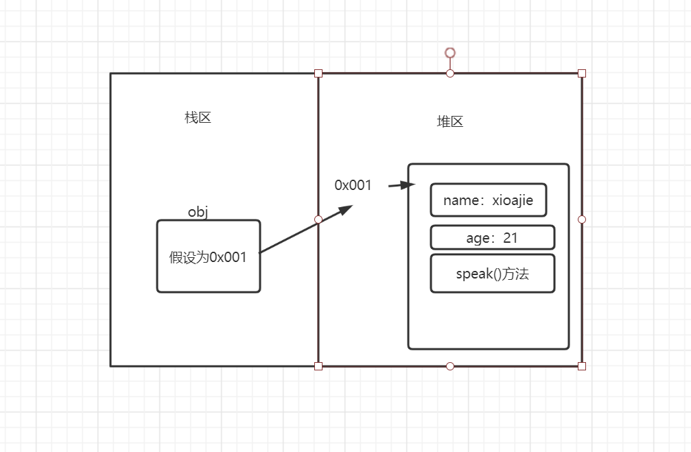
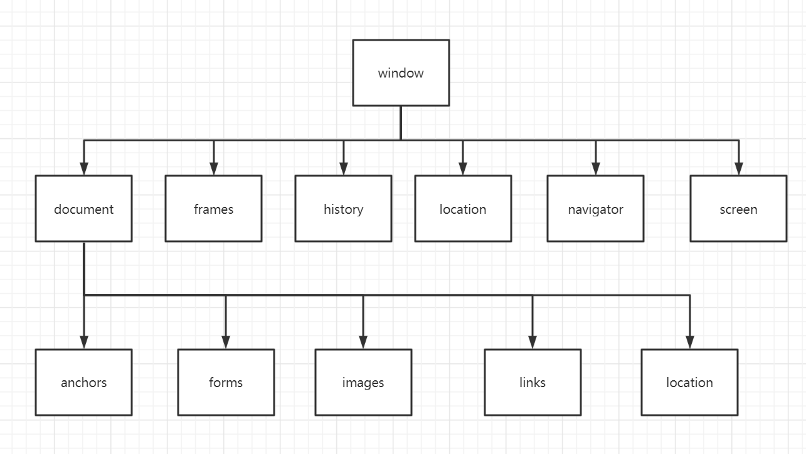

#####   各个浏览器的内核与引擎


# 基础之外


[[require.js]]
[[javascript更多]]
[[json]]
[[node.js]]

# javascript基础

### 数据类型

#### 基本数据类型

1. Number：整数，小数，负数，整数，0，NaN，Infinite，-Infinite

   NaN表示运算结果不是数值，必须使用isNaN(num)函数来判断。 Infinite无穷大

2. String

   由单引号或双引号包含的字符串 *建议使用单引号* 。

3. Boolean

4. Undefine

5. Null

#### 变量与常量的声明let与var

变量声明let与var的区别：

1. let声明的变量由作用域的限制，var没有。
2. var声明的变量有作用域提前的效果，let没有。
3. 建议使用let，更加规范。

常量const

#### 引用数据类型

##### 数组

##### 函数

能够执行特定功能的代码段

```js
function function_name(data){
	//code
}
```

特殊的匿名自调用函数

```js
(function(){
	//code
}(参数1， 参数2， ...))
```

再js中，函数没有重载，但有arguments对象来模拟重载的效果

##### arguments对象

argument对象是所有非箭头函数都有的对象，表示此次调用函数有哪些可用的参数。

arguments是对象不是数组，但是可以转换为数组来操作

```js
function func(){
    let ar = Array.from(arguments);
    for(let i=0;i<ar.length;i++) {
        console.log(ar[i]);
    }
}
func(1,3,4);
>>1
  3
  4
```


##### 对象

###### 内置对象

Math，Data等

###### Promise对象

###### 创建一个对象

```js
let obj = {
    name:"xiaojie",
    age:21,
    speak: function(){
        console.log("fuck  you");
    }
}
```

   

###### 使用对象的值

```js
console.log(obj.name);
//获取属性值
obj.speak();
//使用方法
obj.school = "nangong";
//增加属性值
obj.run = function(){};
//增加新的方法
```

###### 遍历对象的属性

```js
for (var pro jin obj) {
	console.log(pro+'...'+obj[pro]);
}
```

```js
//keys就是所有的属性形成的数组
let keys = Object.keys(obj);
//vals.......
let vals = Object.values(obj);
console.log(keys);
>>["name", "age", "speak", "run"]
```


### js函数理解

#### 数据类型转换

##### typeof +变量

返回变量类型

```js
let num = 10;
console.log(typeof num);
>>number   //打印num的类型
```

##### String(data)和Number(data)和Boolean(data)

将data转化为对应的数据类型

##### parseInt(data)

```js
let num_str = "10";
let num = parseInt(num_str);
console.log(num)
>>number
```

data是String时， 遇到不是数字的字符是只转化该字符前面的数字，如果第一个就不是数字，则直接转换为NaN

data是Number是，可以将小数变为整数，不进位。

而Number(data) 遇到由非数字的字符直接返回NaN

##### .toString()

```
num_str = num.toString()
```

不接受num_str为Undefined和Null

#### 数组的方法

##### .find( function )

返回第一个满足function内条件的值

```js
let num = [1,2,3,4,5];
let a = num.find(function(x){return x>2;});
//let a = num.find(x=>x>2);
console.log(a);
>>3
```

##### .findIndex(function)

同上 但返回该值的索引

##### .join(s)

将数组中的元素连接起来作为string，用s分割，s为空则用  ，  分割。

```javascript
let num = [1,2,3,4,5];
let a = num.join();
console.log(a);
>>1,2,3,4,5
let a = num.join('');
console.log(a);
>>12345
console.log(typeof a);
>>string
```

##### .indexOf(ele)和lastIndexOf(ele)

infdexOf(ele)找到第一个值为ele的下标并返回,也可用于String

```js
let num = [1,2,3,4,5,3];
let a = num.indexOf(3);
console.log(a);
```

lastIndexOf()则是从右往前找

##### .length

返回数组的长度

##### .map(function)

对一个数组内的值依次操作并返回给另一个数组

```js
let num = [1,2,3,4,5,3];
let num1 = num.map(item => {return item*item;})
console.log(num1);
>> [1, 4, 9, 16, 25, 9]
```

##### .slice(start,end)

截取从start到end-1的值返回给新数组.同切片原理

```
let num = [1,2,3,4,5,3];
let num1 = num.slice(1,)
console.log(num1);
>>[2,3,4,5,3]
```

##### .some(function)和.every(function)

.some()确保数组中有一个满足条件返回true

.every()要求所有元素满足条件，返回True

```js
let num = [1,2,3,4,5,3];
let T = num.some(x => x>3)
console.log(T);
>>true
```

##### .includes(s)

检查数组中是否存在该元素，也可用于String

##### .sort()

直接对数组进行排序，

```js
let num = [1,2,3,4,5,13];
let T = num.sort();
console.log(num);
>>[1, 13, 2, 3, 4, 5]
```

会把数组内的所有值视为String,进行字典序排序,若数组内是数字,要按数字大小排序,可以

```js
let num = [1,2,3,4,5,13];
let T = num.sort(function(x,y){return x-y;});//这个是升序
console.log(num);
```

##### .splice(index, del, [])

index表示从下表为index的元素开始处理

表示要删除del元素, 返回删除的元素.

[]表示要添加的元素,可添加多个.

```js
let num = [1,2,3,4,5,13];
let T = num.splice(1,3,10,10);
console.log(num);
>>[1, 10, 10, 5, 13]
console.log(T);
>>[2, 3, 4]
```

##### .concat

用于合并两个多个数组，并返回结果.对于参与合并的两个函数没有影响

对于String也适用。

```js
let num = [1,2,3,4,5,13];
let num1 = [8,];
let newA = num.concat(100, num1);
console.log(num);
>>[1,2,3,4,5,13]
console.log(num1);
>>[8,]
console.log(newA);
>>[1, 2, 3, 4, 5, 13, 100, 8]
```

##### .reduce(function)

reduce()接收一个函数作为累加器，从左到右计算每一个值，最终缩减为一个值

#### String的一些方法

##### .trim()

消除字符串前后的空格,对中间的空格没有影响。

```
let str = '  q  we   ';
str.trim();
console.log(str);
>>q  we
```

##### .toUpperCase（）和.toLowerCase()

处理大小写，并返回结果

##### .split()

分割字符串并返回一个数组

```js
let str = 'a,ascd,fdvc,,fe';
let a = str.split(',');
console.log(a);
>>["a", "ascd", "fdvc", "", "fe"]
//没有参数时 就是把整个字符串作为一个元素返回
a = str.split();
console.log(a);
>>["a,ascd,fdvc,,fe"]
//‘’ 意味着把每个字符作为一个元素返回
a = str.split('');
console.log(a);
>>["a", ",", "a", "s", "c", "d", ",", "f", "d", "v", "c", ",", ",", "f", "e"]
```

##### .search(str)

返回字符串中有str子字符串的地方的索引，没有就返回-1

```js
let str = 'a,ascd,fdvc,,fe';
let a = str.search('ss');
console.log(a);
>>-1
```

##### .replace(str1,str2)

把所有的str1都换成str2

##### startWith(str)和endWith(str)

检查是否以str开头还是结尾，返回boolean值。

##### .repeat(num)

将调用它的字符串复制num次后返回

##### .padStart(num,str)和padEnd(num, str)

将调用它的字符串的长度补全到num（如果不足num话），补全的内容就是str的重复。

# DOM-document object model

dom是一些帮助我们使用和操作html文档的集合，不是一个对象。主要使用document对象来操作。它把html页面中所有元素视为节点，

有如下节点：

|          | 定义               | nodeType | nodeName | nodeValue |
| :------- | ------------------ | -------- | -------- | --------- |
| 元素节点 | html文档中的标签   | 1        | 标签名   | null      |
| 属性节点 | 是属性名称和属性值 | 2        | 属性名   | 属性值    |
| 文本节点 | 是标签内的文本内容 | 3        | #text    | 文本内容  |
| 注释节点 | html文档中的注释   | 8        | #commet  | 注释内容  |
| 文档节点 | 整个html文档       | 9        | #docment | null      |

### 获取节点的方法

#### 获取元素节点

#####  document.querySelector(css 选择器)和 document.querySelectorAll();

通过css 选择器来寻找元素节点。

##### document.getElementById() 

通过id属性来找，返回第一个id匹配的元素

##### document.getElementsByTagName(标签名)

通过标签名查找，返回所有标签名匹配的。但返回的不是数组（不能使用数组的方法），可以像数组一样的使用。

###### document.querySelectorAll()和document.getElementsByTagName()

document.querySelectorAll()返回得集合是静态的，而document.getElementsByTagName()获取的集合是动态的

当html结构发生变化时，动态集合也会自动变化。

##### document.getElementsByName(name属性值)

返回带有指定名称的元素节点的集合，依然不是数组。

##### document.getElementsByClassName(class属性值）

返回的是实例集合，不是数组

#### 获取并修改元素节点里的内容

##### 元素节点.innerHtml  *建议使用*  

获取从标签开始到结束的所有的内容，包括其他html标签

还有一个outerHtml

##### 元素节点.innerText

去除了html标签的文本内容，且它不识别html标签

##### 元素节点.value

常用于表单元素

### 属性节点的方法

#### 获取修改元素节点

##### 元素节点.attributes  *比较繁琐*  

获取该节点的所有属性节点，并返回，返回形式并不是数组，但是可以用下表索引

```html
<div id="text" name="te">
        a
 </div>
 <script>
    let p = document.getElementById('text');
    let attrs = p.attributes;
     console.log(typeof attrs);
     >>object    
    
     console.log(attrs[0]);
     >>id="text"
     //sttrs[0]依然是一个object，是一个属性节点
     console.log(typeof attrs[0]);
     >>object
     //可以再由nodeValue nodeName nodeType 来获取具体的值
     console.log(attrs[0].nodeValue);
     >>text
</script>
        
```

##### getAttribute(属性名称) 和getAttributeNode(属性名称)

```html
<div id="text" name="te">
    a
</div>
        <script>
            let div = document.getElementById('text');
            //getAttribute(属性名称) 直接获取该属性的值
            let attr_value = div.getAttribute('id');
            console.log(attr_value)
            >>text
            //getAttributeNode()获取该属性的整个属性节点
            let attr = div.getAttributeNode('id');
            console.log(attr);
            >>id="text"
        </script>
```

##### 点语法和中括号

最简洁但有几点要注意的

1. 只能获取内置属性，自己命名的属性不能使用
2. 在使用class属性的时候，需要改为className，否则就会使undefined结果

```html
<div id="text" name="te">
    a
</div>
<script>
    let div = document.getElementById('text');
    console.log(div.id);
    >>text
    console.log(div.class)
    >>undefined
    console.log(div['className']);
    >>te
</script>
```

### 节点的关系

##### childNodes 和children

childNodes会把编辑使的空白部分也算为节点

children 只会获取真正的元素节点，且结果是动态的  *推荐使用* 

```html
    <ul id="1">
        <li>1</li>
        <li>2</li>
        <li>3</li>
        <li>4</li>
    </ul>
    <script>
       let ul = document.getElementById('1');
       let lis = ul.childNodes;
       let lis_ele = ul.children;
       console.log(lis);
        >>NodeList(9)
       console.log(lis_ele);
        >>HTMLCollection(4)
    </script>
```

##### firstChild和firstElementChild  lastChild和lastElementChild

##### parentNode和parentElement

parentNode会向上寻找父节点，可以达到document节点，即文档节点

而parentElement是寻找父元素，最多只能达到最大的元素节点是html标签

##### nextSibling和nextElementSibling   previousSibling和previousElementSibling

### 获取修改css属性

#### 行内样式的修改

###### 元素.style.getPropertValue('')

###### 元素.style.setProperValue('', value)

###### 元素.style.removeProperValue('')

#### 内部样式和外部样式

###### 元素.style.属性 

这种方式可以设置css属性，也可以获取到值，但似乎不能打印出来。

###### obj = window.getComputedStyle(元素)

```js
let b1 = document.getElementsByTagName('p')[0];
let obj = window.getComputedStyle(b1);
console.log(obj.fontSize);
>>16px
```

可以获取各种未设置的默认值。

为了各个版本之间的兼容的写法

```js
    function getStyle(ele, className) {
        if(window.getComputedStyle(ele) == 'undefined') {
            return ele.currentStyle[className];
        }
        else {
            return window.getComputedStyle(ele)[className];
        }
    }
    console.log(getStyle(b1, 'color'));
```

### 修改DOM树的js操作

###### let b = document.createElement('节点名称')

创建一个指定类型的节点。

###### b.remove()

将创建的元素去除。

###### b = 父节点.appendChild(b)

将b节点作为子节点插入父节点尾部，并返回这个元素

###### 父节点.insertBefor(要加入的节点，目标节点)；

将要加入的节点插入目标节点之前

###### 父节点.replaceChild(新，旧)

### 特殊的一些节点属性

## 事件处理

###### 一些事件的整理

| 鼠标事件      | 描述                                   | DOM  |
| :------------ | :------------------------------------- | :--- |
| onclick       | 当用户点击某个对象时调用的事件句柄。   | 2    |
| oncontextmenu | 在用户点击鼠标右键打开上下文菜单时触发 | 2    |
| ondblclick    | 当用户双击某个对象时调用的事件句柄。   | 2    |
| onmousedown   | 鼠标按钮被按下。                       | 2    |
| onmouseenter  | 当鼠标指针移动到元素上时触发。         | 2    |
| onmouseleave  | 当鼠标指针移出元素时触发               | 2    |
| onmousemove   | 鼠标被移动。                           | 2    |
| onmouseover   | 鼠标移到某元素之上。                   | 2    |
| onmouseout    | 鼠标从某元素移开。                     | 2    |
| onmouseup     | 鼠标按键被松开。                       | 2    |
| onmousewheel  | 鼠标滚轮事件                           |      |

| 键盘事件                                                     | 描述                       | DOM  |
| :----------------------------------------------------------- | :------------------------- | :--- |
| [onkeydown](https://www.runoob.com/jsref/event-onkeydown.html) | 某个键盘按键被按下。       | 2    |
| [onkeypress](https://www.runoob.com/jsref/event-onkeypress.html) | 某个键盘按键被按下并松开。 | 2    |
| [onkeyup](https://www.runoob.com/jsref/event-onkeyup.html)   | 某个键盘按键被松开。       | 2    |

#### DOM0级事件添加

1. 是在标签内写onclick事件

2. 是在JS写onlicke=function（）{}函数

#### Dom2级事件添加

##### 元素节点.addEventListener(事件名称， 函数(不带括号), bool)

一个元素节点可以添加多个事件而不冲突。

bool值为false时(却省时)，事件流为冒泡事件。为true时，为捕获事件

##### 元素节点.removeEventListener(事件名称, 函数)

删除绑定的函数时，该函数不能是匿名函数

##### 事件流概念

1. 冒泡事件：从当元素向外拓展(即根元素)
2. 捕获事件：从根元素到当前元素寻找

#### 事件对象

提供一些属性和方法供我们对事件进行操作，*注意兼容性问题* 

```html
    <--获取事件对象--></--获取事件对象-->
	</style>
        <div>aaa</div>
    <script>
        let div1 = document.getElementsByTagName('div')[0];
        div1.addEventListener('click', fn, false);
        function fn(e){
            e = e||window.event;
            console.log(e);
        }
    </script>
```

##### 事件对象的一些属性

###### type

以字符串形式，返回事件的类型

###### ctrlKey altKey shiftKey

事件触发时，是否按下ctrl，alt，shift键

###### keyCode

键盘事件触发时，返回被按下的键的ascll值


###### 获取鼠标坐标的属性

1. screenX Y ：屏幕坐标
2. clientX Y:视口端
3. pageX Y：页面端
4. offsetX Y:距离自身元素边缘的距离

###### currentTarget和target

currentTarget指向当前事件触发的对象，this的指向和他永远一样

target则指向鼠标点解的对象    

```html
        <div>aaa</div>
    <script>
        let div1 = document.getElementsByTagName('div')[0];
        div1.addEventListener('click', fn, false);
        function fn(e){
            let mytarget = e.target||e.srcElement;
            console.log(mytarget);
        }
    </script>
```

##### 事件对象的一些方法

###### preventDefault()

取消一些元素触发事件时的默认行为 *注意兼容问题* 

```html
    //取消了超链接的跳转操作   
		<a href="www.baidu.com">百度</a>
    <script>
        let div1 = document.getElementsByTagName('a')[0];
        div1.addEventListener('click', fn, false);
        function fn(e){
            let mytarget = e.target||e.srcElement;
            //e.preventDefault();
            if(e.preventDefault == undefined) {
                e.returnValue = false;
            }
            else {
                e.preventDefault();
            }
            console.log(mytarget);
        }
    </script>
```

###### e.stopPropagration()

阻断事件流冒泡

###### e.bubbles

判断该事件是否冒泡事件流

###### e.eventPhase

会返回三种值1，2，3

  2表示该事件触发时，该事件的受者时鼠标的直接点击者

  3表示该事件的 受者是事件流冒泡的产生的

  1表示该事件的受者是事件流捕获产生的 


###### setInterval(函数，间隔使劲按)和clearinterval(定时器id)

setInterval()可以设置函数每隔一段时间重复执行，并返回它自己的编号，这个编号在取消定时器时会用到

```html
        <div>aaa</div>
    <script>
        let div1 = document.getElementsByTagName('div')[0];
        div1.addEventListener('click', fn, false);
        function fn(e){
            let mytarget = e.target||e.srcElement;
            //每个1000ms打印一次
            let timer = setInterval(fn2, 1000);
        }
        function fn2(){
            console.log("interval");
        }
    </script>
```

解除定时器时只要， clearInterval(timer);即可

# BOM- Browser Object Model

bom不是一个对象，应该是一个对象的集合，对象关系示意图

   


#### window

每开一个新窗口就有一个window对象。所有在全局作用域定义的函数，变量等等都可以看成是在对window对象绑定属性。

只不过平时可以省略

##### alert confirm prompt isNaN isFinite

都是window的方法

##### onload事件

onload内的js只有在网页加载完成之后才会执行。

网页加载完成指document.readyState = complete 时

```html
<script>
	 window.onload = function(){
        console.log("网页加载完成");
        }
</script>
```

##### DOMContentLoad事件

DOMContentLoad里的代码在dom树构建完成后即可执行，比onload更早执行

注意要使用dom2级事件添加方式来添加

```html
<script>
	function fn(){
            console.log('a');
        }
    window.addEventListener('DOMContentLoaded', fn, false);
</script>
```

##### error事件

#### document对象

##### readyState属性

返回网页加载情况

1. loading 网页加载中，dom树尚未建完
2. interactive 加载外部资源，一些图片等等。这时DOMContentLoad里的代码可以执行
3. complete  加载完成。onload事件内代码可以执行。

#### navigator对象

保存一些浏览器的信息 

#### location对象

##### location.hostname

返回web主机的域名

##### location.pathname

返回当前页面的路径和文件名

##### location.port

返回web主机的端口

##### location.protocol

返回所使用的web协议(http或https)

#### history对象

表示为整个浏览器的页面栈，提供一些属性及方法更好的控制页面的访问

##### window.history.back()

返回上一个页面

##### window.history.forward()

跳转到栈的下一个页面

##### window.history.go(num)

跳转到栈的指定页面


