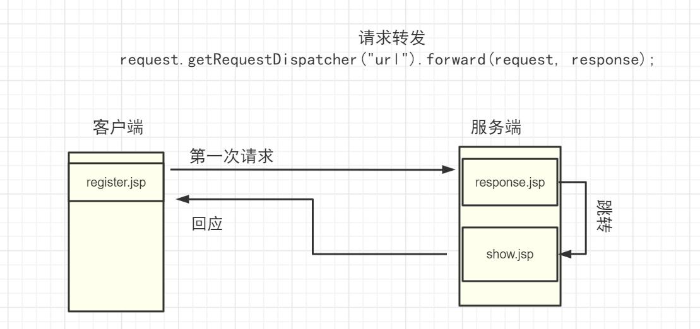
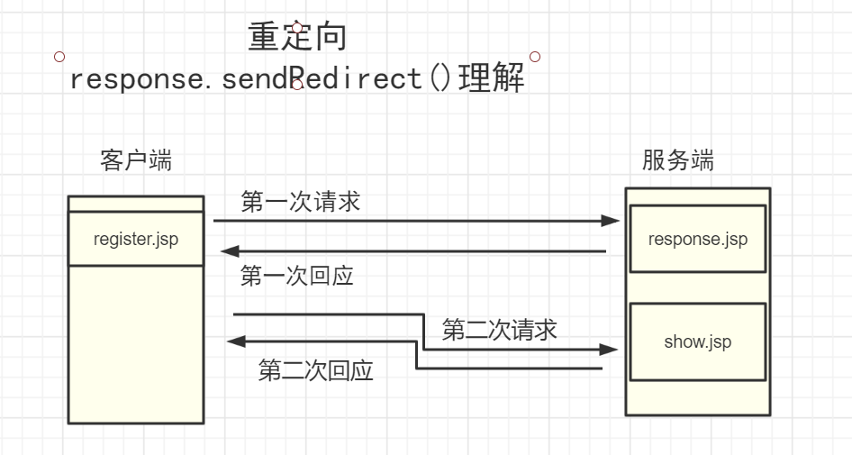
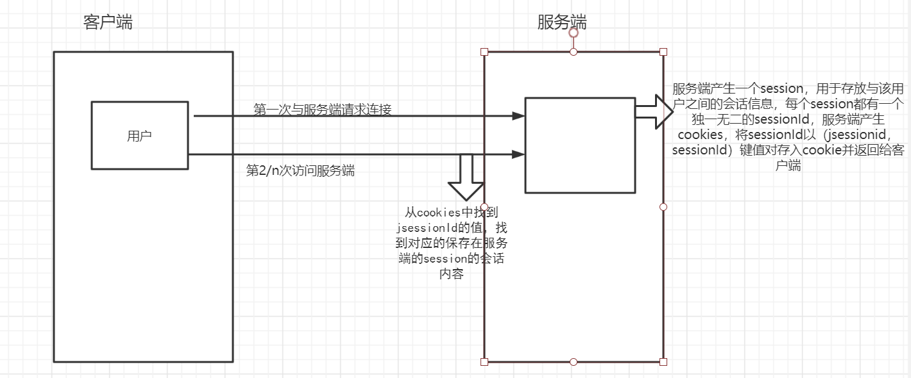

## jsp的各个对象

### request

##### String getParameter(String name)

获取表单提交的名为 name 的参数值，若无则返回null


##### String[] getParameterValues(String name)

返回所有名为name 的参数值，常用于复选框


##### void setCharacterEncoding(String code)

设置request的编码方式


##### void getRequestDispatcher("url").forward(request, response)

请求转发,设置于服务端中，当response.jsp请求转发到show.jsp时，地址并不会被改变，但数据会被继承

区别于[[jsp#void sendRedirect String url]]

  


### response

##### void sendRedirect(String url)

重定向往往设置于服务端中

当 response.jsp 中重定向到 show.jsp 时，地址会改变，并且register.jsp传给response.jsp的数据并不会传递到show.jsp

 

##### void addCookie(Cookie)

写入Cookie


### session

从一次开始此次到结束视为一次会话 session。

session 用于保存客户端和服务端之间的会话信息，session保存在服务端中

session的机制

 


##### void setMaxInactiveInterval(int ) 

设置失效时间


##### int  getMaxInactivaInterval() 

返回session的最大生存时间

##### long getCreationTime()

获取session的创建时间，相对于1970-1-1  0:00:00时刻，毫秒为的单位

##### String getId()

获取session的独一无二的id


##### void invalidate()

使session失效


##### Object getAttribute(String name)

获取名称为name的session值，由于返回值不是String，使用时注意类型转换

```
String session_info = (String)session.getAttribute("name");
```

### application

application对象用于记录整个网站的整体信息，使所有用户共享信息。application对象始于web服务器开始，结束于web服务器结束。

##### Object getAttribute(String name)

##### void setAttribute()

##### void removeAttribute()

### Cookies

cookies 并不是jsp的内置对象使用时需要new一个。

cookie由服务端产生传送给客户端，并由客户端保存 *不同的浏览器保存cookies的路径会不太一样* 

##### String getName() 

返回cookie的键(名称)，

##### String getValue()

返回cookie的值。

##### String getPath()

返回cookies适用的路径

##### String setPath()

设置适用路径

##### void setMaxAge()

设置最大生存时间以秒为单位。

# JDBC
详见[[JDBC API]]

#### jsp中引入jDBC

引入头文件

```jsp
<%@ page language="java" import="java.util.*" pageEncoding="UTF-8"%>
<%@page import="java.sql.*" %>
```

以这样的方式引入。

在加载具体驱动类的时候会报错

将驱动文件添加到tomcat的lib文件夹下。


