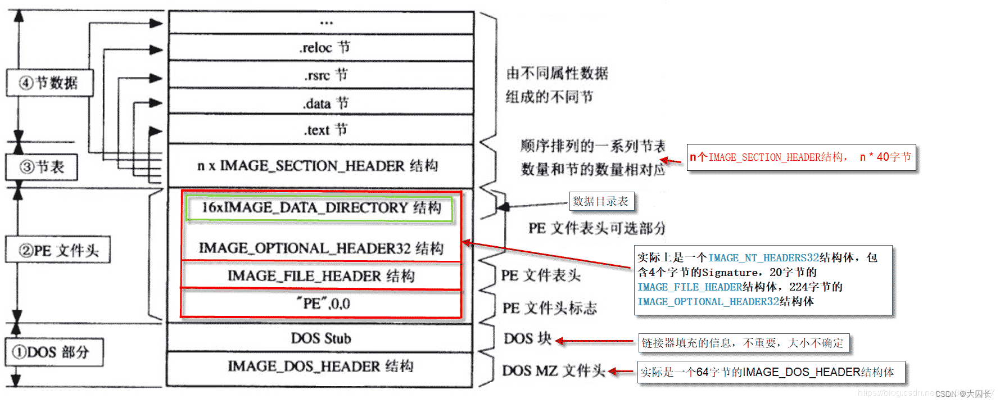

### PE文件结构



#### Dos部分

##### dos头    `_IAMGE_DOS-HEADER`结构

dos的头部分实际上如下的一个结构体 ， 占64字节。 

```c
typedef struct _IMAGE_DOS_HEADER {   // DOS .EXE header
  WORD  e_magic;           // Magic number
  WORD  e_cblp;           // Bytes on last page of file
  WORD  e_cp;            // Pages in file
  WORD  e_crlc;           // Relocations
  WORD  e_cparhdr;          // Size of header in paragraphs
  WORD  e_minalloc;         // Minimum extra paragraphs needed
  WORD  e_maxalloc;         // Maximum extra paragraphs needed
  WORD  e_ss;            // Initial (relative) SS value
  WORD  e_sp;            // Initial SP value
  WORD  e_csum;           // Checksum
  WORD  e_ip;            // Initial IP value
  WORD  e_cs;            // Initial (relative) CS value
  WORD  e_lfarlc;          // File address of relocation table
  WORD  e_ovno;           // Overlay number
  WORD  e_res[4];          // Reserved words
  WORD  e_oemid;           // OEM identifier (for e_oeminfo)
  WORD  e_oeminfo;          // OEM information; e_oemid specific
  WORD  e_res2[10];         // Reserved words
  LONG  e_lfanew;          // File address of new exe header 
 } IMAGE_DOS_HEADER, *PIMAGE_DOS_HEADER;
```

DOS头用于16位的系统中， 在32位系统中多数字段为冗余字段， 少数几个重要的字段：

- **0x00	e_magic**  PE文件的改字段保存 "MZ" 字段，通过这个字段判断是否是PE文件
- **0x3c    e_lfanew**   记录PE文件头(PE Header)结构的偏移量。


##### dos stub

该区域的数据由链接器填充， 一般一段可以在DOS下执行的代码用来向终端输出一行字 :"This program cannot be run in DOS", 随后退出程序。 


#### PE 头部分

PE头文件可以用一个结构体来表示 `_IMAGE_NT_HEADERS32` ==该部分区分x64和x86系统，下面以32位系统为例==

```c
typedef struct _IMAGE_NT_HEADERS {
  DWORD Signature;             // PE文件标识 4Bytes
  IMAGE_FILE_HEADER FileHeader;      // 40 Bytes
  IMAGE_OPTIONAL_HEADER32 OptionalHeader; // 224 Bytes  PE32可执行文件，不讨论PE32+的情况
} IMAGE_NT_HEADERS32, *PIMAGE_NT_HEADERS32;
```

在32位的系统上， 这个结构体共占用 4B+20B+224B 的空间。

- **Signature**   表示PE文件头的开始， 固定存储 "PE00" (0x504500).

- **FileHeader**   `IMAGE_FILE_HEADER` 结构体，表示映像文件头，包含PE文件的基本信息，在微软的文档中被描述为Common Object File Format(COFF)标准文件格式。

  ```c
  typedef struct _IMAGE_FILE_HEADER {
    WORD  Machine;        // 可运行在什么样的CPU上。0代表任意，Intel 386及后续：0x014C， x64: 0x8664
    WORD  NumberOfSections;   // 文件的区块（节）数
    DWORD  TimeDateStamp;     // 文件的创建时间。1970年1月1日以GMT计算的秒数,编译器填充的，不重要的值
    DWORD  PointerToSymbolTable; // 指向符号表（用于调试）
    DWORD  NumberOfSymbols;    // 符号表中符号的个数（用于调试）
    WORD  SizeOfOptionalHeader; // IMAGE_OPTIONAL_HEADER32结构的大小，可改变，32位为E0,64位为F0
    WORD  Characteristics;    // 文件属性
  } IMAGE_FILE_HEADER, *PIMAGE_FILE_HEADER;
  ```

- **OptionalHeader**  `IMAGE_OPTIONAL_HEADER32`称为**可选映像头**或**拓展PE头**

  ```c
  typedef struct _IMAGE_OPTIONAL_HEADER {
    //
    // Standard fields.
    //
     
    WORD  Magic;         //说明文件的类型 PE32：10BH PE32+：20BH  Rom映像文件：107H
    BYTE  MajorLinkerVersion;   //链接器主版本号
    BYTE  MinorLinkerVersion;   //链接器次版本号
    DWORD  SizeOfCode;       //所有代码节的总和（基于文件对齐） 编译器填的 没用
    DWORD  SizeOfInitializedData; //包含所有已经初始化数据的节的总大小 编译器填的 没用
    DWORD  SizeOfUninitializedData;//包含未初始化数据的节的总大小 编译器填的 没用
    
    DWORD  AddressOfEntryPoint;  //程序入口RVA  在大多数可执行文件中，这个地址不直接指向Main、WinMain或DIMain函数，而指向运行时的库代码并由它来调用上述函数
    DWORD  BaseOfCode;       //代码起始RVA，编译器填的  没用
    DWORD  BaseOfData;       //数据段起始RVA，编译器填的  没用
    
    //
    // NT additional fields.
    //
    
    DWORD  ImageBase;       //内存镜像基址 ，可链接时自己设置
    DWORD  SectionAlignment;    //内存对齐   一般一页大小4k
    DWORD  FileAlignment;     //文件对齐   一般一扇区大小512字节，现在也多4k
    WORD  MajorOperatingSystemVersion; //标识操作系统版本号 主版本号
    WORD  MinorOperatingSystemVersion; //标识操作系统版本号 次版本号
    WORD  MajorImageVersion;   //PE文件自身的主版本号 
    WORD  MinorImageVersion;   //PE文件自身的次版本号 
    WORD  MajorSubsystemVersion; //运行所需子系统主版本号
    WORD  MinorSubsystemVersion; //运行所需子系统次版本号
    DWORD  Win32VersionValue;   //子系统版本的值，必须为0
    DWORD  SizeOfImage; //内存中整个PE文件的映射的尺寸，可比实际的值大，必须是SectionAlignment的整数倍  
    DWORD  SizeOfHeaders;     //所有头+节表按照文件对齐后的大小，否则加载会出错
    DWORD  CheckSum;        //校验和，一些系统文件有要求.用来判断文件是否被修改 
    WORD  Subsystem;       //子系统  驱动程序(1) 图形界面(2) 控制台、DLL(3)
    WORD  DllCharacteristics;   //文件特性 不是针对DLL文件的
    DWORD  SizeOfStackReserve;   //初始化时保留的栈大小 
    DWORD  SizeOfStackCommit;   //初始化时实际提交的大小 
    DWORD  SizeOfHeapReserve;   //初始化时保留的堆大小
    DWORD  SizeOfHeapCommit;    //初始化时保留的堆大小
    DWORD  LoaderFlags; 
    DWORD  NumberOfRvaAndSizes;  //数据目录项数目
    IMAGE_DATA_DIRECTORY DataDirectory[IMAGE_NUMBEROF_DIRECTORY_ENTRIES]; //数据目录表
  } IMAGE_OPTIONAL_HEADER32, *PIMAGE_OPTIONAL_HEADER32;
  ```

  


