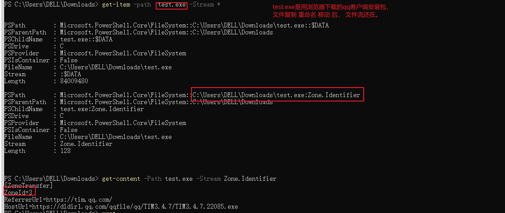
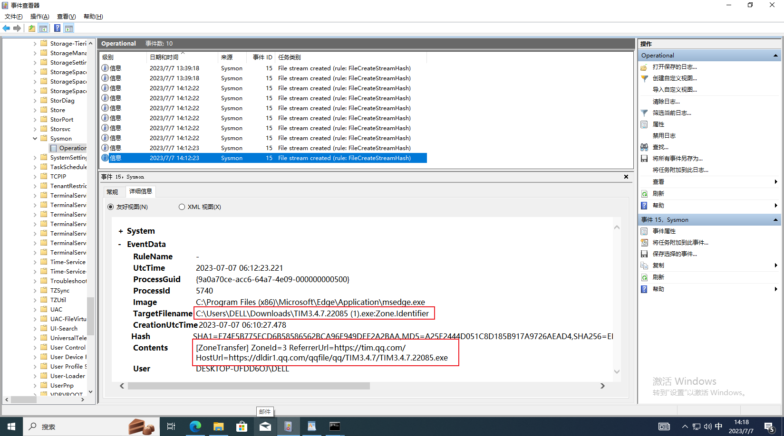
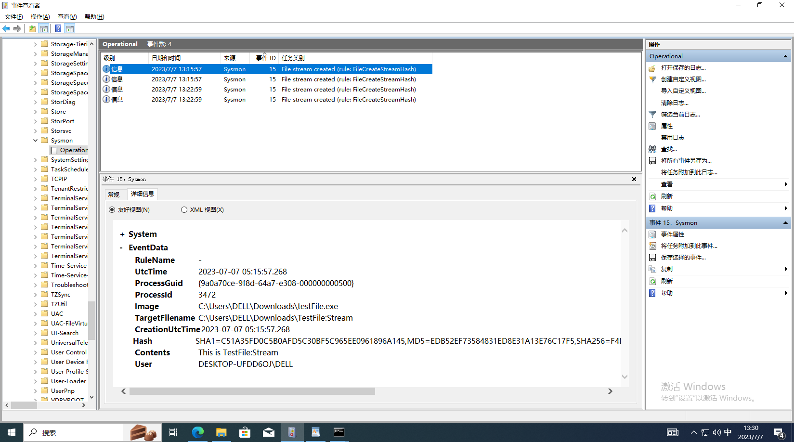
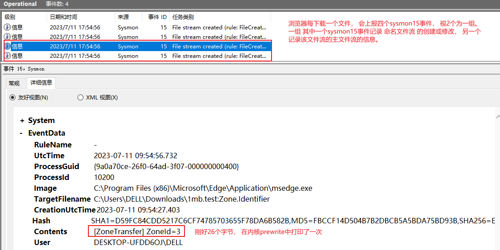
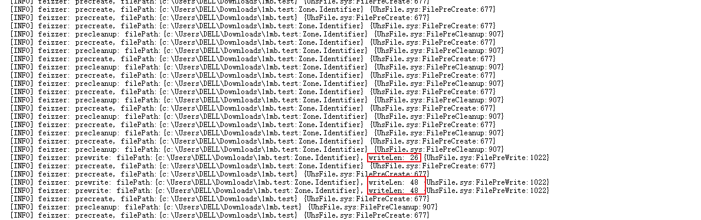
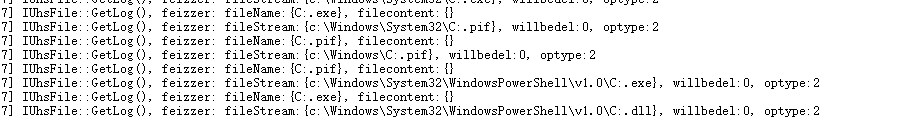
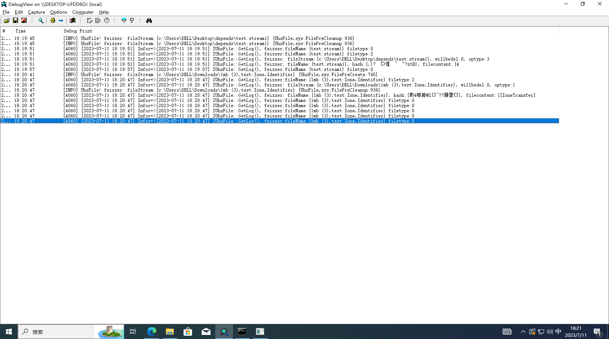

### 文件流 file Stream / NTFS数据流 Alternate Data Streams in NTFS

[Alternate Data Streams in NTFS | Microsoft Learn](https://learn.microsoft.com/zh-cn/archive/blogs/askcore/alternate-data-streams-in-ntfs) 

https://textslashplain.com/2016/04/04/downloads-and-the-mark-of-the-web/

NTFS交换数据流（alternate data streams，简称ADS）是NTFS磁盘格式的一个特性，在NTFS文件系统下，每个文件都可以存在多个数据流，就是说除了主文件流之外还可以有许多非主文件流。它使用资源派生来维持与文件相关的信息，虽然我们无法看到数据流文件，但是它却是真实存在于我们的系统中的。


所有的**文件**在NTFS中至少包含一个**主数据流**，也就是**用户可见的文件或是目录**，一个文件在NTFS中真正的文件名称格式：

> 文件名字: 文件流名字 :文件流类型

比如文件 `test.exe`的主文件流 **test.exe: :$DATA**, 其中test.exe是文件名， 流名字是空，流类型是$DATA。备用文件流的名字一般不为空， 备用文件流也叫**命名文件流(named file stream)**。 [文件流类型](https://learn.microsoft.com/zh-cn/windows/win32/fileio/file-streams) 


可以用powershell的命令查看 文件流 内容

  

- 0 My Computer
- 1 Local Intranet Zone
- 2 Trusted sites Zone
- 3 Internet Zone
- 4 Restricted Sites Zone


### sysmon15  FileCreateStreamHash

> This event logs when a named file stream is created, and it generates events that log the hash of the contents of the file to which the stream is assigned (the unnamed stream), as well as the contents of the named stream. There are malware variants that drop their executables or configuration settings via browser downloads, and this event is aimed at capturing that based on the browser attaching a `Zone.Identifier` "mark of the web" stream.

此事件在创建 **命名文件流** 的时候产生日志。 

浏览器在网络上下载文件后， 会在下载的文件上附加一个 **命名文件流(named file stream)** , 文件流的名字为`Zone.Identifier`, 用来标志该文件的来源。 

 


### sysmon15 使用情况

- 只有**ntfs**文件系统有 文件流的特性， 如果电脑D盘的文件系统是FAT32， 浏览器下载文件到D盘， sysmon15事件不会触发。

- sysmon15事件监控的是**命名文件流**的创建， 命令窗口使用wget下载网络文件， 不会创建 **命名文件流**， 不会触发sysmon15

- 手动创建或修改**命名文件流**， 会触发sysmon15。

  ```c
  #include <windows.h>
  #include <stdio.h>
  
  void main( )
   {
    HANDLE hFile, hStream;
    DWORD dwRet;
  
    hStream = CreateFile( TEXT("TestFile:Stream"), // Filename
                          GENERIC_WRITE,           // Desired access
                          FILE_SHARE_WRITE,        // Share flags
                          NULL,                    // Security Attributes
                          OPEN_ALWAYS,             // Creation Disposition
                          0,                       // Flags and Attributes
                          NULL );                  // OVERLAPPED pointer
    if( hStream == INVALID_HANDLE_VALUE )
      printf( "Cannot open TestFile:Stream\n" );
    else
     {
      WriteFile( hStream,                   // Handle
                 "This is TestFile:Stream", // Data to be written
                 23,                        // Size of data
                 &dwRet,                    // Number of bytes written
                 NULL);                     // OVERLAPPED pointer
      CloseHandle( hStream );
      hStream = INVALID_HANDLE_VALUE;
     }
  }
  ```

  


### 实现

怎么监控文件流的创建?， 

- 过滤ntfs文件系统驱动的 IRP_MJ_CREATE 

- 


##### 模拟网络下载文件

 


可以在prewirte中获得， 但是上报次数对不上

 


一些特殊的文件

 


 


SHA1=

07BBFA82BD593923E221CE090E95E52976F0B7D8

MD5=B25CD510AECE8BAF657FDE93A82E1DB6,

SHA256=15EE9B1CEAB82ED6B40B680845882D493386048C45BEA294D33C73C072961EE9,

IMPHASH=00000000000000000000000000000000 
  Contents 23  


触发实现流程

